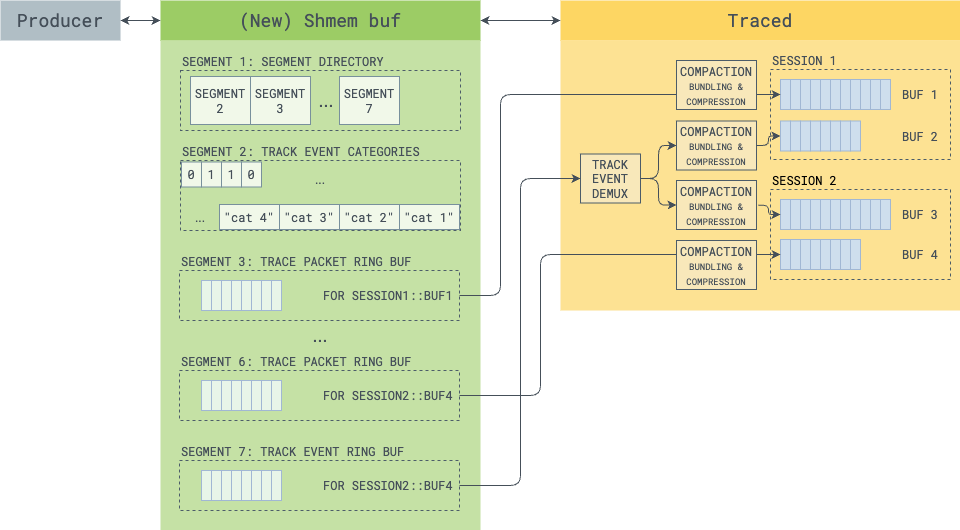
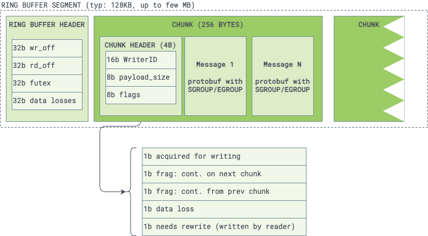

# Tracing Protocol Redesign: The Big Picture

**Authors:** @primiano

**Status:** Draft

**PR:** N/A

I am far from having a full complete design. But it's time to drop thoughts onto
a document to have a skeleton with the big picture. We'll fan out dedicated RFCs
from here once things crystallise.

## Problems

Over the years we have accumulated a number of issues with the current tracing
protocol, which are not just code bugs, but inherent deficiecies of the overall
tracing architecture.

The whole team believes these limitations have now become a bottleneck to the
scaling of Perfetto and need addressing.

The internal document [go/tracing-sdk-2025](http://go/tracing-sdk-2025)
has a good overview of the problems. The summary of that document (available
to external on request) is:

- **Lack of QoS**: the SMB is a single resource per-process but a process
can contribute have multiple sessions and buffers.

- **SMB exhaustion in presence of many idle-ish threads**: Some core android
processes can have several hundreds of threads. In the current model once a
thread traces even just once, it holds onto a 4KB chunk forever.

- **Interning is very unreliable**: it's a whack-a-mole game of trying
to guess how frequently we should invalidate incremental state.

- **Lack of auditing for some data drop patterns**: if the SMB is full data can
be dropped if the SMB is exhausted and the thread doesn't manage to trace at all
later on.

## High level proposal



- This document describes a new _additional_ trace protocol ABI. The current
  protocol must still be supported (probably forever, or for 5y+ at least).
- Reorganize the SMB to be based on _segments_, which can be dynamically created
  and destroyed. This allows having N ring buffers in the SMB, one per target
  buffer (and one or more dedicated to track event).
- Make TrackEvent a first class citizen. This means having a dedicated ring
  buffer type for track event, making traced aware of the category system.
- Switching to a compaction-based pipeline model, where we make the writing
  hot-path even faster (and far closer to a zero-copy memcpy), and we do
  interning (in a reliable batched way) in a different thread (in the long run,
  directly in traced).
- Get rid of interning altogether and instead just do batch-based transparent
  compression using LZ4/ZSTD within traced. This makes the protos easier to
  write and reason about, and removes all the hashmaps and complexity we have
  today for interning. It also makes interning across threads possible, which
  further benefits the trace size reductions.
- Create a routing-based protocol where events like track-event is written
  only once (rather than today's "once per tracing session"), and then "tee-ed"
  internally by traced to the various tracing sessions and buffers that want them.
- Getting rid of patches, and switching to an alternative protobuf encoding
  which uses push/pop markes for begin/end of message (reusing proto groups).
  This will only affect internally the new SMB. The final trace file
  will still be a valid canonically-encoded binary proto as it is today.
- Overall I'm tempted to say we should switch to a world where the socket is
  either: (1) only used to handshake a SMB, and everything happens on the SMB.
  (2) (At some point in the future, let's not get into this here) used to
  support small-binary-size _TrackEvent-nano_, where apps can just write track
  events on a socket and call it a day for low-bandwith cases.

## SMB segments

High level sketch, a more detailed design should follow in a dedicated RFC.

Core ideas.

### Move to producer-allocated SMB

The SMB should always be client-allocated rather than server-allocated.
Server allocation was a mistake, because makes some use cases impossible
(e.g., (1) startup tracing; (2) using the SMB to hold the booleans for track
event categories).

Technically today we support producer-provided SMB, but de-facto Chromium is the
only one using that feature.

In the new protocol the SMB should always be producer-allocated.

### SMB: Large virtual address reservation

We should think about the new SMB as a large-ish (say 128MB) virtual address
reservation. This is going to be realistically the upper bound on how much
memory we are ever willing to use for tracing for a given process. It does NOT
mean that we will use 128MB though. All platforms we support realistically use
overcommit, so we only pay for memory we fault in.

The idea is to use this virtual address reservation to carve out _segments_
(range of congtiguous pages) and madvise(WONTNEED) when they are not necessary
anymore. Think of some sort of page allocator for tracing purposes.

Overall creating/removing a segment is a slowpath operation (along the lines
of our IPC today). Segments will be created/destroyed when starting/stopping a
tracing session.

### SMB Segments

I envision the following type of segments

#### Directory segment

The root segment. Every SMB MUST have one directory segment. This segment is an
index of all the other segments in the SMB. Essentially an array of tuples.

```c++

// TODO: TBD rather than actual system pages (which can be either 4k or 16K), we
// should just address in fixed "4KB blocks", to avoid wastage on 16K systems.
// We don't need to match system pages for our purposes (as long as then we are
// careful doing the math with madvise when freeing up, but it's self-contained
// complexity).
struct SegmentDescriptor {
  uint16_t start_page;  // The page offset (from the start of the SMB).
  uint16_t size_pages;
  uint8_t type;
}
```

NOTE: this means that we will support at most 4096/6 = 680 segments
(e.g. 680 ring buffers). This should be plenty. If we ever need more, we can
chain them by having a descriptor that points to another directory segment.

### TrackEvent categories segment

This segment will hold all the booleans for track event categories. The client
initializes them as categories are registered. The SDK will use this segment for
the category booleans. This allows traced to directly manipulate the
enabled/disabled categories without doing any IPC.

This segment should contain:

- A uint32_t generation counter, incremented every time one or more categories
  are toggled. This can be useful for the client to do quick checks of the form
  "did any of the categories changed? do I need to rescan? (E.g. if a category
  has an onchange listener attached).
- A compact array of booleans. TBD if one byte or one bit per category.
- The actual strings of the category names. we could have a layout where the
  booleans start from the top of the segment, and the strings from the bottom
  and they meet in the middle. If we run out of space, we can always allocate
  a new segment for more storage.
- TBD on whether we need the actual strings in the segment, or only a 32-bit
  hash. Then the only thing that needs the strings is traced and the UI, but
  they can figure it out from the trace config or DS descriptor. This requires
  more thinking. For now let's say we have the full strings.

#### {TracePacket, TrackEvent} ring buffer segment

Those are the main buffers for tracing data. In a way they are conceptually
similar to today's main SMB, but with some key differences.

I am putting them in the section because the ring buffer mechanics should be
identical. What will change is the payload of each event, which will be
described separetely below.

Note that we are still talking about the (relatively tiny) ring buffers in the
shmem. NOT about the traced's buffers.

#### How many shared ring buffers?

##### **For DataSources (anything other than TrackEvent)**
In order to solve the QoS problem we should have one ring buffer per traced
buffer (or at very least one RB per session, TBD).
One RB per traced-buffer (per session) gives the most predictable behaviour, as
each buffer section defined by the user becomes de factor a QoS domain.
My only concern is that one RB per buffer can end causing too much memory
overhead in each app using tracing if we have many overlapped sessions.
(But OTOH, I suspect that most apps will only care about and use track event
so it's fine realistically)

##### **For TrackEvent**

My intial theory is that we need only ONE RB total (per producer) for track
event, as then we can teach traced to demultiplex and route events into the
various sessions that requested that particular category. That would reduce
by far the overhead requires in each app to trace track events.

However, as track-event becomes popular, that would reintroduce the same QoS
problems that today's one RB has. Imagine Winscope data sources or some other
heavy data source like chrome's memory infra gets implemented via Track Event,
and they start doing multi-MB dumps... they will screw up the rest of tracing.

My theory is that what we need for track event is a category-based partitioning
rather than a session-based partitioning:
rather than having one RB per session, we need to map some TE categories to
dedicated ring buffers, after we discover they do heavy things.

The syntax and semantic of the TraceConfig to configure this partitioning should
be addressed in a dedicated RFC and is left as an exercise to the reader.

#### Encoding changes

We should use a different encoding (which is not strictly protobuf-compliant)
in the SMB to avoid patching and the redundant varint encodings. The idea is
to revive protobuf's [SGROUP / EGROUP][pbgroups], which are a deprecated
feature of protobuf.
to mark begin and end of submessages, rather than using "length-delmited + len".

Note that this will have no visible effect to the outside: traced will still
store protobuf-compliant messages in its ring buffer and will still emit traces
in the canonical encoding. SGROUP/EGROUP will exists only in at the trace
protocol ABI in the SMB.

This allows to get rid of patching altogether, which in turn gets rid of a whole
lot of complexity in GetNewChunk().

It's unclear to me whether we will need to create a variant of
`protozero::Message` which uses groups. I feel we don't need all that layering
and we can flatten everything into the new TraceWriterV2.
protozero is nice as it is, because was designed both for encoding and decoding
to deal with proto-compliant messages, sometimes on the heap (TraceProcessor
makes abundant use of it).

We don't have the same use-cases here, as we are dealing strictly only with the
SMB ABI. We should just push down all those `BeginNestedMessage()`,
`AppendVarInt()` etc methods directly into TraceWriterV2.

[pbgroups]: https://protobuf.dev/programming-guides/encoding/#groups

#### New Ring buffer design



Like before, this ring buffer is NOT the main tracing ring buffer. it only
serves to decouple scheduling latencies between traced and the client, and to
avoid a context-switch-per-send (which would happen if we were to use purely
socket like logd does).

Each ring buffer has a "control header" (for stats and futex/synchronization)
and then a series of chunks of the same size.

The ring buffer is organized in chunks of 256 bytes. We still want to retain
TLS/cache-affinity but reduce the chances of fragmentation under heavy thread
traffic.

Like in the current design, a chunk is still owned by a TraceWriter (read a
thread x a data source).

Unlike the past, a chunk is NOT forever. The chunk needs to be marked as
_ACQUIRED_FOR_WRITING_ before writing each packet/event and released after
each write.

Acquiring/releasing are a matter of toggling a bit in the header with an
atomic compare-and-swap on the chunk header.

The _ACQUIRED_FOR_WRITING_ state is very short lived: it starts when the
producer starts writing a packet and ends when the producer has emitted that.
There is a tiny chance that the producer can be descheduled while in the
middle of it and hence leaving the chunk acquired for long. We deem this
chance extremely rare. We still deal with it, but assume only a handful of
threads within a process can end up in this state at any given time.

There is no writer-to-writer overwriting in this ring buffer. Only the one
reader (traced) can free up chunks. Writers write chunks if there is any
space, if not they just record a data loss (more details below). No more locks
involved or IPCs. No more patch relocating.

Unlike the past, acquiring a new chunk is a very fast operation: simply bump
the atomic write pointer and either get a free chunk, or realize that the SMB
is full and declare a data loss.

Like before, in case of ring-buffer full, we can either discard immediately
after having recorded the loss, or stall. Stall will NOT require IPC anymore
and will instead involve a futex on the control page.

There is no interning whatsoever at this level. Producers just write the full
strings here. Interning happens in a later stage (compaction and bundling)

Open questions:

- We could make the 256 bytes configurable, as in some limited
  cases (e.g. traced_perf, traced_probes) we know we'll have only one writer.
  However 256 bytes keeps the header of each chunk more compact as we can use
  1 byte per each "size" field. So this will require some benchmarking, as it
  might not be worth it (especially considering that now GetNewChunk() will be
  much faster).
- ALTERNATIVE: chunk size could be dynamic. If in the last sliding window of N
  chunks, the current writer has used more than x% of them (consecutively or
  not) they are eligible for bigger chunks. But again, not sure it's worth it.


##### Memory layout

```txt
[ Ring buffer Header] [N x Chunk headers] [N x Chunk payloads]
```

where `N = (segment_size - sizeof(RBHeader)) / (sizeof(ChunkHeader) + 256)`

##### Ring buffer header

A 16 bytes header with ring-buffer-wide properties

- Write offset: A word incremented atomically by writer threads to obtain the
  next chunk. Only written by writer threads.
- Read offset: Only written by the reader thread.
- Note that the offset doesn't have to be in bytes. If we stick with the
  decision that chunks are always 256 bytes, they can be the chunk index
  (i.e. `byte_offset = sizeof(RB header) + N * 256`)
  If we are okay limiting a ring buffer to 16MB, we can use 16-bit offsets. This
  can be nice as it allows compare-and-exchange operations on both offsets at
  once if we ever need it (I am not sure we do right now).
- Data losses: a 32 bit counter (with saturation) incremented every time a
  writer fails to acquire a chunk because the SMB is full.
  TBD this should be clared periodically (or snapshotted periodically) by the
  reader on each read pass, otherwise once we have a data loss we can't tell
  if we have more or not.
- Futex: a 32-bit integer used to have a cross-process futex for semaphore
  operations on the RB. This is to make it so that:
  - When the buffer is full the writer thread can stall with a futext_wait
    rather than polling as we do today.
  - Open question: we should probably send an eventfd across to signal in the
    opposite direction, when the writer sees that the buffer is becoming full
    and wants to signal traced to do a read pass. We cannot use a futex there
    because there is no easy way for traced to monitor a futex as part of its
    poll() loop. Either that or we keep using our IPC channel as an eventfd.
    TBD.

##### Chunk header

After the RB header, follows an array of contiguous chunk headers, one per
chunk. If the chunk size is fixed, we know upfront how many chunks we can have
for a given ring buffer size (the segment size). Hence we can store them all
adjacently, making handshaking operations even faster by improving spatial
locality.

The chunk header is 32 bit, and it's important it stays such: this allows to
manipulate it atomically using compare-and-exchange operations on both 32-bit
and 64-bit archs (if we ever need more we could move the writer id on its own
32-bit word, but that would make the chunk header 2x bigger, so let's try to
avoid).

Each chunk header contains:

- (16 bit) WriterID: identifies the writer / sequence
- (8 bit) written payload size in bytes. This is update with a release-store
  only after a new message (or fragment, when end of buffer is approached) has
  been written.
- (8 bit) flags
  - `acquired_for_writing`: the writer writing a message. this bit is set before
    the writer writes a message, and cleared (atomically with the payload size
    increase) when the message has been written.
  - `continues_on_next_chunk` (fragmentation): if this bit is set the last message
    in the chunk is partial and continues on the next chunk.
  - `continues_from_prev_chunk` (fragmentation): if this bit is set the first
    message in the chunk is partial and continues from the previous chunk. In
    this case the first bytes of the chunk payload contain a varint with the
    size of the fragment. This is to allow resynchronizing and skipping the
    fragment if there was a data loss and the previous fragments were lost.
  - `data_loss`: this bit is set if the writer tried to write a long fragmented
    message (or just decided to start a new chunk because there was not enough
    space left in the current chunk to start a new one) but failed to acquire
    the next chunk to continue. Note that it isn't always possible to write this
    bit. The current chunk could have been reclaimed by the reader, and the
    writer could fail to acquire a new chunk. In this case the writer we rely on
    the global data losses counter in the ring-buffer header. This exist to give
    a more accurate indication of where the data loss occurred.
  - `needs_rewrite`: this bit is set by the reader if it managed to read the
    chunk while the writer was still on it. More details in the section
    _Sequence of operations_ below.

Note that the chunk header no longer contains any chunk id, unlike the current
SMB design. This is because in the new design chunks are always written in order
and scraping is factored in the design, so out-of-order commits are no longer
possible by design.

TODO: i need to be convinced that when a chunk gets stuck because a thread
gets descheduled while the chunk is acquired, that doens't break fifo-ness.

##### Sequence of operations: writer

If the writer had a chunk (easy case):

- It first tries to re-acquire the same chunk via a cmpxcgh on the header.
  If nobody else touched the chunk the WriterID will still match, and so will
  the size and flags. In the same cmpxgh operation it will also set the
  acquired_for_writing bit. The TraceWriterV2 needs to keep the chunk header
  cached locally to do this cmpxcgh.
- If the re-acquire suceeds, it appends the payload of the new message and
  updates the header with a new cmpxcgh clearing the `acquired_for_writing` bit
  and bumping the `payload_size`.
- If the message is too big, it writes the portion that fits in the chunk, sets
  the `continues_on_next_chunk` bit and moves on with a new chunk (below).


If the writer didn't have a chunk or the chunk has been reclaimed by the reader.
It needs to acquire a new chunk, as follows:

- The ChunkHeader.write_off points to the position of the next chunk that should
  be free (unless the buffer is full).
- If write_off + 1 == read_off, the buffer is full, the chunk acquire fails.
- If not, try to atomically acquire the write_off-th chunk by cmpxcgh-ing its
  header. If the cmpxcgh succeeds, increment atomically write_off.
  TODO: think about when do we wrap to 0. that's the hard part in ring buffers.
- If the cmpxcgh fails we have two possible causes:
  - Another thread raced us. In this case we re-iterate re-reading write_off
    which meanwhile must have changed.
  - The current chunk is "stuck" in the acquired mode (more below) because the
    thread got descheduled in the middle of a write. In that case we should
    skip that, and try to acquire the chunk after. if we suceed increment by N
    times the write_off. A stuck chunk will be eventually invalidated.

After writing a chunk, if the rd - wr (the number of free chunks left) is less
than a critical threshold (say 50%) the writer needs to wake up the reader
(via IPC or an eventfd, or a futext, but that requires extra threads).

##### Sequence of operations: reader

The reader activates either when:

- The writer thread signals a "SMB getting full"
- Periodically (e.g. upon flushes) to scrape the data and keep the SMB clean
  and the central trace buffers up to date. This is important to prevent that
  some proces that traces only a little has old data that gets never commited
  until the end in the SMB, causing reordering issues in trace processor.

When it activates it iterates throughout all the chunks starting from rd_off:

- It does an acquire-load on the chunk header
- If the chunk is free (its header is 0) skips it (it shouldn't happen though).
- If the chunk header is idle (`acquired_for_writing==0`):
  - The reader reads the payload and moves it to the central traced buffer
    (more below)
  - When it's done does an atomic cmpxcgh to clear the header and mark the chunk
    as free. The cmpxcgh succeeds if the writer didn't write any more data or
    fails, if the writer manages to write more data before the reader arrives.
  - If that happens, the reader needs to do another pass and read the latest
    message(s) and try again (or hit the case below).

- If the chunk is `acquired_for_writing`:
  - It reads all the data up to payload_size, as we are guarranteed that has
    already being fully written.
  - atomically set the `needs_rewrite` bit with a cmpxcgh, keeping the chunk
    still with `acquired_for_writing` set.
  - When the writer tries to clear the `acquired_for_writing` bit, their cmpxcgh
    will fail. It will notice the `needs_rewrite` bit at that point. That will
    signal that it needs to re-transact on the last message so that:
    - The current chunk stays as it was before the write begun. The writer has
      the responsibility of clearing the `acquired_for_writing` without bumping
      the `payload_size`
    - The last written message needs to be re-written (memcpy-ed) in a new chunk
    - The writen can know precisely how much the reader reader, because that
      would be the value of `payload_size` in the header.

Overall there are 4 possible cases of overlapping between reader and writer
on the same chunk:

1. (most likely one): there was no writer at the time when we started the read,
   and no writer further changed the chunk. The reader can tell this because
   `acquired_for_writing` was 0 when it started, old_hdr is still current when
    it does the final cmpxcgh. In this case we simply cmpxcgh(old_hdr, 0x000000)
    meaning that the chunk is now free.
2. There was no writer when we started, but a writer managed to append some data
   while the reader was reading. This means that while we were reading the chunk
   transitioned RD_EXCL -> RD+WR -> RD_EXCL (`acquired_for_writing: 0 -> 1 -> 0`).
   The reader doesn't see the state transition, but observes that the size has
   changed when the cmpxcgh(old_hdr, 0x000000) fails.
   In this case the reader should simply do another round and read new data and
   repeat this whole logic.
3. There was a writer active when the reader started, but it has finished by the
   time the reader gets to the epilogue. The reader should do another pass.
4. The writer is slow and is still active. The reader cannot wait for the
   writer (it would stall traced), and cannot interrupt it. So we will allow the
   writer to finish in its due time, but we will give it homework to do. When it
   finishes, it will have to memcpy the last message to the start of a new
   chunk.

### Data losses auditing

Data losses are always recorded by increasing the RB header's `data_losses`
counter.

Furthermore if we happen to still have the previous chunk available when a data
loss happens, the writer will further set the `data_loss` bit in the chunk
header to signal precisely where the loss occurred.

Note for future: we could even say that in the latter case we could invalidate
the last message of the last chunk and record how many bytes the writer lost.
But that requires further complexity which I'm not sure it's warranted. We
could create a special TracePacket that contains only a `data_loss_bytes` field
which would be forged in replacement of the last message of the chunk. Let's
skip this for now and keep it as idle thought.

#### Chunk payload

This differs for the cases of a "TracePacket ring buffer segment" and a
"TrackEvent ring buffer segment".

##### In both cases

Data should be encoded in _almost protobuf_, that is, using SGROUP/EGROUP
rather than nested messaged to represent submessages. Strings and byte fields
are still represented using length-prefix. Those are not a problem as the writer
knows upfron how big a stirng is before even writing it. The only problem that
cause all the patching drama has always been submessages.

Unlike the current design, I don't think there is any need to prefix each
fragment with its size varint. By using groups we can tell where a message
finishes.

The only case when we need a varint with the size is in presence of
fragmentation, if the chunk header has `continues_from_prev_chunk==1`. In that
case we need to know the size if there has been a data loss and the previous
chunk is gone, to be able to parse the rest.

In order to maximize buffer usage, we can say that the SGROUP for each trace
packet is implicit. Each message starts directly with the TracePacket payload
and contains an EGROUP when the trace packet ends. The next byte will be the
first byte of the next TracePacket. We can tell when we reach the end of the
chunk by using the ChunkHeader.payload_size.

##### In the TrackEvent case

TODO: I need to think more about this. I'm thinking the payload of each event
to be like this:

- [32 bit hash of the category name (or varint category offset if they are stable)
- [varint timestamp]: full for the first one, incremental for the next ones.
- [varint type]: track event type (BEGIN, END, INSTANT, COUNTER)
- [varint length + string]: name of the event.
- [proto-encoded TrackEvent proto bytes for the rest, still using groups]

I am also thinking of a serialization which is a hybrid where:

- The most frequently used fields are proto-like encoded, but not quite
  - Assume we have only 8 "frequently used fields".
  - Each field could be represented as varint(field_id | (value << 3))
  - This allows for fields to still be optional (e.g. for track id override) 
  - This saves one byte per field. Essentially we bake the knowledge of the
    schema of these fields in the ABI.
- All the other fields use the same encoding of TracePacket (protobuf with
  SGROUP/EGROUP)


## Goodbye interning, say hello bundling with transparent compression

In the new design the reader (traced) sees a bunch of small 256B chunks, each
containing packets or fragments.

In the current design, those chunks are directly copied into the trace buffer
as-is.

My proposal is that in the new design traced has an intermediate bundling
phase. Rather than copying chunks as they are, chunks are passed into a
compressor (realistically LZ4 or ZSTD) and accumulated until:

- A threshold is hit (say 128-512 KB, TBD experimentally)
- A flush happens (time-based)

The tradeoff is:
- If the compression window is larger, we get better compression, as the same
  strings over a larger window show up only once.
- OTOH it means a larget unit of overwriting in the final ring buffer, so more
  data gets lost in chunks. 

These bundles of packets are written as a whole in the TraceBufferV2, similarly
to today's notion of `compressed_packets` (I would introduce a different field
though as the semantic is slighly different, this is more `transparently_compressed_packets`).

The main downside is that when we finalize the trace, we have to uncompress
them and run the privacy filter. But that's okay, I would decompress them
anyways to then allow the final trace to be compressed by play services before
uploading (or before passing to it), as that would achieve even better
compression (because of whole file compression vs chunk-based compression).

Essentially the chunk-based compression I'm proposing is only to maximize the
in-memory ring buffer usage, without having to ask people to intern manually
thing. The new ethos would be "just dump strings, they will be compressed by
traced before hitting the ring buffer".
My theory is that will outperform our hand rolled interning today, and remove
a whole bunch of complexity from perfetto.

Also the other downside is that for protovm we'll have to uncompress chunks
before passing it to protovm. But realistically we can have a `bool nocompress`
setting for a buffer and use that whenever we use protovm.

Open question: how do we deal with incremental state used for track types? That
is not just interning. I'm talking about this:

```
message TracePacketDefaults {
  optional uint32 timestamp_clock_id = 58;

  // Default values for TrackEvents (e.g. default track).
  optional TrackEventDefaults track_event_defaults = 11;

  // Defaults for perf profiler packets (PerfSample).
  optional PerfSampleDefaults perf_sample_defaults = 12;

  // Defaults for V8 code packets (V8JsCode, V8InternalCode, V8WasmCode,
  // V8RegexpCode)
  optional V8CodeDefaults v8_code_defaults = 99;
}
```

## Incremental plan

We need to break this into incremental milestones. My proposal is to

1. Let's create an in-process prototype of the TracePacket and TrackEvent ring
   buffers, and skip all the segments and the ABI. For now we can have this as
   a private implementation detail of the SDK, which then writes TracePackets
   using the old SDK. This will allow us to validate the compression
   effectiveness, however we cannot use it in the field as-is, at least not
   until we introduced some code in traced that does the "if compressed,
   decompress before running the privacy filter"
2. We need to prototype the segment system. it has some tricky atomic stuff.
3. We need to think more about the track event encoding. some discussion is
   needed.
4. I haven't thought deep enough about routing/tee-ing, and how do we map
   different track event categories onto different buffers.
5. I haven't tried to wire Java/JNI end-to-end. The overall idea of that
   different encoding for the TrackEvent ring buffer is to make it more JNI
   friendly, but the JNI side needs to evolve in parallel, or the two will never
   fit together.
6. Once everything works, this local in-process prototype can be the gap
   bridging if we want to support talking to an older version of traced.
7. But then we should have a minimal library with just the V2 protocol, which
   could be much smaller. If we can ditch the IPC socket (can we? maybe yes if
   we care only about track event) the SDK can be made MUCH smaller.


# Open questions

- VMs: we need to support VMs and this shmem-based protocol goes in the opposite
  direction of vsocks, as it goes further beyond the IPC. We need to figure out
  what will be the story for commit-over-IPC to support remote machines and VMs.
  shmem across vms is incredibly hard, especially with pKVM as it needs to be
  negotiated by the bootloader. I have not wrapped my head around this (maybe
  VMs will keep using the V1 protocol, and we can make sure they can cohexist
  and nest nicely together. So traced_relay does the compaction and passes
  bundles of TracePackets to the hypervisor via vsock)

- Where do we draw the line between track event and data source? It feels more
  and more "if you take track event, and add arbitrary protos, it can subsume
  the data source layer". The line for sure is "if you need custom config (other
  than the category) that is NOT track event. TrackEvent by design must be
  idempotent (at the category level), as it's biggest value is in the tee-ing
  and mux/demux.
