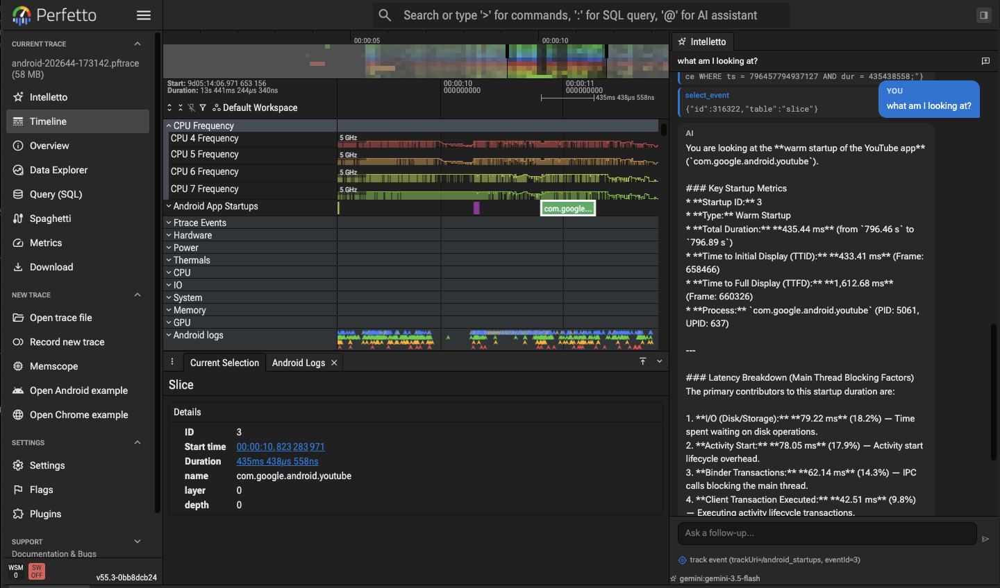

<!--
SCRATCH / ARCHIVE — not part of the RFC series.

This is the original prose half of 0028-intelletto.md, removed when that doc was
restructured to: TL;DR -> Notes (canonical) -> Open questions. The Notes now
describe all of this conceptually; this file is retained only for the concrete
artifacts that may be worth pulling back in for implementers:

  - TypeScript contracts: ProtocolSpec, Provider, ToolSpec, ToolResult, LlmSession
  - The full tool catalogue (SQL / Timeline / Data Explorer tables)
  - The context-strip ASCII mockup
  - The message-flow and trace_processor --httpd conduit diagrams
  - Proposed code layout

If anything here conflicts with 0028-intelletto.md, the Notes in that doc win.
-->

## UX

<figure>
  
  <figcaption align="center"><em>A very rough demo showing a conversational agent in the sidebar.</em></figcaption>
</figure>

The agent will appear in a global sidebar available on all pages. It
presents a typical agent-style interface.

Living in the **sidebar / side panel** rather than on a dedicated route means
Intelletto is _one_ agent that follows the user across the entire UI. The
chat is always there alongside whatever page the user is on — the timeline, the
Data Explorer, a SQL scratchpad, a flamegraph — and the tool surface tells it
what each of those pages can do. Practically this means:

- **No per-page agents.** We don't ship "AI for Data Explorer" and
  "AI for the timeline" as separate things. There's one model, one
  conversation, one set of credentials, and the tools describe the
  pages.
- **Context follows the user.** Selection context, the active page,
  and which tools are currently registered are all part of the prompt
  context. Switching from the timeline to the Data Explorer mid-
  conversation just changes which tools the model finds useful — the
  history stays.
- **Plugins extend the agent by registering tools.** A new page
  added by a plugin becomes addressable by the agent the moment
  that plugin registers its tools (see _Extensibility_ below). The
  agent doesn't need to know about pages at all — only tools.
- **Cross-page workflows fall out for free.** "Find the slowest frame,
  then open the Data Explorer filtered to its slices" is a single
  prompt that crosses two pages, because the tools for both pages
  live in the same registry.

### Invoking Intelletto

- **Sidebar**: an `Intelletto` menu item (icon `stars_2`) in the
  `current_trace` section, registered via `trace.sidebar.addMenuItem()`.
- **Side panel**: a dedicated chat tab (URI
  `dev.perfetto.IntellettoChat`) — the main interaction surface.
- **Omnibox**: typing `@` enters AI mode (hint: `'@' for conversational agent').
  Submitting closes the omnibox and routes the prompt to the panel.
- **Commands**:
  - `dev.perfetto.Intelletto#Activate` — _Ask AI about this trace_
    (proposed hotkey `Mod+Shift+A`).
  - `dev.perfetto.Intelletto#Reset` — _AI: New conversation_.
  - `dev.perfetto.Intelletto#SelectModel` — _AI: Select model_,
    populated by querying the provider's `/models` endpoint at runtime.

## Configuration

The configuration consists of three layers:

1. **Protocols**: Describes how to talk to a particular _kind_ of API. Provided
   by other plugins as they must provide some JS code teaching the agent how
   to talk to that particular backend. Examples: (`gemini`, `anthropic`,
   `openai-compatible`). Indexed by a string ID.
2. **Providers**: Data only - defines a specific configuration of a protocol.
   E.g. google-gemini, or local-llama. Each provider references a protocol to
   use via its ID and (typically) an API key and a baseUrl, among things like
   the list of models we're interested in and perhaps a default model. These are
   configurable via:
   - The end user via the settings page - configured by the user manually and
     stored in localstorage.
   - Via an extension server - displayed in the UI but immutable.
3. **Selected Provider:Model Pair**: User configured provider and model pair -
   allowing users to hot switch between models on the fly. Typically for
   googlers (or those with an extension server configured for their org) there
   will be one provider with one default model and this will be automatically
   selected on startup.

So "Gemini" is a protocol; _"My personal Gemini"_ and _"Work Gemini via internal
proxy"_ are two configured providers that both happen to use the same 'gemini'
protocol.

### Protocols (registered by plugins)

A plugin registers a protocol once, at activation:

```ts
interface ProtocolRegistry {
  registerProtocol(spec: ProtocolSpec): Disposable;
}

interface ProtocolSpec {
  id: string; // 'gemini' | 'anthropic' | 'openai' | 'openai-compatible' ...
  displayName: string; // shown when adding a new provider

  // What login details this protocol needs. Intelletto renders a form
  // from this when the user adds/edits a provider.
  credentialFields: CredentialField[]; // e.g. apiKey, endpoint, project

  // Optional: list models available for given credentials
  // (drives a dropdown on the "add provider" form).
  listModels?(creds: Creds): Promise<ModelInfo[]>;

  // Factory: build a session-scoped LlmSession from the selected
  // provider (creds) and the chosen model name within it.
  create(provider: Provider, modelName: string): LlmSession;

  // Capability hints used by the UI.
  capabilities?: {
    supportsStreaming?: boolean;
    supportsToolUse?: boolean;
    maxToolRounds?: number;
  };
}
```

Notes:

- `credentialFields` is what makes protocols extensible without
  Intelletto having to know about them. One protocol needs just an API
  key; another needs key + endpoint; a Vertex/OAuth protocol needs a
  project ID and a token URL. Intelletto just renders the form.
- The tool loop, streaming UI, abort handling, history management and
  conversation rendering all live in Intelletto. The protocol
  only owns the wire format.

### Provider

A configured provider is just data:

```ts
interface Provider {
  id: string; // unique provider name
  label: string; // user-visible name, e.g. "Work Gemini Pro"
  protocolId: string; // points at a registered protocol
  models: string[]; // the subset of models from this provider we want to show in the model select dropdown
  defaultModel?: string; // if no model is configured - use this one - otherwise uses models[0]
  credentials: Creds; // shape determined by the protocol's credentialFields
}
```

Where these come from:

- **From settings.** The user adds providers via an _AI models_ settings page:
  pick a protocol from the registry, fill in the form derived from its
  `credentialFields`, optionally pick a model from the protocol's `listModels()`
  dropdown, give the provider a label, save. Credentials in this path go into
  the settings secret store.
- **From an extension server.** The extension server can push a list of
  pre-configured `Provider` entries on connect — same shape, but the
  credentials are server-managed (see _API keys from extension servers_ below).
  These appear in the model picker alongside the user's own, tagged with their
  source.

The two sources merge into a single flat list. The user picks the **active**
model from a dropdown in the chat panel header; switching mid-conversation is
allowed (history carries over, the next turn just goes to the new model). One
_active_ model at a time keeps the UI simple; A/B comparison can come later if
there's demand.

Notes:

- We list the models we're interested in specifically as providers have _many_
  models and listing all of them when trying to switch models is not ideal. Also
  we might want to only pick models that are actually going to be useful.

### Provider definitions

```json
{
  "protocol": "gemini",
  "credentials": {
    "apiKey": "AIza..."
  },
  "models": [
    {
      "id": "gemini-flash",
      "label": "Gemini 2.5 Flash (fast/cheap)",
      "modelName": "gemini-2.5-flash"
    },
    {
      "id": "gemini-pro",
      "label": "Gemini 2.5 Pro",
      "modelName": "gemini-2.5-pro"
    },
    {
      "id": "gemini-flash-lite",
      "label": "Gemini 2.5 Flash Lite",
      "modelName": "gemini-2.5-flash-lite"
    }
  ]
}
```

The same file shape is used whether the definition comes from settings or from
an extension server. An extension server typically serves several such files
(one per provider it offers).

### API keys / credentials from extension servers

Pasting a personal API key into a settings dialog is fine for ad-hoc use but a
bad fit for many real deployments. In corporate or shared setups the credentials
should come from an **extension server** instead. Because credentials live
inside the provider definition file, this is the same mechanism — the server
just ships the whole file rather than the user typing it into settings.

- On startup (and on reconnect) Intelletto asks the extension server
  for its provider definition files over the same channel it uses for
  skill files and other capabilities. Each file becomes one or more
  `Provider` entries in the picker, tagged _"Provided by
  extension server"_.
- Server-supplied credentials are **never written to the settings
  secret store** — they live in memory only and are re-fetched on
  reload. Rotating them server-side is enough; nothing to clear on
  the client.
- The server can supply **short-lived tokens** (e.g. OAuth access
  tokens) with a TTL; Intelletto refreshes on 401/403 by re-asking
  the server rather than prompting the user.
- Files can carry an `endpoint` override alongside the credentials,
  so internal deployments can route traffic through a corporate
  proxy (often as an `openai-compatible` protocol) without the user
  having to know about it.

The settings-defined list and the server-supplied list are simply
concatenated into the picker — they don't override each other and
there's no precedence to reason about; the user picks whichever
labelled entry they want. If the same logical model appears in both
sources, that's two entries with two different labels, which is fine.

## Chat behaviour

- **Streaming**: partial responses render incrementally as the provider
  streams tokens.
- **Conversation history**: held per provider in its native format and
  reused across follow-ups until _New conversation_ is invoked.
  In-memory only — not persisted across reloads (see open questions).
- **Ambient context** (see _Context awareness_ below): the active page
  and the page's current selection are auto-appended to every prompt
  so the agent knows what the user is looking at without an extra
  round-trip.
- **Tool visualisation**: each tool call is rendered as a card with the
  tool name and JSON input; errors highlighted in red inline.
- **Tool-call cap**: at most ~20 tool-call rounds per turn. If hit, the
  panel shows a _Paused — reached tool call limit_ button with a
  _Continue_ action.
- **Cancellation**: a stop button aborts the in-flight request via an
  `AbortSignal`.
- **System prompt**: a fixed prompt instructs the model to prefer tools
  over training knowledge, discover schema dynamically, prefer selecting
  over plain scrolling, and stay concise and numeric.

## Context awareness

Because the agent lives in the sidebar and follows the user across
every page (see _One agent, many pages_), it can be **context
aware** in a much stronger sense than a standalone chat: it always
knows what the user is currently looking at, and the model gets that
information without having to ask.

What counts as context:

- **Active page** — which view is open (timeline, Data Explorer, SQL
  scratchpad, flamegraph, …). Plugins that contribute pages can
  contribute a context provider too.
- **Page-specific selection**:
  - Timeline: selected event / area / track, with timestamps and
    track URI.
  - Data Explorer: selected node / row / cell, current table, active
    filters and pivots.
  - SQL scratchpad: the query in the editor, the cursor position,
    the last result set.
  - Flamegraph (or any future page): whatever that page considers
    "what the user is pointing at".
- **Time range / viewport** — the visible window on the timeline.
- **Recent navigation** — optionally, the last page the user came
  from (light-touch; off by default).

How it's plumbed:

- Each page (via its plugin) registers a **context provider** with
  Intelletto: a small function returning a JSON-serialisable
  description of "what is the user looking at right now". Same
  registration model as tools — `trace.intelletto.registerContextProvider(...)`.
- Before every turn, Intelletto polls the active page's context
  provider (cheap, synchronous where possible) and stitches the
  result into the prompt as a structured block, e.g.
  `[Context] page=data-explorer selection={…} viewport={…}`.
- The same context is also available to tools via `ToolCtx`, so a
  tool can act on the current selection without the model needing
  to repeat coordinates back to it.

### Making context visible to the user

LLMs that silently see things the user can't are a usability and
trust problem. To avoid that, the chat window has a **context strip
along the bottom** — directly above the input box — that lists, in
plain language, exactly what context the next prompt will carry:

```
┌─ chat ────────────────────────────────────────────────────┐
│  …conversation…                                           │
├───────────────────────────────────────────────────────────┤
│ Context:                                                  │
│   • Page: Data Explorer                                   │
│   • Selection: row #42 in `slice` (dur=12.3ms)            │
│   • Viewport: 1.20s – 1.45s                               │
│   [×] include selection   [×] include viewport            │
├───────────────────────────────────────────────────────────┤
│  > _                                                      │
└───────────────────────────────────────────────────────────┘
```

Behaviour:

- The strip **updates live** as the user clicks around the UI — make
  a new selection on the timeline and the strip changes immediately,
  so it's obvious what the model will see when you hit enter.
- Each context item has a **toggle** to exclude it from the next
  prompt (e.g. you want to ask a general question without the model
  fixating on the current selection). Toggles are sticky for the
  session but reset on _New conversation_.
- Hover/expand on a context item shows the **raw JSON** that would
  be sent — no hidden context, ever.
- If a page has no selection or registers no context provider, the
  strip just shows the page name. It's never empty and never silent
  about what's being sent.

## Tool surface

All tools defined alongside the plugin (`tools.ts`). They would also be
exposed to external agents via a Web MCP-style `navigator.modelContext`
bridge, so e.g. a browser-resident external coding agent could drive
the same surface as the in-panel agent.

### What the tools are (and aren't) for

The tools here exist to let the LLM **drive the UI** — select a track,
open a row in the Data Explorer, scroll to a time range, set a builder
state. They are deliberately _not_ the agent's source of knowledge
about Trace Processor schema, the stdlib, or how to write PerfettoSQL.

That domain knowledge comes from the **skill files** shipped by Trace
Processor and by the extension server, loaded into the model's context
alongside the system prompt. Those files already describe stdlib
modules, common idioms, table relationships and query patterns — the
same material a human reads in the docs. Duplicating any of that as
tool descriptions would mean two sources of truth that drift apart.

So the split is:

- **Skill files teach the model the _what_ and the _how_** — what
  tables exist, what columns mean, which stdlib module to
  `INCLUDE PERFETTO MODULE`, how to phrase a CTE.
- **Tools give the model _hands_** — `execute_query` to actually run
  the SQL it just learned to write, `select_track` to bring a result
  to the user's attention, `set_data_explorer_state` to put it in
  front of them in a manipulable form.

Concretely this means tool descriptions stay short and behavioural
("run a SQL query against the trace; returns up to 5000 rows"), not
tutorial. If the model needs to know that `thread_state.state = 'R'`
means runnable, that belongs in a skill file, not in the
`execute_query` description.

The same principle applies to extension-server skills: an internal
deployment can ship its own skill files describing private tables or
metrics, and those flow through the same channel — the tool surface
doesn't change.

Skills fall in to a couple of categories:

1. Generic skills that can be used in both the UI and TP (how to write queries).
2. Skills only relevant to TP (e.g. how to use the shell from the command line).
3. Skills that are only releveant in the UI (e.g. how to select an object on the
   timeline) - TBH these are usually tools, but we can have higher level skills
   that use tools.

We need a way of sharing 1 with TP but also keeping 3 ui-only.

#### How TP exposes its skills to the UI

`trace_processor` is the natural owner of the canonical Perfetto
domain knowledge — the stdlib lives there, the schema lives there,
the query idioms live next to the code that runs them. Rather than
the UI shipping a stale copy of all that, **TP exposes its skill
files to the UI** over the connection they already share:

- TP serves a `GET /skills` (or equivalent message on the existing
  WebSocket) returning a manifest of skill files: id, title,
  description, content, optional tags.
- The UI fetches the manifest on connect, and re-fetches on
  `--httpd` reconnect. Skills get merged into a single skill bundle
  alongside extension-server skills and any skills contributed by
  plugins.
- That bundle is what Intelletto loads into the model's context
  (after the system prompt, before the user turn). The UI is the
  point of assembly; TP only owns its own subset.
- When the same UI acts as a conduit to an external agent (see
  _External agents via `trace_processor` as a conduit_ below), the
  combined bundle is what the external agent sees too — TP doesn't
  serve skills to external agents directly.

Versioning is the build's problem: skills ship with the TP binary,
so the manifest reflects whatever version of TP the UI is talking
to. No skill-channel updates, no out-of-band sync.

#### What's in TP's skills

Mostly the kind of material that's currently spread across
`/docs/analysis/` and tribal knowledge:

- **Query recipes.** "How to compute on-CPU time per thread", "how
  to find the slowest N frames", "how to join `slice` with
  `thread_state` correctly", "common pitfalls when summing `dur`".
- **Stdlib pointers.** Which `INCLUDE PERFETTO MODULE` to reach for
  in which situation, with one-line summaries.
- **Column semantics.** What `state = 'R'` means, what a negative
  `dur` indicates, why `track_id` is not what you think.

#### Combining skills with tools from other plugins

The most useful skills aren't just "here's how to write a query" —
they're recipes that **chain TP's query knowledge with tool calls
provided by other plugins.** A skill is just markdown; nothing stops
it from telling the model "after running this query, hand the result
to `flamegraph.open` to show it to the user", or "use
`set_data_explorer_state` to pivot by `name` for the user to
explore".

Examples:

- _"Find the slowest frames"_ skill: writes the SQL, then suggests
  calling `select_event` on the worst offender and
  `scroll_track_into_view` on its track — both tools come from
  Intelletto's timeline tools.
- _"Build a per-thread CPU breakdown"_ skill: writes the
  aggregation, then suggests calling `set_data_explorer_state` with
  a pivot on `thread_name` — a Data Explorer plugin tool.
- _"Inspect a flamegraph for upid X"_ skill (shipped from TP or from
  an extension server): produces the right query, then suggests
  `flamegraph.open(upid, ts_range)` — a tool from a flamegraph
  plugin.

The skill author doesn't need to know which plugin owns which tool;
they just reference the tool by name. If the plugin isn't installed,
the tool isn't in the catalogue and the model picks something else
(or asks). The combinations emerge from whatever plugins happen to
be loaded, without TP or the skill needing to be aware of them.

### Trace Processor / SQL

| Tool               | What it does                                                                                     |
| ------------------ | ------------------------------------------------------------------------------------------------ |
| `execute_query`    | Runs SQL against Trace Processor with a row cap (e.g. 5000). Supports `INCLUDE PERFETTO MODULE`. |
| `list_sql_tables`  | Lists tables/views with descriptions, importance and column counts. Optional name filter.        |
| `get_table_schema` | Returns columns/types/descriptions; falls back to `PRAGMA` for non-stdlib tables.                |

### Timeline / selection

| Tool                     | What it does                                                                                          |
| ------------------------ | ----------------------------------------------------------------------------------------------------- |
| `get_selection`          | Returns the current selection (track event / area / track / empty) with timestamps and track URI.     |
| `select_event`           | Selects an event by `(table, id)`, scrolls it into view, opens its details.                           |
| `scroll_track_into_view` | Scrolls a track URI into view; optionally pans to a time range; expands parent groups.                |
| `list_tracks`            | Lists visible tracks with URIs and tags (`kind`, `cpu`, `utid`, `upid`). Supports filter + limit.     |
| `select_track`           | Selects/highlights a track URI and scrolls to it. Preferred over plain scroll when drawing attention. |

### Data Explorer

| Tool                           | What it does                                                                                                           |
| ------------------------------ | ---------------------------------------------------------------------------------------------------------------------- |
| `get_data_explorer_state`      | Returns the current Data Explorer state JSON (active table, filters, pivots, columns), or null if the page isn't open. |
| `validate_data_explorer_state` | Validates a state JSON without applying it (table existence, column references, filter shape).                         |
| `set_data_explorer_state`      | Replaces the Data Explorer state with a new JSON. Validates first; on error nothing is applied.                        |
| `select_data_explorer_row`     | Highlights a row in the Data Explorer by ID.                                                                           |
| `pin_data_explorer_view`       | Pins the details panel to a specific view; empty string unpins.                                                        |

### Extensibility: tools from other plugins

The tool catalogue above is what Intelletto would ship with, but tools
should not be a closed set. Any plugin should be able to teach the
agent new tricks — a track decider plugin could expose
`decide_tracks_for(query)`, a flamegraph plugin could expose
`open_flamegraph(upid, ts_range)`, an in-house plugin could expose tools
that talk to internal services. The agent becomes more useful
exactly to the extent its tool surface grows with the rest of the UI.

Sketch of the contract — same shape as the built-in tools:

```ts
interface ToolRegistry {
  registerTool(tool: ToolSpec): Disposable;
}

interface ToolSpec<S extends ZodTypeAny = ZodTypeAny> {
  name: string; // unique, snake_case, e.g. 'open_flamegraph'
  description: string; // shown to the model; this is the prompt
  inputSchema: S; // Zod schema; auto-converted per provider
  handle(input: z.infer<S>, ctx: ToolCtx): Promise<ToolResult>;
  // Optional surface metadata used by the panel UI only.
  group?: string; // e.g. 'Flamegraph' — groups cards visually
  destructive?: boolean; // hints "should we confirm before running?"
  requiresTrace?: boolean; // hide when no trace is loaded
}
```

Mechanics:

- **Registration via plugin activation.** A plugin declares
  `dev.perfetto.Intelletto` as an optional dependency and, in
  `onActivate`/`onTraceLoad`, calls
  `trace.intelletto.registerTool({...})`. The returned `Disposable`
  unregisters on plugin teardown / trace unload, so the tool catalogue
  tracks current UI state — a Data Explorer tool disappears when the
  Data Explorer plugin is disabled.
- **Zod-first schemas, provider-agnostic.** Tools declare Zod
  schemas; Intelletto converts them to each provider's function-call
  schema at request time. Plugin authors never write provider-specific
  JSON Schema.
- **Names are namespaced by convention.** `flamegraph.open`,
  `tracks.decider.run`. Intelletto rejects duplicate names and logs a
  clear error rather than silently shadowing.
- **`ToolCtx` is the standard plugin context.** Tools get the
  `Trace`/`App` handles they would in any other plugin code — the
  trace processor, sidebar, command registry, etc. No new
  capabilities; the AI surface is just another caller.
- **Results are JSON-serialisable.** `ToolResult` is either
  `{ ok: true, data: unknown }` or `{ ok: false, error: string }`.
  Large tabular data should be paginated or summarised by the tool
  itself — the model doesn't need 50k rows.
- **Discoverability for users.** A side-panel "Tools" affordance lists
  every registered tool with name, description and source plugin, so
  users can see what the agent _could_ do before asking. Useful
  for debugging "why didn't it use my tool?".
- **Tool gating.** Plugins can register tools as `destructive: true`;
  the panel inserts a one-time-per-session "Allow this tool to run?"
  confirmation before the first call (and never thereafter for that
  session, to avoid prompt fatigue).
- **External-agent mirror.** Anything registered with `ToolRegistry`
  is also reflected through the `navigator.modelContext` bridge, so
  out-of-process agents get the same catalogue automatically — plugin
  authors register once.

## Message flow

```
user input (panel textarea or @omnibox)
    │
    ▼
submitPrompt(text)
    │  ├─ check API key (error if missing)
    │  ├─ append "[Current selection: ...]" if anything is selected
    │  └─ lazy-create LlmSession for the selected provider:model
    ▼
session.sendMessage({ userPrompt, tools, onText, onToolUse, onToolResult })
    │
    ▼  runToolLoop()  — up to ~20 iterations
    │  ├─ POST system prompt + history + tool defs to the backend
    │  ├─ stream response: text chunks → onText, tool_use blocks → onToolUse
    │  ├─ if stop_reason == 'tool_use':
    │  │     for each tool_use: await tool.handle(input)
    │  │     onToolResult(result | error)
    │  │     append tool results to history and loop
    │  └─ otherwise: exit (or stop because the cap was reached)
    ▼
panel re-renders turns[] with streamed text + tool cards
```

Protocols retry on transient errors (e.g. `429` / `529`) with backoff
and all honour the caller's `AbortSignal`.

## Proposed code layout

Under `ui/src/plugins/dev.perfetto.Intelletto/`:

| File          | Role                                                                                                             |
| ------------- | ---------------------------------------------------------------------------------------------------------------- |
| `index.ts`    | Plugin entry: sidebar/omnibox/command/panel registration, system prompt, panel UI, turn state, settings.         |
| `protocol.ts` | `Protocol` / `LlmSession` interfaces and shared types.                                                           |
| `gemini.ts`   | Gemini protocol (content/parts format, streaming, retries, tool loop). Other protocols ship as separate plugins. |
| `tools.ts`    | Tool definitions (schema + `handle`) and the `navigator.modelContext` bridge.                                    |
| `styles.scss` | Panel styling (chat bubbles, tool cards, error states).                                                          |

## External agents via `trace_processor` as a conduit

Most of this doc is about the in-panel agent, but the same tool
surface should also be reachable by **external coding agents** (Claude
Code, Cursor, …). The obvious browser-side path is WebMCP / the
`navigator.modelContext` bridge — and we should register tools there,
since that's where the standard is heading — but in practice it needs
a Chrome extension + local MCP shim and only works in Chrome Canary
today.

A cleaner path for the common Perfetto deployment is to **reuse the
existing `trace_processor --httpd` connection** as the conduit:

```
                 stdio / MCP                  existing WS
  external      <───────────────>  trace_processor  <─────────>  UI tab
  agent                            --httpd                       (browser)
                                   + MCP front-end
```

How it works:

- The UI is already connected to `trace_processor` over a WebSocket.
  When Intelletto and other plugins finish registering tools, the UI
  **pushes its tool catalogue** (names, JSON schemas, descriptions)
  back to TP over that same socket.
- `trace_processor` runs an **MCP front-end** alongside `--httpd`
  (either MCP-over-websocket on the same port, or a small stdio shim
  that proxies into it). External agents point at this like any
  other MCP server.
- Tool invocations from the external agent arrive at TP's MCP
  front-end, get **forwarded over the existing WS to the UI**, are
  dispatched through the same tool registry the in-panel agent
  uses, and the result comes back the same way.

### TP as a conduit, not a participant

A nice property of this design is that **`trace_processor` ends up
acting purely as a conduit for the UI, rather than being a separate
agent surface that competes with it.** All the moving parts —
protocols, providers, context providers, tools, skill
files — live on the UI side and stay in one place.

Even TP's own knowledge (stdlib schema, query idioms, table
descriptions — its skill files) is best handled this way: TP serves
those skill files **to the UI**, the UI assembles them with any
extension-server skills and any plugin-contributed skills into a
single bundle, and then advertises that bundle **back through TP** to
whichever external agent happens to be connected. Same conduit,
single source of truth, no duplicated catalogue.

In other words: TP exposes one thing externally — "the UI that
happens to be pointed at me" — and everything an external agent can
do is whatever the UI says it can do at that moment.

Why this is the right default for `--httpd` users:

- **No browser extension required**, no Chrome Canary, no flags.
- **Reuses the existing socket** — no new ports, no new auth surface;
  if you trust the TP HTTP endpoint, you trust this.
- **Graceful degradation.** If no UI is connected, an external agent
  just sees an empty catalogue (or whatever minimal "you need a UI
  attached" stub TP wants to expose). The moment a UI attaches, its
  tools and skills appear; when it detaches, they drop off and TP
  fires `tools/list_changed`.
- **One registry, two entry points.** The in-panel agent and the
  external agent call into the same tool registry. There is no
  parallel implementation to maintain, and no risk of drift between
  what the two surfaces can do.

Caveats:

- **Only works when TP runs as a process** (`--httpd`). Wasm-only
  users on `ui.perfetto.dev` still need the in-panel agent or
  the WebMCP/extension bridge — this conduit is _additive_, not a
  replacement.
- **Multi-tab.** If two UI tabs attach to the same TP, the catalogue
  needs to namespace tools by tab (or pick a "primary" tab), and
  `set_…` style tools need a clear "which UI gets the side effect"
  story.
- **Trust boundary.** TP today trusts its UI client; an MCP front-end
  opens it up to any local MCP client. Bind localhost-only by
  default and print a one-time token, à la Jupyter.

## Relationship to `com.google.PerfettoMcp`

The existing `com.google.PerfettoMcp` plugin already does most of what
Intelletto proposes: it registers an _AI Chat_ sidebar entry and an
`/aichat` page, talks to Gemini via a streaming REST client
(`GeminiChat`), and runs a tool loop driven by a `ToolRegistry` of
trace/UI tools. In practice the two plugins should not coexist — the
sensible plan is to fold them together.

Suggested merge:

- **Adopt PerfettoMcp's `ToolRegistry` as the public tool API.** It
  already mirrors MCP's `McpServer.tool()` (`tool<S>(name, desc, shape,
handler)`) and already has Zod → Gemini JSON-Schema conversion
  (`zodToGeminiSchema()`). Generalise the schema conversion to also
  emit other providers' shapes, then expose it as
  `trace.intelletto.registerTool(...)` (the contract sketched above).
  No plugin author should have to learn two registries.
- **Keep PerfettoMcp's `tracetools.ts` / `uitools.ts` as the seed tool
  set.** Intelletto's proposed tool list (`execute_query`,
  `list_sql_tables`, `select_event`, `list_tracks`, …) is mostly a
  superset of what's already there. Reuse the existing implementations
  and add the missing ones (Data Explorer tools, selection helpers)
  rather than rewriting.
- **Promote `GeminiChat` into the Gemini protocol.** Rename/refactor
  it to implement the `Protocol` / `LlmSession` interfaces. Its streaming
  async-generator already matches the `onText` / `onToolUse` /
  `onToolResult` callback shape Intelletto needs. Additional protocols
  are net-new code; the Gemini side is mostly already done.
- **Replace the `/aichat` page with the side-panel chat tab.** The
  existing `ChatPage` Mithril component becomes the panel body; the
  full-screen `/aichat` route can stay as a fallback "expand to page"
  view but the primary surface is the side panel + omnibox `@`
  trigger. Sidebar entry renames from _AI Chat_ to _Intelletto_ (or
  whichever name wins).
- **Unify settings under one namespace.** PerfettoMcp's `tokenSetting`,
  `modelNameSetting`, `promptSetting`, `thoughtsSetting`,
  `showTokensSetting` become per-provider settings under
  `dev.perfetto.Intelletto.gemini#…`. The user-uploadable system
  prompt (`promptSetting`) is a nice feature worth keeping — fold it
  into Intelletto's system-prompt handling as an optional override.
- **Migration path.** Ship Intelletto as a rename of PerfettoMcp:
  same OWNERS, the old plugin ID stays as an alias for one release so
  existing settings/bookmarks don't break, then remove. Internal
  helpers (`ToolRegistry`, `zodToGeminiSchema`, `GeminiChat`) move
  to the new directory unchanged where possible.

Net effect: one plugin, one tool registry, two (or more, via the
extensibility hook above) providers, and PerfettoMcp's existing tool
implementations carry over rather than being rewritten.

## Open questions

- Should conversation history be persisted across reloads, or always
  start fresh?
- Which protocols beyond Gemini do we ship in v1 (OpenAI-compatible
  for local models? others)?
- What's the right default tool-call cap? 20 is a guess.
- How should the agent handle very large query results — auto-
  truncate, paginate, or refuse?
- Should destructive tools (e.g. `set_data_explorer_state`) require a
  per-call user confirmation step?
- Where do API keys live long-term — UI settings only, or also
  syncable / shareable across machines?
