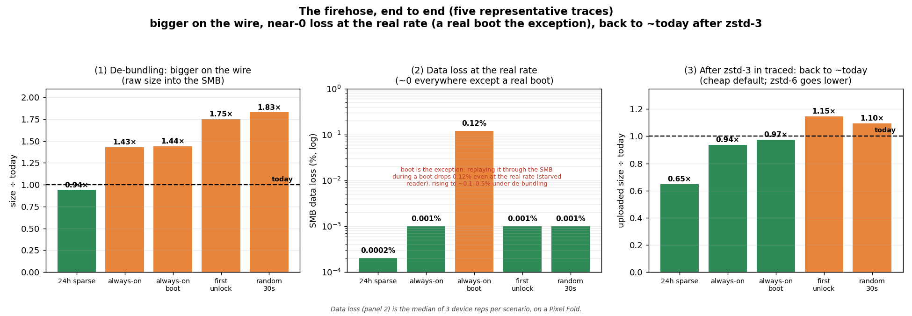

# Tracing Protocol Redesign: validating the firehose on ftrace

**Authors:** @sashwinbalaji

**Status:** Draft

[RFC-0014](https://github.com/google/perfetto/discussions/4508) sketches a
tracing protocol where the producer becomes a firehose: the writer dumps full,
self-contained events with little producer-side packing (close to a zero-copy
memcpy), and the space optimization moves into traced, in batches, off the hot
path. The bet is that traced recovers most of it with "batch-based transparent
compression using LZ4/ZSTD", leaning far less on hand-rolled interning; and that
[RFC-0028](https://github.com/google/perfetto/discussions/6179)'s routing lets the
writer emit each event once and tee it to every session that wants it.

This document is the experiment that checks whether that holds on. We picked ftrace on purpose: it is the highest-volume source and also the most heavily hand-optimized one (`CompactSched` is columnar, delta-coded and comm-interned), so everything the firehose wants to move off the writer is concentrated in one place.

## The three questions

There are three things to worry about with the firehose. We answer each by
running on a real Android device (a Pixel Fold, Tensor G2):

1. Does de-bundling blow up the wire? One full `FtraceEvent` per `TracePacket`
   instead of a packed bundle. How much bigger does that make the stream?
2. Can the SMB absorb the bigger stream? That extra size has to flow through a
   small shared-memory buffer drained by one reader. How much write-rate increase
   can the SMB take before it drops events, and under what device load? (And, read
   as concurrent traces, what that means for the routing in RFC-0028.)
3. Can traced recompress it back to today's size or better? The whole point of
   moving the squeeze into traced is that a general-purpose compressor recovers
   what we stopped doing on the producer. Does it, without regressing what we
   upload?

## Answer



| The worry | What we found |
|---|---|
| De-bundling explodes the wire (~5×) | ~1.5× today (a boot trace ~46 MB → ~60 MB), ~1.9–2.5× once you discount atrace events. The 5× is the real worst case, hit only by a pure-scheduler config (sched events and nothing else): 4.94–4.98× / 5.64×, confirmed on a real Pixel. |
| The SMB can't absorb the bigger stream | It can, except during a real boot. When the reader keeps up (idle, cold-start, heavy compile), a 512 KB SMB carries ~90–145 MB/s with zero loss, so de-bundling's ~1.5–2.5× increase (to ~20–33 MB/s from the real ~13 MB/s) costs nothing. A real boot is the exception: replaying the de-bundled stream through the SMB during a boot drops ~0.12% even at its real ~13 MB/s rate (the reader is starved), and the higher ~20–33 MB/s rate pushes that to ~0.1–0.5%. |
| We can't recompress back to today's size | zstd lands at or below today; lz4 doesn't. zstd-3 is roughly break-even with today at a fraction of the CPU; zstd-6 lands below today on 11 of 12 traces (the one miss is within ~3%). lz4 stays bigger than today on the load traces even at its best level (lz4-12), so it never recompresses back. For example zstd-6 after-unlock 23.5 MB → 23.2 MB, 24 h sparse 2.4 MB → 1.4 MB. zstd is both smaller and faster than the gzip we ship today, on the slow cores traced runs on. |

The data and every experiment behind it live in the companion
[workbook](https://github.com/google/perfetto/blob/rfcs/media/0038/workbook.md);
the scripts that produced these numbers are under
[`media/0038/scripts/`](https://github.com/google/perfetto/tree/rfcs/media/0038/scripts).

The traces, and what each short name means:

- always-on, boot (`aot_boot`): the always-on trace, started once system_server
  is ready during boot. This is the stream we replay for the SMB test in part 2;
  it began ~26 s into the boot, roughly when system_server came up.
- always-on (`aot`): the always-on background trace, triggered when something
  goes wrong on the device.
- cold app start (`cold_start`): launching an app cold.
- after first unlock (`first_unlock`): the heavy spike right after the first
  unlock following a boot.
- random 30 s (`sys_random`): a randomly triggered 30-second capture.
- 24 h sparse (`battery_long`): a day-long, lightweight trace with almost no
  sched.

---

## 1 · How much bigger does de-bundling make ftrace?

Everything here falls out of one fact: only scheduler events are expensive to
un-bundle. Today, ftrace events arrive packed into a per-CPU bundle:

```proto
// today: many events packed into one bundle per CPU
message FtraceEventBundle {
  optional uint32 cpu = 1;
  repeated FtraceEvent event = 2;            // print, binder, irq ...: full messages
  optional CompactSched compact_sched = 16;  // sched_switch/_waking: columnar + interned comm
}
message FtraceEvent {
  optional uint64 timestamp = 1;
  optional uint32 pid = 2;
  oneof event { /* sched_switch, print, binder_transaction, ... */ }
}
```

Two independent optimizations live in there, and de-bundling hits them very
differently:

- Bundling (the `repeated FtraceEvent event`). Most events (atrace `print`,
  binder, irq) are already full standalone messages in that array; they just share
  the bundle's one `cpu` and one packet header. De-bundling gives each its own, but
  the payload is byte-for-byte identical, about 1.07×. Essentially free.
- `CompactSched` (the `compact_sched` field). Scheduler events (`sched_switch`,
  `sched_waking`), the highest-frequency events, are packed columnar: delta
  timestamps, `comm` interned, ~8–12 B each versus ~40 B as a full message.
  De-bundling undoes that (full timestamp, un-interned `comm`, rebuilt `prev_*`),
  which costs ~3.5–4.7×.

The v2 change itself is small, and it leaves the event payloads untouched
(validated field-for-field against a `compact_sched`-disabled capture): kill the
bundle, emit one `FtraceEvent` per `TracePacket`, and move `cpu` onto the event.
This is exactly the firehose shape from RFC-0014: the writer stops packing and
just dumps full events.

```proto
message TracePacket {
  oneof data {
    FtraceEventBundle ftrace_events = 1;   // today: a bundle of many events
    FtraceEvent       ftrace_event  = N;   // v2: exactly ONE ftrace event
  }
}
message FtraceEvent { /* ... */ optional uint32 cpu = M; }   // cpu was per-bundle
```

How much bigger the on-the-wire ftrace gets depends entirely on a trace's
scheduler share. Across 12 real captures (6 scenarios × 2, all data-loss-free):


| trace type | events | today MB | de-bundled MB | × bigger (event bytes) | × bigger (incl. packet header) |
|---|--:|--:|--:|--:|--:|
| general load (`aot`) | 1.45 M | 45.8 | 60.3 | 1.32 | 1.50 |
| startup load (`aot_boot`) | 1.56 M | 45.7 | 60.1 | 1.32 | 1.51 |
| cold start (`cold_start`) | 1.64 M | 46.0 | 65.8 | 1.43 | 1.64 |
| post-unlock (`first_unlock`) | 2.55 M | 61.6 | 107.9 | 1.75 | 1.99 |
| random sampling (`sys_random`) | 1.50 M | 36.2 | 59.6 | 1.64 | 1.92 |
| sparse 24 h (`battery_long`) | 0.12 M | 15.8 | 16.0 | 1.01 | 1.06 |

Rolled up, and bracketed two ways (event bytes only, or including the per-event
packet header; the real v2 framing sits between them):

| ftrace stream | × bigger (event bytes) | × bigger (incl. packet header) |
|---|--:|--:|
| all ftrace, today | 1.3–1.7× (mean 1.46) | 1.5–2.0× (mean 1.67) |
| not counting atrace events (the v2 number) | ~1.9× (up to 2.5×) | ~2.2× (up to 2.9×) |
| other kernel events (binder, irq, …) | ~1.07× | ~1.30× |
| pure-scheduler ceiling (the true upper bound) | 4.94–4.98× | 5.64× |

Two things matter here:

- Only scheduler data is expensive, so a trace's growth tracks its scheduler
  byte-share (a clean linear relationship, shown in the
  [workbook](media/0038/workbook.md)). A trace with no sched is free to de-bundle.
- The worst case is ~5×, from a pure-scheduler config: sched events only, no
  atrace, nothing but context switches. A sched-only capture on a real Pixel
  de-bundles 4.98× / 5.64×, matching a host-built reference. Field traces carry
  atrace and mixed events, so they land far lower (~1.5×); 5× is the ceiling a
  config can hit.

---

## 2 · Can the SMB absorb the bigger de-bundled stream?

De-bundling makes ftrace ~1.5–2.5× bigger (part 1): the real de-bundled stream
peaks at ~13 MB/s (our `aot_boot` capture, started ~26 s into the boot), up from
~9 MB/s bundled. That has to flow through the small shared-memory buffer that one
reader, traced, drains. The question reduces to: how many MB/s can the SMB take
before it drops?

The captured corpus is itself loss-free; it is what today's device actually
recorded. Every loss number below comes from replaying those streams, de-bundled,
through the SMB under load, not from the recordings, so it measures what v2 would
drop rather than what today did.

### How we apply the load: bigger bursts on the real timeline

We replay the boot's per-CPU ftrace through the actual
[v2 shared_ring_buffer](https://github.com/google/perfetto/compare/main...dev/primiano/ringbuf)
prototype and dial the write rate up by duplicating each event at its real
instant: more bytes at the same moments, with the real quiet gaps preserved. That
is exactly what de-bundling does to the stream (bigger events at the same
timestamps), so the x-axis is just MB/s; we swept ~13 → 182 MB/s.

### How much the SMB absorbs, across five conditions

512 KB SMB, reader on traced's cores, the answer splits on whether the reader keeps up:


| condition | absorbs @ <0.1% loss | absorbs @ <1% loss | reader |
|---|--:|--:|---|
| idle | ~98 MB/s | ~143 MB/s | healthy |
| cold app start (everyday) | ~91 MB/s | ~143 MB/s | ~healthy |
| busy phone (heavy compile) | ~70 MB/s | ~99 MB/s | heavy, keeps up |
| first-unlock | ~20 MB/s | ~91 MB/s | spike (noisy) |
| real boot (harshest) | ≤13 MB/s | ~47 MB/s | starved |

The full sweep, loss % at each write rate, per condition (the de-bundled stream
is ~13 MB/s; de-bundling's 1.5–2.5× boundary is ~20–33 MB/s):

Loss % is the share of ftrace events the producer dropped because the SMB was
full when it went to write, counted exactly from the per-event sequence numbers
in the replay (a missing number is a real drop). So 0.12% means about 1 event in
800 never reached the reader, and never made it into the trace; 0% means nothing
was dropped.

| write rate | idle | cold start | heavy compile | first-unlock | real boot |
|---|--:|--:|--:|--:|--:|
| 13 MB/s (1× real) | 0.001% | 0.001% | 0.001% | 0.001% | 0.12% |
| 26 MB/s | 0.001% | 0.000% | 0.001% | 0.20% | 0.18% |
| 39 MB/s | 0.000% | 0.000% | 0.001% | 0.22% | 0.53% |
| 65 MB/s | 0.011% | 0.000% | 0.000% | 0.61% | 2.10% |
| 91 MB/s | 0.025% | 0.061% | 0.49% | 0.63% | 4.54% |
| 130 MB/s | 0.48% | 0.65% | 3.06% | 9.94% | 27.9% |
| 182 MB/s | 2.16% | 2.56% | 3.18% | 19.3% | 36.1% |

Each cell is the median of 3 repetitions. Values below ~0.01% are at the
measurement noise floor (a few stray events out of millions per run); treat them
as zero, and don't read a trend into them (idle at 13 vs 39 MB/s only differ by
rounding noise).

What this says:

- De-bundling needs ~13 MB/s, or ~20–33 MB/s at its 1.5–2.5× boundary.
- When the reader keeps up, the SMB carries it to ~90–145 MB/s with zero loss:
  idle, the everyday cold-start, even a whole-device compile.
- A real boot is the one exception. Replaying the de-bundled stream during a boot
  drops ~0.12% even at its real ~13 MB/s rate, because whole-system contention
  starves the reader; the higher ~20–33 MB/s rate pushes that to ~0.1–0.5%.

So boot is the only case that needs the reader-starvation fix below; everywhere
else there is no loss at any realistic rate.

After the initial sweep we re-audited the harness against the live traced (its
cpuset, cpu cgroup and `nice` all match, so the reader is not over-privileged)
and re-ran boot and first-unlock. The loss numbers reproduced, with boot's median
staying under 1% out to ~65 MB/s. Details are in the
[workbook](media/0038/workbook.md).

### Why boot is different: the drain-ceiling rule

It all obeys one rule: you lose data only when the write rate crosses the
reader's drain ceiling. Starvation lowers the ceiling; the buffer only smooths
bursts.

traced's reader sits on the little/mid cores (cpuset 0–5) and gets descheduled
under load. Its reader-wait climbs from 21% idle, to ~50% under load, to ~60%+
during a boot, which drops its drain ceiling from ~125 MB/s to well below the
elevated rate. That, not the buffer, is what caps a boot at ~47 MB/s.

The buffer-size sweep proves it. A bigger SMB helps cleanly when the reader keeps
up, and does almost nothing once it's starved:


| loss @ ~130 MB/s | 256 KB | 512 KB | 1 MB | 2 MB | 4 MB |
|---|--:|--:|--:|--:|--:|
| idle | 2.1% | 0.38% | 0.003% | 0.001% | 0% |
| cold start | 2.8% | 0.73% | 0.19% | 0.000% | 0% |
| heavy compile | 7.3% | 3.4% | 0.86% | 0.08% | 0% |
| real boot (starved) | 15.5% | 10.5% | 17.3% | 5.7% | 8.0% (flat/noisy) |

For the keep-up conditions, 1–2 MB takes even ~130 MB/s to ~0. For a starved
boot, every size loses about the same: memory can't buy back a reader that has
lost the CPU.

### Cutting boot loss by lowering the reader's nice

The lever for the boot case is reader scheduling, not buffer size: give traced's
reader a stronger (more negative) `nice` so it keeps the CPU and drains the SMB
even mid-boot. A strong negative `nice` (no real-time policy) closes the loss in
the faithful model: emphatically for sustained load, and sharply at the rates
that matter for the spikes. This is the same lever we reached for once before, in
[aosp/2743797](https://android-review.googlesource.com/c/platform/external/perfetto/+/2743797).


| condition | metric | 39 MB/s | 65 MB/s | 91 MB/s | 130 MB/s |
|---|---|--:|--:|--:|--:|
| heavy compile | nice 0 → −10 | 0.00 → 0.00 | 0.00 → 0.00 | 0.44 → 0.00 | 3.21 → 0.00 |
| real boot | nice 0 → −10 | 4.70 → 0.001 | 2.78 → 0.07 | 3.80 → 1.34 | 2.65 → 7.31\* |
| first-unlock | nice 0 → −10 | 0.59 → 0.001 | 0.63 → 0.28 | 0.73 → 0.33 | 2.69 → 1.14 |

Up to ~91 MB/s, `nice −10` takes boot/unlock loss from a few percent to ~0 and
wipes out the heavy-compile loss entirely. traced already holds `SYS_NICE`, so
this is a one-line ship-fix. And Android won't grant a service `−20` anyway, so
`−10` is the realistic target, and it is enough.

The one ugly cell (the `*`: real-boot at 130 MB/s, where `−10` is worse than `0`)
is boot noise. real_boot is one-shot per reboot at 3 reps, and its nice-0 row is
itself non-monotonic (4.7/2.8/3.8/2.6). Trust the shape (the fix closes the
realistic range), not that single high-rate boot point. A bigger-rep real-boot
confirm is the only follow-up, and 130 MB/s during a boot is already well past
anything de-bundling needs.

### Reading it as sessions, and why routing helps

That headroom has a second reading: how many concurrent ftrace traces one SMB can
feed, and whether the routing from RFC-0028 changes that.

| scenario | per-trace SMB write rate | concurrent traces one 512 KB SMB carries |
|---|--:|--:|
| today, bundled (no dedup) | ~13 MB/s | ~7–11 (the ~90–145 MB/s headroom ÷ 13) |
| today, de-bundled (no dedup) | ~20–33 MB/s | ~3–7 (de-bundling spends ~1.5–2.5× per trace) |
| with routing (emit once, tee to all) | ~13–33 MB/s total, any N | not capped by the SMB |

Without dedup, every extra trace re-emits the same events, so N concurrent traces
cost ~N× the write rate and the SMB scales with the number of traces.

The routing in RFC-0028 removes that: the writer emits each event once (one RID
per ftrace trace point) and traced tees it to every interested trace, so one
emission delivers roughly X traces' worth of content (≈ X × 13 MB/s) while the SMB
stays flat. The bandwidth measured here is therefore a floor, what one SMB
sustains before that win even lands.

---

## 3 · Can traced compress it back down?

Yes: use zstd. The chart below compares the final uploaded size, compressed on
both sides, today's actual artifact (the bundled stream after gzip, what we ship
now) against the de-bundled stream after each candidate codec (gzip, lz4, zstd),
across all 12 traces.

- Both sides are post-compression, so de-bundling's size cost is already included.
- Each bar is that codec's size divided by today's; the dashed line at 1.0 is
  today's shipped artifact (bundled + gzip). Anything below the line is smaller
  than what we ship now.


What the chart shows:

- zstd-6 lands at or below today on 11 of 12 traces (worst case after-unlock at
  ~1.03×); zstd-3 is roughly break-even at a fraction of the CPU.
- De-bundled + gzip and both lz4 levels (the fast lz4-1 and lz4's best lz4-12)
  stay above the line: bigger than today.
- zstd is the only codec that pays back de-bundling's cost, and it's also faster
  than gzip on the cores traced runs on (see the cost note below).

The table breaks the same comparison down in absolute MB for three representative
trace types. For each: the ftrace window and the rate the de-bundled stream is
produced at (uncompressed), then today's upload (bundled + gzip) against the
de-bundled stream after each candidate codec, as size (× today) and little-core
compression speed (Cortex-A55, the slowest core traced is pinned to). Sizes are
whole-stream and core-independent; speeds are the little-core floor.

| trace type | ftrace window | produced (uncompressed) | today (bundled + gzip) | dbun + lz4-1 | lz4-1 MB/s | dbun + lz4-12 | lz4-12 MB/s | dbun + zstd-3 | zstd-3 MB/s | dbun + zstd-6 | zstd-6 MB/s |
|---|--:|--:|--:|--:|--:|--:|--:|--:|--:|--:|--:|
| always-on | ~4.7 s | ~13 MB/s | 16.0 MB | 27.6 MB (1.73×) | 58 | 19.4 MB (1.22×) | 2.8 | 14.9 MB (0.94×) | 51 | 13.1 MB (0.82×) | 14 |
| after unlock (heaviest) | ~21 s | ~4.8 MB/s | 23.5 MB | 44.7 MB (1.91×) | 66 | 31.4 MB (1.34×) | 3.2 | 26.9 MB (1.15×) | 52 | 23.2 MB (0.99×) | 14 |
| 24 h sparse | ~24 h | ~0.0002 MB/s | 2.4 MB | 2.8 MB (1.15×) | 245 | 1.9 MB (0.81×) | 6.1 | 1.6 MB (0.65×) | 99 | 1.4 MB (0.59×) | 29 |

Reading the table:

- Only zstd lands below today (× < 1), at healthy little-core speed (zstd-3
  ~50–99 MB/s, zstd-6 ~14–29 MB/s).
- lz4 is the opposite trade: its fast level (lz4-1) is quick but bigger than
  today, and its best level (lz4-12) shrinks more but collapses to ~3 MB/s,
  slower than zstd-6 at a worse ratio.
- The de-bundled stream is produced at ~5 MB/s, peaking ~13 MB/s on the densest
  always-on burst (the ftrace window is short but packed). zstd-3 on the little
  core clears that with ~4× to spare; zstd-6 (~14 MB/s on the little core) keeps
  pace at the peak and has room to spare on the mid/big cores traced can also use.


- Size lands at or below today on 11 of 12 traces with zstd-6 (the one miss,
  after-unlock/t2, is within ~3%) and on all 12 with zstd-12. De-bundling makes
  the raw stream bigger; zstd more than pays it back. zstd-3 is break-even at ~⅛
  the CPU; zstd-6 is ~10% under.
- The cost is cheap on the cores that matter. traced is pinned to little/mid
  (`ProcessCapacityHigh`, cpus 0–5). zstd-3 clears the ~13 MB/s peak production
  rate with ~4× to spare even on the little core; zstd-6 matches the peak on the
  little core and has headroom on the mid cores. zstd-3 is the cheap default; step
  to zstd-6 when you want ~10% more shrink. Compression is not where traced's CPU
  goes.
- Don't bother with lz4. Even with the full ladder now measured on-device, it is
  bigger-than-today at its fast levels and slower-than-zstd at a worse ratio at
  its HC levels.

Switching to zstd is a win on-device regardless of de-bundling. (A generic
columnar pass before zstd reduces this further; that's a separate RFC.)

### How big should the compression blocks be?

traced won't compress the whole trace in one shot; it compresses each flush as
its own block, the same bundling-and-compress step RFC-0014 describes. Bigger
blocks let zstd see more history before it has to start over, so the ratio climbs
a little as blocks grow, but with clear diminishing returns:


| block size (zstd-12) | 512 KB | 1 MB | 2 MB | 4 MB | whole stream |
|---|--:|--:|--:|--:|--:|
| after unlock (busy, dense events) | 4.56× | 4.76× | 4.94× | 5.08× | 5.25× |
| 24 h sparse (mostly idle) | 10.5× | 11.2× | 11.6× | 11.9× | 12.2× |

- 512 KB -> 4 MB buys about 10%, and compressing the whole stream as one block
  (which we can't actually do while streaming) adds only a few percent beyond
  that. So 1–4 MB blocks capture almost all of the available ratio at a fraction
  of the memory.
- No reason to reach for zstd's `--long` mode: it triples the RAM and buys nothing
  on ftrace, where the repetition that compresses well is all local.
- zstd-3 follows the same curve, just with a smaller spread.
- The size figures elsewhere in this section are quoted whole-stream; in real
  1–4 MB per-flush blocks they are ~1–4% larger.

### Can a block ever come out bigger than it went in?

Worth pinning down for sizing buffers in traced: the worry with any compressor is
that incompressible data comes out larger. Strictly, neither gzip nor zstd
promises output ≤ input (by the pigeonhole principle, no lossless codec can), but
both fall back to storing incompressible data in raw/uncompressed blocks, so the
worst case is a few bytes of bookkeeping, not a doubling. For a 1 MB block of
fully incompressible data:

| codec | real worst case | library's safe bound (for buffer sizing) |
|---|--:|--:|
| gzip / DEFLATE | +103 B (1,048,679) | +333 B (`compressBound`) |
| zstd | +34 B (1,048,610) | +4096 B (`ZSTD_COMPRESSBOUND`) |

The two columns mean different things:

- Real worst case: what the encoder can actually emit — the fixed frame
  header/footer plus a few bytes per raw block.
- Safe bound: the looser number the library's `*_COMPRESSBOUND` macro hands back,
  rounded up with cheap bit-shifts so it is trivial to compute and provably safe
  across every level and version. This is the one you size the output buffer with.

Two things fall out. zstd's real worst case is actually tighter than gzip's (its
raw blocks are 128 KB versus DEFLATE's 64 KB, so fewer block headers over the same
data), and either way a block can grow by at most a few dozen bytes. Switching to
zstd adds no new expansion risk.

### Decompression is cheap too (the read side)

The read/upload path (trace_processor, traceconv) decompresses. On the same
Pixel, zstd versus lz4 at matched levels, on the little core (the slowest read
core), for a dense and a sparse trace:


Even on the little core, zstd decompresses ~180–510 MB/s and lz4 ~490 MB/s–1.1
GB/s (~2–3× faster), both far above the ~14–51 MB/s they compress at and well
above the ~13 MB/s peak production rate. The read side is never the bottleneck, so
it doesn't sway the codec choice.

---

## Why some traces (especially 24h) compress far better than others

Two questions decide whether a trace is cheap or expensive under v2:

- How much scheduler data does it carry? That's the only part that gets bigger
  when de-bundled.
- How repetitive is its atrace text? That's what decides how well zstd shrinks it
  back.

The 24 h sparse trace and the heaviest load trace sit at the two ends.

Only scheduler data gets bigger. De-bundling re-expands the packed `CompactSched`
and leaves everything else about the same (~1.07×), so a trace grows by roughly
however much of it is scheduler data. A trace with no scheduler data doesn't grow
at all; it shrinks:

| trace | scheduler data | re-expands to | after de-bundling |
|---|--:|--:|--:|
| 24 h sparse (no scheduler) | 0 MB | 0 MB | 17.7 → 16.7 MB (shrinks, 0.95×) |
| heaviest load | 12.3 MB | 53.3 MB (4.3×) | 64.6 → 113.4 MB (grows, 1.76×) |
| pure-scheduler config (worst case) | n/a | n/a | ~4.9× |

The sparse trace records almost nothing but suspend/resume events, with
`CompactSched` off, so there's nothing to re-expand. It even shrinks: it flushes
only ~1.6 events at a time, so most of its file was the per-bundle wrapper, and
de-bundling drops that wrapper (~0.97 MB, the whole shrink).

Then zstd wins it back, and that's about repetition. Once compressed, all that
matters is how repetitive the atrace text is:

| trace | distinct event types | atrace lines | distinct strings | strings making up half the bytes | zstd-6 ratio |
|---|--:|--:|--:|--:|--:|
| 24 h sparse | 2 | 106,410 | 31,647 | 225 | 11.7× |
| heaviest load | 28 | 740,163 | 220,710 | 3,075 | 4.9× |

- The sparse trace has just 2 event types (atrace `print` + `suspend_resume`) and
  a small string vocabulary, so the stream is uniform and compresses easily. Just
  225 lines make up half its atrace text, things like:

  ```
  6,631× event1
  5,181× event2
  4,842× event3
  ```

  Long lines repeated that often are exactly what a compressor is good at.
- The load trace is the reverse: 28 event types (`print`, `binder_transaction`,
  `sched_blocked_reason`, `workqueue`, and more) and thousands of short, throwaway
  markers (the 7-byte slice-ends of a busy unlock) that give the compressor little
  to match, so it reaches about half the ratio.

So the sparse trace is the best case (free to de-bundle, ~0.59× today after zstd)
and a scheduler-heavy load trace is the hard case (grows ~1.76× raw), yet even the
hard case lands about where we are today once compressed. For any new config the
two questions are the same: how much scheduler data, and how repetitive the atrace
text.

---

## So: solving, not regressing, improving

What the firehose makes go away:

- Producer hot-path complexity. `CompactSched`, the comm intern table, the
  delta-timestamp bookkeeping: all of it leaves the producer. The firehose is a
  near-zero-copy memcpy, which is exactly the write path RFC-0014 is after.

Where there's no regression versus today:

- Trace size stays within today. De-bundled + zstd is at or below today on all 12
  traces, so the bigger on-wire stream costs nothing in what we actually upload.
- On-device CPU stays cheap. zstd-3 compresses at ~50 MB/s on a single little
  core, ~4× the ~13 MB/s peak the stream is produced at.
- Data loss stays at ~0. At the real ~13 MB/s rate the SMB drops essentially
  nothing (~0.12%, and only mid-boot, which the `nice` fix closes). Because it
  absorbs ~90–145 MB/s whenever the reader keeps up, the ~1.5–2.5× de-bundling
  increase still sits far inside that, so loss is no worse than today.

Where it is strictly better:

- Smaller uploads. zstd-6 is ~10% smaller than today on dense traces and ~40% on
  sparse long ones, before the columnar upside.
- Cheaper compression. zstd is smaller and faster than today's gzip on the cores
  traced actually runs on: a win we can take immediately, independent of the
  rewrite.
- Room for more concurrent traces. The same ~90–145 MB/s headroom holds several
  un-deduped concurrent ~13 MB/s traces beyond the de-bundling cost; once routing
  lands (RFC-0028) the writer emits once and traced tees, so delivered output
  scales without the SMB scaling, and the firehose is what makes that tee-ing
  tractable.

---

## Decision log

- Kill the `FtraceEventBundle` outright: one `FtraceEvent` per `TracePacket`,
  `cpu` moves onto `FtraceEvent`. No 1-event-bundle shim.
- The producer stays a firehose: full events, no producer-side optimization;
  compaction and compression happen in traced, per RFC-0014.
- The SMB absorbs the de-bundling increase. Measured with the faithful
  duplication model across five real conditions: the SMB absorbs ~90–145 MB/s
  when the reader keeps up and ~47 MB/s during a real boot, versus the de-bundled
  stream's ~13 MB/s. Time-warp was the interim proxy and is now superseded.
- Codec is zstd (level 3–6), blocks 1–4 MB.
