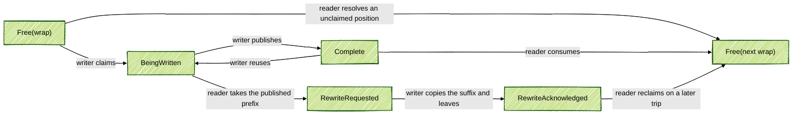

# Tracing v2: shared ring buffer ABI

**Authors:** @sashwinbalaji

**Status:** Draft (Not ready for review)

**PR:** N/A

This is the follow-up to [RFC 0014][rfc14] on the shared ring buffer. RFC 0014
sketched a producer-owned ring in shared memory: several trace writers in one
process write into it, one reader (normally `traced`) drains it. It left the
actual ABI open.

This RFC fills that in: the ring header, the chunk layout, and what happens
when the reader and a writer reach the same chunk at the same time.

## 1. The ring at a glance

One ring is a small header followed by equally sized chunks:

```text
 producer process                                      traced

 TraceWriter A --+
                 |       producer-owned shared memory
 TraceWriter B --+--> +--------+-----+-----+-----+-----+ --> one reader
                 |    | header |  0  |  1  |  2  | ... |
 TraceWriter C --+    +--------+-----+-----+-----+-----+
```

Writers use the ring concurrently. The reader resolves their positions in the
order they were reserved. A chunk is reused many times.

Every chunk starts with one 32-bit atomic state word. It says who may touch the
chunk and, while a writer owns it, how many fragments the reader may copy.
Every handoff between a writer and the reader is a compare-and-swap on that
word. Section 4 defines it.

In the rest of this document:

| Term | Meaning |
|---|---|
| **position** | A number in the ordered stream of writer reservations. Positions start at 0 and wrap as a `uint32_t`. |
| **physical chunk** | One fixed byte range in the shared mapping. Position `p` uses chunk `p % num_chunks`. |
| **reserve** | Advance the ring's write position and obtain one position in the stream. |
| **claim** | Take ownership of that position's physical chunk by changing its state word from `Free` to `BeingWritten`. |
| **fragment** | One contiguous byte range handed to the encoder. A packet is one fragment, or several when it crosses a chunk boundary. |
| **publish** | Make one or more finished fragments visible to the reader by updating the chunk's state word. |
| **resolve** | The reader's decision for one position: consume its data, take a published prefix, or skip it as a hole. |
| **hole** | A position that yields no data, because no writer claimed its chunk before the reader reached it. |

Reserve and claim are deliberately separate. Reserving position 7 fixes where
the data belongs in the stream. Claiming gives the writer the physical chunk
that position 7 maps to. A thread can be descheduled between the two
(section 6.1).

### 1.1 The ordinary case

Start with a four-chunk ring:

```text
read_pos  = 0
write_pos = 0

position:       0          1          2          3
chunk:          0          1          2          3
state:       Free(0)    Free(0)    Free(0)    Free(0)
```

A writer reserves position 0, which moves `write_pos` to 1. It claims chunk 0,
writes fragments, and publishes the chunk as `Complete`:

```text
read_pos  = 0
write_pos = 1

position:       0          1          2          3
chunk:          0          1          2          3
state:     Complete     Free(0)    Free(0)    Free(0)
```

The reader consumes chunk 0, prepares it for its next use (position 4), and
advances `read_pos`:

```text
read_pos  = 1
write_pos = 1

position:       0          1          2          3
chunk:          0          1          2          3
state:       Free(1)    Free(0)    Free(0)    Free(0)
```

The number in `Free(n)` is the wrap count: which trip around the ring the
chunk is free for. Section 6.1 explains why the reader writes it.

## 2. What the protocol guarantees

As long as nobody gets descheduled, the ring above is a plain FIFO. Everything
below exists for three cases: a writer descheduled between reserve and claim,
a writer descheduled halfway through a chunk, and the reader arriving while a
writer is still appending. In all of them:

- **FIFO follows reservation order.** Writers may finish in any order, but
  the reader resolves positions in the order they were reserved.
- **The reader never waits for a writer.**
- **A delayed writer cannot publish into a position the reader has resolved.**
- **Published bytes do not change.** A writer only appends. It never moves
  or rewrites a published fragment.
- **The reader can take the published prefix** of a chunk whose writer is
  still working in it.
- **Only the reader makes a chunk free.**
- **One stopped writer pins one chunk, not the ring.** Positions that map to
  that chunk become holes, and the reader and the other chunks keep going.

The wrap count in `Free` is 16 bits, so the third guarantee has a finite
horizon. Section 9.1 gives the bound.

## 3. Ring layout and positions

```text
+------------------------+---------+---------+---------+-----+
| RingBufferHeader, 64 B | chunk 0 | chunk 1 | chunk 2 | ... |
+------------------------+---------+---------+---------+-----+
0                        64
```

All chunks have the same size. `num_chunks` is a power of two (section 3.3).
`chunk_size` is at least 256 bytes, and a multiple of four so that every
state word is aligned. The ABI is little-endian and requires
`atomic<uint32_t>` and `atomic<uint64_t>` to be lock-free.

### 3.1 Ring header

```text
byte offset
0              4              8             12               64
+--------------+--------------+--------------+----------------+
|   read_pos   |  write_pos   | num_writers_ | reserved       |
|              |              | waiting      |                |
+--------------+--------------+--------------+----------------+
\________ rw_positions _______/\_ atomic32 __/
       one atomic<uint64_t>
```

Numerically, the 64-bit `rw_positions` word is:

```text
63                                      32 31                    0
+-----------------------------------------+-----------------------+
|                write_pos                |       read_pos        |
+-----------------------------------------+-----------------------+
```

`write_pos` is the next position a writer may reserve, and `read_pos` the
next position the reader has not resolved. They share one atomic so that a
capacity check never mixes counters read at different times. In memory
`read_pos` is the first four bytes of the word, which is the futex address
used in section 8.

`num_writers_waiting` lets the reader skip the wake syscall when nobody is
parked. It is only an optimization (section 8) and never decides capacity or
ownership.

A zero-filled mapping is already a valid ring: `read_pos = write_pos = 0`, no
waiters, every chunk `Free(0)`.

### 3.2 Capacity and `uint32_t` rollover

```text
outstanding = uint32_t(write_pos - read_pos)
```

Unsigned subtraction keeps working when the counters roll over, and because
the ring never allows `2^31` or more outstanding positions the result has only
one reading:

```text
outstanding == 0           ring is empty
outstanding < num_chunks   a position can be reserved
outstanding == num_chunks  ring is full
outstanding > num_chunks   invalid header
```

`num_chunks` is therefore at most `2^30`. Because at most `num_chunks`
positions are outstanding, at most one outstanding reservation maps to each
physical chunk. That is why an exact-value compare-and-swap on the chunk's
state word is enough to arbitrate ownership. The one exception is the alias in
section 9.1.

### 3.3 Mapping a position to a chunk

For `num_chunks = 2^k`:

```text
chunk_index(position) = position & (num_chunks - 1)
trip(position)        = position >> k
```

For four chunks, `k = 2`:

```text
position:     0  1  2  3 | 4  5  6  7 | 8  9 10 11 | 12 ...
chunk index:  0  1  2  3 | 0  1  2  3 | 0  1  2  3 |  0 ...
trip:         0  0  0  0 | 1  1  1  1 | 2  2  2  2 |  3 ...
```

## 4. Chunk layout

RFC 0014 sketched a chunk header with a WriterID, a size, and
`acquired_for_writing` and `needs_rewrite` bits. Here the two bits become a
three-bit ownership state with five values, and the size becomes a fragment
count:

| Value | State | Meaning |
|---:|---|---|
| `000` | `Free(wrap)` | Nobody owns the chunk. A reservation with the matching wrap count may claim it. |
| `001` | `BeingWritten(writer,n)` | The writer owns the chunk. The first `n` fragments are complete; another may be open after them. |
| `010` | `Complete(writer,n)` | The writer has finished with the payload. It may take the chunk back before the reader does. |
| `011` | `RewriteRequested(writer,n)` | The reader took the first `n` fragments while the writer was still in the chunk. The writer still owns anything it appended after them. |
| `100` | `RewriteAcknowledged` | The old writer has stopped touching this chunk. The reader may reclaim it. |
| `101`..`111` | reserved | Ownership is not defined. |

The state lives in the low three bits of the state word. The rest of the word
has one layout while the chunk carries data and another while it is free.

### 4.1 Data-bearing states

`BeingWritten`, `Complete` and `RewriteRequested` share one layout. The low
byte of the word is the control byte, which holds the state, the format and
three flags:

```text
31                       16 15             8 7                0
+---------------------------+----------------+------------------+
|         WriterID          | num_fragments  |   control byte   |
+---------------------------+----------------+------------------+
          16 bits                 8 bits            8 bits

control byte, bits 7..0 of the word:

   bit 7      bit 6      bit 5      bits 4..3     bits 2..0
+----------+----------+----------+-------------+-------------+
|   from   |    on    |   data   |   format    |    state    |
| previous |   next   |   loss   |             |             |
+----------+----------+----------+-------------+-------------+
```

`num_fragments` is the number of complete fragments visible to the reader.
`data loss` means this writer dropped data before this chunk. `on next` means
the last fragment continues in this writer's next chunk, and `from previous`
means the first fragment continues a packet from this writer's previous
chunk.

### 4.2 `Free` and `RewriteAcknowledged`

`Free` borrows the WriterID field for the wrap count. Every other bit,
including the whole control byte, is zero:

```text
31                       16 15             8 7                0
+---------------------------+----------------+------------------+
|        wrap count         |      zero      |  control = 000   |
+---------------------------+----------------+------------------+
```

`Free(0)` is therefore the all-zero word. `RewriteAcknowledged` is state `100`
with every other bit zero, numerically 4. The reader reclaims it by comparing
against that exact word.

### 4.3 Bytes in memory and the initial chunk format

The ABI is little-endian, so the control byte is byte 0 of the chunk, followed
by the fragment count and the WriterID. Format `00`, the only format defined
here, adds one target BufferID and sends every fragment in the chunk to that
trace buffer:

```text
byte offset
0          1          2                    4                    6
+----------+----------+--------------------+--------------------+------------------+
| control  |   num    | WriterID, LE       | BufferID, LE       | payload and      |
|   byte   |fragments |                    |                    | size directory   |
+----------+----------+--------------------+--------------------+------------------+
\____________ atomic state word ___________/
```

The writer stores the BufferID while it exclusively owns a newly claimed
chunk. Publishing the first fragment makes it visible, so a reader that sees
`num_fragments == 0` must not read it. Format `01` is reserved for the
per-packet routing of [RFC 0028][rfc28]. Formats `10` and `11` are also
reserved.

## 5. Payload and fragment directory

The writer asks for a contiguous fragment, fills it, and closes it with the
number of bytes used. Closing a fragment makes it part of the published
prefix. An open fragment is invisible to the reader.

```text
low address                                                   high address

+--------------+------------------------+--------+---------------------+
| chunk header | fragment payloads ---> | unused | <--- size varints   |
+--------------+------------------------+--------+---------------------+
```

Sizes live at the far end because the encoder does not know a fragment's size
until it closes it: there is no size prefix to reserve or patch, and a varint
size does not cap a fragment at 255 bytes. The state word carries only the
fragment count. The reader decodes that many sizes from the end of the chunk
and derives the payload ranges.

Each size is a shortest-form protobuf varint, stored so that a reader walking
toward lower addresses meets its bytes in normal order. For sizes 5, 200 and 3:

```text
low address                                      high address
                    <----- reader walks
+-------+------+------------+--------+
|  ...  | 03   | 01 c8      | 05     |
+-------+------+------------+--------+
          size2   size1       size0

reader sees: 05, then c8 01, then 03
```

The writer stores the payload and size varints of the first `n` fragments
before it publishes `num_fragments = n` with a release operation. Those bytes
never move afterwards. The reader checks every size and offset against the
chunk bounds before it copies anything.

### 5.1 Packet boundaries

A fragment is one complete packet or one part of a packet that crosses a
chunk boundary. The two continuation flags join those parts for the same
WriterID. A writer closes the crossing fragment only in the operation that
publishes `Complete` with `on next`. Two rules follow:

- `BeingWritten` never carries `on next`, so a prefix taken from
  `BeingWritten` always ends at a packet boundary (section 6.2).
- A `Complete` chunk carrying `on next` is never reused, because nothing may
  be appended after its last fragment (section 6.3).

## 6. Chunk lifecycle and races

In the ordinary case a writer takes a chunk from `Free` to `BeingWritten` and
then to `Complete`, and the reader takes it back to `Free`. The
`RewriteRequested` path is used when the reader reaches the chunk before the
writer has published `Complete`:



Every handoff is a compare-and-swap on the state word against the exact word
last observed. A failed CAS proves that the other side's transition won. A
writer then acts on the returned word: it abandons the position, drops its
cached handle, or relocates its suffix. The reader discards any speculative
copy, leaves `read_pos` unchanged, and returns `RetryLater`. A later drain
pass reloads the word with acquire and resolves the same position from
whatever it finds. Three handoffs can be contested.

### 6.1 Claiming a position, and why `Free` carries a wrap count

Reserving a position updates the ring header; claiming its chunk updates the
chunk's state word. No single atomic operation does both, so a writer can be
descheduled in between.

Suppose writer A reserves position 0 and is descheduled before claiming chunk
0, and writer B reserves position 1 and finishes chunk 1:

```text
read_pos  = 0
write_pos = 2

position:       0          1          2          3
chunk:          0          1          2          3
state:       Free(0)    Complete    Free(0)    Free(0)
                 ^          ^
              writer A   writer B
               asleep
```

The reader cannot wait for A. It resolves position 0 as a hole and moves on to
B.

If every free chunk used the same all-zero word, the reader would have nothing
to change when it resolves the hole. Chunk 0 would still read as zero when A
wakes, A's compare-and-swap from zero would succeed, and A would publish data
for position 0 after the reader had passed it. FIFO is broken.

So `Free` carries the low 16 bits of the position's trip:

```text
wrap_count(position) = uint16_t(trip(position))
```

A reservation for position `p` permits exactly one claim attempt, from
`Free(wrap_count(p))`. When the reader resolves position `p` as a hole, it
prepares the chunk for its next use, and the two may race:

```text
writer wins: Free(wrap(p)) -> BeingWritten(writer,0)
             reader retries later and finds BeingWritten (section 6.2)

reader wins: Free(wrap(p)) -> Free(wrap(p + num_chunks))
             writer's one claim attempt fails; position p is a hole
```

In the example the reader changes chunk 0 from `Free(0)` to `Free(1)`, and A's
delayed claim, which expects `Free(0)`, fails. The failed writer may reserve
another position, but it must not retry the claim for `p` against the word
the failed CAS returned. This differs from a full ring: `Full` means nothing was
reserved, whereas a failed claim leaves a position that only the reader can
resolve, so a writer must notify the reader before it waits for space.

Two rules cooperate here. "Only the reader writes `Free`" stops an old writer
from freeing a chunk that a newer reservation owns. The wrap count stops an
old reservation from claiming a chunk that is legitimately free for a later
trip.

### 6.2 Publishing while the reader takes a prefix

`BeingWritten(writer,n)` means fragments `0..n-1` are stable and the writer
may be appending after them. The reader may copy that prefix rather than
wait. Taking the committed prefix of a live chunk is what this document calls
scraping. The copy is speculative until the reader wins this race:

```text
writer: BeingWritten(writer,n) -> Complete(writer,n+k)
reader: BeingWritten(writer,n) -> RewriteRequested(writer,n)
```

If the writer wins, the reader discards its copy and consumes the chunk on a
later pass.

If the reader wins, its prefix is the data for this position. The writer's
later publish fails and returns `RewriteRequested(writer,n)`. The writer
copies only the fragments after `n` into private storage, changes the old
chunk to `RewriteAcknowledged`, and publishes the suffix in a later chunk, or
drops it and reports data loss. It acknowledges before waiting for replacement
space, so a waiting writer cannot keep the old chunk pinned. Flags already
emitted with a non-empty prefix are not repeated on the suffix.

If the writer never returns, the chunk stays `RewriteRequested`. Every later
position that maps to it is a hole, so the ring runs with one chunk fewer
until the writer comes back.

### 6.3 Reusing a complete chunk while the reader consumes it

A writer can take a `Complete` chunk back and append another fragment if space
remains. At the same time the reader may try to consume it:

```text
writer wins: Complete(writer,n) -> BeingWritten(writer,n)
             reader discards its copy, retries later and follows section 6.2

reader wins: Complete(writer,n) -> Free(next wrap)
             writer drops its cached handle
```

A writer must not reuse a `Complete` chunk that carries `on next`
(section 5.1), nor while it has data loss pending: the next fragment after a
loss goes into a new chunk that carries `data loss`, otherwise the flag would
follow the data it reports on.

## 7. Memory ordering

Two chains need ordering. For payload written by the SDK:

```text
writer stores BufferID, payload and size varints
  -> writer release-publishes a data-bearing state
  -> reader acquire-loads that state
  -> reader may copy the published bytes
```

Before a later writer overwrites a chunk:

```text
reader finishes reading or copying the old contents
  -> reader release-transitions the chunk
  -> reader release-publishes the new read_pos
  -> a writer acquire-observes the capacity and claims the chunk
  -> that writer may overwrite the old bytes
```

| Operation | Success | Failure | Why |
|---|---|---|---|
| Writer reserves `write_pos` | acquire | acquire | Sees the reader's reclaims behind a new `read_pos`. |
| Writer claims `Free -> BeingWritten` | acquire | relaxed | The reader's last access to the old contents precedes the writer's first store. |
| Writer publishes `BeingWritten -> Complete` | release | acquire | Success publishes bytes; failure orders the reader's finished copy before relocation. |
| Writer reuses `Complete -> BeingWritten` | relaxed | relaxed | Stays in the publication's release sequence. |
| Writer writes `RewriteAcknowledged` | release | relaxed | All writer access precedes the acknowledgement. |
| Reader loads a chunk state | acquire | n/a | Makes the published bytes visible. |
| Reader moves a chunk to `RewriteRequested` or `Free(next)` | release | relaxed | The reader's copy precedes the next claim. On failure it retries with a new acquire load, so nothing is read through the returned word. |
| Reader reclaims `RewriteAcknowledged` | acq_rel | relaxed | Observes the writer's final release; failure is a protocol error. |
| Reader publishes `read_pos` | release | relaxed | Chunk transitions precede the capacity. |

Nothing in the chunk protocol needs sequential consistency. The only seq_cst
operations are the two fences in section 8.

## 8. Waiting when the ring is full

A writer with a stalling policy sleeps when every position is outstanding.
The sleep is a futex wait on the low `read_pos` half of `rw_positions`, which
little-endian layout puts at byte offset zero. The reader publishes `read_pos`
once per drain pass, after all its chunk transitions, and then wakes waiters.
Until then writers can only under-estimate free capacity. `num_writers_waiting`
avoids the wake syscall when nobody is asleep:

```text
writer                                      reader
------                                      ------
num_writers_waiting++                       publish a larger read_pos
seq_cst fence                               seq_cst fence
check read_pos                              check num_writers_waiting
futex_wait if it is unchanged               futex_wake if nonzero
```

The two fences rule out the one outcome that would lose a wake:

```text
writer misses the new read_pos
AND
reader misses the new waiter count
```

After the fences, at least one side observes the other's update: either the
writer sees the new `read_pos` and does not sleep, or the reader sees a waiter
and calls wake. A stale nonzero waiter count only costs an extra syscall.

The futex word must be visible to both processes, so the cross-process design
uses shared, not process-private, futex operations. The opposite direction,
the producer telling the service that there is something to resolve, is
outside this ABI: `traced` cannot put a futex into its socket `poll()` loop.

## 9. Limits and errors

### 9.1 The wrap count is finite

`Free` stores the low 16 bits of the trip, so the wrap count of a physical
chunk repeats after:

```text
min(num_chunks * 65,536, 2^32) reservations
```

| Chunks | Wrap count repeats after | At 1M reservations/s |
|---:|---:|---:|
| 1 | 65,536 | 65.5 ms |
| 4 | 262,144 | 262 ms |
| 256 | 16,777,216 | 16.8 s |
| 65,536 or more | 4,294,967,296 | 71.6 min |

For the wrap count to alias, one writer must stay suspended between reserving
and claiming while the rest of its process and the reader push the ring
through the entire period. Suspending the whole process does not do it. If it
happens, the delayed claim succeeds and its data is delivered at the later
position: FIFO is lost for that writer, the writer that reserved the later
position finds its claim failing and reserves again, and nothing is corrupted.
This ABI accepts that. A minimum ring size would lengthen the period without
removing it.

### 9.2 Producer memory is untrusted

`traced` must copy the format header, fragment directory and payload into its
own memory before parsing them. Validating offsets in the shared mapping and
then following them is a time-of-check/time-of-use race.

### 9.3 Protocol errors, bad payload and data loss

The reader stops one producer ring when it cannot tell who may touch a chunk:
a reserved state, a `Free` word with the wrong wrap count or nonzero reserved
bits, a non-canonical `RewriteAcknowledged` word, or more than `num_chunks`
outstanding positions. Other rings and sessions are unaffected. On the writer
side, only the reader's rewrite request may change a chunk a writer owns, and
anything else is a protocol error.

Malformed fragment sizes and unknown formats are payload errors, not ownership
errors. The reader still performs the ownership transition it would have
performed for a valid chunk (a malformed `BeingWritten` chunk still becomes
`RewriteRequested`, otherwise its writer could publish behind the reader),
drops the bytes, and reports a data loss for the WriterID in the state word.

A writer that loses data sets `data loss` on the next chunk it publishes. In
both cases the consumer reports the gap on that writer's next packet. Durable
loss counters in `traced` are separate work, and the reserved header bytes
have no meaning in this ABI.

## 10. Alternatives considered

- Use the same all-zero `Free` word on every trip. An old reservation could
  then claim a later use of the chunk after the reader has passed it
  (section 6.1).
- Claim any free word, then check `read_pos`. The reader resolves a position
  before it publishes `read_pos`, and publishes in batches, so a delayed writer
  could claim in that window and publish stale data.
- Let writers make chunks free. A delayed writer could erase state belonging
  to a newer reservation, because only the reader knows which position it is
  resolving.
- Leave an invalid marker forever. An ordinary deschedule between reservation
  and claim would then permanently remove that chunk from the ring.
- Publish a byte count instead of a fragment count. A byte boundary cannot
  describe the append-only fragments needed to take a prefix and relocate only
  the suffix.
- Move the whole active chunk after a scrape. Already published packets would
  wait for the writer and be copied twice.
- Use a 64-bit chunk state. Everything fits in 32 bits, and a wider word would
  double the per-chunk header without closing the reserve/claim gap.

[rfc14]: 0014-tracing-protocol-redesign.md
[rfc28]: 0028-tracing-protocol-routing.md
