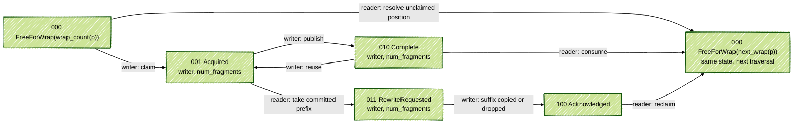
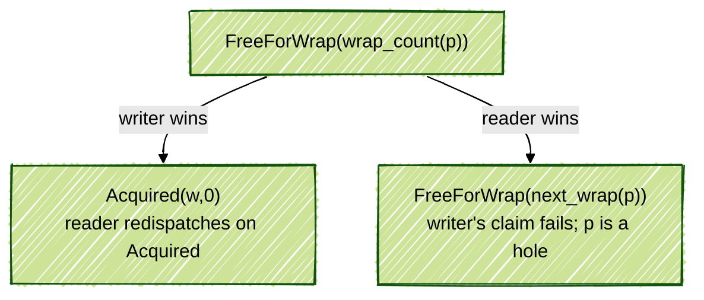
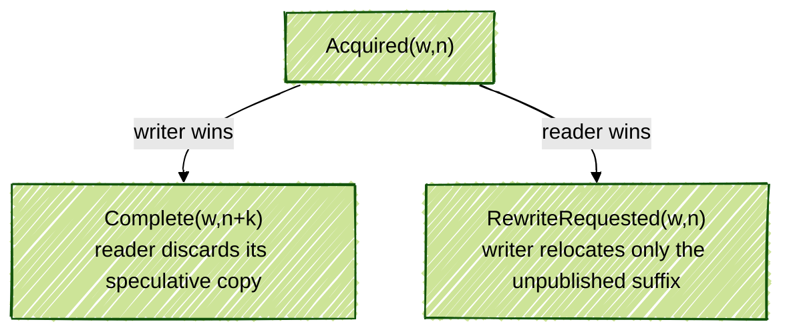
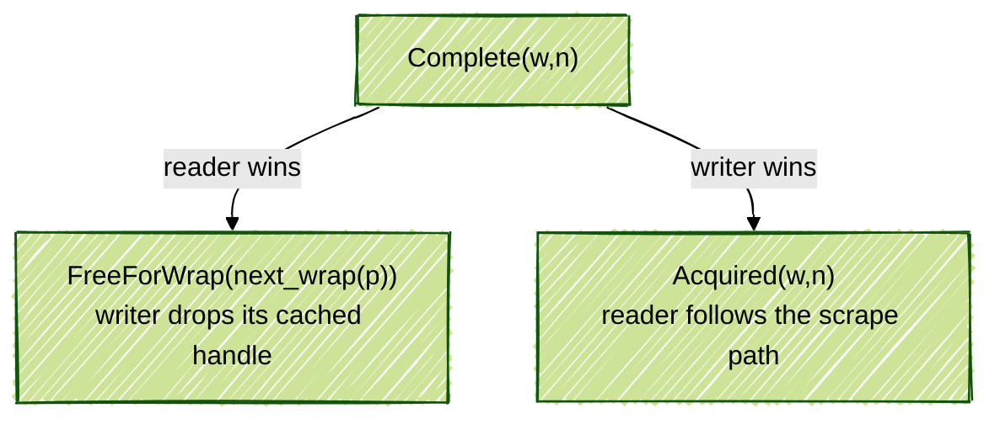
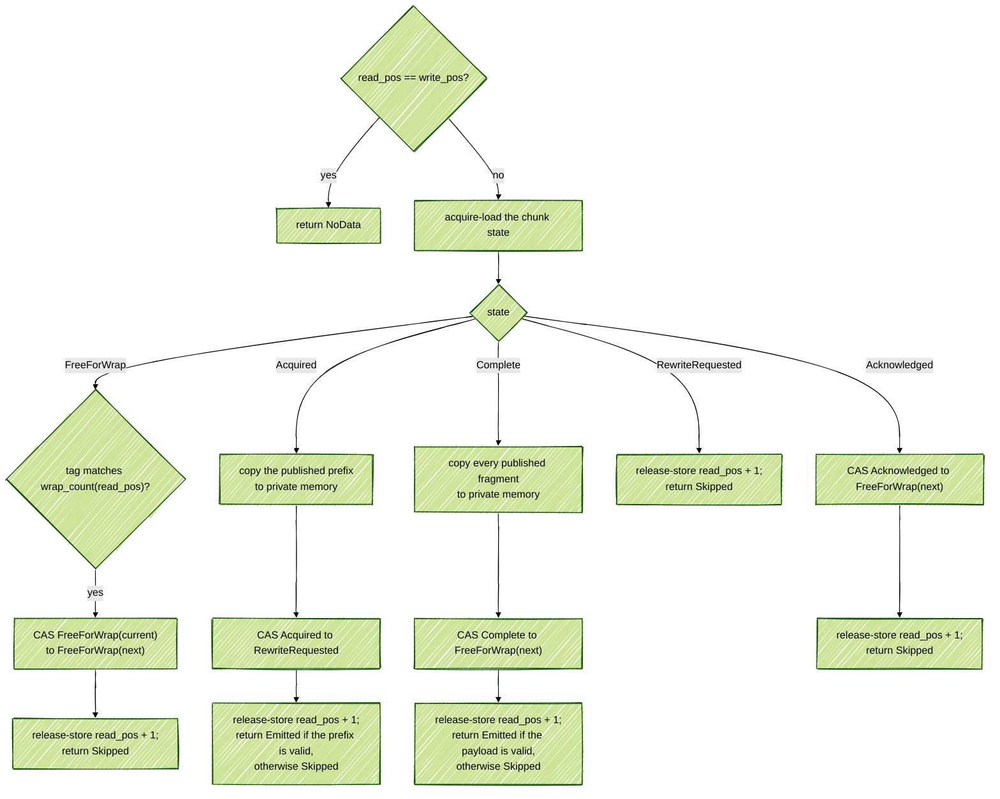
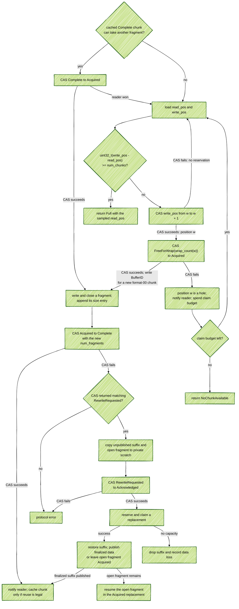

# Tracing v2: Shared Ring Buffer Chunk ABI and State Protocol

**Authors:** @sashwinbalaji

**Status:** Draft (Not ready for review)

**PR:** N/A

[RFC 0014][rfc14] sketches a producer-local shared-memory ring split into
fixed-size chunks. Writers bump an atomic cursor to reserve a chunk, and one
reader (`traced`) drains the chunks.

This RFC specifies the chunk layout, its 32-bit state word, every legal
transition, and what happens when the reader and a writer race on the same
chunk.

## 1. Requirements

The ring is multi-producer, single-consumer. Writers reserve logical positions
concurrently. The reader resolves those positions in order.

- **FIFO by reservation position.** Once the reader resolves a position, a
  delayed writer for that position cannot publish behind it. The identity used
  to enforce this is finite; section 9 gives the exact limit.
- **The reader never waits for a writer.** It does not wait for a slow writer,
  a writer stopped inside a fragment, or one that never comes back.
- **Committed bytes are append-only.** A writer may append fragments. It may not
  change or remove a fragment it has already published.
- **The reader can take a committed prefix.** If a writer is still using the
  chunk, the reader takes the fragments already published. The writer keeps the
  unpublished suffix and any open fragment.
- **Only the reader makes a chunk free.** A writer can acknowledge that it has
  finished using a chunk. The reader decides when that chunk can be claimed
  again.
- **A stalled writer does not stop the reader.** A writer stalled after claiming
  a chunk can pin that physical chunk. Later positions mapping to it become
  holes, but the reader continues through the rest of the ring.
- **One atomic word decides each handoff.** Ownership, published progress and
  free-chunk identity are encoded in one per-chunk word. Every handoff compares
  against the exact word the actor observed.

The state word is 32 bits and not 64, because Perfetto still supports 32-bit
targets where a 64-bit atomic is not guaranteed to be lock-free.

## 2. Limitation of the first prototype

The [first prototype][pr4704] uses this 32-bit header:

```text
 31            24 23            16 15                             0
+----------------+----------------+--------------------------------+
|     flags      |  payload_size  |            WriterID            |
+----------------+----------------+--------------------------------+
      8 bits           8 bits                  16 bits

flags:
  bits 7-5  unused            bit 2  continues from previous chunk
  bit 4  needs rewrite        bit 1  continues on next chunk
  bit 3  data loss            bit 0  acquired for writing
```

Most of this should stay: one 32-bit CAS, a WriterID, and the three payload
flags. The payload byte count becomes a fragment count for partial scraping.

The ownership problem is the all-zero `Free` word. It means the same thing on
every traversal of the ring. A delayed writer cannot tell whether a free chunk
belongs to its reservation or to a much later one.

### 2.1 Example: a delayed writer publishes behind the reader

Assume four chunks.

```text
Legend
  F      free, all-zero word
  R(a)   writer_a owns the chunk; the reader requested a rewrite
  K      writer acknowledged and will no longer touch the chunk
  C(b)   complete data from writer_b
```

`writer_a` owns chunk 0 from an older position. The reader has already taken
its committed prefix and moved to position 4.

```text
chunk:     0     1     2     3
        +-----+-----+-----+-----+
        | R(a)|  F  |  F  |  F  |        read_pos = 4  write_pos = 4
        +-----+-----+-----+-----+
```

`writer_b` reserves position 4, which also maps to chunk 0. It is descheduled
before its claim.

```text
chunk:     0     1     2     3
        +-----+-----+-----+-----+
        | R(a)|  F  |  F  |  F  |        read_pos = 4  write_pos = 5
        +-----+-----+-----+-----+
           ^ writer_b will try to claim this chunk
```

The reader resolves position 4. Only `writer_a` can leave `R(a)`, so the reader
skips this position and advances.

```text
chunk:     0     1     2     3
        +-----+-----+-----+-----+
        | R(a)|  F  |  F  |  F  |        read_pos = 5  write_pos = 5
        +-----+-----+-----+-----+
```

`writer_a` wakes, moves its unfinished suffix elsewhere, and writes `K`. It
does not make the chunk free.

```text
chunk:     0     1     2     3
        +-----+-----+-----+-----+
        |  K  |  F  |  F  |  F  |
        +-----+-----+-----+-----+
```

Traffic takes the cursors around the ring. The reader later resolves position
8 on chunk 0. It turns `K` into `F` and advances to position 9.

`writer_b` now wakes and runs the claim it prepared for position 4. It expected
the all-zero word and the chunk is all-zero again. Its CAS succeeds:

```text
chunk:     0     1     2     3
        +-----+-----+-----+-----+
        | C(b)|  F  |  F  |  F  |        read_pos is already past position 4
        +-----+-----+-----+-----+
```

`writer_b` has published behind the reader.

***Reader-only `Free` is necessary, but it does not identify which traversal
the free word belongs to.***

### 2.2 Give `Free` a wrap count

The free word carries the traversal it belongs to:

```text
FreeForWrap(wrap_count)
```

A writer derives the expected value from its reserved position. In the example
above:

There are four chunks, so positions `0..3` belong to wrap 0, positions `4..7`
belong to wrap 1, and so on. `writer_b` reserved position 4, whose wrap count
is `4 / 4 = 1`. When the reader resolves position 8, the next use of the same
physical chunk is position `8 + 4 = 12`, whose wrap count is `12 / 4 = 3`.

```text
writer_b reserved position 4:  expects FreeForWrap(1)
reader resolves position 8:    writes  FreeForWrap(wrap_count(8 + 4))
                                      = FreeForWrap(3)
claim result:                  expected != actual
```

The delayed claim fails.

This also handles a writer that reserves a position and sleeps before anyone
has claimed the chunk:

```text
writer reserves position 0 and expects FreeForWrap(0)
reader resolves position 0:
  FreeForWrap(0) -> FreeForWrap(1)
writer wakes and its one claim attempt fails
```

No invalid marker is needed. The reader resolves the hole and prepares the
physical chunk for its next traversal with one CAS.

## 3. Chunk ABI

### 3.1 Ring and chunk layout

```text
Ring:
+---------------------+---------+---------+---------+-----+
| ring control header | chunk 0 | chunk 1 | chunk 2 | ... |
+---------------------+---------+---------+---------+-----+
```

The ring control header holds `read_pos`, `write_pos` and ring-wide control or
statistics. Its exact layout is outside this RFC.

Every chunk in a ring has the same `chunk_size`. It is a power of two between
256 bytes and 32 KiB. Every chunk begins with one naturally aligned four-byte
state word.

This RFC defines format `00`:

```text
Target-buffer chunk, format 00:

+-------------------+-------------------+---------------------------------+
| state word, 4 B   | target BufferID   | bidirectional payload area      |
|                   | 2 B, little-end.  |                                 |
+-------------------+-------------------+---------------------------------+
 byte 0           3  4               5   6                  chunk_size - 1
```

Every packet in this chunk goes to the same target buffer.

### 3.2 State word

The top three bits select the state. The other 29 bits depend on that state.
Five ownership states need three bits; spelling them as an enum is easier to
audit than deriving ownership from several flags and a sometimes-zero
WriterID.

```text
FreeForWrap (000):

 31          29 28                                             0
+-------------+------------------------------------------------+
|     000     |               29-bit wrap_count                |
+-------------+------------------------------------------------+

Acquired (001), Complete (010), RewriteRequested (011):

 31          29 28      27 26      24 23       16 15             0
+-------------+----------+----------+-----------+----------------+
|    state    |  format  |  flags   | num_frags |    WriterID    |
+-------------+----------+----------+-----------+----------------+
     3 bits      2 bits     3 bits     8 bits        16 bits

Acknowledged (100):

 31          29 28                                             0
+-------------+------------------------------------------------+
|     100     |                       0                        |
+-------------+------------------------------------------------+
```

The diagrams abbreviate `num_fragments` as `num_frags`.

| Value | State | Meaning |
|---|---|---|
| `000` | `FreeForWrap(k)` | Free for the reservation whose wrap count is `k`. |
| `001` | `Acquired(w,n)` | Writer `w` owns the chunk; `n` fragments are published. |
| `010` | `Complete(w,n)` | `n` fragments are published; no writer is changing the payload. |
| `011` | `RewriteRequested(w,n)` | The reader took the first `n` fragments. Writer `w` owns only the suffix. |
| `100` | `Acknowledged` | The old writer has finished every access to this chunk. |
| `101`, `110`, `111` | reserved | No ownership meaning is defined. |

The data-bearing word is:

```text
(state << 29) | (format << 27) | (flags << 24) |
(num_fragments << 16) | writer_id
```

`FreeForWrap(0)` is zero, so a freshly allocated, zero-filled ring is already
free. There is no initialization pass over every chunk. As in v1, code must
still access each shared state word atomically.

Always decode the state first:

- In `FreeForWrap`, bits 28..0 are a wrap count.
- In the three data-bearing states, they are format, flags, fragment count and
  WriterID.
- In `Acknowledged`, they must be zero.

The subfields are masks and shifts of the numeric atomic value. They are not a
byte-addressed C struct.

Only `FreeForWrap` needs a wrap count because it is the only word a new writer
may claim. No writer claims `Acknowledged`; the reader replaces it with the
correct free tag for the position it is resolving. `RewriteRequested` and
`Acknowledged` are separate because the writer may still touch payload in the
first and has finished every access in the second.

### 3.3 Flags

The three flags describe payload, not ownership.

| Bit | Meaning |
|---|---|
| 26 | The first fragment continues a packet from the writer's previous chunk. |
| 25 | The last fragment continues into the writer's next chunk. |
| 24 | The writer lost data before this chunk. |

### 3.4 Formats

| Format | Meaning |
|---|---|
| `00` | Target BufferID in bytes 4-5; payload starts at byte 6. |
| `01` | Reserved for packet routing. A later routing RFC defines the layout. |
| `10`, `11` | Reserved. |

The two format bits leave room for target-buffer and per-packet-routing chunks
to have different headers without changing the ownership state machine.

An unknown format does not prevent ownership arbitration. The reader performs
the state transition but does not read the format-specific header or payload.

An unknown state (`101`, `110` or `111`) is different. The reader cannot know
who owns the chunk or how to release it. It stops consuming this ring, leaves
the state and `read_pos` unchanged, and reports a protocol error. It does not
crash `traced` or stop other rings.

### 3.5 Fragment count

`num_fragments` is eight bits. A chunk can publish at most 255 fragments. At
255, the writer closes the chunk even if some payload space remains. This is a
fragment count rather than a total byte size because partial scraping needs to
identify the stable prefix on both sides of the bidirectional payload area.

The directory fills first in the two smallest supported chunks. Even with
zero-byte payloads, a 256-byte chunk fits at most 250 entries and a 512-byte
chunk fits 253. The 255-fragment limit matters only for larger chunks.

## 4. Logical positions and wrap counts

`read_pos` and `write_pos` are `uint32_t` logical positions. They are tickets,
not byte offsets or physical chunk indices.

- `write_pos` counts positions reserved.
- `read_pos` counts positions resolved.
- A hole still advances `read_pos`.

### 4.1 Full, empty and cursor rollover

Use unsigned subtraction:

```text
distance = uint32_t(write_pos - read_pos)
empty iff distance == 0
full  iff distance >= num_chunks
```

This continues to work when the counters wrap:

```text
read_pos  = UINT32_MAX - 3 = 0xffff'fffc
write_pos = 0x0000'0002

uint32_t(write_pos - read_pos) = 6
```

The ring has six outstanding positions. The result is unambiguous because
`num_chunks` is strictly below `2^31`, so the live distance never reaches the
ambiguous half of the 32-bit sequence space.

`num_chunks` is a power of two, at least 2 and below `2^31`. It does not change
for the life of the ring.

### 4.2 Position to chunk and wrap count

```text
chunk_bits            = log2(num_chunks)
chunk_index(position) = position & (num_chunks - 1)
wrap_count(position)  = (position >> chunk_bits) & 0x1fff'ffff
```

Because the chunk count is a power of two, the low `chunk_bits` bits select
the physical chunk. The remaining bits count how many times that position has
gone around the ring. The mask keeps the low 29 bits of that count, which are
the bits available in `Free`.

For a four-chunk ring and position 12:

```text
chunk_bits            = log2(4) = 2
chunk_index(12)       = 12 & (4 - 1) = 0
wrap_count(12)        = (12 >> 2) & 0x1fff'ffff = 3
```

For four chunks:

```text
position:     0  1  2  3 | 4  5  6  7 | 8  9 10 11 | 12 ...
chunk index:  0  1  2  3 | 0  1  2  3 | 0  1  2  3 |  0 ...
wrap count:   0  0  0  0 | 1  1  1  1 | 2  2  2  2 |  3 ...
```

After resolving position `p`, the reader prepares that physical chunk for its
next use:

```text
next_wrap(p) = wrap_count(uint32_t(p + num_chunks))
```

Compute this from `p`. Do not increment the tag found in the chunk. The
difference matters when the logical cursor rolls over. With 16 chunks:

```text
p                         = 0xffff'fff0
uint32_t(p + num_chunks)  = 0x0000'0000
next_wrap(p)              = 0
```

A blind increment would produce a different value.

Together, `(chunk_index, wrap_count)` identifies the reservation until the
finite repeat described in section 9.

The wrap count is used in exactly two places:

- After reserving position `p`, a writer may claim only
  `FreeForWrap(wrap_count(p))`.
- After resolving position `p`, the reader exposes the physical chunk as
  `FreeForWrap(next_wrap(p))`.

No separate wrap counter is stored in the ring header. Data-bearing states and
`Acknowledged` do not carry a wrap count because no new writer may claim them.

### 4.3 Reserve once, claim once

Reservation and physical ownership are separate operations:

```text
1. CAS write_pos from w to w + 1. Position w is now reserved.
2. CAS the physical chunk from FreeForWrap(wrap_count(w)) to Acquired.
```

A thread may sleep between those two operations. It therefore keeps `w` as a
local `uint32_t` and derives both the chunk index and expected free word from
that saved position.

```cpp
uint32_t position = /* returned by reservation */;
Chunk* chunk = &chunks[ChunkIndex(position)];

uint32_t expected = FreeForWrap(WrapCount(position));
if (!chunk->state.compare_exchange_strong(
        expected, MakeAcquired(writer_id, format, flags),
        std::memory_order_acquire, std::memory_order_relaxed)) {
  // Do not retry this reservation against |expected|. The position is a hole.
  AbandonReservation(position);
}
```

There are two different failures:

- Losing the `write_pos` CAS reserves nothing. Retry without spending a claim
  budget and without creating a hole.
- Losing the physical claim happens after reservation. That position is a hole.
  Discard the word returned by CAS. Never retry that position against it.

### 4.4 Why a post-claim `read_pos` check is not enough

The reader transitions the physical chunk before it publishes its new
`read_pos`. A stale writer can claim in between those operations, observe the
old cursor, and conclude incorrectly that its reservation is still live.

Making that approach correct would need a two-atomic handshake, not one extra
load. It would also add a read of the reader-owned cache line to the writer's
hot path. The exact `FreeForWrap` CAS avoids both.

## 5. State protocol

### 5.1 Complete transition graph



- No writer transition produces `FreeForWrap`.
- The reader always derives `next_wrap` from the logical position it is
  resolving.
- An unclaimed reservation never owned the chunk, so it does not need
  `Acknowledged`.
- A well-formed `Complete` chunk has at least one published fragment.
- The reader never advances while leaving an `Acquired` or `Complete` word
  unresolved. It first replaces that word with `RewriteRequested` or the next
  `FreeForWrap`. An older `RewriteRequested` may remain in the chunk, or become
  `Acknowledged`, while the reader moves on.

### 5.2 The three shared-word races

There are only three states that both actors may try to leave.

#### Claim versus resolving an unclaimed position

Both compare against `FreeForWrap(wrap_count(p))`.



#### Publish versus scrape

Both compare against `Acquired(w,n)`.



The reader emits only after its CAS succeeds. The writer relocates only what
comes after the fragment count recorded by the reader. No fragment is emitted
twice.

#### Reuse versus consume

Both compare against `Complete(w,n)`.



After a failed CAS, the reader may redispatch on the word returned by CAS. It
is still responsible for resolving that position.

***A writer gets one attempt to claim the chunk for its reserved position.***
If that CAS fails, the position becomes a hole. The word returned by CAS belongs
to another writer or another trip around the ring.

### 5.3 Reader flow

The reader handles one logical position at a time. It first reads the state with
acquire semantics, then dispatches on that one snapshot.



The diagram shows the successful CAS paths. If a CAS loses to a writer, it
returns the writer's new state word and the reader handles that state instead.
After a bounded number of consecutive losses, the reader returns `RetryLater`
without advancing `read_pos`.

A mismatched free tag, a reserved state value, or a failed reclaim of
`Acknowledged` cannot occur in a valid run. In those cases the reader cannot
safely decide who owns the chunk, so it reports a protocol error and stops at
the current position. It changes neither the chunk nor `read_pos`.

Points worth calling out:

- A matching free word means nobody claimed this position. The same CAS resolves
  the hole and prepares the chunk for its next traversal.
- A mismatched free tag is not a slow-writer case. It means corrupt state, an
  incompatible ABI, or an unsupported reader restart. The reader stops this
  ring rather than guessing.
- The reader marks `Acquired` even if the format or directory is malformed. It
  may drop the bytes, but it must still prevent the writer from publishing
  behind it.
- The reader does not change `RewriteRequested`. Only its writer may
  acknowledge it. The current logical position is resolved as a hole.
- CAS contention is bounded per drain pass. Running out of budget returns
  `RetryLater`; it does not move `read_pos`.

### 5.4 Writer flow



`Full`, `NoChunkAvailable` and `RetryLater` are different results:

- `Full`: the logical distance reached `num_chunks`; a blocking policy may wait
  on the sampled `read_pos`.
- `NoChunkAvailable`: the writer reserved positions but spent its bounded claim
  budget on chunks it could not claim.
- `RetryLater`: the reader kept losing state-word races during this pass.

A burned position must notify the reader even though it carries no payload.
Otherwise holes alone can fill the logical ring without scheduling a drain.
The notification transport is outside this RFC.

Reservation CAS contention is lock-free, not wait-free. A caller choosing to
stall on `Full` is blocking by policy.

## 6. Bidirectional fragment layout

Payload grows from the start of the payload area. Fragment sizes grow backwards
from the end of the chunk.

```text
low address                                                   high address

+--------------+------------------------+--------+---------------------+
| chunk header | fragment payloads ---> |  free  | <--- size entries   |
+--------------+------------------------+--------+---------------------+
                ^                                 ^
                payload_cursor                    dir_cursor
```

Both cursors are private writer state. The reader reconstructs them from
`chunk_size`, format and `num_fragments`.

The trade-off is that writing and closing a fragment dirties both ends of the
chunk: the payload tail and the next directory entry. Those writes usually
touch separate cache lines. Benchmark the complete writer path before claiming
that this layout is a net performance win.

The size-entry width is fixed for the ring:

| `chunk_size` | Size-entry width |
|---|---|
| 256 bytes | 1 byte |
| 512 bytes to 32 KiB | 2 bytes, little-endian |

Use bytewise reads and writes for two-byte entries. Do not rely on native
alignment or endianness.

A 256-byte format-00 chunk has at most 250 payload bytes, so one byte is enough
for any fragment size. A 32-KiB chunk has at most 32762 payload bytes, so two
bytes cover every larger supported chunk.

For entry width `w`, fragment `i` uses:

```text
[chunk_size - (i + 1) * w, chunk_size - i * w)
```

Fragment 0's size is nearest the end of the chunk. Walking down from the end
returns sizes in payload order. `num_fragments` gives the exact number of
entries; there is no sentinel.

### 6.1 Worked example

A 256-byte target-buffer chunk with fragments of 5, 200 and 3 bytes:

```text
byte:  0     3 4   5 6      10 11        210 211  213 214    252 253   255
      +-------+-----+---------+-------------+-------+----------+---------+
      | state | bid | frag 0  | frag 1      | frag 2|   free   |  sizes  |
      +-------+-----+---------+-------------+-------+----------+---------+
       4 bytes 2 B    5 bytes   200 bytes     3 B    39 bytes    3 bytes

byte 255 = 0x05   size of fragment 0
byte 254 = 0xc8   size of fragment 1
byte 253 = 0x03   size of fragment 2

payload_cursor = 214
dir_cursor     = 253
available      = 39
```

### 6.2 Opening and closing a fragment

Only one fragment may be open in a chunk.

To open one:

- fail if `num_fragments == 255`;
- fail if `dir_cursor - payload_cursor < w`;
- otherwise give the encoder
  `[payload_cursor, dir_cursor - w)`.

To close it:

1. Write the actual payload size at `[dir_cursor - w, dir_cursor)`.
2. Move `dir_cursor` left by `w`.
3. Move `payload_cursor` right by the actual size.
4. Increment the writer-local fragment count.
5. Publish the new count through the state word.

The directory bytes for an open fragment are reserved before the encoder gets
its range, so payload and directory cannot overlap.

### 6.3 What `num_fragments` publishes

Publishing `num_fragments = n` publishes two ranges:

```text
payload:    [payload_start, payload_start + sum(first n sizes))
directory:  [chunk_size - n*w, chunk_size)
```

Published payload and size entries never move. The writer appends only in the
unpublished middle.

### 6.4 Reader validation

The reader copies the directory before parsing it. It does not repeatedly read
producer-owned bytes while deriving boundaries.

```text
w             = fixed entry width for this ring
n             = num_fragments from the state word
payload_start = 6 for format 00
capacity      = chunk_size - payload_start

directory_bytes = n * w
reject if directory_bytes > capacity

copy [chunk_size - directory_bytes, chunk_size) to private memory

total = 0
for every copied entry in payload order:
  size = little-endian entry value
  total += size                         # checked addition
  reject if total > capacity - directory_bytes
```

A malformed directory drops the payload. It does not change the ownership
transition the reader must perform.

### 6.5 Encoder contract

The encoder gets one contiguous range bounded by `dir_cursor - w`. Closing that
range adds the size entry without moving payload.

Nested protobuf messages use the start-group/end-group private encoding chosen
for tracing v2. No nested-message length is patched after publication. Strings
and bytes keep their normal length prefix because their size is known before
they are written.

When an open fragment is relocated, the encoder's current write pointer and
range end are rebased to the replacement chunk.

### 6.6 Future option: variable-width size entries

The fixed-width directory is the format defined by this RFC. A later format
could encode each size as reverse ULEB128:

| Fragment size | ULEB128 bytes | Current width in a 512 B-32 KiB chunk |
|---:|---:|---:|
| 0-127 | 1 | 2 |
| 128-16383 | 2 | 2 |
| 16384 and above | 3 | 2 |

This saves one byte for small fragments, costs one for the largest fragments,
and needs variable-width reverse parsing plus a conservative reservation while
a fragment is open. It should be introduced only as a separately defined and
negotiated chunk format after measuring real fragment sizes. It must not
silently change the fixed-width layout defined here.

## 7. Partial scraping

If the reader reaches an `Acquired` chunk, it takes the published prefix and
leaves the unpublished suffix with the writer.

```text
Before: num_fragments = 3, one fragment is open

 +--------+--------+--------+--------+----------+------+----------------+
 | header | frag 0 | frag 1 | frag 2 | open     | free | s2  s1  s0     |
 +--------+--------+--------+--------+----------+------+----------------+
           \__ published prefix ___/ \ writer /        \ published    /
                                         owns             size entries

After the reader wins the CAS

 +--------+--------+--------+--------+----------+------+----------------+
 | header | frag 0 | frag 1 | frag 2 | open     | free | s2  s1  s0     |
 +--------+--------+--------+--------+----------+------+----------------+
           \_____ reader emits _____/ \ writer copies and relocates ___/
```

The order is:

1. Reader acquire-loads `Acquired(writer, n)`.
2. Reader copies the first `n` directory entries and matching payload to private
   memory.
3. Reader CASes that exact word to `RewriteRequested(writer, n)`, changing only
   the state bits. Format, flags, count and WriterID remain unchanged.
4. If CAS fails, the reader discards its copy and redispatches on the returned
   word.
5. If CAS succeeds, the copied prefix belongs to the reader exactly once.
6. Writer sees its publication CAS fail with `RewriteRequested(writer, n)` and
   copies the unpublished finalized fragments plus any open fragment to private
   scratch.
7. Writer CASes `RewriteRequested` to `Acknowledged` before looking for another
   chunk.
8. Writer restores the suffix in a replacement chunk, or drops it and records
   data loss.

Copy before acknowledging: after `Acknowledged`, the reader may reclaim the old
chunk. Acknowledge before reserving a replacement: a full ring must not leave
the old chunk occupied while the writer waits for another one.

### 7.1 Flags after a scrape

- If the reader took a non-empty prefix, that prefix keeps `continues from
  previous chunk` and `data loss`. The relocated suffix does not repeat them.
- If `num_fragments == 0`, the reader took nothing. The writer carries both
  flags with the whole suffix.
- `continues on next chunk` describes the relocated tail. It is set when that
  tail is published, not on the prefix already taken.
- If the suffix is dropped, the writer sets `data loss` on its next
  publication.
- An `Acquired` word never carries `continues on next chunk`.
- A `Complete` chunk with `continues on next chunk` is not reused.

Those last two rules ensure that a non-empty published prefix seen in
`Acquired` ends on a packet boundary.

For the first implementation, a fully finalized relocated suffix is published
in a fresh chunk and that chunk is not reused for another packet. If the suffix
contains an open fragment, the replacement stays `Acquired` until the fragment
closes.

> **TODO(sashwinbalaji):** consider reusing a completed replacement chunk once
> this path is measured. It must preserve the two packet-boundary rules above.

## 8. Memory ordering

The payload handoffs are:

```text
writer stores payload and size entries
  -> release-publishes the state word
  -> reader acquire-loads that state
  -> reader copies the published ranges

reader finishes copying the old payload
  -> release-transitions to FreeForWrap(next)
  -> next writer acquire-claims the chunk
  -> next writer starts overwriting payload
```

The cursor handoff is:

```text
reader resolves the physical chunk
  -> release-stores read_pos
  -> writer acquire-loads read_pos
  -> writer may reserve the newly exposed capacity
```

| Operation | Success | Failure | Purpose |
|---|---|---|---|
| Reader loads chunk state | acquire | n/a | Makes published payload and size entries visible before copying. |
| Reader loads `write_pos` | relaxed | n/a | A stale value only delays one drain pass. |
| Writer loads `read_pos` | acquire | n/a | Capacity is advertised only after the reader's physical-chunk transition. |
| Reserve `write_pos` | relaxed | relaxed | Allocates a logical position; it does not transfer chunk ownership. |
| Claim `FreeForWrap -> Acquired` | acquire | relaxed | The next writer cannot overwrite until the reader has finished with the old payload. Failure is discarded. |
| Reader advances `FreeForWrap(current) -> FreeForWrap(next)` | release | acquire | Hands the chunk to the next traversal. Acquire failure permits redispatch on a writer's returned state. |
| Publish `Acquired -> Complete` | release | acquire | Publishes new fragments, size entries and the target BufferID on first publication. Acquire failure observes the reader's rewrite request before relocation. |
| Reuse `Complete -> Acquired` | relaxed | relaxed | The RMW extends the release sequence of the earlier publication. |
| Mark `Acquired -> RewriteRequested` | release | acquire | Orders the reader's copy before writer relocation. Acquire failure observes a concurrent publication. |
| Acknowledge `RewriteRequested -> Acknowledged` | release | relaxed | The writer has finished every access under the old ownership. |
| Reclaim `Complete -> FreeForWrap(next)` | release | acquire | Orders the reader's copy before reuse. Acquire failure observes writer reuse/publication. |
| Reclaim `Acknowledged -> FreeForWrap(next)` | acq_rel | relaxed | Consumes the writer's final release and hands the chunk to the next writer. |
| Store `read_pos` | release | n/a | Advertises capacity after the physical transition. |

Nothing in the chunk protocol needs `memory_order_seq_cst`.

C++17 allows compare-exchange failure ordering to be stronger than success
ordering ([P0418R2][p0418]). This is why a CAS may use `release` on success and
`acquire` on failure. Failure ordering still cannot be `release` or `acq_rel`.

The reader only touches the published payload and directory ranges. Later
writer stores are in the unpublished middle. Memory ordering does not make
overlapping non-atomic accesses safe; the layout avoids the overlap.

## 9. Finite wrap-count identity

The wrap count is finite. `(chunk_index, wrap_count)` eventually repeats.

```text
identity period = min(num_chunks * 2^29, 2^32) reservations
```

| `num_chunks` | Identity repeats after | At 1 reservation/ns | At 1M reservations/s |
|---:|---:|---:|---:|
| 2 | `2^30` reservations | 1.07 s | 17.9 min |
| 4 | `2^31` reservations | 2.15 s | 35.8 min |
| 8 or more | `2^32` reservations | 4.29 s | 71.6 min |

The one-reservation-per-nanosecond column is an arithmetic lower bound, not an
expected throughput rate.

The unit is reservations, including reservations whose physical claim fails.
With two or four chunks, masking to 29 wrap bits shortens the period. From eight
chunks onwards, the 32-bit logical position wraps first.

A FIFO failure needs all of the following:

1. A writer is suspended between reserving and claiming.
2. Other threads in the same process make an entire identity period of
   reservations while it remains suspended.
3. The physical chunk becomes `FreeForWrap` with the same 32-bit value that the
   old writer saved.
4. The old claim matches and publishes behind the reader.

A whole-process freeze does not cause this because it also stops the cursors.

## 10. Alternatives considered

- **All-zero `Free`.** Smaller, but every delayed writer expects the same word.
  Section 2 shows the resulting FIFO failure.
- **Check `read_pos` after claiming.** This is a timing check with the normal
  reader ordering, not an ownership proof. A correct version needs a second
  atomic handshake and adds reader-cache-line traffic to the writer hot path.
- **Permanently retire raced chunks.** Safe, but ordinary scheduling races
  permanently remove capacity.
- **Store low position bits instead of a wrap count.** The identity repeats
  after `2^29` reservations for every ring size and a zero-filled mapping no
  longer initializes every chunk correctly.
- **Claim before reserve, with helping.** Removes the reserve/claim gap, but
  serializes the head and needs helping so a stopped writer cannot block all
  writers. This is the direction to revisit if the finite identity is not
  acceptable.
- **Use a 64-bit state word.** Gives a much longer identity, but is not
  guaranteed lock-free on supported 32-bit targets.

[rfc14]: https://github.com/google/perfetto/discussions/4508
[pr4704]: https://github.com/google/perfetto/pull/4704/changes
[p0418]: https://www.open-std.org/jtc1/sc22/wg21/docs/papers/2016/p0418r2.html
