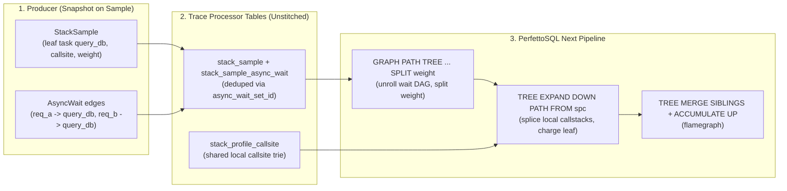
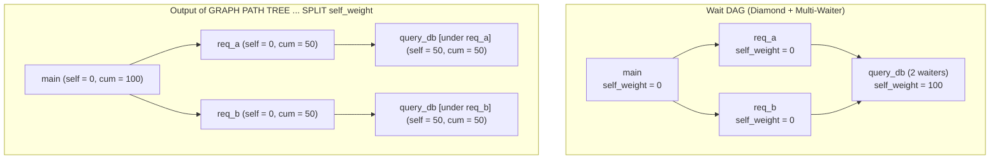
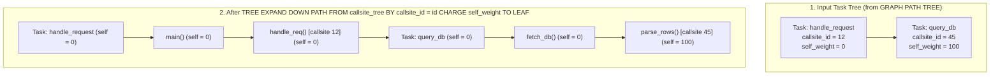

# Async Profiling and Late Callstack Stitching

**Authors:** @LalitMaganti

**Status:** Discussion

**PR:** N/A

**Companion RFCs:** RFC-0027 (Public Profiling Protos), RFC-0040 & RFC-0041
(PerfettoSQL Next)

> **Note:** This document is only an exploration of the problem space and a
> place to jot down thoughts. It is **not** a proposal that we actually do or
> implement anything described here.

## Problem

Asynchronous programs (C++20 coroutines, Rust `tokio`, Python `asyncio`, Kotlin
coroutines, Go goroutines) do not keep a logical call chain on a single
contiguous OS thread stack.

Consider a parent task `handle_request` that awaits a child task `query_db`:

1. `handle_request` suspends, saves its state on the heap, and returns from the
   OS thread stack.
2. Later, `query_db` runs on a worker thread or blocks on I/O. While `query_db`
   runs, the OS thread stack contains only the executor loop and `query_db`'s
   local frames (`epoll_wait -> runtime::poll -> query_db -> parse_rows`).
3. `handle_request`'s frames, which explain why `query_db` is running, are not
   on the CPU stack.

Profilers such as
[Datadog's async-aware Python profiler](https://www.datadoghq.com/blog/engineering/async-python-profiler/)
reconstruct these causal chains by walking the runtime's await graph at sample
time. Supporting this kind of analysis in Perfetto would touch the
stack-sampling protos, Trace Processor tables, and PerfettoSQL Next.

Three gaps in our current designs make this difficult today.

### 1. `AsyncContextDescriptor.parent_iid` (RFC-0027) cannot model await graphs

RFC-0027 introduced `StackSample`, `TaskContext`, and `AsyncContextDescriptor`:

```proto
message AsyncContextDescriptor {
  optional uint64 iid        = 1;
  optional string name       = 2;
  optional string kind       = 3;  // e.g. "goroutine", "fiber"
  // Structural parent (the task that spawned this one). NOT causality:
  // dynamic causality (await chains, wakeups) is modelled via TrackEvent
  // flows, not here.
  optional uint64 parent_iid = 4;
}
```

RFC-0027 deferred stackless coroutines and dynamic await chains, assuming
`TrackEvent` flows would carry causal links. That model has four limitations:

* **Requiring `TrackEvent` flows does not work for standalone sampling
  profilers.** Out-of-band or runtime-level sampling profilers do not emit
  in-band `TrackEvent` slices and flows on every task poll. A sampling profiler
  needs a way to emit a self-contained trace using `StackSample` alone.
* **No suspension callsite.** Knowing that `query_db` has parent task
  `handle_request` (`parent_iid`) does not record which frame inside
  `handle_request`'s callstack is awaiting `query_db`. Attaching `query_db`'s
  root to `handle_request`'s root produces a sibling branch rather than
  extending `handle_request`'s callstack from its suspension point.
* **Dynamic awaiter changes.** A helper coroutine `spawn_subtask()` can create
  `query_db`, return its handle to `main()`, and exit. When `main()` later
  awaits `query_db`, the active waiter is `main()`, not `spawn_subtask()`. Who
  awaits a task is a property of the sample, not a static property of the
  task's descriptor.
* **Multi-waiter fan-in (DAGs).** A single task or stream can be awaited at the
  same time by multiple tasks (for example, Rust `futures::future::Shared`, C++
  `folly::coro::SharedPromise`, broadcast/mpsc streams, or `asyncio` shared
  futures). A single `parent_iid` cannot represent fan-in.

### 2. Import-time callstack stitching is the wrong model

A profiler or importer could flatten a waiter chain by concatenating
`handle_request`'s frames and `query_db`'s frames into a single `Callstack` in
`stack_profile_callsite` at import time. This fails for three reasons:

* **Multi-waiter DAGs do not fit a single `callsite_id`.** Each row in
  `stack_sample` references one `callsite_id`. If `query_db` is awaited by both
  `req_a` and `req_b`, a sample of `query_db` has two root-to-leaf caller paths.
* **Loss of local vs. cross-task structure.** Pre-stitching bakes one view into
  `stack_profile_callsite`. Queries can no longer separate a task's own stack
  from cross-task await edges, switch between stitched and unstitched views, or
  show and hide task-boundary frames.
* **Duplication in `stack_profile_callsite`.** If a leaf task with 20 frames is
  awaited from 500 caller stacks, import-time stitching duplicates those 20
  frames 500 times in `stack_profile_callsite`.

`stack_profile_callsite` should therefore remain unstitched, storing only
per-task local callstacks, with stitching across awaiting tasks done in
PerfettoSQL at query time.

### 3. PerfettoSQL Next (RFC-0041) is missing two operations for late DAG stitching

Expressing late callstack stitching in PerfettoSQL Next (RFC-0041) runs into two
gaps in the operator set:

1. **No DAG path-unrolling reduction with proportional measure splitting (§7).**
   RFC-0041 §7 provides `GRAPH ( DFS | BFS | DOMINATOR ) TREE`. All three
   deduplicate vertices (`1:1` node identity), which is right for heap graphs
   (an object's byte size cannot be split or counted twice) but wrong for an
   await DAG where `req_a` and `req_b` both await `query_db`:
   * `DFS` and `BFS` pick either `req_a` or `req_b` by node `id` and drop the
     other edge, giving 100% of `query_db`'s weight to one caller and 0% to the
     other.
   * `DOMINATOR` reparents `query_db` to the lowest common ancestor of `req_a`
     and `req_b` (such as `main`), detaching `query_db` from both `req_a`'s and
     `req_b`'s callstacks.
   * Converting a wait DAG into a call tree requires unrolling root-to-leaf
     paths and splitting `query_db`'s sample weight across its incoming waiter
     edges so total sample weight is preserved without double-counting at common
     ancestors.

2. **`TREE EXPAND` (§6.9) cannot splice root-to-leaf paths from a prefix tree
   (`stack_profile_callsite`).**
   In `stack_profile_callsite`, a task's local callstack is identified by its
   leaf `callsite_id`, while its ancestor frames have distinct `id`s linked by
   `parent_id`. RFC-0041's `TREE EXPAND ... BY cols` joins an expansion relation
   by flat key equality, which works for inline frames that share one
   `callsite_id`. Expanding each task node's `callsite_id` with flat key
   equality would require materializing the `O(n * depth)` ancestor closure of
   `stack_profile_callsite` in SQL first, which RFC-0040 specifically avoids.

## Non-goals

* **Hybrid `TrackEvent` + `StackSample` stitching.** Stitching `StackSample`
  onto `TrackEvent` slices and flows requires cooperation between in-band
  instrumentation and sampling profilers and is out of scope here.
* **Async Flamecharts (timeline tracks).** A flamechart places callstacks on a
  1D horizontal `[ts, ts + dur)` timeline. This works for a single sequential
  resource such as an OS thread (`utid`), where caller and callee intervals nest
  in time. Concurrent async tasks overlap in wall time, move across threads, and
  fan out and in as a DAG. Flamecharts only make sense for physical thread
  timelines; async attribution belongs in Flamegraphs.
* **Import-time stitching in `stack_profile_callsite`.** All cross-task
  stitching would happen in PerfettoSQL.

## Decision

None. This document is only a place to capture thoughts and explore the design
space.

## Potential design

A complete approach would have four parts:

1. **Proto surface (RFC-0027):** An `AsyncWait` message on `stack_sample.proto`
   and `InternedData` to record snapshot-on-sample waiter DAGs.
2. **Trace Processor storage:** Unstitched local callstacks in
   `stack_profile_callsite`, plus deduplicated wait-DAG sets alongside
   `stack_sample`.
3. **PerfettoSQL Next operators (RFC-0041):**
   * `GRAPH PATH TREE ... SPLIT cols` in §7 to unroll DAGs into trees with
     proportional weight splitting.
   * `TREE EXPAND ... PATH FROM` in §6.9 to splice root-to-node paths from a
     prefix tree (`stack_profile_callsite`) into a task tree.
4. **Producer mappings:** How C++20 coroutines, Rust `tokio`, and Python
   `asyncio` would map onto this model.



### 1. Proto Surface: Snapshot-on-Sample Wait DAGs

Following RFC-0027, samples are self-describing and do not require stateful
reconstruction across packets. Each `StackSample` could optionally carry the
active wait graph observing the sampled task at the time of the sample.

#### `AsyncWait` message

An `AsyncWait` would describe one directed wait edge: a suspended `waiter` task,
the local `waiter_callstack` where it suspended (`co_await` / `.await`), and the
`awaited` task it is waiting on.

```proto
// A single wait edge in an async await graph at sample time:
// |waiter_task_context| is suspended at |waiter_callstack|, waiting for
// |awaited_task_context| to complete or yield a value.
message AsyncWait {
  optional uint64 iid = 1;

  // The suspended task that is waiting.
  oneof waiter_task_context_field {
    TaskContext waiter_task_context = 2;
    uint64 waiter_task_context_iid = 3;
  }

  // The local callstack of the waiter task at its suspension point.
  oneof waiter_callstack_field {
    Callstack waiter_callstack = 4;
    uint64 waiter_callstack_iid = 5;
  }

  // The task being awaited. If unset, defaults to the enclosing StackSample's
  // task_context (the single-hop case).
  oneof awaited_task_context_field {
    TaskContext awaited_task_context = 6;
    uint64 awaited_task_context_iid = 7;
  }
}
```

`StackSample` and `InternedData` would gain `async_waits`:

```proto
message StackSample {
  // ... existing fields 1..14 ...

  // Active async wait edges ancestor to this sample's task_context.
  // Populate EITHER async_waits (inline) OR async_wait_iids (interned).
  // Together, these edges form a tree or DAG rooted at top-level tasks and
  // terminating at this sample's task_context.
  repeated AsyncWait async_waits = 15;
  repeated uint64 async_wait_iids = 16 [packed = true];
}
```

Properties of this representation:

* **Single-hop wait:** One `AsyncWait` with `waiter = handle_request`,
  `waiter_callstack` set to its suspension stack, and `awaited` unset
  (defaulting to the sample's `task_context`).
* **Multi-hop chain:** Two `AsyncWait` entries: `main -> handle_request` and
  `handle_request -> query_db`.
* **Multi-waiter fan-in:** Multiple `AsyncWait` entries pointing to the same
  `awaited_task_context`.
* **Interning:** While `handle_request` is suspended awaiting `query_db`, the
  tuple `(waiter, waiter_callstack, awaited)` does not change for the duration
  of the await. If `query_db` is sampled 100 times while running on-CPU, the
  producer can intern the `AsyncWait` once in `InternedData` and write one
  varint in `async_wait_iids` per sample.
* **Frame kind on `InlineCallstack.Frame`:** `profile_common.proto` defines
  `Frame.Kind` (`KIND_NATIVE`, `KIND_INTERPRETED`, `KIND_JIT`, `KIND_GC`,
  `KIND_RUNTIME`). Adding `KIND_ASYNC` for task/coroutine boundary frames and
  `optional Frame.Kind kind` on `InlineCallstack.Frame` would give inline and
  interned callstacks the same frame metadata.

### 2. Trace Processor Storage Model

#### Unstitched `stack_profile_callsite`

`stack_profile_callsite` would remain unchanged. Both `StackSample.callstack`
(the leaf task's local stack) and `AsyncWait.waiter_callstack` (each suspended
waiter's local stack) would be interned into `stack_profile_callsite` as
independent local callsite chains rooted at `parent_id IS NULL`.

#### Deduplicating wait graphs via `async_wait_set_id`

Multiple `StackSample` rows captured while the same await graph is active share
the same set of `AsyncWait` edges.

Trace Processor could intern each unique set of resolved
`(waiter_task_context_id, waiter_callsite_id, awaited_task_context_id)` edges
into `stack_sample_async_wait`, using `async_wait_set_id` in the same way
`arg_set_id` groups arguments:

| Table | Columns | Description |
| :--- | :--- | :--- |
| `__intrinsic_stack_sample` | `id`, `ts`, `task_context_id`, `execution_context_id`, `callsite_id`, `async_wait_set_id`, ... | `async_wait_set_id` is `NULL` when the sample has no async waiters. |
| `stack_sample_async_wait` | `id`, `async_wait_set_id`, `waiter_task_context_id`, `waiter_callsite_id`, `awaited_task_context_id` | One row per wait edge in the set identified by `async_wait_set_id`. |

Because `async_wait_set_id` canonicalizes the wait DAG, two samples with the
same `(task_context_id, callsite_id, async_wait_set_id)` have the same stitched
callstack structure. A query could therefore run
`AGGREGATE SUM(weight) GROUP BY task_context_id, callsite_id, async_wait_set_id`
before any graph or tree operation, reducing millions of raw samples to the
distinct `(leaf_callsite, wait_dag)` combinations present in the trace.

### 3. PerfettoSQL Next: Late Stitching and Multi-Waiter DAGs

Stitching callstacks in PerfettoSQL Next without materializing recursive
closures in SQL would require two extensions to RFC-0041.

#### 3.1 `GRAPH PATH TREE` with proportional measure splitting (RFC-0041 §7)

RFC-0041 §6.1 states:

> *A scalar can be folded together but never split apart, so any operation that
> fans a measure out happens at construction, before aggregation.*

When `query_db` (with weight 100) is awaited by both `req_a` and `req_b`,
reducing the wait DAG to a tree has to duplicate `query_db` under each waiter
path and split its measure across those paths during tree construction.

RFC-0041 §7 could be extended with `GRAPH PATH TREE`:

```text
source := "GRAPH" ( "DFS" | "BFS" | "DOMINATOR" ) "TREE"
          "NODES" rel "EDGES" rel "FROM" rel
        | "GRAPH" "PATH" "TREE"
          "NODES" rel "EDGES" rel "FROM" rel
          [ "SPLIT" cols ] ;
```

Semantics:

1. **Path unrolling:** Every simple path starting at a seed in `FROM` and
   following directed edges in `EDGES` produces a node in the output tree, with
   its parent set to the prefix path. Cycles along a path are broken by dropping
   back-edges to ancestors already on the current path.
2. **Proportional measure splitting (`SPLIT cols`):** When a node has `k`
   incoming edges from nodes reachable from `FROM`, each incoming branch
   receives `1 / k` of the node's `SPLIT` columns. If a descendant below that
   node also has `m` incoming edges, each path through both fan-in points
   receives `1 / (k * m)` of the descendant's `SPLIT` columns. Unnamed columns
   are treated as properties and copied unchanged.



Because the split fractions across all paths from `FROM` to any reachable node
sum to 1, total weight is preserved in both top-down and bottom-up views:

* **Top-down:** In the diamond `main -> {req_a, req_b} -> query_db` with
  `self_weight = 100`, `req_a` and `req_b` each accumulate `50`, and their
  common ancestor `main` accumulates `50 + 50 = 100` rather than double-counting
  to `200`.
* **Bottom-up:** After
  `|> TREE INVERT |> TREE MERGE SIBLINGS BY name AGGREGATE SUM(self_weight) AS self_weight`,
  the two copies of `query_db` become roots, merge by name, and sum back to
  `50 + 50 = 100`.

This would also require `TreeAccumulate` in `physical_plan.cc` to support
`core::Double` in addition to `core::Int64` so fractional weights accumulate
without integer truncation.

#### 3.2 `TREE EXPAND ... PATH FROM` for prefix-tree splicing (RFC-0041 §6.9)

Once `GRAPH PATH TREE` builds a tree of task activations, each node has a
`callsite_id` pointing to a leaf in `stack_profile_callsite`. Each task node
then needs to be expanded into its local frame chain from
`stack_profile_callsite`, with child tasks attached under the suspension frame
of their parent task.

RFC-0041 §6.9 defines `TREE EXPAND` as:

> *Inserts a keyed sub-structure `rel` above (`UP`) or below (`DOWN`) each
> matched node ... The matched node survives at its end (leaf-ward for `UP`,
> root-ward for `DOWN`) and its existing subtree reconnects at the far end. ...
> `CHARGE cols TO ( LEAF | ROOT )` migrates the named measures from the matched
> node to the far end the insertion created.*

For `TREE EXPAND DOWN ... CHARGE self_weight TO LEAF`, these reconnection and
charging rules already match callstack stitching:

1. The matched parent task node (`handle_request`) stays at the root-ward end,
   acting as the task boundary node.
2. `handle_request`'s local callstack chain is inserted below it.
3. `handle_request`'s children in the task tree (the awaited task `query_db`)
   reconnect at the leaf frame of `handle_request`'s local callstack, placing
   `query_db` directly under the frame where `handle_request` suspended.
4. `CHARGE self_weight TO LEAF` moves `query_db`'s `self_weight` from the task
   node to the leaf frame (`parse_rows`) of `query_db`'s local callstack.

What §6.9 lacks is a way to extract a root-to-leaf frame chain when `rel` is a
prefix tree (`stack_profile_callsite`): the task node's `callsite_id` matches
`rel.id` at the leaf of the chain, and the chain to splice is the ancestor path
from `rel`'s root down to that `id`.

RFC-0041 §6.9 could be extended with `PATH FROM`:

```text
stage := "|>" "TREE EXPAND" ( "UP" | "DOWN" )
         ( rel "BY" cols [ "ORDERED BY" cols ]
         | "PATH FROM" rel "BY" match_col "=" node_col )
         [ "CHARGE" cols "TO" ( "LEAF" | "ROOT" ) ] ;
```

Semantics of `PATH FROM rel BY callsite_id = id`:

* `rel` is a tree relation with `id`, `parent_id`, and payload columns (`name`,
  `mapping_name`, `source_file`, `line_number`, `frame_kind`).
* For each node in the input tree with a non-null `callsite_id`, the operator
  walks `rel` from `id = callsite_id` up to its root to form the root-to-leaf
  frame chain.
* That chain is spliced below (`DOWN`) or above (`UP`) the input node,
  reconnecting the input node's existing children at the far end and moving any
  `CHARGE` measures to that far end.
* `rel` is indexed once as a `ChildToParent` array, so splicing chains for all
  task nodes runs in `O(output_nodes)` time and memory without recursive SQL.



#### 3.3 Example PerfettoSQL Next Pipeline

With `GRAPH PATH TREE` and `TREE EXPAND DOWN PATH FROM`, the async flamegraph
query is a single pipeline:

```sql
-- 1. Unroll the wait DAG into a weighted task activation tree,
--    splitting sample weights proportionally at multi-waiter fan-in nodes.
GRAPH PATH TREE
  NODES _async_sample_task_nodes
  EDGES _async_sample_wait_edges
  FROM  _async_sample_root_tasks
  SPLIT self_weight
-- 2. Splice each task's local callstack (with inlines already expanded)
--    from the shared callsite trie, attaching awaited tasks below the
--    waiter's suspension callsite and charging weight to the leaf frame.
|> TREE EXPAND DOWN PATH FROM _callstack_spc_forest
   BY callsite_id = id
   CHARGE self_weight TO LEAF
-- 3. Optional: strip runtime poll/scheduler frames or task boundary frames.
|> TREE CONTRACT AT (
     SELECT id FROM @input WHERE frame_kind IN ('runtime', 'async_task')
   )
   AGGREGATE SUM(self_weight) AS self_weight
-- 4. Collapse identical frame paths into a flamegraph and sum subtrees.
|> TREE MERGE SIBLINGS BY name, mapping_name, source_file
   AGGREGATE SUM(self_weight) AS self_weight
|> TREE ACCUMULATE UP
   SUM(self_weight) AS cumulative_weight;
```

Existing tree operators handle the remaining view options:

* **Task boundary markers:** Keeping `frame_kind = 'async_task'` leaves
  `[task: ...]` divider frames between stitched tasks. Adding `'async_task'` to
  `TREE CONTRACT AT` connects the caller's `await` frame directly to the
  callee's entry frame.
* **Runtime frames:** Adding `'runtime'` to `TREE CONTRACT AT` removes
  `tokio::runtime::park`, `asyncio.base_events._run_once`, or coroutine
  trampoline frames while preserving the user frames above and below them.
* **Bottom-up view:** Adding `|> TREE INVERT` before `TREE MERGE SIBLINGS`
  produces the bottom-up flamegraph.

### 4. Producer Mappings

#### 4.1 C++20 Stackless Coroutines (`std::coroutine_handle<>`)

In C++20 (`folly::coro::Task`, `cppcoro`, `std::execution`), each coroutine
activation is a compiler-generated state machine allocated on the heap (`void*`
frame address via `std::coroutine_handle<>::address()`).

* **Why OS stack unwinding is not enough:** With symmetric transfer
  (`await_suspend` returning `std::coroutine_handle<>`), when coroutine `A`
  `co_await`s coroutine `B`, `A` suspends on the heap and its `resume()` frame
  returns. Only the innermost active coroutine `C` is on the OS thread stack;
  `A` and `B` exist on the heap linked by `promise_type` continuation handles.
* **Emitting `StackSample`:**
  * **Task identity (`TaskContext`):** Each task or coroutine frame in a
    task/shared-promise graph is identified by `async_id` (the coroutine frame
    address or task ID) with `AsyncContextDescriptor`
    (`kind = "cpp20_coroutine"`).
  * **Active leaf stack (`StackSample.callstack`):** Unwinding the OS thread
    stack from the instruction pointer up to the coroutine `resume()` entry
    point gives the running coroutine's local native callstack.
  * **Suspended waiter graph (`StackSample.async_waits`):** Walking the
    runtime's continuation pointers (both 1:1 `promise.continuation` handles and
    multi-waiter lists on `SharedPromise`, `collectAll`, or async queues)
    produces `AsyncWait` edges. Each suspended coroutine frame's resumption
    address (`__coro_resume` plus suspension point index, symbolized via DWARF
    to `source_file:line_number`) forms its `waiter_callstack`.

#### 4.2 Rust `tokio`

Rust `async fn`s compile into state-machine `enum`s that are polled
synchronously down the active future tree while on-CPU, but split across
independent heap tasks at `tokio::spawn`, channels (`mpsc`, `oneshot`,
`broadcast`), and shared futures (`futures::future::Shared`).

* **Intra-task frames (`StackSample.callstack`):** While a `tokio` task is
  polled on a worker thread, DWARF unwinding captures the nested `poll()` calls
  inside that task along with wrapper frames (`tokio::runtime::task::raw::poll`,
  `GenFuture::poll`). Marking runtime wrapper frames with
  `Frame.Kind = KIND_RUNTIME` lets `TREE CONTRACT AT` remove them at query time.
* **Inter-task wait DAG (`StackSample.async_waits`):** When a parent task awaits
  a `JoinHandle`, `oneshot::Receiver`, or `Shared<Fut>` driven by a child task,
  the waker registration records that the parent task (suspended at its last
  poll callsite) is awaiting the child task. When the child task is sampled,
  those waiter links can be emitted as `AsyncWait` edges.

#### 4.3 Python `asyncio`

In Python `asyncio`, tasks (`asyncio.Task`) execute interpreted Python frames
interleaved with native C-extension frames (`uvloop`, `aiohttp`, `grpc`).

* **Mixed-mode local stacks (`StackSample.callstack`):** Each task's local stack
  interleaves `KIND_INTERPRETED` Python frames (`PyFrameObject`), `KIND_NATIVE`
  C frames, and `KIND_RUNTIME` event-loop frames (`base_events._run_once`).
* **Wait DAG (`StackSample.async_waits`):** On each sample tick, the profiler
  reads the active `Task` table. If a child task is running (or blocked on I/O
  in wall-time mode) and one or more parent tasks are suspended awaiting it
  (directly or via `asyncio.gather` / `asyncio.wait`), the profiler emits
  `AsyncWait` edges with each parent task's suspended Python callstack.

## Alternatives considered

### 1. Emit lifecycle events (`AsyncWaitBegin` / `AsyncWaitEnd`) instead of sample-time `AsyncWait` snapshots

Instead of attaching `AsyncWait` edges to `StackSample`, the producer could emit
timestamped events whenever a task starts or stops awaiting another task, and
PerfettoSQL could reconstruct the active wait graph at `stack_sample.ts` using
`INTERVALS FROM EVENTS` and `INTERVAL JOIN`.

Pro:

* Avoids repeating `async_wait_iids` across samples.
* Records exact wait durations between sampling ticks.

Con:

* **Requires instrumentation on every `await` / poll.** Sampling profilers are
  used because they do not run code on every `co_await` or future poll; they
  only read task pointers when a timer fires. Requiring lifecycle events turns a
  sampling profiler into a tracing profiler.
* **Fragile under packet loss or mid-process attach.** If an `AsyncWaitBegin` or
  `AsyncWaitEnd` packet is dropped or happened before tracing started, the
  reconstructed wait graph is corrupted.
* **Multi-hop reconstruction in SQL requires temporal graph joins.** With
  `async_wait_iids` interned in `InternedData`, the wire cost on `StackSample`
  is one packed varint per edge, and import is stateless.

### 2. Stitch callstacks at import time into `stack_profile_callsite`

Trace Processor could walk `async_waits` during trace ingestion and insert
stitched callsite chains directly into `stack_profile_callsite`.

Pro:

* Existing queries against `stack_profile_callsite` would see stitched stacks
  without SQL changes.

Con:

* Cannot represent multi-waiter fan-in DAGs without duplicating `stack_sample`
  rows and changing `stack_sample.weight` at import time.
* Loses the distinction between per-task stacks and cross-task wait edges.
* Duplicates leaf callsite subtrees in `stack_profile_callsite` whenever a leaf
  task is awaited from multiple caller contexts.

### 3. Use `GRAPH DOMINATOR TREE` or `GRAPH BFS TREE` for wait DAGs

Instead of adding `GRAPH PATH TREE ... SPLIT cols`, we could reduce the wait DAG
using RFC-0041's existing `DOMINATOR` or `BFS` tree operators.

Pro:

* No new `GRAPH` operator variant in RFC-0041.

Con:

* Both produce wrong flamegraphs when a task has multiple waiters:
  * `BFS` drops all but one waiter edge, hiding shared work from the other
    callers.
  * `DOMINATOR` moves the shared task to the lowest common ancestor of its
    waiters, detaching it from the intermediate call paths that awaited it.
* Callgraphs and wait DAGs attribute weight along paths rather than by vertex
  dominance.

## Open questions

* **Cycle and depth bounds in `GRAPH PATH TREE`:** A buggy producer or a cyclic
  channel wait could emit a cycle, or a deep diamond DAG could have an
  exponential number of paths. `GRAPH PATH TREE` would break cycles along each
  root-to-leaf walk, and would also need a path-expansion limit (recording a
  stat when truncated). What should the default limit be?
* **Task boundary nodes in `TREE EXPAND DOWN PATH FROM`:** Because
  `TREE EXPAND DOWN` keeps the matched task node at the root of its spliced
  frame chain, each task activation appears as a node above its local frames
  (carrying `async_context.name` and `async_context.kind`). Should a default
  stdlib flamegraph keep these task-boundary nodes or contract them?
* **Intra-task stackless chains without fan-in:** For a 1:1 C++20
  `promise.continuation` chain inside a single task, should producers emit those
  frames directly in `StackSample.callstack` (with `Frame.Kind = KIND_ASYNC`)
  and use `AsyncWait` only for cross-task / fan-in boundaries, or emit all
  coroutine suspension hops as `AsyncWait`?
