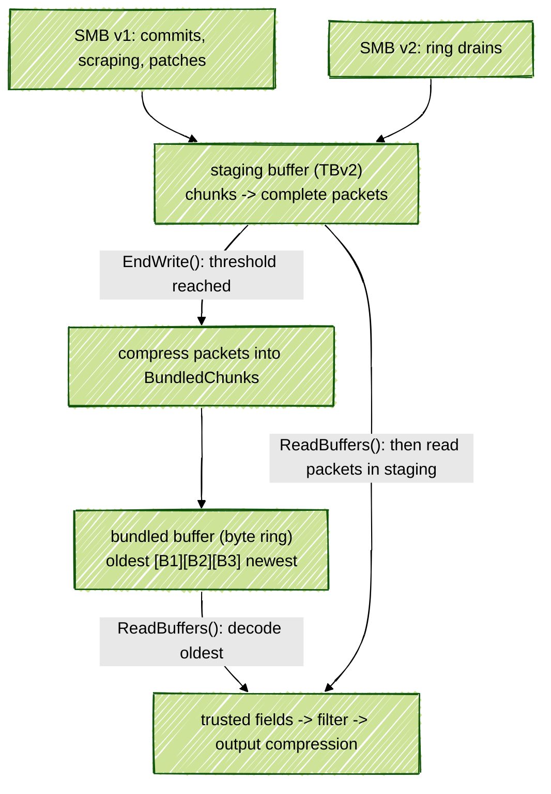

# TBv3 = TBv2 + a buffer of compressed bundles

**Authors:** @primiano @rsavitski @sashwinbalaji

**Status:** Draft

This RFC describes the layout and flow of TraceBuffer V3 (TBv3).

The flow starts just like today, the tracing service copies producer chunks
(SMB v1 and SMB v2) into the trace buffer. But now that buffer is a staging
area. Periodically we read its chunks as complete trace packets, bundle and
compress them into a second buffer, which is a plain ring.

## Requirements

- Support both SMB v1 and v2 chunks. V1 chunks bring in the most complexity of
  needing to support out of order chunks, scraping, patches.
- No behavior change for caller and callee of trace buffer. TBv3 from outside
  should just look like TBv2 or TBv1. The bundling, the new format are all
  hidden. ReadBuffers should return the same trace packets as it does today with
  the same trusted fields. None of this should leak into trace filter or trace
  processor.
- Work just like an opt in feature/mode of TBv2 meaning support everything TBv2
  does of ProtoVM, cloning and fill policies.

## Overview



So TBv3 has two buffers.

- Staging buffer
  - This is the current TBv2, with the same write and read paths. It still
    deals with all the complexity of SMB v1 and SMB v2 chunks.
  - This is the last place in the SMB v2 flow where "perfetto proto group"
    exists. Once a packet leaves staging, it is in normal protobuf form.
- Bundled buffer
  - A pure ring buffer. It does not need to care about padding or patches.
  - A bundle written into it is complete in itself.

So for each sequence, every packet in the bundled buffer is older than every
packet of that sequence in staging. And once we make a bundle, it doesn't
change and nobody outside the buffer holds a pointer into it.

## How chunks reach the staging buffer

No change in this flow. The chunks come into the staging buffer just as today
via CopyChunkUntrusted and CopyChunkV2Untrusted (newly added).

The tracing service calls these functions in write batches. A batch is one run
of consecutive calls that copy chunks (and apply patches), done in one go.

1. SMB v2 uses DrainV2RingBuffer() -> ServiceRingBufferDrainer::Drain() ->
   CopyChunkV2Untrusted().
   The normal SMB v2 flow. The producer wakes the service and the service
   drains the ring. Chunks arrive in order and nothing is patched.
2. SMB v1 commits go through CommitData -> CopyProducerPageIntoLogBuffer() ->
   CopyChunkUntrusted().
   The normal SMB v1 flow. The producer tells the service which chunks it has
   finished. Per writer, the chunks are in order. The patches of the same IPC
   come after all its chunks.
3. SMB v1 scraping goes through ScrapeSharedMemoryBuffers() ->
   ForEachScrapableChunk() ->
   CopyProducerPageIntoLogBuffer() -> CopyChunkUntrusted().
   The scraping case. On a flush the service reads chunks straight out of the
   producer's SMB without waiting for the commit, one producer at a time. It
   walks the SMB page by page, so the chunks of one writer can come out of
   ChunkID order.

## When do we bundle packets from staging

A bundling pass reads complete packets from staging, compresses them into one
or more bundles, stores them in the bundled buffer, and compacts staging.

We set a threshold, bundle_trigger_bytes, for how much new chunk data can
arrive in staging before we run another bundling pass. Once we reach it, we
bundle the complete packets.

Now the question is where exactly we check this threshold and start bundling.

Doing it through a separate periodic PostTask seems like unnecessary
complexity. Doing it only at read time is too late because at that point we
might as well bypass bundling and write to the file. We want bundling to make
room while data is still coming in, so we can write more. So the write path
seems like the best place, and the bundling pass should be much like a
periodic readback.

The obvious place would be inside CopyChunkxxUntrusted. Count the chunk bytes
copied and run a bundling pass once we cross bundle_trigger_bytes.

But with SMB v1 chunks that won't work for two reasons.

1. Scraping means chunks can be out of order.
   - During a scrape we scan the SMB in linear order and commit chunks as we
     find them. That linear order is the chunk allocation order, which is
     unpredictable, so chunks are effectively committed in random order.
   - TBv2 handles this by sorting the chunks by ChunkID. It relies on all the
     out-of-order commits of one scrape arriving together, atomically, before
     any read.
   - Bundling in the middle of a scrape breaks that. If it runs between two
     copies of the same scrape, a chunk that comes later in page order but
     earlier in ChunkID order arrives after the bundling pass has already read
     past its position. TBv2 then discards it as older than the last chunk
     read.

   ```text
   SMB of P, in page order:   page 2: chunk 7 of W
                              page 9: chunk 6 of W

   Bundling inside CopyChunkUntrusted():

     CopyChunkUntrusted(W, chunk 7)
       1 MiB is reached, so bundling starts now.
       It reads W. After chunk 5 it finds chunk 7.
       That looks like a hole. The packets of chunk 7 go out
       with a loss flag.
     CopyChunkUntrusted(W, chunk 6)
       Chunk 6 is older than the last chunk read, which is 7.
       TBv2 discards it.
   ```

2. Patches are copied after the chunks (minor).
   - CommitData carries a list of chunks followed by a list of patches. We
     copy the chunks first, then ApplyChunkPatches() applies their patches
     through TryPatchChunkContents().
   - A packet split across chunks cannot be read until its first chunk is
     patched.
   - So a bundling pass inside CopyChunkUntrusted() finds that chunk still
     waiting for a patch that is a few lines further down in the same message.
     It leaves it, and everything the writer wrote after it, in staging.
   - Nothing is lost, the bundling pass just does less than it could.

**The proposal is to introduce EndWrite().**

- We recently introduced EndRead() (name TBD) to let the service tell the
  trace buffer that it has read everything and the buffer can change its
  state. In the same way we need an EndWrite() for the service to tell the
  buffer that it has finished a write batch.
- This can solve the above problems if plugged into all places that call the
  copy chunk functions.

## How do we bundle packets from staging

We start by reading staging with the same BeginRead() and
ReadNextTracePacket() as today, then compress the packets we get back.

The sequence looks like this.

1. EndWrite() checks how many chunk bytes have arrived since the last
   bundling pass. If we have not reached bundle_trigger_bytes, return and
   leave the packets in staging.
2. Otherwise, start the staging read with BeginRead(), then
   ReadNextTracePacket() in a loop. We get the same behavior as the TBv2 reader.
   - Fragments are reassembled into complete packets.
   - A sequence waiting for a patch or a missing fragment waits in staging.
     Packets from other sequences can still be bundled.
   - A scraped incomplete chunk gives us its complete packets. Its unfinished
     tail waits for the later commit.
   - RewriteProtoGroupPacket() converts SMB v2 packets into normal protobuf.
   - Each packet comes with its PacketSequenceProperties and its
     previous_packet_on_sequence_dropped reason bits.
3. Feed each packet into zstd, along with a small header saying whose packet
   it is, its size, and its loss bits. Keep track of the producers and writers
   that appear in this bundle.
4. When the bundle is ready, finish the zstd frame and build its header and
   tables. Make room in the bundled buffer, then copy the whole thing into it.
5. When there are no more readable packets, finish the last bundle and compact
   staging. What remains is the chunks whose packets could not be bundled,
   with the consumed chunks' padding removed.
6. At this point we can run the shift-left compaction on the TBv2 buffer to
   reduce the memory in use.

### When do we finish one bundle

- A packet stays whole inside one bundle, whatever its size.
- Per bundle, we start with a limit of 2 * bundle_trigger_bytes, so 2 MiB of
  packet bytes and their small headers. Before adding a packet we check
  whether it would take the total past that limit. If so, we finish the
  current bundle and start another.
- ReadNextTracePacket() returns false, meaning no more chunks to read.
- The producer or writer count would exceed the 16-bit counters we keep for
  them.

We stream packet slices into zstd and let it write compressed output into a
reusable scratch vector. Before the bundling pass returns, we finish and store
every bundle. We don't keep an open bundle between service tasks.

## What a BundledChunk looks like

Each bundle we store in BundledBuffer is a BundledChunk. It looks like this.

```text
 +-------------+----------------+----------------+----------------------+
 | header      | producer table | writer table   | compressed packets   |
 | 12 bytes    | 16 bytes/entry | 4 bytes/entry  | one zstd frame       |
 +-------------+----------------+----------------+----------------------+
```

```cpp
struct BundleHeader {          // 12 bytes
  uint32_t stored_size;        // Header + tables + compressed bytes.
  uint32_t uncompressed_size;  // Packet bytes + their small headers.
  uint16_t num_producers;
  uint16_t num_writers;
};

struct ProducerEntry {         // 16 bytes
  uint16_t producer_id;
  uint16_t reserved;           // Zero.
  uint32_t uid;
  int32_t pid;
  uint32_t machine_id;
};

struct WriterEntry {           // 4 bytes, one sequence
  uint16_t producer_index;     // Index into this bundle's producer table.
  uint16_t writer_id;
};
```

### Header

- stored_size is the size of the whole bundle, like TBChunk::size.
  We need it to skip a bundle, to make room for a new one and to advance
  the read position. We could get it from zstd too, but that would need a
  scan. Keeping it here makes those operations fast.
- uncompressed_size is how much memory to allocate when decoding. We also
  check that zstd produced that many bytes. zstd can store the input size in
  its frame, but we stream packets and only know the total when we finish.
  Keeping it here makes the read straightforward.
- num_producers and num_writers tell us where each table ends and where
  the compressed bytes start.

**Open question:** do we need a version field?

### Producer and writer tables

Today TBv2 keeps the producer identity in SequenceState, once per sequence for
the whole buffer. Now each bundle has to carry that information too. But
packets that arrive close together are likely to come from the same producer,
so we would often be repeating the same uid, pid and machine ID for every
writer in a bundle.

So the producer table holds that identity once, and the writer table holds
(producer_index, writer_id). At read time, the two together give us the same
PacketSequenceProperties that the staging reader returned.

For example, say producer 12 has writers 3 and 8 in one bundle.

```text
 Producer table:
   [0] producer 12, uid, pid, machine_id

 Writer table:
   [0] producer_index 0, writer_id 3
   [1] producer_index 0, writer_id 8
```

**Open question:** using the producer ID directly would be simpler and closer
to ProducerAndWriterID. The reason for the **index** is the rare case where
the service reuses a ProducerID and we get packets from two different
producers with the same ID. I'm open to simplifying this. We also need it to
agree with how TBv2 handles reuse in sequences_, discussed under "Producer ID
reuse" below.

### Inside the compressed bytes

Each trace packet has three varints before it.

```text
 compressed bytes --zstd--> record, record, record, ...

 one record: [writer_index][ loss ][ size ][packet bytes]
                 varint     varint  varint
```

- `writer_index` points into the writer table above.
- `loss` is previous_packet_on_sequence_dropped from the staging read,
  including its reason bits.
- `size` tells us where this packet ends and the next record starts.

The packet bytes are already normal protobuf. The service adds the trusted
fields on consumer readback, as it does today.

### Why we keep the header and tables uncompressed

We need the header and tables when overwriting. Once the ring fills, adding a
bundle often means removing an old one. We need to know which sequences lost
packets, and we don't want to decode the whole bundle just to find its
writers. So we keep the header and tables outside zstd.

**Open question:** we could compress the tables separately. That would save
some space, but we would have to compress them when finishing a bundle and
decompress them on every overwrite. I would keep them uncompressed for now.

## How the bundled buffer stores these chunks

The bundled buffer is one flat piece of memory of size_kb * 1024 bytes.

```cpp
class BundledBuffer {
  base::PagedMemory mem_;  // size_kb * 1024 bytes.
  uint64_t head_ = 0;      // Where the next BundledChunk goes.
  uint64_t tail_ = 0;      // Where the oldest BundledChunk starts.
};
```

head_ and tail_ count bytes in the logical stream, and head_ - tail_ is
the amount in use. The byte at position p lives at `p % mem_.size()`.

```text
 Logical positions:

             tail_                              head_
               |                                  |
               v                                  v
               [ B3 ][ B4 ][ B5 ][       B6        ]

 The same data in memory:

 0                                                      capacity
 +----------+----------+------+-----+-----+-------------------+
 | B6 end   | free     | B3   | B4  | B5  | B6 start          |
 +----------+----------+------+-----+-----+-------------------+
            ^ head offset
                       ^ tail offset
```

These rules hold at all times.

- `tail_ <= head_` and `head_ - tail_ <= mem_.size()`.
- tail_ points to a bundle header, or equals head_ when empty.
- One bundle starts immediately after the previous one. No alignment or
  padding between them.
- Reads and overwrites both remove data from tail_. New bundles go at
  head_.

Both counters are uint64_t and count bytes, so they should never wrap in
practice.

- head_ overflows when it reaches 2^64 = 1.8 x 10^19 bytes.
- Assume 1 GB/s of compressed output, 10^9 bytes per second, the worst of
  worst cases.
- The time to overflow is 1.8 x 10^19 / 10^9 = 1.8 x 10^10 s, which is
  1.8 x 10^10 / (365 x 24 x 3600) = ~585 years.

Hopefully no tracing session lives that long. So we can treat these counters
as only growing and leave out wrap handling.

**Open question:** the physical wrap is just a modulo. Should we constrain the
buffer size so we can use a bitwise operation instead?

### Appending, including when the ring wraps

Say the ring is 2 MiB, 1.9 MiB is in use, and the new bundle is 0.2 MiB. The
oldest bundle is 0.3 MiB. In RING_BUFFER mode this works as follows.

1. Free space is 0.1 MiB, so the new bundle does not fit.
2. Read the oldest bundle's header and tables. Record loss for its
   sequences, release its sequence references, and feed ProtoVM if needed.
   Advance tail_ by its stored_size, 0.3 MiB.
3. We now have 0.4 MiB free. Copy the new bundle at logical position 1.9 MiB, so
   its first 0.1 MiB goes at the end, the other 0.1 MiB at offset zero.
4. Advance head_ to 2.1 MiB.

```text
 Before:
   | oldest: 0.3  |       other bundles        | free: 0.1 |
   0              0.3                          1.9         2.0
   ^ tail_ = 0                                 ^ head_ = 1.9

 After:
   |new end| free |       other bundles        | new start |
   0       0.1   0.3                           1.9         2.0
                 ^ tail_ = 0.3
           ^ head_ = 2.1, which is offset 0.1
```

If one overwrite is not enough, keep removing whole bundles until the
new one fits. We make room before copying, and the space left over is
available to the next append.

The other choice is to leave the end unused when a bundle does not fit
there. That needs a padding record, or another way for the reader to skip the
gap. Allowing the wrap avoids that space loss. The copy takes at most two
pieces, and zstd can decode those pieces in order.

So normally an overwrite just reads the header and tables, updates the
sequence state, and advances tail_. We only decode for a consumer read or when
ProtoVM needs the packets we are overwriting.

## How packets go back to the consumer

For the service, the flow stays the same. ReadBuffers() calls BeginRead(),
then ReadNextTracePacket() in a loop. Once the read has finished,
EndReadBuffers() calls EndRead().

What changes is where ReadNextTracePacket() gets its packet. It starts at the
oldest bundle, returns its packets, then moves to the next one. Once
the bundled buffer is empty, it reaches the packets still in staging.

This works because, for each sequence, everything in a bundle is older than
what remains in staging. So we keep TBv2's per-sequence order.

The walkthrough below reads staging directly once the ring drains. We could
also put those remaining packets through a bundle first. That choice is still
open, and we get to it below.

### Reading one BundledChunk

We can't return slices of the compressed bytes as packets. So the first time
the reader reaches the bundle at tail_, we do this.

1. Read the BundleHeader and allocate uncompressed_size bytes in
   read_buf, a `std::vector<uint8_t>` to be added.
2. Decode the zstd frame into that buffer.
3. Join the producer and writer tables into a list of
   PacketSequenceProperties, indexed by writer_index.
4. Start read_offset, a size_t to be added, at zero, the first packet
   record.

Each ReadNextTracePacket() then reads the three varints at read_offset,
looks up the sequence, and returns a slice pointing at the packet bytes in
read_buf. It combines the record's loss bits with any pending
bundle-overwrite loss for that sequence. Then it advances read_offset past
the packet.

So we decode once when entering the bundle. Returning the next packet
does not decode or copy its bytes again.

When read_offset reaches the end, we advance tail_ by stored_size and release
the bundle's references to its sequences. We get to how we keep those
sequences alive below. The next call starts the next bundle.

### A read takes more than one service task

ReadBuffersIntoConsumer() reads about 32 KiB per task
(kApproxBytesPerTask). ReadBuffersIntoFile() uses a larger batch, about
1 MiB. The service collects that much, delivers it, then comes back in another
task if there is more. So a read task can stop well before the end of a
bundle.

TBv2 already handles this for chunks, where payload_avail tells us how much of
each chunk is still unread. The next BeginRead() resets rd_ and the chunk
reader, then continues from the unread data.

For bundles, we keep these members in the trace buffer object.

- read_buf: the decoded bytes of the bundle at tail_.
- read_offset: the next packet record inside those bytes.
- The identity of each writer in this bundle: its writer ID combined
  with the producer information. We build this once when we decode the
  bundle, so each packet's writer_index gives us its
  PacketSequenceProperties.
- finished_read_bufs: the decode buffers of bundles we finished
  reading during this task. The service still has packet slices pointing into
  them while it collects and delivers the batch. We keep these buffers until
  the batch is delivered. The next BeginRead() can free them, or EndRead()
  after the final batch.

Take a bundle with 300 packets.

1. **First task.** BeginRead() starts a read batch. ReadNextTracePacket()
   decodes the oldest bundle and returns packets 1 to 40. The service
   reaches its byte threshold and delivers those packets. read_buf,
   read_offset and the tables stay in the object.
2. **Between tasks.** A CommitData, scrape or drain can write into staging.
   Its EndWrite() can bundle more staging packets. Usually this does not
   touch the current decode buffer. The overwrite case is in the next
   section.
3. **Following tasks.** BeginRead() must preserve the bundle's
   read_offset. ReadNextTracePacket() continues with packet 41 and so on,
   without another decode.
4. **A task reaches packet 300.** The bundle is finished, so tail_
   advances. But the packets this task just returned still point into
   read_buf. Move that buffer into finished_read_bufs, then decode the
   next bundle into a new read_buf.
5. **Next task.** The previous task's packets have been delivered.
   BeginRead() can clear finished_read_bufs and continue reading the
   current bundle.
6. **End of readback.** After the ring drains, read the complete packets in
   staging. Once their slices are no longer in use, EndRead() clears the
   decode buffers and does the compaction the fill policy allows.

### A bundling pass overwrites the bundle we were reading

Go back to the first task. We delivered packets 1 to 40, but 41 to 300 are
still unread. Now a CommitData runs, its EndWrite() makes a bundle, and the
ring needs to overwrite its oldest bundle to make room. That happens to be the
one in read_buf.

```text
 Oldest BundledChunk:
 [ packets 1 ... 40 | packets 41 ........................ 300 ]
       delivered                       unread
```

- Packets 1 to 40 are already with the consumer.
- Packets 41 to 300 are lost. The next read starts at the new tail_.
- Only the sequences with packets in 41 to 300 get a loss flag. A writer whose
  packets were all among 1 to 40 lost nothing.
- If ProtoVM needs this bundle, it gets only packets 41 to 300 too.
- Clear read_buf, the tables and read_offset, because they described the
  bundle we just removed.

We already decoded the remaining packet headers, so we can find those
sequences by walking from read_offset. If we haven't read any of the bundle
yet, the writer table is enough.

### The packets still in staging

Now we have read all the bundles, but there can still be packets in staging.
Some arrived after the last bundling pass and didn't reach
bundle_trigger_bytes. Others only became readable after a patch or a later
fragment arrived. We need to return those too.

#### Direct staging read

Once `tail_ == head_`, ReadNextTracePacket() can use the normal TBv2 read path
and return the packet, identity and loss bits straight from staging. We
assemble packets just as we do for bundling, but don't compress them.

**What this gives us**

- No compress-and-decode work for those last packets. A small trace might
  never need a bundle at all.
- In DISCARD mode, staging can hold more of the trace after the bundled
  buffer stops accepting bundles. Those packets can stay in staging until
  the consumer reads them.

**What we have to handle**

- Two sources of packet slices. Bundled packets point into read_buf and
  staged packets use TBv2's existing slice storage. We need to keep both
  alive until the service finishes delivering the task's packets.
- Both the bundling pass and the consumer call the staging reader. They
  share rd_ and chunk_seq_reader_, so a bundling pass must start its own
  read. The next consumer task must start again with BeginRead() and check
  the bundled buffer first.
- Bundle-overwrite loss must be applied to packets from both sources. The next
  packet after the gap might still be in staging.
- In DISCARD mode, reading packets must not make room for more writes. So
  after the consumer reads staging directly, we cannot compact it and reuse
  that space to accept more data.

#### Read through bundles (leaning towards this)

Once `tail_ == head_`, ReadNextTracePacket() runs the same bundling pass that
EndWrite() uses, even below the byte threshold. It then decodes the resulting
bundles. So the consumer always gets packets through one path.

Then only the bundling pass calls the staging reader. We get the identity and
loss flags from the decoded bundle, and the packet slices all point into
read_buf. We compact staging after bundling, and even a small trace goes
through encode and decode.

The cost is that we compress packets we are about to decode immediately. That
happens at the end of a trace and on each periodic file read that finds
packets in staging. Frequent reads also make smaller bundles, so we spend more
bytes on tables per packet and may get worse compression.

**Open question:** which read path do we want?

## Data loss

The packet leaving ReadNextTracePacket() still carries
previous_packet_on_sequence_dropped, with the reason bits. What changes is
where those bits wait while the packet is in the buffer.

### A chunk is lost in staging

This is TBv2's existing path. SequenceState::data_loss_reasons holds the loss
until the staging reader returns the next packet of that sequence, then clears
it.

If the bundling pass is doing that read, it writes the bits into the packet's
loss varint. They travel with the compressed packet and come back out when
the consumer decodes it. If the consumer reads staging directly, it gets the
bits as today.

### A BundledChunk is overwritten

Here the next packet of that sequence may already be in another bundle. Or it
may be in staging, or not written yet. So we need to keep the loss flag until
the **consumer** reads that next packet.

Add pending_bundle_loss next to data_loss_reasons in SequenceState.

```cpp
uint32_t data_loss_reasons;     // Applied by the staging reader.
uint32_t pending_bundle_loss;   // Applied by the consumer reader.
uint32_t bundles_holding;       // Bundles that still reference this sequence.
```

When overwriting a bundle, walk its writer table, look each sequence up in
sequences_, and OR DATA_LOSS_OVERWRITE into pending_bundle_loss. If we already
read part of the bundle, only mark the sequences with packets in the part we
have not read.

When the consumer gets the next packet of that sequence, OR in the pending bits
and clear the field.

With direct staging reads, we apply pending_bundle_loss in both places that
return packets, the bundle reader and the staging reader. With reads through
bundles, every packet comes through the bundle reader, so we apply it only
there.

We can also keep a buffer-wide count of sequences with pending bundle loss. If
that count is zero, the reader can skip looking up the sequence's pending flag.

This example shows why we cannot reuse data_loss_reasons here.

```text
 Writer W:  [A: overwritten] [B: in a BundledChunk] [C: in staging]

 Consumer next reads B -> B must report the loss of A.
 Bundling next reads C -> putting the flag here would report the loss too late.
```

### A SequenceState has to live as long as its bundled packets

Today DeleteStaleEmptySequences() considers a sequence empty when
chunks.empty(). It keeps the 1024 most recently emptied sequences and prunes
when the count passes 1152.

With TBv3, a bundling pass can empty the chunk list every MiB, but its packets
are still there in bundles. If we keep the same empty check, we can delete an
active sequence and lose its ChunkID history and any loss still waiting to be
reported.

That is what bundles_holding above is for.

1. When a sequence contributes its first packet to a bundle, increment
   bundles_holding once. That count includes the bundle we are still
   building, before we finish compression and append it to the ring.

   Otherwise, reading the sequence's last staging chunk could make it look
   empty. Its packets still exist in the bundle being built, so we must keep
   its SequenceState.

2. When the bundle is fully read or overwritten, walk its writer table
   and decrement the count. The overwrite already walks that table to set
   loss, so both happen together.
3. Only when chunks.empty() **and** `bundles_holding == 0` do we set
   age_for_gc and count the sequence in empty_sequences_.

So a sequence is only "empty" once its data has left both buffers. Until then
it stays in sequences_. After that, we keep it around as one of the recently
emptied sequences, just as today.

### When one packet cannot fit in the bundled buffer

A packet larger than the 2 MiB bundle target gets a bundle of its own. That is
fine as long as the resulting bundle fits in the bundled buffer.

The problem is when that one bundle, including its header and tables, is
larger than the entire buffer. This can happen with a large packet that
compresses poorly. Even overwriting every existing bundle would not give
us enough space.

We only know the exact stored size after compression. By then
ReadNextTracePacket() has already consumed the packet from staging. So we
can't just leave it there and try again later.

For RING_BUFFER, I would discard this packet and increment bundles_discarded.
But we need to report that loss on the next packet of the same sequence
**after the discarded packet**.

```text
 P1: already bundled -> P2: too large, discarded -> P3: next from staging
                                                    ^
                                                    report the loss here
```

So we put DATA_LOSS_PRESENT into the sequence's data_loss_reasons. The staging
reader will attach it to P3. Using pending_bundle_loss would be wrong here
because the consumer might still be waiting to read P1, which came before the
loss.

If P2 already carried loss bits from the staging reader, put those back into
data_loss_reasons too. Otherwise discarding P2 would also discard the earlier
loss report.

Finally, decrement bundles_holding for the bundle we built but could not
store.

For DISCARD, we can't consume the packet and then find out it won't fit. We
need to reserve enough space first, otherwise bundling itself would lose a
packet we meant to keep.

## How the fill policies work with two buffers

We still select one fill policy and both buffers must follow it.

- With **RING_BUFFER** we keep recent data. Overwrite old data when needed.
- With **DISCARD** we keep the start of the trace. Stop writes permanently once
  full. Reading must not allow more writes.

### RING_BUFFER

- In the **bundled buffer**, remove the oldest whole bundles until the new one
  fits. Report the loss as described above.
- In **staging**, a bundling pass normally consumes complete packets and
  compacts staging before it fills.

Staging can still run out of space.

1. **We cannot read some packets yet.** A fragmented packet may be too large
   to complete within staging. Or a chunk may need a patch while later chunks
   from that writer keep arriving. These chunks cannot be bundled.
2. **One write batch is too large.** A scrape can fill staging before
   EndWrite() runs. This can overwrite complete packets that we could
   otherwise have bundled, including chunks copied earlier in the same batch.

Keep TBv2's DeleteNextChunksFor() handling and report the loss. So we need
to be aware of a few things.

- We can keep older packets in the bundled buffer while losing newer packets
  in staging.
- bundle_trigger_bytes does not limit how much we can lose. One batch can be
  larger than that threshold.
- Free bundled space does not solve staging overflow. We must read staging to
  use it, and reading halfway through a scrape is unsafe because chunk 7 may
  arrive before chunk 6.

**Open question:** are we okay with losing packets this way in staging? The
other case is a packet whose bundle is larger than the entire bundled buffer,
covered above.

### DISCARD

With DISCARD we want to keep the start of the trace, just like today. Reading
packets should not let us write more, even if we are periodically reading into
a file. We can reuse staging space after bundling because those packets are
now in the bundled buffer.

Now when there isn't room for another bundle, what we do with staging depends
on which read path we choose.

#### With direct staging reads

We bundle at EndWrite() as usual. Before calling ReadNextTracePacket(), we
need to set aside enough bundled space for the packet because that read
consumes it from staging. If we cannot, finish the current bundle with the
space already reserved for it, stop bundling, and leave the rest in staging.

From here we can do either of these.

1. **Stop taking more chunks.** We still keep the chunks already copied,
   including those from the batch that made us stop. But any room left in
   staging goes unused.
2. **Keep copying chunks into staging until it fills.** This lets us keep
   more data. So bundling_stopped only stops bundling, and discard_writes_ stops
   chunk copies once staging fills.

```text
 Data kept:  [compressed BundledChunks] -> [uncompressed packets in staging]
 Read via:    bundle decoder               direct staging read
```

We need to be careful if the consumer reads staging directly, because we cannot
give that space back to writes. Even if a later bundling pass compacts it, we
still need to count those bytes as used. Otherwise a consumer that reads often
would let DISCARD keep writing.

#### With reads through bundles

Here we need to know that everything we accept into staging has room in the
bundled buffer later. So before copying a new chunk, reserve enough bundled
space for it and for all the data still waiting in staging.

If we cannot reserve that space, stop taking more chunks. We can still bundle
the data already in staging, because we set aside space for it before
accepting it.

On a consumer read, drain the existing bundles, then bundle the readable
packets left in staging even below bundle_trigger_bytes, and decode them. This
keeps one read path, but we have to get that space calculation right. We
cannot accept a chunk now and only find out later that its packets won't fit.

#### Staging can fill first in either case

We cannot assume that free bundled space means we can keep writing. Staging
may be full of chunks waiting for patches or more fragments. Or one batch may
fill it before EndWrite() runs, and we cannot safely bundle halfway through a
scrape.

In that case DiscardWrite() stops further chunk copies, just like today. Even
if a patch or compaction later frees some space, we do not start taking chunks
again. We can still read what we have.

**Open question:** need to work this out further once we choose the read path
and whether to keep filling staging after bundling stops. We also need to work
out how much space to reserve, including headers, tables, SMB v2 rewriting and
streaming compression. If we reserve too much, we stop earlier with space
still unused.

## When ProtoVM sees packets

Today DeleteNextChunksFor() assembles the packets we are about to overwrite
and calls MaybeProcessOverwrittenPacketWithProtoVm(). With TBv3, we still have
those packets in bundles after they leave staging. So the place to call
ProtoVM is when we overwrite a bundle.

The overwrite flow looks like this.

1. Read the producer table and check whether any VM needs packets from those
   producers.
2. If none does, skip decoding. The tables tell us which sequences lost
   packets and which bundle references to release.
3. Otherwise decode the bundle, identify each packet's producer through
   the writer table, and call MaybeProcessOverwrittenPacketWithProtoVm() for
   the relevant packets.

If the consumer already read part of the bundle, reuse read_buf and
start at read_offset.

**Open question:** staging overwrite needs different treatment.

- A packet lost there can be newer than packets of the same sequence still
  retained in bundles.
- Passing it to ProtoVM immediately would put it before those older packets.
- So the proposal is to report staging overwrite as ordinary loss in
  TBv3, and only feed ProtoVM when overwriting a bundle.

## What CloneReadOnly needs to copy

There are three parts to copy.

1. **Staging, as TBv2 does today.** Copy the chunk memory up to used_size_,
   wr_, the stats and sequences_. This includes the new loss flag and the
   bundle reference count. Keep the existing ProtoVM clone behavior too.
2. **The live bundled bytes.** Copy `[tail_, head_)` in logical order, with
   two memcpys if the ring wrapped. Rebase the clone to `tail_ = 0`,
   `head_ = copied_size`.
3. **The position inside the oldest bundle.** Copy read_offset. If
   the source is between read tasks, the consumer already has the packets
   before that offset.

For example, take this buffer.

```text
 Source, 2 MiB allocation:

 0        0.1    0.3                                   1.9        2.0
 | B6 end | free | B2 | B3 | B4 | B5                   | B6 start |
          ^ head offset
                 ^ tail offset

 Clone, 1.8 MiB allocation:

 0                                                                1.8
 | B2 | B3 | B4 | B5                   | B6                       |
 ^ tail_                                                          ^ head_

 Copy source [0.3, 2.0), then source [0, 0.1).
```

We don't need to copy read_buf, the joined tables or finished_read_bufs. On
its first read, the clone decodes its oldest bundle, builds the tables and
starts at the copied read_offset. It has no earlier read task whose slices
need finished_read_bufs.

With direct staging reads, the clone never appends bundles, so it needs only
the live byte count, not the source ring's full capacity.

**Open question:** if we choose reads through bundles, the clone also has to
bundle its staging packets when we read it. But we just allocated enough space
for the existing bundles. We would need to leave extra room or keep those new
bundles in separate scratch storage.

## Stats

The new BufferStats fields would be:

| Field                       | Meaning                                                      |
|-----------------------------|--------------------------------------------------------------|
| `bundles_written`           | BundledChunks stored                                         |
| `bundle_bytes_uncompressed` | Packet bytes and their small headers, before compression     |
| `bundle_bytes_compressed`   | Stored bytes, including the bundle header and tables         |
| `bundles_overwritten`       | BundledChunks overwritten to make room                       |
| `bundles_discarded`         | Single-packet bundles too large for the whole bundled buffer |
| `bundling_max_us`           | Longest bundling pass                                        |

The ratio of the two byte counters tells us how much space we saved, including
the cost of the headers and tables. We expect bundles_overwritten to grow as
the ring wraps, just like chunks_overwritten today. bundles_discarded counts
packets we could not fit even in an empty bundled buffer.

We also need to be careful about what we count as a read. If a bundling pass
increments bytes_read, it looks like those bytes reached the consumer when
they are still in the bundled buffer. We need to decide what chunks_read and
`readaheads_*` mean too, since decoding a bundle doesn't go through the
original chunks. With reads through bundles this is easier to separate because
every staging read is for bundling.

## TBv2 changes needed

These read and recommit issues already exist for SMB v1 chunks in TBv2. Since
bundling uses the same reader, TBv3 can hit them even when the consumer isn't
reading.

### A commit after its chunk was scraped and read

In SMB v1, we can scrape complete chunks before their batched CommitData
arrives. What happens in CopyChunkUntrusted() depends on whether we read those
chunks before the commit comes in.

**If no read happens between the scrape and the commit**, the copied chunks are
still in seq.chunks. Say last_chunk_consumed is 4 and we scraped chunks 5
and 6. Both commits pass the earlier consumed-chunk check (`cmp > 0`), then
find their existing copies.

```cpp
// CopyChunkUntrusted(): compute_insert_position() searches seq.chunks by
// ChunkID.
auto [insert_pos, recommit_chunk] = compute_insert_position();
if (recommit_chunk) {
  // Size/flag validation and relocation checks omitted; valid identical copy.
  if (chunk_complete)
    recommit_chunk->flags &= ~kChunkIncomplete;
  if (all_frags_size == recommit_chunk->payload_size)
    return;  // Existing copy has these bytes. No chunks_discarded increment.
}
```

**If a read consumes and erases both chunks before the commit**, their copies
are gone and last_chunk_consumed is 6. Returning a chunk's last packet does
not erase it. The reader must advance past it.

```text
 Start:                     chunk 5 [P], chunk 6 [Q]    last_chunk_consumed = 4
 ReadNextTracePacket(): P   chunk 5 stays               last_chunk_consumed = 4
 ReadNextTracePacket(): Q   chunk 5 erased, 6 stays     last_chunk_consumed = 5
 ReadNextTracePacket(): false
                            chunk 6 erased              last_chunk_consumed = 6
```

After that last read, all we have is the record of the last chunk consumed. So
when commits 5 and 6 arrive, both return from the earlier check without even
searching seq.chunks.

```cpp
// ChunkSeqIterator::EraseCurrentChunk(): records the chunk we just erased.
seq_->last_chunk_consumed = SequenceState::ConsumedChunkInfo{
    chunk_->chunk_id, chunk_->payload_size, was_incomplete};

// CopyChunkUntrusted(), before compute_insert_position().
if (seq.last_chunk_consumed.has_value()) {
  const auto& last = *seq.last_chunk_consumed;
  int cmp = ChunkIdCompare(chunk_id, last.chunk_id);
  if (cmp == 0 && last.was_incomplete &&
      last.payload_size < all_frags_size) {
    previously_consumed_payload = last.payload_size;  // Re-admit new payload.
  } else if (cmp <= 0) {
    // Commit 5: cmp = -1. Commit 6: cmp = 0. Both copies were complete.
    stats_.set_chunks_discarded(stats_.chunks_discarded() + 1);
    PERFETTO_DCHECK(suppress_client_dchecks_for_testing_);
    return;
  }
}
```

Ignoring these commits is fine because we already delivered P and Q. There is no
duplicate packet and no loss flag for the consumer. The problem is that we
increment chunks_discarded for each commit, and in a debug build we can hit
the first DCHECK. If we know these are duplicates of complete chunks we
already consumed, we should just return.

TBv2 can already hit this if a consumer read consumes the chunks before the
delayed commit. TBv3 can call the same BeginRead() / ReadNextTracePacket()
path from EndWrite() to bundle packets, even when the consumer is not
reading.

```text
 TBv2, no intervening read:
   scrape 5, 6 -> CommitData 5, 6 -> find existing copies -> ignore duplicates

 TBv3, if the scrape reaches the bundling threshold:
   scrape 5, 6 -> EndWrite() bundles and consumes both -> CommitData 5, 6
                  copies gone, last_chunk_consumed = 6    hits the earlier check
```

Another producer's write to the same buffer can trigger bundling too. So there
are more chances to hit this in TBv3, even though the comparison in
CopyChunkUntrusted() is the same.

The catch is that `last_chunk_consumed = 6` does not tell us whether we
consumed chunk 5 or skipped past it because it was missing. We could add
consumed_range_begin to remember an unbroken range of consumed chunks,
starting a new range after a gap. But the IDs still do not tell us each old
chunk's size or whether it was complete. We need to decide how much history to
keep and which checks to relax.

- If we know it is a duplicate of a complete chunk we consumed, ignore it
  without loss accounting or a DCHECK.
- If an incomplete chunk has new payload, keep accepting it and skip the
  bytes already consumed.
- If a chunk arrives after we passed its gap, count the discard, but do
  not DCHECK a valid delayed commit.
- If we can prove a recommit is malformed, keep the ABI-violation check.

### Loss reporting across repeated reads

For SMB v1 chunks, a jump from chunk 5 to 7 means chunk 6 is missing.
READ_GAP should tell the consumer about that loss on the first packet after
the gap, once.

#### Reporting the same gap again after resuming

ReadBuffersIntoConsumer() limits how many bytes it reads per task. It can
reach that limit after P and post another task to continue with Q.

```text
 chunk 5 consumed -> chunk 6 missing -> chunk 7 [packet P][packet Q]

 Task 1: BeginRead() -> ReadNextTracePacket() returns P with READ_GAP.
         Byte limit reached; post a task to continue reading.
 Task 2: BeginRead() resets the temporary ChunkSeqReader.
         ReadNextTracePacket() creates a new one, returns Q with READ_GAP again.
```

The buffer remembers that P was consumed, so the new ChunkSeqReader continues
with Q. But last_chunk_consumed is still 5 because chunk 7 still has Q and has
not been erased. The new constructor sees the same 5 -> 7 gap.

```cpp
// TraceBufferV2::BeginRead(): the next packet read creates a new reader.
chunk_seq_reader_.reset();

// ChunkSeqReader::ChunkSeqReader()
// last is *seq_->last_chunk_consumed; readmit handles an incomplete recommit.
if (!readmit && iter_->chunk_id != last.chunk_id + 1)
  AddSeqDataLoss(seq_, DataLossReason::DATA_LOSS_READ_GAP);

// ReadNextTracePacket(): loss bits are returned and cleared for each packet.
*previous_packet_on_sequence_dropped = s.data_loss_reasons;
s.data_loss_reasons = 0;
```

We cleared the loss bits when we returned P. But constructing the reader again
adds them back, so Q reports another loss even though nothing was lost between
P and Q. We still deliver both packets once. Without that second BeginRead(),
Q has no loss flag.

So we need to remember that we already checked the gap before chunk 7, even if
we create a new reader. Continuing inside that chunk should not report it
again. Calling EndRead() between the batches would not fix this either,
because compaction does not update last_chunk_consumed.

#### Missing a gap while advancing to the next chunk

This depends on the order in which chunks were copied. A scrape visits SMB
pages, so it can copy chunk 7 before chunk 5. Suppose chunk 4 was already
consumed and chunk 6 never arrives.

```text
 Buffer order:    [7: Q] [5: P]
 Sequence order:  [5: P] -> [6 missing] -> [7: Q]
```

ReadNextTracePacket() first finds chunk 7 in buffer order and makes it the
reader's target, end_. But ChunkSeqReader starts at the first chunk in
sequence order, chunk 5.

```text
 Create reader:  start = 5, target = 7, last_chunk_consumed = 4
 Constructor:    5 == 4 + 1, so no gap
 Read P:         keep this reader, it has not reached target 7
 Read Q:         the same reader advances 5 -> 7
```

NextChunkInSequence() detects that jump. It only sets a flag, and the normal
packet-reading path does not use it to report loss.

```cpp
// ChunkSeqIterator::NextChunkInSequence()
if (!seq_->is_smb_v2 && last_chunk_id.has_value() &&
    next_chunk->chunk_id != *last_chunk_id + 1)
  sequence_gap_detected_ = true;

// ChunkSeqReader::ReadNextPacketInSeqOrder()
TBChunk* next_chunk = seq_iter_.NextChunkInSequence();
if (!next_chunk)
  return false;
iter_ = next_chunk;
frag_iter_ = FragIterator(next_chunk);
// No AddSeqDataLoss() for the iterator's gap before reading Q.
```

Q is returned without READ_GAP. After chunk 7 is erased,
last_chunk_consumed becomes 7. A later chunk 8 looks consecutive, so the loss
of chunk 6 is never reported.

Copying 5 before 7 avoids this path because the reader for 5 stops there, and
a new reader at 7 reports the gap in its constructor. That is why the copy
order matters.

We need to report READ_GAP as we cross from 5 to 7, before returning Q. This
needs to work with the previous fix, so we check for a gap before each chunk
once, whether a new reader starts there or an existing reader advances to it.

#### An old gap causing a valid packet to be dropped

Use the same out-of-order copy, but let packet R start in chunk 7 and end in
chunk 8. S is a whole packet after R. Chunk 4 was already consumed.

```text
 Buffer order:    [7: R begins] [5: P] [8: R ends | S]
 Sequence order:  [5: P] -> [6 missing] -> [7: R begins] -> [8: R ends | S]
```

We have both fragments of R. The missing chunk is before R, so we should still
be able to assemble and return it.

1. The reader starts at 5 with target 7 and returns P.
2. It crosses 5 -> 7 and sets `sequence_gap_detected_ = true`.
3. ReassembleFragmentedPacket() copies that iterator, including the flag.
4. The copy advances 7 -> 8. There is no new gap, but
   NextChunkInSequence() does not clear the old flag. Reassembly fails with
   REASSEMBLY_GAP.

```cpp
// ChunkSeqReader::ReassembleFragmentedPacket(), shortened.
ChunkSeqIterator chunk_iter = seq_iter_;  // Copies the flag from 5 -> 7.
// Inside the lookahead loop:
TBChunk* next_chunk = chunk_iter.NextChunkInSequence();  // 7 -> 8.
// After checking next_chunk exists and needs no patching:
if (chunk_iter.sequence_gap_detected() ||
    (next_chunk->flags & kChunkLossBefore)) {
  outcome.result = FragReassemblyResult::kDataLoss;
  outcome.reason = DataLossReason::DATA_LOSS_REASSEMBLY_GAP;
}
```

The failed reassembly consumes R's first fragment. When the reader reaches the
end fragment, it treats it as an orphan and discards that too. R is lost, and S
reports the reassembly and orphan errors.

```text
 Expected:  P -> R [READ_GAP] -> S [no loss]
 Actual:    P -----------------> S [REASSEMBLY_GAP | ORPHAN_CONTINUATION]
```

With no earlier gap, or with copies in ChunkID order so that a new reader
starts at 7, R is returned intact.

We need to set the flag based on the two chunks we are crossing now, so it is
true for 5 -> 7, false for 7 -> 8. The previous fix reports the missing chunk
6. This one stops that old gap from making us drop a complete packet after it.

### Producer ID reuse (rare)

If the service reuses a ProducerID while we still have its old sequence, new
packets can get the old uid and pid.

```cpp
// SequenceState constructor: stores the identity supplied at creation.
SequenceState::SequenceState(ProducerID p, WriterID w, ClientIdentity c)
    : producer_id(p), writer_id(w), client_identity(c),
      chunks(/*initial_capacity=*/64) {}

// TraceBufferV2::CopyChunkUntrusted(): an existing key keeps its old state.
auto seq_key = MkProducerAndWriterID(producer_id_trusted, writer_id);
auto [seq_it, seq_is_new] = sequences_.try_emplace(
    seq_key,
    SequenceState(producer_id_trusted, writer_id, client_identity_trusted));
SequenceState& seq = seq_it->second;

// TraceBufferV2::ReadNextTracePacket(): returns that stored identity.
*sequence_properties = {s.producer_id, s.client_identity, s.writer_id};
```

We cannot just update client_identity in place, because then the old chunks
still in that sequence would get the new producer's identity. We need separate
state for each use of the ID, or we need to stop the service reusing it while
we still have data from the old producer. TBv3 copies this identity into
bundles, so we need to settle this when choosing how the producer index works
too.
