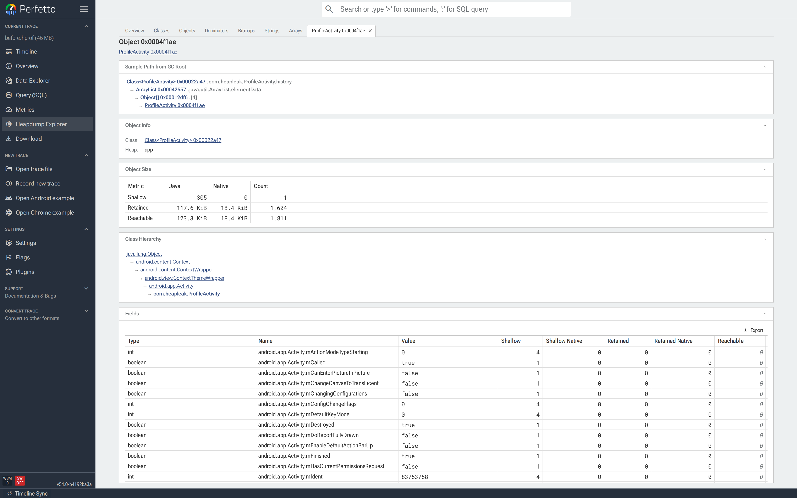
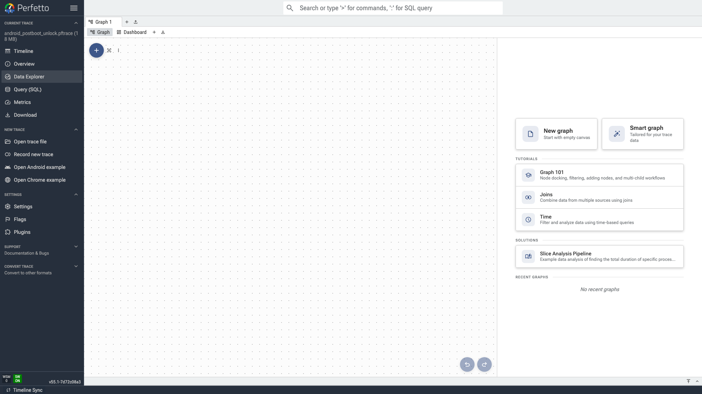

We're excited to share Perfetto v55.1! Highlights include GPU-accelerated trace rendering, a new Heap Dump Explorer, native Linux heap profiling, a redesigned `trace_processor` shell, multi-GPU analysis, and a major docs refresh.

> *Note: v55.0 was never released due to a build failure on Windows and an issue with parsing of some important ftrace events. v55.1 includes fixes to these issues.*

## ⚡ WebGL rendering & virtual track scrolling

Opening big traces (hundreds of processes, thousands of tracks, millions of slices) should be significantly smoother in v55.  Two changes drive this:

- **WebGL rendering** for slice and counter tracks moves the per-frame drawing work onto the GPU, lifting the budget for dense tracks by a wide margin.
- **Partial virtual track scrolling** means that tracks off screen only render a "skeleton" of their layout to allow for browser Ctrl-F while not doing unnecessary work.

> Note: for the largest traces, there's more coming with *full* virtual track scrolling in the works!

## 🧠 Heap Dump Explorer

Investigating Android and Java memory issues gets a significant improvement in Perfetto UI through the new **Heap Dump Explorer** page. Instead of just showing the flamegraph for the heap dump, this is an interactive exploration tool on the classes, objects and references in the dump. Specifically:

- A high-level **Overview** with retained bytes per heap.
- **Classes** ranked by retained / shallow size to help you find which type is hogging memory.
- An **Objects** browser for navigating individual instances and following references.
- **Dominators** view to find which objects "retain" the largest memory chunks.
- **Bitmap gallery**, **Strings**, and **Arrays** views (require an Java/ART `.hprof` heap dump).

The Java HPROF importer also got a major upgrade: primitive fields, array contents, and Bitmap-specific metadata are now preserved when parsing the traces to power this functionality.



[Learn more in the Heap Dump Explorer guide](https://perfetto.dev/docs/visualization/heap-dump-explorer)

## 🐧 `heap_profile host`: native Linux heap profiling

`heap_profile` is no longer Android-only. The new `host` subcommand lets you capture an allocation-attributed memory profile of a local Linux process and open the result in the same UI:

```sh
tools/heap_profile host -- ./my_binary --some-flag
```

It auto-downloads the bits it needs, launches a bundled daemon, and produces a flamegraph that behaves exactly like the Android equivalent (drill in by stack frame, deobfuscate symbols, etc.). The existing Android workflow lives under `heap_profile android` and is unchanged.

[Get started with native heap profiling On Linux](https://perfetto.dev/docs/getting-started/memory-profiling)

## 🐚 Subcommand-based `trace_processor_shell`

`trace_processor_shell` has been rebuilt around purpose-built subcommands that read more like `git`, replacing the flat-CLI-with-flags model:

```sh
trace_processor query        # one-shot SQL
trace_processor interactive  # REPL
trace_processor server       # serve the UI over RPC
trace_processor metrics      # run metrics
trace_processor summarize    # high-level summaries
trace_processor export       # write to other formats
trace_processor convert      # legacy conversions
```

The `query` subcommand also gained a **structured query mode** for programmatic callers. Existing scripts that use the classic flat CLI keep working just as it is today but all new functionality will be exposed through subcommands only.

[New trace_processor subcommand docs](https://perfetto.dev/docs/analysis/trace-processor)

## 🎮 Multi-GPU support

Trace Processor now models multiple GPUs as first-class citizens. The new `gpu` and `gpu_context` tables let you slice slice and memory tracks per-GPU and per-machine, so workloads spanning a discrete + integrated pair, a multi-GPU host, or a multi-machine setup attribute correctly all the way through analysis.

On the recording side, the GPU data source gained `InstrumentedSamplingConfig` for fine-grained sampling control, custom counter groups in `GpuCounterConfig`, and CUDA / HIP added to the graphics-context APIs; useful for compute workloads beyond traditional rendering.

[GPU data source documentation](https://perfetto.dev/docs/data-sources/gpu)

## 🐍 Python: polars DataFrame support

The Python `TraceProcessor` API can now return query results as **polars** DataFrames as well as pandas.

```python
df = tp.query("SELECT * FROM slice").as_polars_dataframe()
```

## 📈 Data Explorer dashboards

The Data Explorer (formerly "Explore") now has a full **dashboard environment** with side-by-side `Graph` and `Dashboard` views, an in-sidebar chart editor, smarter graph with cycle detection, import/export of dashboards between sessions, and built-in tutorials & solution recipes.



## 📊 New chart types and UI polish

A handful of new chart and aggregation types ship across the UI:

- **Sankey chart** for flow visualisations (scheduling transitions, call relationships, anything with sources and destinations).
- **Stats widget** for one-glance summaries (count, mean, min, max).
- New **percentile** and **count-distinct** aggregations in the SQL table viewer.
- **Line charts** now support stacking, series hovering, and selection alongside brushing.
- **Counter detail panels** now reflect counter mode and handle **rate-delta counters** correctly — particularly noticeable on Android GPU events.

## 🚀 Tracing service and probes

- **`android.aflags` data source** captures Android aconfig flags in effect during the trace, surfaced through Trace Processor and the UI.
- **`/proc/slabinfo`** polling added to `sys_stats` for tracking kernel slab allocations.
- **`traced_perf`** gained a CPU filter for per-CPU sampling, and raw perf events can specify a **dynamic PMU by name**.
- Any trace can now carry **generic trace-level metadata** for your own annotations. See
- Multi-machine tracing setups can restrict data sources to specific remote producers (`trace_all_machines` in `TraceConfig`).
- Stack sampling can be **filtered by source** (user-space / kernel / hypervisor).

## 🌐 More importers

Perfetto can now ingest more formats end-to-end:

- **ART Method v2** streaming traces from Android.
- **Firefox profiler markers** are imported as slices so you can correlate profiling information with high level timeline markers

## ☕ Java SDK

The Java SDK now understands `@CompileTimeConstant` annotations and static track names — so instrumentation can be more efficient when the compiler can prove the strings are constant.

## 📚 Refreshed documentation

The documentation site received a signifcant facelift

- Reorganised top-level **table of contents**.
- **Filter chips** for narrowing pages by topic (OS, role, cookbook, etc.).
- Refreshed typography, visuals, and navigation.
- Substantially rewritten or brand-new guides:
  - **PerfettoSQL** getting started (rewritten)
  - **GPU data source** (full rewrite)
  - **Symbolization & deobfuscation**
  - **Heap Dump Explorer** user guide
  - **`heap_profile`** with both `host` and `android` subcommands
  - **`traceconv`** (rewritten from scratch)
  - **`trace_processor`** shell + C++ embedding
  - **Multi-machine tracing** with `traced_relay`
  - **Rust SDK** getting started
  - **Periodic trace snapshots** cookbook
  - **`trace_processor` and `traceconv` on Windows**
- Community-maintained **Chinese docs** are now linked from the site.

## ⚠️ Breaking changes from previous releases

- The `TraceMetadata` proto was renamed to **`TraceAttributes`**.
- The `tid` field in `thread_descriptor.proto` is now **`int64`** (matters for Windows, which has large thread IDs).
- Legacy trace actions are now disabled by default; they live in the `dev.perfetto.Catapult` plugin if you need them.
- Trace Processor: an `arg_set_id` column was added to the `thread` table — queries joining `thread` with other tables that have `arg_set_id` (e.g. `slice`) may need to qualify the column name to avoid ambiguity.

## 🛠️ v55.1 patch fixes

- **Infra:** Fix build of prebuilts on Windows.
- **Trace Processor:** Fix parsing of timestamps for Adreno ftrace events.

---

A huge thanks to everyone — inside and outside Google — who contributed to making Perfetto v55 a success. ♥️

*For complete details, see the [changelog](https://github.com/google/perfetto/blob/v55.1/CHANGELOG) or [view all changes on GitHub](https://github.com/google/perfetto/compare/v54.0...v55.1).*

*Download Perfetto v55.1 from our [releases page](https://github.com/google/perfetto/releases), get started at [docs.perfetto.dev](https://perfetto.dev/docs/), or try the UI directly at [ui.perfetto.dev](https://ui.perfetto.dev/).*
