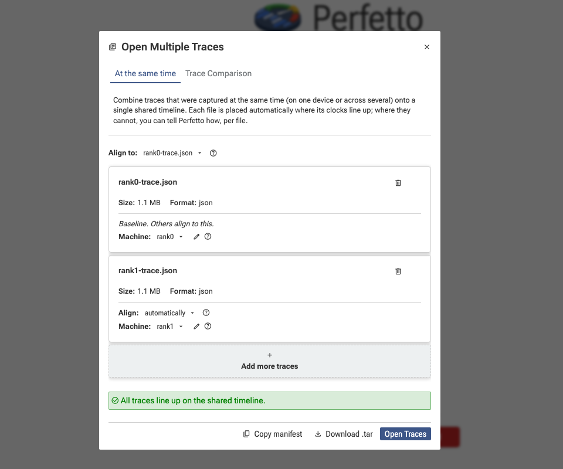
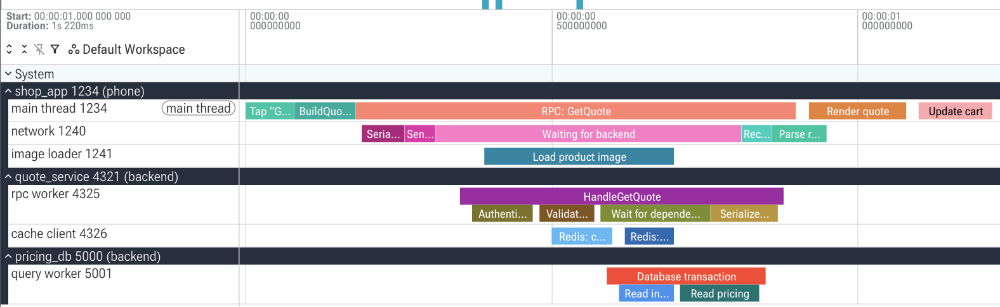
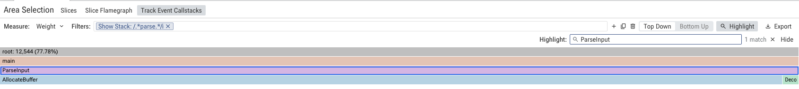
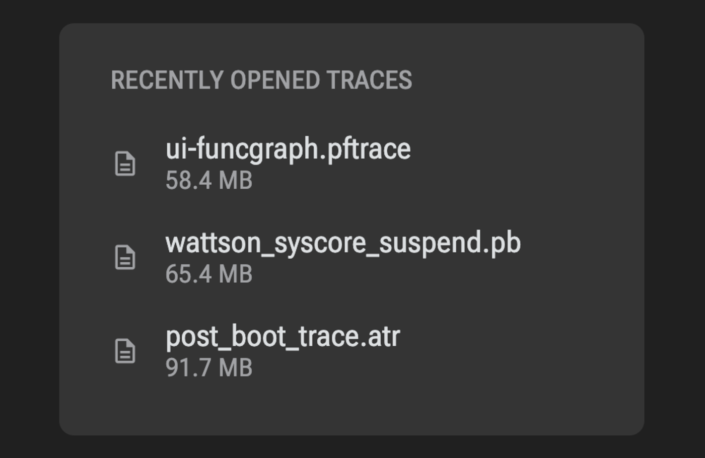
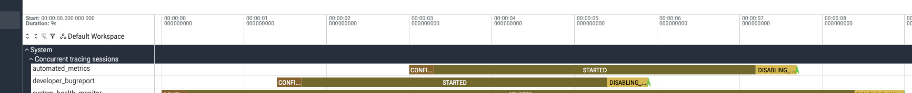

We’re excited to share Perfetto v58.2! This release makes it possible to **merge traces from different machines onto one timeline**, introduces **Memscope and Memory Overview** for end-to-end memory investigations, lets you **keep a parsed trace running and analyze it through lightweight remote clients**, adds **Zstd trace compression**, and substantially improves Perfetto’s **AI-assisted analysis workflows**. It also introduces a common stack-sampling format, new export options, and a collection of UI and SDK improvements.

> Note: v58.0 and v58.1 were never released due to compilation issues with Windows builds.

## Merge multiple traces onto one timeline

Perfetto can now open several traces together and merge their contents onto a single timeline! This makes it much easier to investigate behavior spanning multiple VMs, machines, or separately recorded trace sources without manually converting them into one trace first.

Here's a demo of merging traces in the Perfetto UI:


In the UI, select **Open multiple trace files**, select several files in the normal file picker, or drop multiple files onto the page. A new dialog lets you configure how the traces should be merged, shows whether any events would be dropped, and can export the result as a self-contained `.tar` archive.



A powerful use of this feature is to visualize traces that span machines and VMs. For example, to visualize traces across a phone and a backend service the phone is communicating with:



Use the new `util merge` command which helps avoid common mistakes when merging traces. The resulting trace can be opened in the UI or in the trace processor:

```sh
# Merge traces from the same machine recorded with consistent clocks. For multi-machine or multi-clock setups, use the JSON
# manifest as described below.
trace_processor util merge \
  -o merged.tar \
   perf.data \
   perfetto.pftrace

# Now you can opened merged.tar in the UI *or* load it in trace processor:
trace_processor merged.tar
```

For more complex setups, a `perfetto_manifest` JSON file can assign machine names, relate clock domains, and apply fixed clock offsets. The UI can generate both the archive and manifest interactively, providing a convenient starting point for scripted or repeatable workflows.

See the [merging traces documentation](https://perfetto.dev/docs/analysis/merging-traces) for much information examples of how to merge traces in common setups, details of the manifest format and details on how to generate pre-merged traces for loading in the UI, without using `trace_processor merge`

## Memscope and Memory Overview (Preview)

Perfetto v58 introduces a connected memory-analysis workflow spanning live monitoring, trace recording, initial triage, and detailed investigation.

> **Preview:** Memscope and Memory Overview are still preview features.

**Memscope** is a live memory profiler for Android and Linux. It guides you through connecting to a device or host, displays system-wide and per-process memory statistics as they change, and provides shortcuts for recording a memory trace for a selected process. Instead of constructing a memory-focused recording configuration by hand, you can move directly from observing suspicious memory behavior to capturing the information needed to explain it.


After recording, **Memory Overview** provides a high-level breakdown of where a process’s memory is being used. It combines information from smaps snapshots, ART heap dumps, and native heap profiling into one starting point, with links into more specialized tools such as Heap Dump Explorer.


Memory Overview also opens automatically when a trace contains smaps snapshots, making memory traces immediately actionable rather than dropping users onto a generic timeline.

Together, Memscope and Memory Overview provide a path from “this process appears to be using too much memory” to the appropriate native, managed, or system-level investigation.

See the [Memscope and Memory Overview guide](https://perfetto.dev/docs/visualization/memscope) for a complete recording and analysis walkthrough.

## Load once, analyze through lightweight clients

Remote Trace Processor analysis is not new: `trace_processor server http` already allowed the Perfetto UI to use a native Trace Processor instance instead of the browser’s WebAssembly implementation.

The command-line experience, however, had significant gaps. The Trace Processor CLI could not connect to an existing server, and running several server instances meant manually assigning port numbers, remembering which trace was attached to each port, and dealing with port clashes.

Perfetto v58 turns this into a complete client-server workflow. A trace can be loaded once into a properly named background session, and any number of lightweight command-line clients can connect to it using `--remote`:

```sh
# Parse the trace once and keep it in a named session.
trace_processor server unix \
  --name mysession \
  --daemonize trace.pftrace

# Run queries against the existing session.
trace_processor query \
  --remote mysession \
  "SELECT count(*) FROM slice"
```

Named local sessions use Unix sockets, so there is no port to allocate or remember. The session name identifies both the running Trace Processor and the trace it contains. The new remote client can also connect to a `trace_processor server http` instance using `--remote host:port`, bringing the existing HTTP/WebSocket server workflow to the command-line interface.

Session state persists across invocations: tables created by one query and modules included by one command remain available to the next, allowing expensive intermediate results to be materialized once and reused. The result is a much more usable workflow for large traces: parse once, give the session a meaningful name, and analyze it repeatedly without juggling ports or restarting Trace Processor.

See the [command-line analysis guide](https://perfetto.dev/docs/getting-started/command-line-analysis) for session management, remote addresses, and idle-timeout options.

## Smaller traces with Zstd compression

Perfetto now supports **Zstd** as a trace compression option alongside deflate. Zstd generally produces smaller traces than deflate at a similar speed, reducing the storage and transfer costs of longer or more data-intensive recordings.

Compression is selected through the new `TraceConfig.compression` field:

```protobuf
compression {
  zstd {}
}
```

The compression level can also be controlled explicitly:

```protobuf
compression {
  zstd {
    level: 9
  }
}
```

Level `0`, or leaving the level unset, uses Zstd’s default level of `3`, which provides a good balance for most traces. The older `compression_type` field remains honored for compatibility but is now deprecated in favor of `TraceConfig.compression`.

See the [trace configuration documentation](https://perfetto.dev/docs/concepts/config#tuning-the-zstd-level) for level selection, compatibility behavior, and SDK build requirements.

## Faster and more capable AI-assisted analysis

Perfetto’s installable AI skill can now keep a trace loaded across an investigation. Instead of reparsing the same trace for every question, the skill opens a persistent Trace Processor session and reuses it for subsequent queries. This makes iterative analysis significantly faster and allows SQL state and materialized intermediate results to carry across steps.

The skill also gains:

- A `TraceConfig` reference and exemplar configurations that an agent can adapt when a question requires a custom recording.
- A saved Markdown report at the end of every analysis, containing the original question, the findings, and the queries that produced useful results.
- A downloadable `perfetto-ai-skill.zip` asset in each GitHub release, allowing the skill to be installed on machines that cannot reach GitHub at installation time.

See the [Using AI with Perfetto guide](https://perfetto.dev/docs/getting-started/using-ai) for installation instructions and example investigations.

## A common format for stack-sampling profilers

Perfetto now defines a common stack-sampling format that any profiler can emit.

The new `TracePacket.stack_sample` packet attributes a callstack to a thread, process, or stackful asynchronous context such as a goroutine or fiber. Samples are measured against an explicit counter timebase—such as wall time, CPU cycles, or allocated bytes—and can carry additional follower counters.

Callstacks can be fully inline or use Perfetto’s interning mechanism. Per-sequence `StackSampleDefaults` identify the profiler and declare common counters once for the whole sampling stream.

Trace Processor exposes the results through a common set of tables:

- `stack_sample`
- `stack_sample_session`
- `stack_sample_task_context`
- `stack_sample_execution_context`
- `stack_sample_async_context`
- `stack_sample_counter_track`
- `stack_sample_counter`

These tables provide one profiler-neutral model while continuing to share the existing `stack_profile_*` callstack tables. Linux perf’s specialized `perf_sample`, `perf_session`, and `perf_counter_track` tables remain available for perf-specific information, including counter-only samples.

This gives profiler authors a standard route into Perfetto’s SQL and visualization capabilities without having to adopt another profiler’s transport format.

## Export parsed traces and tables

Perfetto v58 adds two Trace Processor export formats for workflows that need to reuse or move already-parsed data.

```sh
# Reloadable by the same Trace Processor version.
trace_processor export perfetto \
  -o parsed.tar \
  trace.pftrace

# Standard Arrow files for external analysis tools.
trace_processor export arrow_tar \
  -o tables.tar \
  trace.pftrace
```

The **`perfetto`** format stores parsed data in an archive that another Trace Processor instance of the same version can load. This avoids repeatedly parsing a large source trace when a persistent server session is not appropriate.

The **`arrow_tar`** format writes the built-in tables as standard Apache Arrow files inside a TAR archive. The format is stable across Perfetto versions and can be consumed by tools such as pandas, Polars, and PyArrow. It is intended for interoperability and cannot be loaded back into Trace Processor.

Together with client-server mode, these formats provide three distinct options: keep a live parsed session, save a reloadable parsed archive, or export tables into a standard analytics ecosystem.

## UI improvements

### Better flamegraphs

Flamegraphs now have clearer direction and filter controls, frame highlighting, and case-insensitive regular-expression filtering.

Callstack sample tracks and flamegraphs also share a common implementation over the new `stack_sample` table. Tracks and area-selection tabs remain separate for each profiler source, preserving source-specific workflows, while any source that records counters can now support counter-weighted flamegraphs.



### Recently opened traces

The Perfetto homepage now lists recently opened traces, making it easier to return to an investigation without locating the file again.



### Pivot slice aggregations by argument values

The slice aggregation table can now pivot on values stored in event arguments. This makes it possible to compare groups based on dimensions encoded in `args` without first reshaping the data through a custom SQL query.

<!-- MEDIA READY — Before/after screenshots: `/tmp/perfetto-v58-media/screenshots/arg-pivot-before-crop.png` and `/tmp/perfetto-v58-media/screenshots/arg-pivot-after-crop.png`. Rough interaction video: `/tmp/perfetto-v58-media/videos/arg-pivot-demo.mp4`. Trace generator: `/tmp/perfetto-v58-media/generate_arg_pivot_trace.py`; Playwright automation: `/tmp/perfetto-v58-media/capture_arg_pivot.cjs`. -->

Additional UI improvements include:

- We now publish the UI as a GitHub release artifact, making it easier than to embed the UI inside other tools.
- The ftrace plugin now supports area selections and multi-machine traces.
- The command-palette shortcut is remapped to `F1` on Firefox.

## Recording and tracing improvements

### See other tracing sessions in your trace

More than one tracing session can be active on a device at the same time—for example, a developer recording manually while a system service or automated test is also tracing. Until now, the resulting trace did not show when those other sessions started or stopped, making interference between recordings difficult to explain.

Perfetto can now record the lifecycle of every other session that overlaps with yours. Enable it in the recording config:

```protobuf
builtin_data_sources {
  enable_concurrent_session_events: true
}
```

The trace records when each concurrent session is configured, started, begins shutting down, or becomes disabled. Trace Processor and the UI turn those events into one state track per session under **Concurrent tracing sessions**, so the overlap is visible alongside the activity being investigated.



### More complete process metadata from procfs

The `process_stats` data source now writes an explicit `Thread` message for every process’s main thread instead of leaving it implied by the process entry. Traces recorded from procfs alone therefore retain main-thread names in Trace Processor and the UI.

### Structured context for recordings

Trace-level notes have been generalized into attributes. `TraceConfig.trace_attributes` and `perfetto --add-attribute` replace `TraceConfig.notes` and `--add-note`, allowing a recording to carry structured context such as its build identifier, experiment name, test case, or collection environment. These attributes are available from Trace Processor without requiring a timestamped event or metadata track.

## SDK improvements

The C SDK’s shared-library configuration has been simplified:

- Static linking—the default—no longer requires any export macros.
- Define `PERFETTO_SDK_SHLIB_IMPLEMENTATION` when building the SDK into a shared library.
- Define `PERFETTO_SDK_SHLIB` when consuming it as a shared library.
- The same model applies to the amalgamated SDK.

The C data-source ABI also gains `PerfettoDsGetTimestamp()` and `PerfettoDsGetDefaultClockId()`. These APIs return timestamps using Perfetto’s preferred trace clock, removing the need for callers to select an operating-system-specific clock themselves. The Rust SDK provides the equivalent through `DataSourceTimestamp::now()`.

On Apple platforms, `dev.perfetto.clock_sync` signpost events now fire on iOS as well as macOS, allowing Instruments traces captured on iOS to be synchronized with Perfetto traces.

## Trace Processor improvements

The SQL `regexp()` function now accepts an optional third argument for matching flags: `i` selects case-insensitive matching and `c` explicitly selects case-sensitive matching.

This release also fixes:

- Negative timestamps wrapping to large positive values and crashing the UI.
- A crash when importing an empty `CpuInfo` packet.
- A hang when skipping an oversized protobuf field.
- Lost callstacks when importing Apple Instruments traces produced by Xcode 27.

## Migration and compatibility notes

Perfetto v58 includes several API and tooling changes worth checking when upgrading:

- **Inline callstacks:** `TrackEvent.Callstack` has moved to the top-level `InlineCallstack` message in `trace/profiling/inline_callstack.proto`. The wire format is unchanged, but code referring to the generated `TrackEvent.Callstack` or `TrackEvent::Callstack` types must move to `InlineCallstack`.
- **Trace metadata:** `TraceConfig.notes` and `perfetto --add-note` have been replaced by `TraceConfig.trace_attributes` and `--add-attribute`.
- **Compression:** `TraceConfig.compression` supersedes the deflate-only `compression_type` field.
- **C SDK shared libraries:** `PERFETTO_SHLIB_SDK_IMPLEMENTATION` has been renamed to `PERFETTO_SDK_SHLIB_IMPLEMENTATION`, and `PERFETTO_SDK_DISABLE_SHLIB_EXPORT` has been removed.
- **`traceconv`:** the standalone tool is deprecated in favor of equivalent `trace_processor` subcommands. The `traceconv` wrapper continues to fetch Trace Processor and run it under the old name, so existing invocations continue to work for now.
- **SQL file access:** the embedder-provided filesystem interface is disabled by default. Trace Processor permits SQL file access only when started with `--allow-sql-file-access`.
- **`EXPORT_JSON`:** the integer file-descriptor form has been removed. SQL file writes no longer require `--dev`.

Happy Tracing!

---

A huge thanks to everyone who contributed to making Perfetto v58 possible. A specific thanks to our first time contributors:

* @jernej-google made their first contribution in https://github.com/google/perfetto/pull/6346
* @TParaschiv made their first contribution in https://github.com/google/perfetto/pull/6259
* @sergey-miryanov made their first contribution in https://github.com/google/perfetto/pull/6402
* @tudormot made their first contribution in https://github.com/google/perfetto/pull/6455
* @carlscabgro made their first contribution in https://github.com/google/perfetto/pull/6403
* @annamayzner made their first contribution in https://github.com/google/perfetto/pull/6437
* @lucigrigo made their first contribution in https://github.com/google/perfetto/pull/6479
* @acst1223 made their first contribution in https://github.com/google/perfetto/pull/6586
* @adilburaksen made their first contribution in https://github.com/google/perfetto/pull/6518
* @Yong-yuan-X made their first contribution in https://github.com/google/perfetto/pull/6623
* @Nublo made their first contribution in https://github.com/google/perfetto/pull/6685
* @kongy made their first contribution in https://github.com/google/perfetto/pull/6733
* @Leafum made their first contribution in https://github.com/google/perfetto/pull/6804
* @junov-google made their first contribution in https://github.com/google/perfetto/pull/6886
* @akahuang-goog made their first contribution in https://github.com/google/perfetto/pull/6847
* @jingjiewang-twn made their first contribution in https://github.com/google/perfetto/pull/6655
* @Socialpranker made their first contribution in https://github.com/google/perfetto/pull/6588
* @rishuranjanofficial made their first contribution in https://github.com/google/perfetto/pull/6968

*For complete details, see the [v58.2 changelog](https://github.com/google/perfetto/blob/v58.2/CHANGELOG) or [view all changes on GitHub](https://github.com/google/perfetto/compare/v57.2...v58.2).*

*Download Perfetto v58.2 from our [releases page](https://github.com/google/perfetto/releases), get started at [perfetto.dev](https://perfetto.dev/docs/), or try the UI directly at [ui.perfetto.dev](https://ui.perfetto.dev/).*
