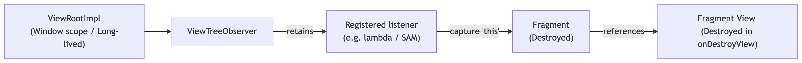
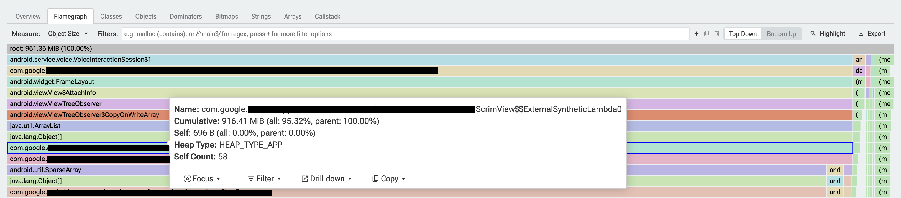
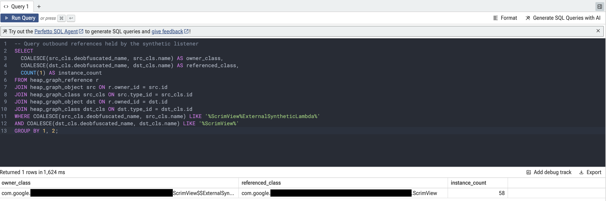

# Under the Hood: Diagnosing a 1 GB ViewTreeObserver Memory Leak with Perfetto

## Motivation

How does a single background scrim view end up retaining nearly a gigabyte of memory in a production application? Memory leaks in Android are common, but few are as destructive as those involving [ViewTreeObserver](https://developer.android.com/reference/kotlin/android/view/ViewTreeObserver).

In this article, we will walk through a common but often misunderstood pattern: memory leaks caused by `ViewTreeObserver` listeners. We will look at how these leaks manifest, use Perfetto to identify them, and see how to implement safe engineering patterns to fix them.

## The Lifetime Mismatch: Who Actually Owns ViewTreeObserver?

Before diving into heap dumps or traps, it's crucial to understand a fundamental architectural detail in Android:

> A ViewTreeObserver isn't owned by the individual View. Once attached, all views in the same ViewRoot share the hierarchy's ViewTreeObserver. Therefore, registering a listener from a short-lived object (such as a [Fragment](https://developer.android.com/reference/androidx/fragment/app/Fragment)) effectively stores that callback in a potentially much longer-lived ViewRoot. If the listener captures the Fragment and isn't unregistered during teardown, the ViewRoot will retain the destroyed Fragment for as long as that window hierarchy remains alive.



## Gathering Data: The Warning Signs

Every investigation starts with a symptom or an alert. In our case, automated telemetry pipelines flagged creeping memory issues in large-scale applications.

### Real World Impact Stats:

* A single leaking observer retained \~900 MB of memory across 58 dead view trees and native graphics buffers.  
* Orphaned observers retained 61.1 MB per trace, stranding custom audio player UI components.  
* Leaks retained up to 12.8 MB per trace, holding high-resolution image thumbnails in memory.

## Forensic Investigation: Heap Dumps in Perfetto

Knowing that observers can hold dead UI hierarchies is one thing; pinpointing the exact line of code holding the reference in a production trace is another.  
When telemetry alerts flag high memory retention, diagnosing the root cause requires inspecting the app's **Java Heap Graph**.

> **Try it on your app:** If you haven't analyzed a heap dump in Perfetto yet, try capturing one after going through a complex flow in your app. It’s one of the fastest ways to uncover hidden retention chains. Check out the official [Perfetto Guide](https://perfetto.dev/docs/data-sources/java-heap-profiler) to get started.

### Step 1: Spotting the Anomaly in the Heap Profile Flamegraph

Navigating to the **Heapdump Explorer** in the left sidebar and opening the **Flamegraph** tab (set to **Top Down** view) immediately revealed the smoking gun. 



Instead of memory being distributed across various features, nearly **100% of the *\~1 GB* retained footprint** formed a solid, uninterrupted column flowing straight down through the window hierarchy: `View$AttachInfo` ➡️ `ViewTreeObserver` ➡️ `ViewTreeObserver$CopyOnWriteArray` ➡️ `…` ➡️ **`ScrimView$$ExternalSyntheticLambda0 [58 instances]`** ➡️ **`ScrimView [58 instances]`**. When a single leak site accumulates dozens of dead View hierarchies spanning the entire width of your application's flamegraph, you know you've found the culprit.

### Step 2: The Root Cause in Code

To understand why `ScrimView$$ExternalSyntheticLambda0` was registered and never removed, we inspect `ScrimView.kt`:

```kotlin
// ⚠️ Problematic Code in ScrimView.kt
fun updateListener() {
    if (isAttachedToWindow && overrideOpacity == null) {
        if (!isRecomputeScrimListenerAttached) {
            viewTreeObserver.addOnPreDrawListener(recomputeScrimListener)
            isRecomputeScrimListenerAttached = true
        }
    } else {
        viewTreeObserver.removeOnPreDrawListener(recomputeScrimListener)
        isRecomputeScrimListenerAttached = false
    }
}

override fun onAttachedToWindow() {
    super.onAttachedToWindow()
    updateListener()
}

override fun onDetachedFromWindow() {
    super.onDetachedFromWindow()
    updateListener() // 🚨 THE BUG!
}
```

#### Bug explanation

Developers often assume `isAttachedToWindow` returns `false` inside `onDetachedFromWindow()`. However, AOSP's `View.dispatchDetachedFromWindow()` invokes `onDetachedFromWindow()` before setting `mAttachInfo = null`.

```
dispatchDetachedFromWindow()
  ├── 1. onDetachedFromWindow()           <-- isAttachedToWindow is STILL TRUE!
  ├── 2. onViewDetachedFromWindow()       <-- isAttachedToWindow is STILL TRUE!
  └── 3. mAttachInfo = null;              <-- Flag reset happens HERE at the end
```

When `ScrimView.onDetachedFromWindow()` executed:

1. `isAttachedToWindow` returned `true`.  
2. Because `overrideOpacity` was `null`, `if (isAttachedToWindow && overrideOpacity == null)` evaluated to `true`.  
3. `updateListener()` entered the registration block instead of the teardown `else` block.  
4. Because `isRecomputeScrimListenerAttached` was already `true`, execution silently did nothing.

The listener was never unregistered and remained attached to the window's `ViewTreeObserver` indefinitely.

### 

### Step 3: Uncovering the Retention Path (The Chain of Blame)

How does this listener leak end up holding nearly a gigabyte of memory?

By tracing the reference path downward from the flamegraph, we can see the cascade of references.

1. **Listener Attachment:** When `ScrimView` is attached to a window, [`onAttachedToWindow()`](https://developer.android.com/reference/android/view/View#onAttachedToWindow\(\)) calls `updateListener()`, registering `recomputeScrimListener` (`ScrimView$$ExternalSyntheticLambda0`) on `ViewTreeObserver`.  
2. **Implicit Reference:** In Kotlin, lambdas and method references (like `this::recomputeScrim`) implicitly capture an outer 'this' reference. The compiler generates a synthetic class (`ScrimView$$ExternalSyntheticLambda0`) that holds a strong reference to the `ScrimView` instance, making the registered callback a persistent anchor for the entire view.  
3. **Detachment Lifecycle Flaw:** When `ScrimView` is being detached, `dispatchDetachedFromWindow()` invokes [`onDetachedFromWindow()`](https://developer.android.com/reference/android/view/View#onDetachedFromWindow\(\)). Because `mAttachInfo` remains non-null during execution of `onDetachedFromWindow()`, [`isAttachedToWindow`](https://developer.android.com/reference/android/view/View#isAttachedToWindow\(\)) returns `true`.  
4. **Bypassed Unregistration:** In `updateListener()`, `if (isAttachedToWindow && overrideOpacity == null)` evaluates to `true`. Thus, execution enters the `if` block instead of the `else` block containing `viewTreeObserver.removeOnPreDrawListener(recomputeScrimListener)`.  
5. **Memory Accumulation:** With each open/dismiss cycle of the transient UI overlay, [`ViewTreeObserver.mOnPreDrawListeners`](https://developer.android.com/reference/android/view/ViewTreeObserver.OnPreDrawListener) retained another dead `recomputeScrimListener`. Because `ScrimView.mParent` chains all the way up through the view hierarchy to `FragmentManager`, leaking `ScrimView` retained the entire destroyed `Fragment` instance, its `ViewModel` references, and all associated child views. Over **58** user interactions, this accumulated **58 dead UI trees**, stranding 50 uncollected high-resolution [`Bitmap`](https://developer.android.com/reference/android/graphics/Bitmap) graphic buffers totaling **\~898.5 MB** of native graphics memory (in a process with only 83 MB of Java heap).

#### Verifying Programmatically with PerfettoSQL

While the flamegraph provides an intuitive visual overview of memory bloat, Perfetto also models the entire heap graph as a relational database. You can run custom queries directly in the browser by navigating to **Query (SQL)** in the left sidebar.  
To verify that the synthetic lambda instances were holding references back to `ScrimView`, we can query the `heap_graph_reference` table:

```sql
SELECT
  COALESCE(src_cls.deobfuscated_name, src_cls.name) AS owner_class,
  COALESCE(dst_cls.deobfuscated_name, dst_cls.name) AS referenced_class,
  COUNT(1) AS instance_count
FROM heap_graph_reference r
JOIN heap_graph_object src ON r.owner_id = src.id
JOIN heap_graph_class src_cls ON src.type_id = src_cls.id
JOIN heap_graph_object dst ON r.owned_id = dst.id
JOIN heap_graph_class dst_cls ON dst.type_id = dst_cls.id
WHERE COALESCE(src_cls.deobfuscated_name, src_cls.name) LIKE '%ScrimView%ExternalSyntheticLambda%' 
  AND COALESCE(dst_cls.deobfuscated_name, dst_cls.name) LIKE '%ScrimView%'
GROUP BY 1, 2;
```

 

### Step 4: The Immediate Fix

The fix was straightforward: **unconditionally unregister** the listener during window detachment, without relying on attach-state checks:

```kotlin
// ✅ FIX: 100% unconditional unregistration on window detachment
override fun onDetachedFromWindow() {
   super.onDetachedFromWindow()
   viewTreeObserver.removeOnPreDrawListener(recomputeScrimListener)
   isRecomputeScrimListenerAttached = false
}
```

Never route lifecycle teardown through dynamic business-state checks (like overrideOpacity \== null). While property setters can manage listener attachment dynamically while the view is attached, cleanup in onDetachedFromWindow() must be unconditional, ensuring the listener is always removed when the view leaves the window.

## Beyond ScrimView: 3 Other Silent Traps

While `ScrimView` was an attach-state lifecycle trap, our investigation across other applications revealed three more recurring patterns.

### Trap 1: The Floating Observer Ghost 

A common anti-pattern in Android development is attempting to clean up listeners during Fragment view destruction:

```kotlin
// ⚠️ Flawed unregistration in Fragment onDestroyView()
override fun onDestroyView() {
    super.onDestroyView()
    // 🚨 Silent Failure: Operates on a detached floating observer!
    binding?.root?.viewTreeObserver?.removeOnGlobalLayoutListener(myListener)
}
```

#### The Pathology: The `mFloatingTreeObserver` Trap

By the time a Fragment executes [`onDestroyView()`](https://developer.android.com/reference/androidx/fragment/app/Fragment#onDestroyView\(\)), its view hierarchy has already been completely detached from the window (`mAttachInfo == null`).  
Under the hood in AOSP, when `mAttachInfo` is `null`, calling `view.viewTreeObserver` does **not** return the active Window observer. Instead, it instantiates a brand-new, empty **floating observer** (`mFloatingTreeObserver`).  
The `removeOnGlobalLayoutListener(...)` call executes against this ghost observer and silently does nothing. Meanwhile, the **live Window-scoped `ViewTreeObserver` still holds onto your listener**, permanently leaking the Fragment and its view hierarchy.

**The Critical Timing Contrast:**

> - **Inside `onDetachedFromWindow()`:** `mAttachInfo` is still non-null, so `viewTreeObserver` successfully resolves to the active Window observer.  
> - **Inside Fragment `onDestroyView()`:** Detachment is already complete (`mAttachInfo == null`), silently redirecting all `viewTreeObserver` calls to an unattached `mFloatingTreeObserver`.

### Trap 2: The Kotlin SAM & Method Reference Trap 

In modern Kotlin, developers frequently pass method references or inline lambdas, assuming they act as stable function pointers:

```kotlin
// 1. Registration (Kotlin creates SAM instance #1):
view.viewTreeObserver.addOnGlobalLayoutListener(this::onGlobalLayout)

// 2. Teardown (🚨 Silent Failure: Kotlin creates a BRAND-NEW SAM instance #2!):
view.viewTreeObserver.removeOnGlobalLayoutListener(this::onGlobalLayout)
```

#### The Pathology: Reference Equality (`===`) in `CopyOnWriteArray`

Under the hood in AOSP, `ViewTreeObserver` stores listeners in an internal array (`CopyOnWriteArray<T>`) and removes them using **strict reference equality (`===`)**.  
In Kotlin, passing a method reference (`this::onGlobalLayout`) triggers **SAM (Single Abstract Method) conversion**. Every time you evaluate `this::onGlobalLayout`, the Kotlin compiler instantiates a **new wrapper object**:  
Because of that, the removal call silently fails to find a match and does nothing. The initial listener remains registered on the window hierarchy indefinitely.  
> **Rule of Thumb:** If you register a `ViewTreeObserver` listener, store it in an explicit property (e.g. `private val layoutListener = ViewTreeObserver.OnGlobalLayoutListener { ... }`) and pass that **exact same instance** to both `addOn...Listener` and `removeOn...Listener`.

### Trap 3: The One-Way Unregistration Ticket 

Another fragile pattern is attempting to self-unregister directly inside a one-shot callback:

```kotlin
// ⚠️ Fragile self-unregistration attempt in Kotlin
val drawListener = object : ViewTreeObserver.OnDrawListener {
    override fun onDraw() {
        // 🚨 CRASH: Throws IllegalStateException in AOSP!
        view.viewTreeObserver.removeOnDrawListener(this)
        performAction()
    }
}
view.viewTreeObserver.addOnDrawListener(drawListener)
```

#### The Pathology: `mInDispatchOnDraw` and Detachment Races

This pattern introduces two severe failure modes:

1. **Immediate Crash via `IllegalStateException`:**  
   Unlike `removeOnPreDrawListener` (which is safely permitted during pre-draw dispatch), `removeOnDrawListener` is explicitly prohibited while drawing is in flight. Under the hood, `ViewTreeObserver` sets `mInDispatchOnDraw = true` during traversal:

```java
// Inside android.view.ViewTreeObserver (AOSP):
public void removeOnDrawListener(OnDrawListener victim) {
        checkIsAlive();
        if (mOnDrawListeners == null) {
            return;
        }
        if (mInDispatchOnDraw) {
            IllegalStateException ex = new IllegalStateException(
                    "Cannot call removeOnDrawListener inside of onDraw");
            if (sIllegalOnDrawModificationIsFatal) {
                throw ex;
            } else {
                Log.e("ViewTreeObserver", ex.getMessage(), ex);
            }
        }
        mOnDrawListeners.remove(victim);
    }
```

2. **The Detachment Trap (Stranded Observers):**  
   Even when using `OnPreDrawListener` (where self-removal is permitted without throwing), self-unregistration assumes the callback is guaranteed to run. If the view is removed from the hierarchy, marked `View.GONE`, or detached *before* the next traversal pass occurs, **`onDraw()` / `onPreDraw()` will never execute**. The listener remains stranded on the window's `ViewTreeObserver` indefinitely.

## The Fix: Safe Engineering Patterns

### Pattern 1: Prefer View-Scoped Layout Listeners

If observing layout changes on a single View, **avoid `ViewTreeObserver` entirely**. Use `View.OnLayoutChangeListener`:

```kotlin
// ✅ Scoped to the View instance; does not touch Window ViewTreeObserver
val layoutListener = View.OnLayoutChangeListener { v, left, top, right, bottom, oldL, oldT, oldR, oldB ->
    updateToolbarWidth(right - left)
}
toolbar.addOnLayoutChangeListener(layoutListener)

// Teardown:
toolbar.removeOnLayoutChangeListener(layoutListener)
```

Unlike `ViewTreeObserver` (which attaches callbacks to the window-level `ViewRootImpl`), `View.OnLayoutChangeListener` callbacks are stored directly inside the view itself at `View.mListenerInfo.mOnLayoutChangeListeners`.  
Because the callback never escapes to the window root, it shares the exact same lifecycle as the host view. If you forget to unregister it, the listener is still **naturally garbage-collected alongside the View** without holding the entire window tree hostage.

---

### Pattern 2: When Window-Wide Observation is Truly Necessary

While single views should use `View.OnLayoutChangeListener`, there are valid scenarios where you genuinely need a Window-scoped `ViewTreeObserver`, such as detecting soft-keyboard (IME) insets, observing scroll offsets across arbitrary sibling views, or coordinating multi-view screen layouts.

When registering a `ViewTreeObserver` listener (especially when wrapping it with tracing or analytical proxies), use a lifecycle-bound wrapper that manages attachment and guarantees safe unregistration:

```kotlin
/**
 * Safely manages a Window-scoped ViewTreeObserver listener by binding it
 * to a host View's window attachment lifecycle.
 */
class SafeGlobalLayoutObserver(
    private val hostView: View,
    private val callback: () -> Unit
) : View.OnAttachStateChangeListener {

    // 1. Hold an explicit reference so removal reference equality (===) succeeds
    private var activeWrapper: ViewTreeObserver.OnGlobalLayoutListener? = null

    fun attach() {
        hostView.addOnAttachStateChangeListener(this)
        if (hostView.isAttachedToWindow) {
            registerOnWindow()
        }
    }

    fun detach() {
        hostView.removeOnAttachStateChangeListener(this)
        unregisterFromWindow()
    }

    override fun onViewAttachedToWindow(v: View) {
        registerOnWindow()
    }

    override fun onViewDetachedFromWindow(v: View) {
        unregisterFromWindow()
    }

    private fun registerOnWindow() {
        if (activeWrapper != null) return
        val wrapper = ViewTreeObserver.OnGlobalLayoutListener {
            Trace.beginSection("global_layout_pass")
            try {
                callback()
            } finally {
                Trace.endSection()
            }
        }
        hostView.viewTreeObserver.addOnGlobalLayoutListener(wrapper)
        activeWrapper = wrapper
    }

    private fun unregisterFromWindow() {
        val wrapper = activeWrapper ?: return
        val vto = hostView.viewTreeObserver
        // 2. Guard against window teardown where ViewTreeObserver is no longer alive
        if (vto.isAlive) {
            vto.removeOnGlobalLayoutListener(wrapper)
        }
        activeWrapper = null
    }
}
```

---

### Pattern 3: AndroidX \`[doOnPreDraw](https://developer.android.com/reference/kotlin/androidx/core/view/package-summary#\(android.view.View\).doOnPreDraw\(kotlin.Function1\))\` and \`[doOnLayout](https://developer.android.com/reference/kotlin/androidx/core/view/package-summary#\(android.view.View\).doOnLayout\(kotlin.Function1\))\` Utilities

For one-shot measurement, layout, or animation callbacks, avoid manually registering `ViewTreeObserver` listeners. Instead, use the Kotlin extension functions provided by `androidx.core:core-ktx`:

```kotlin
import androidx.core.view.doOnPreDraw
import androidx.core.view.doOnLayout

// ✅ Safe, one-shot pre-draw callback
view.doOnPreDraw { v ->
    updateUI(v.width)
}

// ✅ Safe, one-shot layout callback
view.doOnLayout { v ->
    alignFloatingButton(v.top)
}
```

#### Why it's immune to detachment races

Under the hood, `doOnPreDraw` relies on AndroidX's [`OneShotPreDrawListener`](https://developer.android.com/reference/androidx/core/view/OneShotPreDrawListener), which simultaneously implements **both** `ViewTreeObserver.OnPreDrawListener` and `View.OnAttachStateChangeListener`.

1. **If the draw pass happens:** It removes the listener from `ViewTreeObserver` and executes your lambda.  
2. **If the view is detached before drawing:** `onViewDetachedFromWindow()` triggers automatically, unregistering the listener before it can ever be stranded on the window hierarchy.

Similarly, `doOnLayout` uses a self-removing `View.OnLayoutChangeListener`, which is safely scoped to the View instance.

## Over to You

Memory leaks like this often remain completely invisible until telemetry flags a spike in production crashes or OutOfMemory errors.

* Have you encountered unexpected memory retention from window-scoped listeners in your own apps?  
* How often do you capture and analyze Java heap dumps in Perfetto?  
* What is the sneakiest or largest memory leak you have ever tracked down? Let us know your thoughts, questions, and experiences in the comments below\!