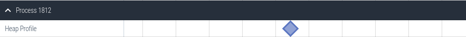
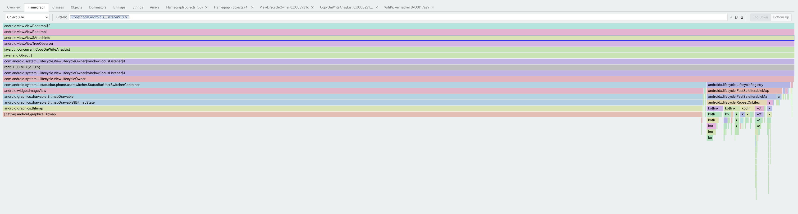
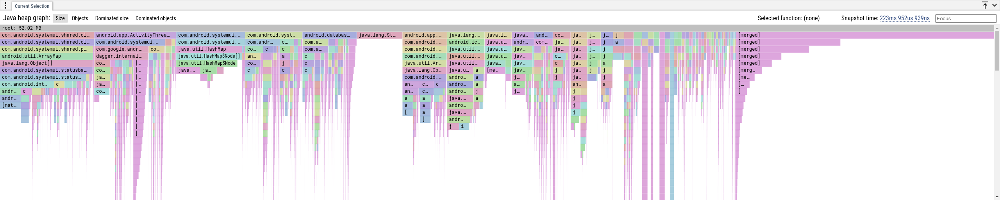
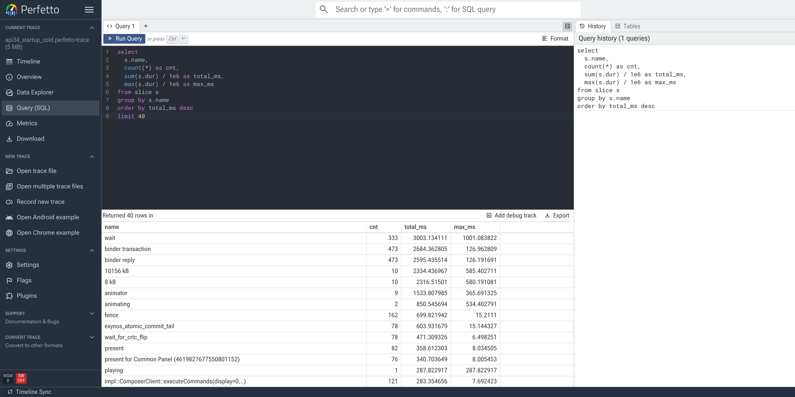
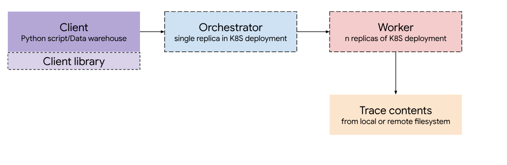

A single unregistered callback in an Android app can quietly pin an entire destroyed `Fragment`, its view hierarchy, and tens of megabytes of decoded `Bitmap` buffers in memory. Do that a few times across navigation transitions and a smooth experience turns into aggressive garbage collection pauses, background process kills (`lmkd`), or an outright `OutOfMemoryError`.

Every complex, asynchronous application encounters memory leaks sooner or later. Modern Android apps juggle overlapping lifecycles: Activities, Fragments, Compose UI trees, ViewModels, coroutine scopes, hardware callbacks, and window-level observers. When any two of those lifecycles fall out of sync, memory stays reachable long after its work is done.

At Google, I work on Android platform system health. To keep our own applications and the broader Android ecosystem fast and reliable, my colleagues and I built a comprehensive suite of memory profiling and analysis tools directly into [Perfetto](https://perfetto.dev), and we open-sourced the entire stack so every developer can use the exact same workflows.

In this post, I will walk through how to hunt down Android memory leaks across four complementary layers of the Perfetto ecosystem:

1. **Capturing heap profiles** on any Android device with zero app code changes.
2. **Interactive visual forensics** in the Perfetto Web UI using the Heap Dump Explorer, dominator flamegraphs, and bitmap metadata inspectors.
3. **Programmatic analysis with PerfettoSQL**, from ad-hoc queries in the browser to automated local CI checks with `trace_processor` and fleet-wide analysis across thousands of traces with **BigTrace**.
4. **Agentic root-cause analysis** using the open-source **Perfetto AI Skill**, where coding agents combine heap graph queries with repository-wide code search and automated test generation to diagnose, fix, and verify memory leaks end to end.

## What makes Perfetto different as a heap analyzer

If you have debugged Java memory leaks before, you have likely used standard JVM `.hprof` snapshots. Traditional HPROF dumps serialize every primitive field and byte array payload in the process, producing massive files that are slow to transfer and disconnected from what the rest of the operating system was doing when memory spiked. (If you want a refresher on how Android and the Linux kernel account for virtual memory areas, anonymous pages, RSS, PSS, and swap, see the [Debugging memory usage on Android case study](https://perfetto.dev/docs/case-studies/memory).)

Perfetto approaches memory analysis differently:

* **Lightweight reference graphs ([`android.java_hprof`](https://perfetto.dev/docs/data-sources/java-heap-profiler)):** Rather than dumping raw primitive contents, Perfetto's ART heap profiler records the complete **object retention graph**: every live Java/Kotlin object, its class, its shallow size, its native allocation size (via `libcore.util.NativeAllocationRegistry`), and the exact named member fields connecting owners to referents. Because no string payloads or pixel buffers leave the process, it is fast, privacy-safe, and works on non-debuggable builds. (When you do need full primitive/bitmap pixel contents on a debuggable build, Perfetto also imports standard ART `.hprof` files.)
* **Unified timeline context ([Memory Counters](https://perfetto.dev/docs/data-sources/memory-counters)):** Because a heap snapshot is just one data source in a Perfetto trace, you can correlate object retention directly against kernel memory counters (`anon_rss`, `swap`, `oom_score_adj`), CPU scheduling slices, GC pauses, and app lifecycle events on the exact same timeline.
* **Java and Native ([`heapprofd`](https://perfetto.dev/docs/data-sources/native-heap-profiler)) under one roof:** Android memory pressure frequently crosses the JNI boundary. A tiny 64-byte Kotlin wrapper object might retain a 24 MB native hardware buffer. Perfetto lets you inspect both ART object retention graphs and [native C/C++ callstack allocations or ART allocation profiles](https://perfetto.dev/docs/getting-started/memory-profiling) in a single tool.

## Anatomy of real-world Android memory leaks

Before opening a trace, it helps to recognize the structural patterns that cause memory leaks in production Android code. Across hundreds of investigations, almost every memory issue falls into one of six recurring engineering patterns.

### Lifecycle mismatch in callback registries

Short-lived UI components frequently register callbacks on longer-lived registries without binding the registration to their own lifecycle.

```kotlin
// LEAK: Registered on the Activity's registry without passing a LifecycleOwner.
// The Activity outlives the Fragment and retains the callback (and Fragment) indefinitely.
class PhotoAttachmentLauncher(private val fragment: Fragment) {
  private lateinit var launcher: ActivityResultLauncher<String>

  fun init() {
    launcher = fragment.requireActivity().activityResultRegistry.register(
      "pick_photo", ActivityResultContracts.GetContent(), ::onPhotoPicked
    )
  }
}
```

In Kotlin and Java, method references (`::onPhotoPicked`) and lambdas implicitly capture their enclosing `this` reference (`PhotoAttachmentLauncher`), which in turn holds a strong reference to the destroyed `Fragment` and its entire view hierarchy.

```kotlin
// FIX: Use the Fragment's lifecycle-aware registration API so the callback
// is automatically unregistered when the Fragment is destroyed.
class PhotoAttachmentLauncher(private val fragment: Fragment) {
  private val launcher = fragment.registerForActivityResult(
    ActivityResultContracts.GetContent(), ::onPhotoPicked
  )
}
```

*The example code above was inspired by a real bug in Google Messages that our engineers found with Perfetto.*

### Window-root vs. local view scope mismatches

A subtle variation occurs when helper functions attach listeners to window-level roots, such as `activity.window.decorView` or a window-shared `ViewTreeObserver`, to update a short-lived child view or `Fragment`.

```kotlin
// LEAK: decorView lives as long as the Activity, retaining the listener lambda
// which captures 'this' (a short-lived RecyclerView inside a Fragment).
fun View.applyNavigationBarPadding(decorView: View) {
  ViewCompat.setOnApplyWindowInsetsListener(decorView) { _, insets ->
    updatePadding(bottom = insets.getInsets(WindowInsetsCompat.Type.navigationBars()).bottom)
    insets
  }
}
```

Attaching the listener directly to the target `View` (or removing window-level observers inside `view.doOnDetach { ... }`) ensures the callback's lifetime never exceeds the view it updates:

```kotlin
// FIX: Scope the insets listener directly to the target view.
fun View.applyNavigationBarPaddingSafe() {
  ViewCompat.setOnApplyWindowInsetsListener(this) { _, insets ->
    updatePadding(bottom = insets.getInsets(WindowInsetsCompat.Type.navigationBars()).bottom)
    insets
  }
}
```

*Based on a real leak in YouTube.*

### Unbounded asset retention in long-lived listeners

When a component registers itself with a long-lived service or singleton cache and stores decoded `Bitmap` instances without an eviction ceiling or lifecycle teardown, a small structural leak quickly balloons into hundreds of megabytes.

```kotlin
// FIX: Implement Closeable (or bind to Lifecycle) to unregister listeners
// and release heavy graphics buffers immediately on teardown.
class ThemePreviewController(
  private val themeService: ThemeService
) : Closeable {
  private var previews: List<Bitmap> = emptyList()

  init {
    themeService.addListener(this)
  }

  override fun close() {
    themeService.removeListener(this)
    previews = emptyList()
  }
}
```

*Based on a real leak in the Pixel Watch companion app.*

### Cancelled asynchronous teardowns

One of the trickiest modern Kotlin leaks happens when cleanup code is launched inside a coroutine scope that gets cancelled at the exact same moment:

```kotlin
// LEAK: When the Fragment is destroyed, uiScope is cancelled immediately.
// The launched coroutine is aborted before cameraController.unbind() executes!
fun onClose() {
  uiScope.launch {
    cameraController?.unbind()
  }
}
```

Because `uiScope` is cancelled as part of teardown, the cleanup coroutine throws `CancellationException` before `unbind()` runs, leaving hardware buffers and preview surfaces pinned in memory. Wrapping critical teardown work in `NonCancellable` guarantees completion:

```kotlin
// FIX: Run asynchronous teardown under NonCancellable so cleanup finishes
// even when the parent UI scope is being cancelled.
fun onClose() {
  uiScope.launch(NonCancellable) {
    cameraController?.unbind()
  }
}
```

*Based on a real leak in Google Camera.*

### Executor queue backlogs and reactive allocation churn

Not every memory spike is a permanent reference leak:

* **Executor queue bloat:** When slow disk or database I/O blocks a single-threaded executor, thousands of pending lambdas accumulate in unbounded task queues, retaining every string or context captured in their closures. Using bounded queues (`LinkedBlockingQueue(capacity)`) and isolating slow I/O onto dedicated pools prevents runaway heap growth. *(Based on a real issue in Google Photos.)*
* **Reactive stream churn:** Chaining multi-step collection transformations (`list.filter { ... }.groupBy { ... }.mapValues { ... }`) inside high-frequency Kotlin `Flow` emissions allocates dozens of intermediate lists and maps per frame. Flattening hot paths into single-pass loops and caching decoded immutable models eliminates hundreds of megabytes of hourly garbage collection churn. *(Based on a real issue in Google Home.)*

## Three ways to capture heap profiles with Perfetto

You do not need to modify your app's build files or add runtime dependencies to capture a heap profile. Perfetto provides three ways to record memory snapshots depending on your workflow (see [Recording Android traces locally](https://perfetto.dev/docs/getting-started/local-android-trace-recording) for the full cookbook).

### Quick capture with official CLI helper scripts

The fastest way to capture a Java heap dump or native heap profile from a connected Android device is with the standalone helper scripts in the [Perfetto repository](https://github.com/google/perfetto/tree/main/tools):

```bash
# Download the official helper scripts
curl -O https://raw.githubusercontent.com/google/perfetto/main/tools/java_heap_dump
curl -O https://raw.githubusercontent.com/google/perfetto/main/tools/heap_profile
chmod +x java_heap_dump heap_profile

# 1. Capture an ART Java/Kotlin heap graph snapshot
./java_heap_dump -n com.example.myapp -o ./heap_dump.perfetto-trace

# 2. Or profile C/C++ native heap allocations (heapprofd)
./heap_profile -n com.example.myapp -o ./native_profile_dir
```

You can also pass `--wait-for-oom` to `java_heap_dump` to automatically capture a snapshot at the exact moment an `OutOfMemoryError` is thrown (see the [OOM heap dump guide](https://perfetto.dev/docs/getting-started/local-android-trace-recording#oom-heap-dump)).

### Browser-based recording and live monitoring with Memscope

If you prefer a graphical workflow:

1. Open [ui.perfetto.dev](https://ui.perfetto.dev) in Chrome or Edge and click **Record new trace** in the left sidebar.
2. Connect your Android device via WebUSB or ADB.
3. Under **Memory**, enable **Java heap dumps** (and optionally **Native heap profiling**) and enter your target package name (for example, `com.example.myapp`).
4. Click **Start Recording**, exercise the user journey in your app, and let the trace open automatically in the browser.

If you are not yet sure *which* process is leaking, try [**Memscope**](https://perfetto.dev/docs/visualization/memscope) in the Perfetto sidebar: it connects to your device over WebUSB, displays live per-process `anon_rss + swap` sparklines in real time, and lets you click **Profile** on any growing process to record periodic ART heap dumps, `smaps` snapshots, and native heap profiles with a single click.

### Custom multi-source TraceConfig for timeline correlation

When investigating complex regressions, you often want a heap dump *plus* continuous process RSS, swap, and `/proc/[pid]/smaps` counters in the same trace. You can combine `android.java_hprof` with `linux.process_stats` in a single `.pftxt` [trace configuration](https://perfetto.dev/docs/concepts/config):

```protobuf
buffers: {
  size_kb: 65536
  fill_policy: DISCARD
}

# Periodically record RSS, swap, and oom_score_adj for timeline correlation
data_sources: {
  config {
    name: "linux.process_stats"
    process_stats_config {
      scan_all_processes_on_start: true
      proc_stats_poll_ms: 250
    }
  }
}

# Capture the ART Java/Kotlin object retention graph + smaps breakdown
data_sources: {
  config {
    name: "android.java_hprof"
    java_hprof_config {
      process_cmdline: "com.example.myapp"
      dump_smaps: true
    }
  }
}

duration_ms: 10000
```

Record the combined trace with `record_android_trace`:

```bash
curl -O https://raw.githubusercontent.com/google/perfetto/main/tools/record_android_trace
chmod +x record_android_trace
./record_android_trace -c memory_config.pftxt -o combined_memory.perfetto-trace
```

## Interactive visual forensics in the Perfetto Web UI

When you open a trace containing a Java heap dump in [ui.perfetto.dev](https://ui.perfetto.dev), Perfetto surfaces memory data in two places: on the timeline tracks and inside the dedicated [**Heap Dump Explorer**](https://perfetto.dev/docs/visualization/heap-dump-explorer) (as well as the [**Memory Overview**](https://perfetto.dev/docs/visualization/memscope#memory-overview-post-hoc-memory-triage) page if your trace includes `smaps` snapshots).

### Finding the heap snapshot on the timeline

In the timeline view, expand your application's process track group. You will see an **ART heap dump** track containing a diamond marker for each captured snapshot:



Clicking any diamond marker opens the interactive flamegraph panel for that exact point in time.

### Reading the Heap Dump Explorer and Flamegraph

The [**Heap Dump Explorer**](https://perfetto.dev/docs/visualization/heap-dump-explorer) (accessible from the left sidebar or via **Open in Heapdump Explorer** on any flamegraph node) combines Overview, Flamegraph, Classes, Objects, Dominators, Bitmaps, Strings, Arrays, and OOM Callstack tabs in one workspace:



When reading a heap flamegraph in Perfetto, keep three key concepts in mind:

* **Self Size vs. Dominated (Retained) Size:** If you sort raw heap objects by *Object Size* along shortest paths, the top entries in almost every Android app will be `byte[]`, `java.lang.String`, `int[]`, and `java.lang.Object[]`. That tells you *what* the bytes are made of, not *why* they are alive. Switching the metric dropdown to **Dominated Object Size** reorganizes the flamegraph around the [dominator tree](https://perfetto.dev/docs/visualization/heap-dump-explorer#dominators) so that each node's width represents the exact memory that would be freed if that object became unreachable.
* **Spotting the "Leak Column" (and pivoting on suspects):** In a healthy heap, retained memory fans out broadly across independent subsystems. In a memory leak, you will see a tall, un-narrowing column descending from a GC root (such as `ViewRootImpl`, an `ActivityResultRegistry`, or a static singleton) straight into dozens of retained `Fragment`, `View`, or custom controller instances. You can also use the filter bar (`SS:` to show matching stacks, `HF: java.lang.Object[]` to collapse container noise, or `P: MyClass` to [pivot the flamegraph](https://perfetto.dev/docs/visualization/heap-dump-explorer#pivot) around a specific class):



* **Native size (`[native]`) and Bitmap inspection:** On Android 13 and higher, Perfetto automatically extracts native allocations registered via `NativeAllocationRegistry` and displays them as `[native]` child nodes in the flamegraph. In the Heap Dump Explorer's [Bitmaps gallery](https://perfetto.dev/docs/visualization/heap-dump-explorer#bitmaps), you can also inspect decoded `android.graphics.Bitmap` dimensions, duplicate content hashes, and retention paths directly to see whether retained views are holding onto oversized image assets.

## Querying heap graphs at any scale with PerfettoSQL

Visual flamegraphs are great for interactive exploration, but sometimes you need exact numbers, custom filtering, or automated regression checks. Every heap dump loaded into Perfetto is backed by a relational SQLite engine powered by [**PerfettoSQL**](https://perfetto.dev/docs/analysis/perfetto-sql-getting-started) and the [Perfetto Standard Library](https://perfetto.dev/docs/analysis/stdlib-docs) (see the [Analyzing Android Traces cookbook](https://perfetto.dev/docs/getting-started/android-trace-analysis#memory-metrics) for additional process memory recipes).

You can run these queries interactively in the browser by clicking **Query (SQL)** in the left sidebar of `ui.perfetto.dev`:



### Four essential PerfettoSQL queries for memory leak hunting

#### Orienting: Heap size vs. process RSS and swap

Start by checking how many heap snapshots exist in the trace, how much of the Java heap is actually reachable from GC roots, and how the Java heap compares to total process `anon_rss_and_swap`:

```sql
INCLUDE PERFETTO MODULE android.memory.heap_graph.heap_graph_stats;

SELECT
  upid,
  graph_sample_ts,
  total_heap_size / (1024 * 1024) AS total_heap_mb,
  reachable_heap_size / (1024 * 1024) AS reachable_heap_mb,
  total_obj_count,
  reachable_obj_count,
  anon_rss_and_swap_size / (1024 * 1024) AS anon_rss_and_swap_mb,
  oom_score_adj
FROM android_heap_graph_stats
ORDER BY graph_sample_ts;
```

#### Finding classes that dominate retained memory

Instead of grouping by raw `self_size`, use `android.memory.heap_graph.class_summary_tree` to compute the cumulative retained memory (`cumulative_size`) dominated by each class along the shortest-path tree from GC roots:

```sql
INCLUDE PERFETTO MODULE android.memory.heap_graph.class_summary_tree;

SELECT
  name AS class_name,
  root_type,
  self_count,
  self_size / 1024 AS self_kb,
  cumulative_count,
  cumulative_size / (1024 * 1024) AS retained_mb
FROM android_heap_graph_class_summary_tree
ORDER BY cumulative_size DESC
LIMIT 25;
```

#### Pinpointing exact leak instances in the dominator tree

Once you spot a suspicious class (or want to find the single object instance dominating the most memory in the entire process), query `android.memory.heap_graph.dominator_tree`:

```sql
INCLUDE PERFETTO MODULE android.memory.heap_graph.dominator_tree;

SELECT
  d.id AS object_id,
  c.name AS class_name,
  d.dominated_obj_count,
  d.dominated_size_bytes / (1024 * 1024.0) AS dominated_mb,
  d.depth,
  d.idom_id AS immediate_dominator_id
FROM heap_graph_dominator_tree d
JOIN heap_graph_object o ON d.id = o.id
JOIN heap_graph_class c ON o.type_id = c.id
ORDER BY d.dominated_size_bytes DESC
LIMIT 20;
```

#### Inspecting the exact field holding a reference alive

To see *which exact field name* on a parent object (`owner_id`) retains a leaked child object (`owned_id`), query `heap_graph_reference`:

```sql
SELECT
  r.owner_id,
  oc.name AS owner_class,
  r.field_name,
  r.owned_id AS referent_id,
  rc.name AS referent_class,
  ro.self_size
FROM heap_graph_reference r
JOIN heap_graph_object oo ON r.owner_id = oo.id
JOIN heap_graph_class oc ON oo.type_id = oc.id
JOIN heap_graph_object ro ON r.owned_id = ro.id
JOIN heap_graph_class rc ON ro.type_id = rc.id
WHERE rc.name LIKE '%MyLeakedFragment%';
```

This immediately reveals whether the retaining reference is an anonymous synthetic lambda capture (`this$0`), a listener list (`mOnPreDrawListeners`), or a static map entry.

### Automating local & CI checks with `trace_processor`

Because the exact same SQL engine ships as a standalone command-line binary ([`trace_processor` CLI](https://perfetto.dev/docs/reference/trace-processor-cli)) and a Python package ([Trace Processor Python API](https://perfetto.dev/docs/analysis/trace-processor-python) and [Batch Trace Processor](https://perfetto.dev/docs/analysis/batch-trace-processor) via `pip install perfetto`), you can run these queries automatically in local scripts or CI integration tests:

```bash
# Run a PerfettoSQL leak check directly from the command line
trace_processor_shell -q check_leaks.sql ./heap_dump.perfetto-trace
```

Or in Python as part of an automated UI test suite:

```python
from perfetto.trace_processor import TraceProcessor

with TraceProcessor(trace='heap_dump.perfetto-trace') as tp:
  df = tp.query('''
    INCLUDE PERFETTO MODULE android.memory.heap_graph.class_summary_tree;
    SELECT name, cumulative_size
    FROM android_heap_graph_class_summary_tree
    WHERE name LIKE 'com.example.myapp.%'
    ORDER BY cumulative_size DESC
    LIMIT 10;
  ''').as_pandas_dataframe()
  print(df)
```

### Warehouse-scale fleet analysis with BigTrace

What if you have 10,000 traces collected from automated lab devices or field telemetry and want to know which classes leak most often across your entire user base?

Downloading 10,000 multi-megabyte trace files to a single machine is slow and impractical. That is why we built and open-sourced **BigTrace** inside the Perfetto repository.



At Google, we use this approach to turn individual heap profiles into clusters of leaks. Grouping fleet-wide snapshots by their retaining dominator chains helps us identify common root causes and decide which issues to address first, ranked by incident count and estimated memory impact.

BigTrace distributes trace processing across a stateless cluster of `trace_processor` workers orchestrated over gRPC, deployable [locally on a single machine with Docker](https://perfetto.dev/docs/deployment/deploying-bigtrace-on-a-single-machine) or [at cluster scale on Kubernetes](https://perfetto.dev/docs/deployment/deploying-bigtrace-on-kubernetes) with traces stored in cloud object storage, and integrable with analytical engines like ClickHouse. Using the open-source Python client (`perfetto.bigtrace.api`), you can execute a single PerfettoSQL query across thousands of remote traces in seconds and aggregate the results directly into a Pandas DataFrame:

```python
import perfetto.bigtrace.api

client = perfetto.bigtrace.api.Bigtrace(orchestrator_address="127.0.0.1:5051")

traces = [
    "/gcs/my-trace-bucket/o/trace_0001.perfetto-trace",
    "/gcs/my-trace-bucket/o/trace_0002.perfetto-trace",
    # ... thousands of traces in cloud storage
]

query = """
INCLUDE PERFETTO MODULE android.memory.heap_graph.class_summary_tree;

SELECT
  name AS class_name,
  MAX(cumulative_size) AS peak_retained_bytes
FROM android_heap_graph_class_summary_tree
WHERE cumulative_size > 10 * 1024 * 1024
GROUP BY name;
"""

fleet_df = client.query(traces=traces, sql_query=query)
print(
    fleet_df.groupby("class_name")["peak_retained_bytes"]
    .agg(["count", "mean", "max"])
    .sort_values(by="max", ascending=False)
)
```

## Supercharging leak investigations with AI and the Perfetto Skill

Even with great visualizers and SQL tables, root-causing a memory leak traditionally requires context-switching between two separate worlds:

1. **The trace world** (Perfetto UI / SQL), which tells you *what* object graph is alive (`ActivityResultRegistry$3` -> `PhotoAttachmentLauncher$$ExternalSyntheticLambda0` -> `PhotoAttachmentLauncher` -> `ComposeMessageFragment`).
2. **The source code world** (your IDE and git repository), which tells you *why* that reference was created, what lifecycle callbacks exist, and how to fix it safely without breaking feature behavior.

To bridge those two worlds, Perfetto ships an official open-source **[agentskills.io](https://agentskills.io) skill for AI coding agents** (supporting Claude Code, Codex, OpenCode, Cursor, Antigravity, and any agent that reads `SKILL.md` workflows; see the [Cookbook: Using AI with Perfetto](https://perfetto.dev/docs/getting-started/using-ai) and [AI memory debugging workflows](https://perfetto.dev/docs/getting-started/android-trace-analysis#using-ai)).

You can install it in one command:

```bash
# Claude Code
/plugin marketplace add google/perfetto@ai-agents

# Or install into any coding agent directory
curl -fsSL https://get.perfetto.dev/agents-install | python3 - --target .claude/skills
```

The skill bundles a `trace_processor` wrapper along with battle-tested workflows for single-dump dominator triage (`heap_dump.md`), duplicate object/caching optimization (`heap_dump_caching_optimizer.md`), and multi-trace fleet clustering (`heap_dump_cluster.md`). Because the AI agent runs right inside your development workspace, it can query the Perfetto trace, read your Kotlin/Java source files, edit the buggy class, and run unit tests to verify its own fix.

Here are three real-world examples of what this looks like in practice.

### Example 1: Tracing a heap dump leak straight to the source file and fixing it

In this conversation, a developer points their coding agent at a captured `.perfetto-trace` file and asks why memory grows every time the photo picker opens and closes:

> **Developer:**
> I recorded a heap dump at `./traces/photo_picker_leak.perfetto-trace` after opening and dismissing the attachment sheet 5 times. Can you check if we're leaking memory and find where in our codebase it's coming from?
>
> **Agent:**
> I'll analyze `./traces/photo_picker_leak.perfetto-trace` using the Perfetto heap dump triage workflow.
>
> *[Tool Call: Runs `trace_processor` with `triage_dominator_path.sql` and `heap_graph_reference` queries]*
>
> **Heap Dump Findings (`com.example.chatapp`, sampled at `t = 14.82s`):**
> * **Total Reachable Java Heap:** `194.6 MB` (`anon_rss_and_swap`: `312.4 MB`)
> * **Primary Dominator Bottleneck:** `androidx.activity.result.ActivityResultRegistry$3` dominates **142.3 MB** across **5 destroyed instances** of `com.example.chatapp.composer.AttachmentSheetFragment`.
> * **Exact Reference Chain (`heap_graph_reference`):**
>   ```text
>   [ROOT_STICKY_CLASS] MainActivity
>     └── mActivityResultRegistry (ActivityResultRegistry)
>          └── mKeyToCallback (HashMap)
>               └── PhotoAttachmentLauncher$$ExternalSyntheticLambda0 (this$0)
>                    └── PhotoAttachmentLauncher.fragment
>                         └── AttachmentSheetFragment (5 instances, retaining 142.3 MB)
>   ```
>
> *[Tool Call: Searches workspace repository for `class PhotoAttachmentLauncher`]*
>
> **Root Cause in Source Code:**
> Found in `app/src/main/java/com/example/chatapp/composer/PhotoAttachmentLauncher.kt:27`:
> ```kotlin
> launcher = fragment.requireActivity().activityResultRegistry.register(
>   "attachment_picker",
>   ActivityResultContracts.GetContent(),
>   ::onAttachmentSelected
> )
> ```
> Because `register(key, contract, callback)` is called on `requireActivity().activityResultRegistry` **without passing `fragment` as the `LifecycleOwner`**, the callback lambda (`::onAttachmentSelected`) stays registered in `MainActivity.mActivityResultRegistry.mKeyToCallback` for the entire lifetime of `MainActivity`. Each time `AttachmentSheetFragment` is dismissed and recreated, another `Fragment` instance and its decoded thumbnail `Bitmap` cache (~28.4 MB per instance) are pinned in memory.
>
> **Proposed Fix:**
> Pass `fragment` as the `LifecycleOwner` (or use `fragment.registerForActivityResult(...)`) so `ActivityResultRegistry` automatically removes the callback when `fragment.lifecycle` reaches `DESTROYED`:
> ```kotlin
> launcher = fragment.requireActivity().activityResultRegistry.register(
>   "attachment_picker",
>   fragment, // Automatically unregisters on Fragment ON_DESTROY
>   ActivityResultContracts.GetContent(),
>   ::onAttachmentSelected
> )
> ```
> Would you like me to apply this change to `PhotoAttachmentLauncher.kt`?

### Example 2: Catching a cancelled coroutine teardown and writing the regression test

Even more powerfully, an agent can connect a heap graph retention signature to a subtle concurrency bug, and then **write and execute a unit test** to prove the bug is fixed.

> **Developer:**
> We have an intermittent leak in `./traces/camera_preview_leak.perfetto-trace` where `CameraPreviewController` and its surface buffers stay alive after swiping back from the scanner screen. Why didn't our `onClose()` cleanup release it? Can you fix it and write a unit test that reproduces the race?
>
> **Agent:**
> Let me inspect the retention chain for `CameraPreviewController` in `./traces/camera_preview_leak.perfetto-trace` and cross-reference it with `onClose()` in your source tree.
>
> *[Tool Call: Queries `android_heap_graph_class_summary_tree` and `heap_graph_reference` via `trace_processor`]*
> *[Tool Call: Views `app/src/main/java/com/example/scanner/CameraPreviewController.kt`]*
>
> **Diagnosis: Aborted Asynchronous Teardown**
> 1. **In the Perfetto trace:** `CameraPreviewController` retains **64.8 MB** (including `[native]` hardware buffer references). It is still registered as an active frame listener inside `CameraSessionManager.activeListeners`.
> 2. **In `CameraPreviewController.kt:84`:**
>    ```kotlin
>    fun onClose() {
>      uiScope.launch {
>        cameraSessionManager.unbind(this@CameraPreviewController)
>      }
>    }
>    ```
> 3. **Why it leaks:** `ScannerFragment.onDestroyView()` calls `controller.onClose()` and immediately cancels `uiScope` on the next line. Because `uiScope.launch { ... }` is dispatched asynchronously, the parent scope is cancelled *before* the coroutine body starts executing. The coroutine aborts with `CancellationException`, so `cameraSessionManager.unbind(...)` never runs.
>
> *[Tool Call: Edits `CameraPreviewController.kt` to wrap cleanup in `withContext(NonCancellable)`]*
> *[Tool Call: Creates `app/src/test/java/com/example/scanner/CameraPreviewControllerTest.kt` using `kotlinx-coroutines-test`]*
> *[Tool Call: Runs `./gradlew :app:testDebugUnitTest --tests "com.example.scanner.CameraPreviewControllerTest"`]*
>
> **Fix & Regression Test Verified:**
> 1. Updated `CameraPreviewController.onClose()` to execute cleanup under `NonCancellable`:
>    ```kotlin
>    fun onClose() {
>      uiScope.launch(NonCancellable) {
>        cameraSessionManager.unbind(this@CameraPreviewController)
>      }
>    }
>    ```
> 2. Added `CameraPreviewControllerTest.unbindCompletesEvenWhenUiScopeIsImmediatelyCancelled`:
>    ```kotlin
>    @Test
>    fun unbindCompletesEvenWhenUiScopeIsImmediatelyCancelled() = runTest {
>      val fakeSessionManager = FakeCameraSessionManager()
>      val uiScope = CoroutineScope(StandardTestDispatcher(testScheduler) + Job())
>      val controller = CameraPreviewController(fakeSessionManager, uiScope)
>
>      // Trigger close and immediately cancel the UI scope before advancing dispatchers
>      controller.onClose()
>      uiScope.cancel()
>      advanceUntilIdle()
>
>      assertThat(fakeSessionManager.unboundControllers).containsExactly(controller)
>    }
>    ```
> 3. Executed `:app:testDebugUnitTest`: **PASS** (verified the test fails without `NonCancellable` and passes with the fix).

At Google, we use this workflow as a grounding approach. An agent may identify a memory leak from analyzing a heap profile, write a test to reproduce the leak, run the test and examine the resulting heap profile to confirm that the test reproduced the issue, and then use the exact same test as a regression test for its proposed fix. After passing all of these grounding steps autonomously, the agent notifies a human reviewer of the issue, presenting a high-confidence analysis and a patch with test coverage. Agents can follow Test-Driven Development too!

### Example 3: Clustering 50 heap dumps to find the top leak signatures across a release

When triaging a batch of heap dumps from a test lab or beta dogfood population, inspecting traces one by one is tedious. The Perfetto AI skill includes an automated clustering pipeline (`cluster_paths.py` + `summarize_clusters.py`) that extracts dominator paths across dozens of traces, normalizes dynamic instance counts, vectorizes paths using TF-IDF, selects the optimal cluster count $K$ via Silhouette scores, and collapses parent-child wrapper chains into clean root causes:

> **Developer:**
> I have 50 heap dump traces from our weekend UI stress test in `~/stress_test_dumps/`. Can you cluster the dominator paths across all 50 traces and tell me how many distinct memory leaks we actually have?
>
> **Agent:**
> I'll run the Perfetto fleet clustering workflow (`heap_dump_cluster.md`) across all 50 traces in `~/stress_test_dumps/`.
>
> *[Tool Call: Batch-extracts dominator paths from 50 traces using `triage_dominator_path.sql`]*
> *[Tool Call: Runs `cluster_paths.py` (TF-IDF + Silhouette-optimized K-Means) and `summarize_clusters.py`]*
>
> **Fleet Clustering Report (`50 traces`, Optimal $K = 3$, Silhouette Score: `0.84`):**
>
> Rather than 50 separate issues, all 50 heap dumps collapse into **3 distinct root-cause clusters**:
>
> | Cluster | Traces Affected | Avg Dominated Size | Collapsed Root Attribution Chain | Root Cause Hypothesis |
> | :--- | :--- | :--- | :--- | :--- |
> | **Cluster 1** | 29 / 50 (58%) | **88.4 MB** | `ViewRootImpl` -> `ViewTreeObserver` -> `TooltipOverlay$$ExternalSyntheticLambda1` -> `TooltipOverlay` | Unregistered `OnPreDrawListener` in `TooltipOverlay.kt` retaining detached view hierarchies. |
> | **Cluster 2** | 14 / 50 (28%) | **54.1 MB** | `MediaCacheSingleton` -> `LruCache` -> `VideoFrameBitmapWrapper` -> `android.graphics.Bitmap` | Un-evicted high-resolution preview bitmaps missing size-based `sizeOf()` override in `MediaCacheSingleton.kt`. |
> | **Cluster 3** | 7 / 50 (14%) | **31.7 MB** | `[ROOT_JNI_GLOBAL]` -> `NativeFrameProcessor` -> `byte[]` | JNI global reference (`NewGlobalRef`) allocated during video export without matching `DeleteGlobalRef` on error paths. |
>
> Would you like me to open the source files for Cluster 1 (`TooltipOverlay.kt`) and Cluster 2 (`MediaCacheSingleton.kt`) and prepare patches for both?

## Try it on your app today

Whether you are tracking down a single elusive `OutOfMemoryError` on your local device, building automated memory gates into CI, or analyzing thousands of traces across a fleet, Perfetto gives you an open, end-to-end toolkit that scales with your engineering needs:

* **Explore interactively:** Capture a heap snapshot with `./java_heap_dump` (or live via [Memscope](https://perfetto.dev/docs/visualization/memscope)) and inspect it in the [Heap Dump Explorer](https://perfetto.dev/docs/visualization/heap-dump-explorer) at [ui.perfetto.dev](https://ui.perfetto.dev).
* **Query programmatically:** Use the `android.memory.heap_graph.*` modules in [PerfettoSQL](https://perfetto.dev/docs/analysis/perfetto-sql-getting-started), the [Trace Processor Python API](https://perfetto.dev/docs/analysis/trace-processor-python), and distributed [BigTrace](https://perfetto.dev/docs/deployment/deploying-bigtrace-on-kubernetes).
* **Automate with AI:** Install the [Perfetto AI Skill](https://perfetto.dev/docs/getting-started/using-ai) in your favorite coding agent and let it connect trace dominator trees directly to your source code and test suite.

If you uncover an interesting leak pattern or build a new PerfettoSQL memory recipe, share it with the community on the [Perfetto GitHub Discussions](https://github.com/google/perfetto/discussions)!
