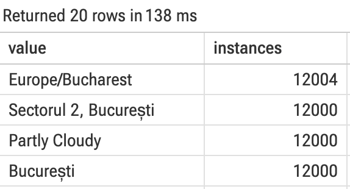
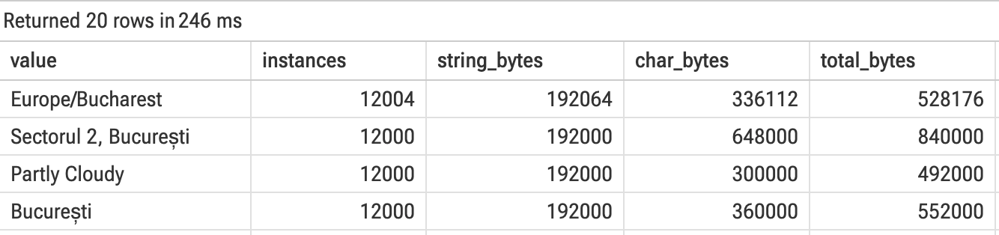
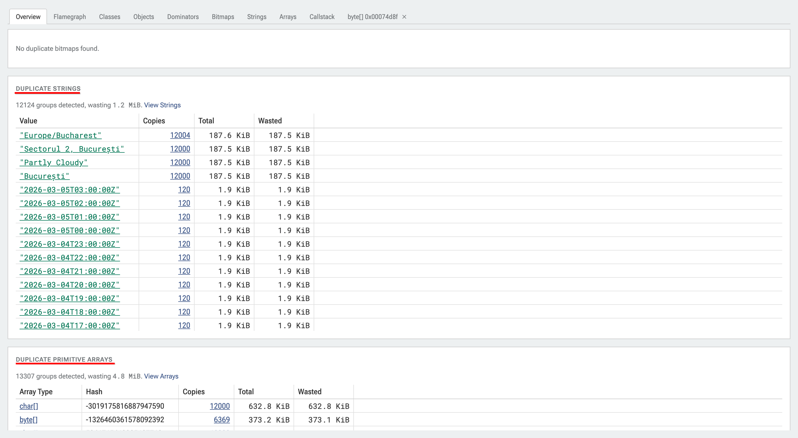
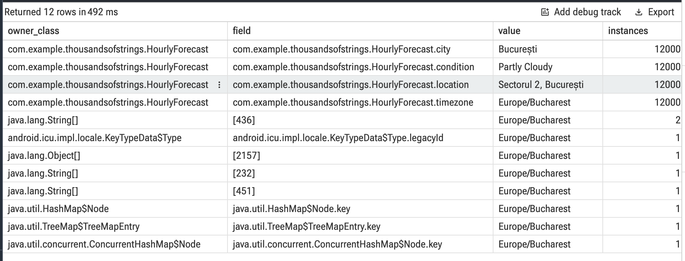
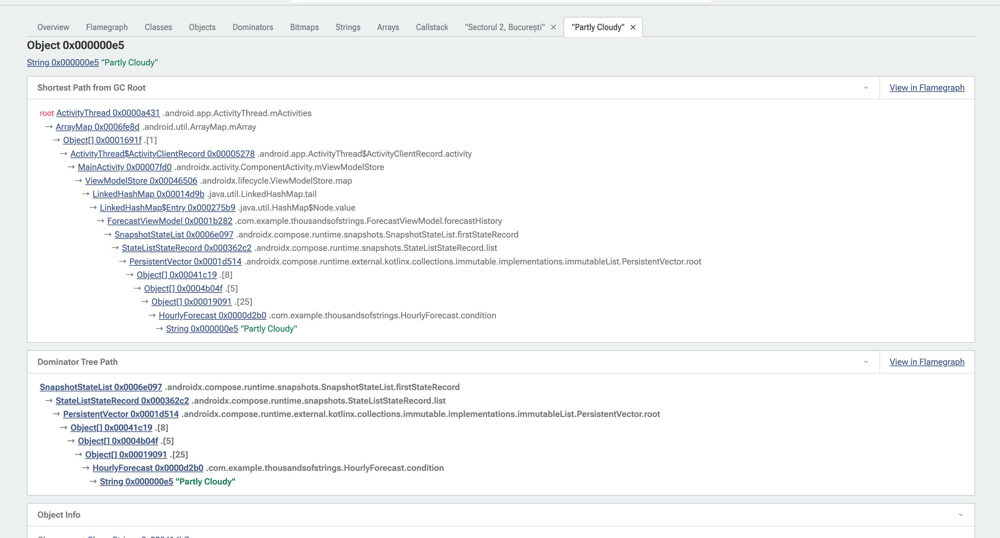
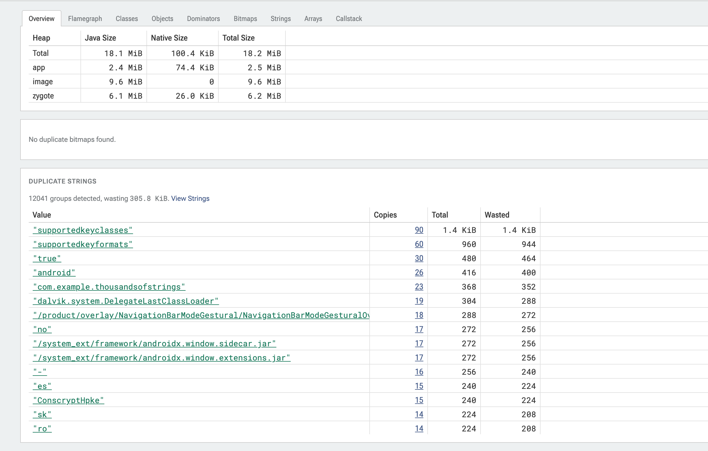
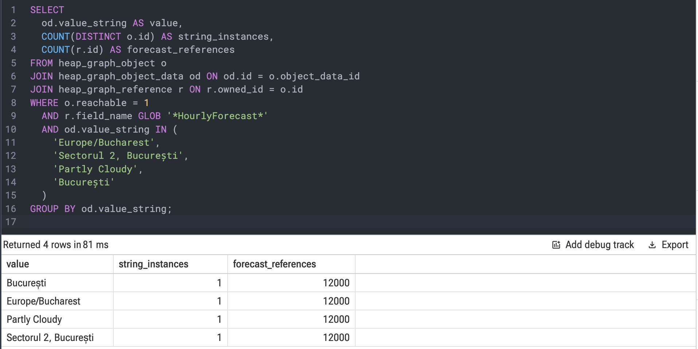

## Hiding in Plain Sight

If you've ever taken a heap dump of an Android app, you've almost certainly seen `java.lang.String` near the top: tens of thousands of instances, often more than any other class in your app.

Most of us shrug and move on. Modern apps are text-heavy by nature (user profiles, localized labels, API responses, URLs), so it's easy to treat a high String count as an unavoidable cost of doing business on Android. Unlike a leaked Activity or a massive Bitmap, Strings don't set off alarm bells. They blend into the background.

But what if those thousands of objects aren't actually unique data? What if your app is holding tens of thousands of identical copies of the exact same words?

Part of the reason this goes unnoticed is how heap data is usually browsed: class by class, instance by instance, sorted by size. Duplicated strings (repeated API values like "Partly Cloudy" or city names like "București") are small, so they sink to the bottom and end up scattered across thousands of separate rows. Duplication isn't a property of any single object. It only shows up when you group objects by what they contain, and an instance-by-instance view never does that.

Everything here comes from a sample app built for this post. It shows an hourly weather forecast of 100 rows and reloads it again and again, the way a real app would. The code is ordinary on purpose: a JSON payload, a data class, a list. Nothing in it looks wrong.

Yet a heap dump taken after a few minutes of use holds 61,752 `String` objects. Some of them are copies. The question is how many, and of what.

## Counting What the Instance View Won't

The heap dump has everything we need to find out. We just have to group the strings by value ourselves.

### Getting a heap dump you can query

There are two main ways to capture the ART/Java heap on Android:

1. **`am dumpheap`**, which writes a full `.hprof` heap dump.
2. **Perfetto's Java heap profiler** (see [Analyzing the Java Heap](https://perfetto.dev/docs/case-studies/memory#java-hprof)).

`am dumpheap` is slower and more expensive, but it captures the entire heap, including the contents of every field: string values, primitive arrays, and so on. Perfetto's heap profiler is faster and more lightweight, but it records only the shape of the heap graph (object sizes and retaining references), not the contents of the objects.

Perfetto's tools can open both. Finding duplicate strings means comparing their values, so we need option 1. All you need is a debuggable build. From the command line, dump and then pull:

```
adb shell am dumpheap <package-name> /data/local/tmp/dump.hprof
adb pull /data/local/tmp/dump.hprof
```

If you prefer your IDE's memory profiler, export the heap dump from there instead. Any `.hprof` works.

Then open the [Perfetto UI](https://ui.perfetto.dev/) and drag the file in.

Perfetto is probably familiar as a systrace viewer, but its trace processor also ingests ART heap dumps directly, and exposes them as SQL tables you can query in the browser. The whole thing runs client-side in WebAssembly, so the dump never leaves your machine.

### Grouping by value

Three tables do the work. heap\_graph\_object holds every object on the heap, with its size. heap\_graph\_class supplies each object's class name, so we can keep only the strings. heap\_graph\_object\_data holds the decoded contents, including the actual text of every java.lang.String.

Joining them lets you do the one thing the instance view won't: GROUP BY the string's value.

```sql
SELECT od.value_string AS value, COUNT(*) AS instances
FROM heap_graph_object o
JOIN heap_graph_class c ON o.type_id = c.id
JOIN heap_graph_object_data od ON od.id = o.object_data_id
WHERE c.name = 'java.lang.String'
  AND o.reachable = 1
  AND od.value_string IS NOT NULL
GROUP BY od.value_string
HAVING instances > 1
ORDER BY instances DESC
LIMIT 20;
```

Filtering by reachable ensures we only count strings that the application is actively holding alive.

Paste it into the **Query (SQL)** tab and hit run. The top of the result is four rows:



*Figure 1: Four values account for roughly 48,000 objects.*

That answers the question: roughly 48,000 of the 61,752 strings are copies of just four values. Every one is a separate allocation, and all were reachable when the dump was taken.

### What the duplication costs

The next step is to add `SUM(self_size)`. But every row comes back at exactly 16 bytes per instance. It stays 16 whether the string is 9 characters or 21\. That is the clue. In an HPROF dump, `self_size` measures only the `String` object header (its class pointer, lock word, `count`, and `hash`). To see the characters, you have to follow an object reference to a separate backing array.

> **Fun runtime detail:** In device memory, ART actually stores characters **inline** directly inside the `java.lang.String` allocation. If you inspect `s.charAt(i)` compiled with Android's dex2oat in [Compiler Explorer](https://godbolt.org/), the compiled ARM64 code reads directly from `[String_ptr + 16]` with zero pointer indirection. However, because the legacy JVM HPROF format cannot represent variable-length class instances, ART fabricates a synthetic `byte[]` or `char[]` primitive array when generating a heap dump so standard profiling tools can read it.

To count the characters in Perfetto, we follow that synthetic reference. It takes three more joins:

```sql
SELECT
  od.value_string AS value,
  COUNT(*) AS instances,
  SUM(o.self_size) AS string_bytes,
  SUM(arr.self_size) AS char_bytes,
  SUM(o.self_size + arr.self_size) AS total_bytes
FROM heap_graph_object o
JOIN heap_graph_class c ON o.type_id = c.id
JOIN heap_graph_object_data od ON od.id = o.object_data_id
JOIN heap_graph_reference r ON r.reference_set_id = o.reference_set_id
JOIN heap_graph_object arr ON arr.id = r.owned_id
JOIN heap_graph_class ac ON arr.type_id = ac.id
WHERE c.name = 'java.lang.String'
  AND od.value_string IS NOT NULL
  AND ac.name IN ('byte[]', 'char[]')
  AND o.reachable = 1
GROUP BY od.value_string
ORDER BY instances DESC
LIMIT 20;
```
Run it. The same four values, now with their character data:



*Figure 2: The same grouping, extended to follow each String to its character array.*

Now `total_bytes` shows the full cost: **2.3 MiB for four values**, just over three times the 750 KiB from the objects alone.&nbsp;

*Note: Notice that the 9-character string `"București"` costs more than the 13-character `"Partly Cloudy"`. Because `ș` is outside 7-bit ASCII, ART cannot use its 1-byte ASCII string compression and falls back to uncompressed UTF-16 (char\[\]) at 2 bytes per character for the entire string.*&nbsp;

None of this was hidden. All 48,000 objects were in the dump all along, thousands of rows apart. The data was there. The grouping was not.

### Letting Perfetto do the work

You don't have to write that SQL every time. Once a dump is loaded, click **Heapdump Explorer** in the sidebar. Its **Overview** tab groups duplicate strings by value for you.




*Figure 3: Heapdump Explorer Overview shows duplicate Strings*

The same four values, the same counts, in one click. The character arrays are here too, in a table of their own: **Duplicate Strings** counts the String objects, **Duplicate Primitive Arrays** counts the text. Nothing is missing. It is just split in two.

That split is why the query still earns its place. The arrays table labels each group with a content hash, so you cannot tell which string a given byte\[\] or char\[\] belongs to. Only the query puts a value and its full cost on the same line.

So where do 48,000 duplicate strings come from in an app that shows a hundred rows of weather?

## Why Strings Multiply

We know *what* the duplicate strings are, and we know what they cost. Next, we need to see what is holding them alive.

### Tracing the retainers

Earlier, we used `heap_graph_reference` to see **what each `String` points to** (its backing `byte[]` or `char[]`). To find out who owns the `String`, we flip the join to see **what points to each `String`** (`r.owned_id = o.id`):

```sql
SELECT
  owner_class.name AS owner_class,
  r.field_name AS field,
  od.value_string AS value,
  COUNT(*) AS instances
FROM heap_graph_object o
JOIN heap_graph_class c ON o.type_id = c.id
JOIN heap_graph_object_data od ON od.id = o.object_data_id
JOIN heap_graph_reference r ON r.owned_id = o.id
JOIN heap_graph_object owner ON r.owner_id = owner.id
JOIN heap_graph_class owner_class ON owner.type_id = owner_class.id
WHERE c.name = 'java.lang.String'
  AND o.reachable = 1
  AND od.value_string IN (
    'Europe/Bucharest',
    'Sectorul 2, București',
    'Partly Cloudy',
    'București'
  )
GROUP BY owner_class, field, value
ORDER BY instances DESC;
```


*Figure 4: Grouping the duplicate strings by their owning class and field.*

All 12,000 application copies trace back to the same class: `com.example.thousandsofstrings.HourlyForecast`, specifically its `city`, `condition`, `location`, and `timezone` fields. (The remaining rows at the bottom also explain why `"Europe/Bucharest"` had 12,004 instances in Figure 1 instead of 12,000: those extra 4 copies belong to Android's `android.icu` timezone tables.)

And if you want the full reference chain without writing SQL, you can click the `12000` link in the **Copies** column of Heapdump Explorer and click any instance to inspect its **Shortest Path from GC Root**:



*Figure 5: In Heapdump Explorer, clicking an instance shows its Shortest Path from GC Root, tracing straight through `ForecastViewModel.forecastHistory` down to `HourlyForecast.condition`.*

### The JSON trap

Why does `HourlyForecast` hold 12,000 separate copies of `"Partly Cloudy"` instead of pointing to a single shared `String`?

Look at the model and the payload:

```kotlin
@Serializable
data class HourlyForecast(
    val time: String,
    val timezone: String,
    val location: String,
    val city: String,
    val condition: String,
    val temp: Double
)
```

```json
[
  {
    "time": "2026-03-01T00:00:00Z",
    "timezone": "Europe/Bucharest",
    "location": "Sectorul 2, București",
    "city": "București",
    "condition": "Partly Cloudy",
    "temp": 15.0
  }
]
```

When you write `"Partly Cloudy"` as a literal in Kotlin code, the compiler places it into the DEX string pool. At runtime, ART interns it and every reference in your code shares that single heap instance.

**JSON parsers don't do that for string values.**

Whether you use `kotlinx.serialization`, Moshi, Gson, or Jackson, a JSON parser's job is to turn a stream of bytes into objects as fast as possible. While modern parsers like Moshi and Jackson are clever enough to avoid allocating new strings for repeated JSON keys like `"condition"`, they make no attempt to deduplicate string values. When the parser reads `"Partly Cloudy"` in the first object, it decodes those bytes from the buffer and allocates a fresh `String` on the heap. Moments later, when it reads `"Partly Cloudy"` on the second row, it has no memory of the first, so it allocates a brand-new `String` all over again.

### The math

In our sample app, `ForecastViewModel.forecastHistory` holds **12,000 `HourlyForecast` objects** in memory.

Because the JSON schema is flat, every hourly record carries the same `timezone` (`"Europe/Bucharest"`), `location` (`"Sectorul 2, București"`), `city` (`"București"`), and `condition` (`"Partly Cloudy"`). Since the parser allocates a fresh `String` for every value, each `HourlyForecast` instance brings **4 duplicate `String` allocations** along with it:

* **12,000** `HourlyForecast` objects × **4** repeated string fields \= **48,000 `String` allocations** (**2.3 MiB**)  
* Plus the 5th field, time: 100 distinct hourly timestamps × 120 reloads \= 12,000 more String allocations (the 120-copy rows just below the top four in Figure 3\)

Together, those 5 fields account for 60,000 of the 61,752 String instances in the dump.


This **`N objects × M repeated fields`** multiplier often shows up in production apps. It comes not from memory leaks, but from legitimate data held in memory:

* **Product catalogs & feeds:** Thousands of items repeating the same category names, brand names, currency codes (`"EUR"`), or availability labels (`"In Stock"`).  
* **Messaging & social timelines:** Thousands of cached messages repeating the same sender names, channel IDs, or delivery states (`"DELIVERED"`).  
* **Offline caches & sync tables:** Thousands of deserialized JSON records or Room entities holding repeated timezones, locale strings, or status enums stored as text.

Even if your app legitimately needs thousands of domain objects in memory, they shouldn't each own a separate copy of `"Partly Cloudy"`.

## Fixing It

We want all 12,000 `HourlyForecast` objects to share a single `String` instance per distinct value, without rewriting our UI or ViewModel.

Depending on whether you control the serializer, there are two ways to do this.

### Option 1: Deduplicating during JSON parsing

If you use `kotlinx.serialization` (or Moshi / Gson type adapters), the cleanest place to deduplicate is right inside the decoder, *before* the `HourlyForecast` instance is even constructed:

```kotlin
import androidx.collection.LruCache
import kotlinx.serialization.KSerializer
import kotlinx.serialization.Serializable
import kotlinx.serialization.builtins.serializer
import kotlinx.serialization.encoding.Decoder

object PooledStringSerializer : KSerializer<String> by String.serializer() {
    private val pool = LruCache<String, String>(256)

    override fun deserialize(decoder: Decoder): String {
        val value = decoder.decodeString()
        return synchronized(pool) {
           pool[value] ?: value.also { pool.put(it, it) }
        }
    }
}

// Shorthand on Kotlin 1.8.20+ (or annotate properties directly with @Serializable(with = ...)):
typealias PooledString = @Serializable(with = PooledStringSerializer::class) String
```

Then apply `PooledString` to the repeated string fields on your model:

```kotlin
@Serializable
data class HourlyForecast(
    val time: PooledString,
    val timezone: PooledString,
    val location: PooledString,
    val city: PooledString,
    val condition: PooledString,
    val temp: Double
)
```

Because `PooledString` resolves to `kotlin.String`, nothing in your ViewModel or Compose UI changes. And because deduplication happens before `HourlyForecast` is constructed, no extra wrapper objects are allocated. *(Note: `256` entries easily holds our 4 location/condition strings plus all hourly timestamp strings; if you share a serializer across multiple models in a large app, size the `LruCache` to fit your working set so one model doesn't evict another's strings.)*

### Option 2: Post-load deduplication (When you don't control the parser)

Sometimes you can't hook into the serializer, for example, when models come from a third-party SDK, a legacy parser, or generated code.

In that case, you can pass the parsed `HourlyForecast` list through a small `StringPool` right after loading (keeping in mind that `.copy()` allocates a new `HourlyForecast` per row, turning the original un-pooled instances and their duplicate strings into short-lived garbage for young-generation GC to clean up):

```kotlin
class StringPool(maxSize: Int = 256) {
    private val cache = LruCache<String, String>(maxSize)

    fun intern(value: String): String = synchronized(cache) {
       cache[value] ?: value.also { cache.put(it, it) }
    }
}

fun HourlyForecast.deduplicated(pool: StringPool) = copy(
    time = pool.intern(time),
    timezone = pool.intern(timezone),
    location = pool.intern(location),
    city = pool.intern(city),
    condition = pool.intern(condition)
)

// Reused in your repository/data source across loads:
private val stringPool = StringPool()

// Applied when loading from disk/network:
val forecasts = rawForecasts.map { it.deduplicated(stringPool) }
```

*(Tip: Use a bounded `LruCache` like `StringPool` above when the pool lives across multiple requests. If you only need to deduplicate within a single one-shot list, a local `val pool = HashMap<String, String>()` with `pool.getOrPut(s) { s }` is even lighter and is garbage-collected as soon as the function returns. And because `LruCache<T, T>` and `HashMap<T, T>` only rely on `equals()` and `hashCode()`, the exact same pattern works to deduplicate repeated immutable sub-objects (such as nested data classes or generated Protobuf messages), not just `String`s.)*

### `LruCache` vs. `String.intern()` on ART

You might wonder why `PooledStringSerializer` above uses an `LruCache` instead of calling Java's built-in `String.intern()` on every field. Both work on Android, but they have different runtime trade-offs:

* **What `String.intern()` gets right on ART:** Unlike a naive `static HashMap<String, String>` (which holds strong references), ART stores runtime-interned strings in a native **weak intern table** (`weak_interns_`). Once `forecastHistory` is cleared and nothing references `"Partly Cloudy"`, ART's garbage collector automatically sweeps it out of `weak_interns_` (`SweepInternTableWeaks`) and reclaims the memory. It also shares instances **process-wide** across every library and module in your app.  
* **The catch with `String.intern()` in tight loops:** Every call to `.intern()` transitions into native code (`@FastNative`) and acquires ART's process-wide mutex (`Locks::intern_table_lock_`). Interning 5 fields across 12,000 rows means **60,000 global lock acquisitions** (contending with class loading and other background threads) and adds entries that the GC must scan during weak-root sweeps.  
* **Why a scoped map or `LruCache` is faster for batch parsing:** A bounded `LruCache<String, String>` (or even simpler, a plain `HashMap<String, String>` created for a single JSON decode pass and discarded immediately after)  runs 100% in Kotlin memory with zero JNI overhead and zero global lock contention.

### Verifying the fix

After applying `PooledString` and capturing a new heap dump, we can open **Heapdump Explorer** in Perfetto to compare the **Overview** tab against **Figure 3**:



*Figure 6: Heapdump Explorer's Overview tab after deduplicating. Every weather and timestamp string has vanished from Duplicate Strings, leaving only small Android framework strings (`"supportedkeyclasses"`, `"true"`, `"android"`).*

To confirm that all 12,000 `HourlyForecast` objects are still in memory and now share a **single** `String` instance per value, we can run one final SQL check:

```sql
SELECT
  od.value_string AS value,
  COUNT(DISTINCT o.id) AS string_instances,
  COUNT(r.id) AS forecast_references
FROM heap_graph_object o
JOIN heap_graph_object_data od ON od.id = o.object_data_id
JOIN heap_graph_reference r ON r.owned_id = o.id
WHERE o.reachable = 1
  AND r.field_name GLOB '*HourlyForecast*'
  AND od.value_string IN (
    'Europe/Bucharest',
    'Sectorul 2, București',
    'Partly Cloudy',
    'București'
  )
GROUP BY od.value_string;
```

&nbsp;



*Figure 7: Every row now reports **`1` `string_instance`** and **`12,000` `forecast_references`**. All 12,000 `HourlyForecast` objects are pointing to the exact same four `String` addresses on the heap.*

### When not to deduplicate

Before you pool every string in your app, keep three guardrails in mind:

1. **Never pool truly unique strings:** In our forecast, `time` is quantized to whole hours (`"2026-03-05T03:00:00Z"`), so the same 100 distinct strings repeat across reloads. By contrast, if a field holds UUIDs, millisecond timestamps, search queries, or unique URLs where every row is different, pooling saves zero memory while paying the CPU and cache-eviction cost on every row.  
2. **Never use an unbounded strong map:** A `static ConcurrentHashMap<String, String>` that never evicts is a memory leak in disguise. Always use a bounded `LruCache`, a short-lived `HashMap` scoped to a single parse pass, or `String.intern()` (for low-volume **process-wide** strings).  
3. **Only optimize what stays reachable:** If a response is parsed, mapped to a small UI summary, and immediately discarded, short-lived duplicate strings are cleaned up in microseconds by ART's young-generation collector. Only target strings that survive in `WHERE o.reachable = 1`.

## Takeaways

Next time `String` is sitting at the top of your heap dump:

* **Group by value, not by instance:** Drag your `.hprof` into [ui.perfetto.dev](https://ui.perfetto.dev/) and check **Heapdump Explorer → Overview**, or run a `GROUP BY value_string` query in [PerfettoSQL](https://perfetto.dev/docs/analysis/perfetto-sql-getting-started) to join each string with its backing `byte[]`/`char[]` array.  
* **Trace back to the parser:** JSON and Protobuf deserializers optimize for speed, not string reuse. They allocate a fresh `String` on every row even when the text is identical.  
* **Pool only what repeats and stays alive:** A small bounded `LruCache` inside your serializer (or a post-load pass on immutable sub-objects) collapses thousands of duplicate strings down to a single shared instance, without touching your UI or ViewModel.

Grab a heap dump from your own app, drop it into [Perfetto](https://ui.perfetto.dev/), and see what's sitting at \#1 in **Duplicate Strings**. You can even point your coding agent at it with the [Perfetto AI Skill](https://perfetto.dev/docs/getting-started/using-ai). If you uncover a surprising duplication culprit don’t hesitate to share it.