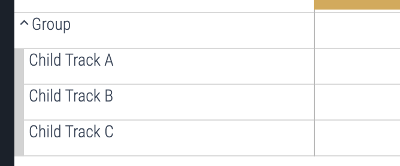
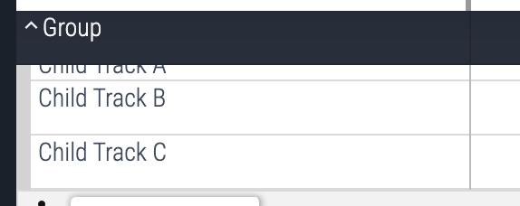

# UI plugins
The Perfetto UI can be extended with plugins. These plugins are shipped part of
Perfetto.

## Create a plugin
The guide below explains how to create a plugin for the Perfetto UI. You can
browse the public plugin API [here](https://cs.android.com/android/platform/superproject/main/+/main:external/perfetto/ui/src/public).

### Prepare for UI development
First we need to prepare the UI development environment. You will need to use a
MacOS or Linux machine. Follow the steps below or see the [Getting
Started](./getting-started) guide for more detail.

```sh
git clone https://github.com/google/perfetto.git
cd perfetto
./tools/install-build-deps --ui
```

### Copy the plugin skeleton
```sh
cp -r ui/src/plugins/com.example.Skeleton ui/src/plugins/<your-plugin-name>
```
Now edit `ui/src/plugins/<your-plugin-name>/index.ts`. Search for all instances
of `SKELETON: <instruction>` in the file and follow the instructions.

Notes on naming:
- Don't name the directory `XyzPlugin` just `Xyz`.
- The `pluginId` and directory name must match.
- Plugins should be prefixed with the reversed components of a domain name you
  control. For example if `example.com` is your domain your plugin should be
  named `com.example.Foo`.
- Core plugins maintained by the Perfetto team should use `dev.perfetto.Foo`.
- Commands should have ids with the pattern `example.com#DoSomething`
- Command's ids should be prefixed with the id of the plugin which provides
  them.
- Command names should have the form "Verb something something", and should be
  in normal sentence case. I.e. don't capitalize the first letter of each word.
  - Good: "Pin janky frame timeline tracks"
  - Bad: "Tracks are Displayed if Janky"

### Start the dev server
```sh
./ui/run-dev-server
```
Now navigate to [localhost:10000](http://localhost:10000/)

### Enable your plugin
- Navigate to the plugins page:
  [localhost:10000/#!/plugins](http://localhost:10000/#!/plugins).
- Ctrl-F for your plugin name and enable it.
- Enabling/disabling plugins requires a restart of the UI, so refresh the page
  to start your plugin.

Later you can request for your plugin to be enabled by default. Follow the
[default plugins](#default-plugins) section for this.

### Upload your plugin for review
- Update `ui/src/plugins/<your-plugin-name>/OWNERS` to include your email.
- Follow the [Contributing](./getting-started#contributing) instructions to
  upload your CL to the codereview tool.
- Once uploaded add `stevegolton@google.com` as a reviewer for your CL.

## Plugin Lifecycle
To demonstrate the plugin's lifecycle, this is a minimal plugin that implements
the key lifecycle hooks:

```ts
default export class implements PerfettoPlugin {
  static readonly id = 'com.example.MyPlugin';

  static onActivate(app: App): void {
    // Called once on app startup
    console.log('MyPlugin::onActivate()', app.pluginId);
    // Note: It's rare that plugins would need this hook as most plugins are
    // interested in trace details. Thus, this function can usually be omitted.
  }

  constructor(trace: Trace) {
    // Called each time a trace is loaded
    console.log('MyPlugin::constructor()', trace.traceInfo.traceTitle);
  }

  async onTraceLoad(trace: Trace): Promise<void> {
    // Called each time a trace is loaded
    console.log('MyPlugin::onTraceLoad()', trace.traceInfo.traceTitle);
    // Note this function returns a promise, so any any async calls should be
    // completed before this promise resolves as the app using this promise for
    // timing and plugin synchronization.
  }
}
```

You can run this plugin with devtools to see the log messages in the console,
which should give you a feel for the plugin lifecycle. Try opening a few traces
one after another.

`onActivate()` runs shortly after Perfetto starts up, before a trace is loaded.
This is where the you'll configure your plugin's capabilities that aren't trace
dependent. At this point the plugin's class is not instantiated, so you'll
notice `onActivate()` hook is a static class member. `onActivate()` is only ever
called once, regardless of the number of traces loaded.

`onActivate()` is passed an `App` object which the plugin can use to configure
core capabilities such as commands, sidebar items and pages. Capabilities
registered on the App interface are persisted throughout the lifetime of the app
(practically forever until the tab is closed), in contrast to what happens for
the same methods on the `Trace` object (see below).

The plugin class in instantiated when a trace is loaded (a new plugin instance
is created for each trace). `onTraceLoad()` is called immediately after the
class is instantiated, which is where you'll configure your plugin's trace
dependent capabilities.

`onTraceLoad()` is passed a `Trace` object which the plugin can use to configure
entities that are scoped to a specific trace, such as tracks and tabs. `Trace`
is a superset of `App`, so anything you can do with `App` you can also do with
`Trace`, however, capabilities registered on `Trace` will typically be discarded
when a new trace is loaded.

A plugin will typically register capabilities with the core and return quickly.
But these capabilities usually contain objects and callbacks which are called
into later by the core during the runtime of the app. Most capabilities require
a `Trace` or an `App` to do anything useful so these are usually bound into the
capabilities at registration time using JavaScript classes or closures.

```ts
// Toy example: Code will not compile.
async onTraceLoad(trace: Trace) {
  // `trace` is captured in the closure and used later by the app
  trace.regsterXYZ(() => trace.xyz);
}
```

That way, the callback is bound to a specific trace object which and the trace
object can outlive the runtime of the `onTraceLoad()` function, which is a very
common pattern in Perfetto plugins.

> Note: Some capabilities can be registered on either the `App` or the `Trace`
> object (i.e. in `onActivate()` or in `onTraceLoad()`), if in doubt about which
> one to use, use `onTraceLoad()` as this is more than likely the one you want.
> Most plugins add tracks and tabs that depend on the trace. You'd usually have
> to be doing something out of the ordinary if you need to use `onActivate()`.

### Performance
`onActivate()` and `onTraceLoad()` should generally complete as quickly as
possible, however sometimes `onTraceLoad()` may need to perform async operations
on trace processor such as performing queries and/or creating views and tables.
Thus, `onTraceLoad()` should return a promise (or you can simply make it an
async function). When this promise resolves it tells the core that the plugin is
fully initialized.

> Note: It's important that any async operations done in onTraceLoad() are
> awaited so that all async operations are completed by the time the promise is
> resolved. This is so that plugins can be properly timed and synchronized.


```ts
// GOOD
async onTraceLoad(trace: Trace) {
  await trace.engine.query(...);
}

// BAD
async onTraceLoad(trace: Trace) {
  // Note the missing await!
  trace.engine.query(...);
}
```

## Extension Points
Plugins can extend functionality of Perfetto by registering capabilities via
extension points on the `App` or `Trace` objects.

The following sections delve into more detail on each extension point and
provide examples of how they can be used.

### Commands
Commands are user issuable shortcuts for actions in the UI. They are invoked via
the command palette which can be opened by pressing Ctrl+Shift+P (or Cmd+Shift+P
on Mac), or by typing a '>' into the omnibox.

To add a command, add a call to `registerCommand()` on either your
`onActivate()` or `onTraceLoad()` hooks. The recommendation is to register
commands in `onTraceLoad()` by default unless you very specifically want the
command to be available before a trace has loaded.

Example of a command that doesn't require a trace.
```ts
default export class implements PerfettoPlugin {
  static readonly id = 'com.example.MyPlugin';
  static onActivate(app: App) {
    app.commands.registerCommand({
      id: `${app.pluginId}#SayHello`,
      name: 'Say hello',
      callback: () => console.log('Hello, world!'),
    });
  }
}
```

Example of a command that requires a trace object - in this case the trace
title.
```ts
default export class implements PerfettoPlugin {
  static readonly id = 'com.example.MyPlugin';
  async onTraceLoad(trace: Trace) {
    trace.commands.registerCommand({
      id: `${trace.pluginId}#LogTraceTitle`,
      name: 'Log trace title',
      callback: () => console.log(trace.info.traceTitle),
    });
  }
}
```

> Notice that the trace object is captured in the closure, so it can be used
> after the onTraceLoad() function has returned. This is a very common pattern
> in Perfetto plugins.

Command arguments explained:
- `id` is a unique string which identifies this command. The `id` should be
prefixed with the plugin id followed by a `#`. All command `id`s must be unique
system-wide.
- `name` is a human readable name for the command, which is shown in the command
palette.
- `callback()` is the callback which actually performs the action.

#### Async commands
It's common that commands will perform async operations in their callbacks. It's
recommended to use async/await for this rather than `.then().catch()`. The
easiest way to do this is to make the callback an async function.

```ts
default export class implements PerfettoPlugin {
  static readonly id = 'com.example.MyPlugin';
  async onTraceLoad(trace: Trace) {
    trace.commands.registerCommand({
      id: `${trace.pluginId}#QueryTraceProcessor`,
      name: 'Query trace processor',
      callback: async () => {
        const results = await trace.engine.query(...);
        // use results...
      },
    });
  }
}
```

If the callback is async (i.e. it returns a promise), nothing special happens.
The command is still fire-n-forget as far as the core is concerned.

Examples:
- [com.example.ExampleSimpleCommand](https://cs.android.com/android/platform/superproject/main/+/main:external/perfetto/ui/src/plugins/com.example.ExampleSimpleCommand/index.ts).
- [perfetto.CoreCommands](https://cs.android.com/android/platform/superproject/main/+/main:external/perfetto/ui/src/core_plugins/commands/index.ts).
- [com.example.ExampleState](https://cs.android.com/android/platform/superproject/main/+/main:external/perfetto/ui/src/plugins/com.example.ExampleState/index.ts).

### Hotkeys
A hotkey may be associated with a command at registration time.

```typescript
ctx.commands.registerCommand({
  ...
  defaultHotkey: 'Shift+H',
});
```

Despite the fact that the hotkey is a string, its format is checked at compile
time using typescript's [template literal
types](https://www.typescriptlang.org/docs/handbook/2/template-literal-types.html).

See
[hotkey.ts](https://cs.android.com/android/platform/superproject/main/+/main:external/perfetto/ui/src/base/hotkeys.ts)
for more details on how the hotkey syntax works, and for the available keys and
modifiers.

Note this is referred to as the 'default' hotkey because we may introduce a
feature in the future where users can modify their hotkeys, though this doesn't
exist at the moment.

### Tracks
In order to add a new track to the timeline, you'll need to create two entities:
- A track 'renderer' which controls what the track looks like and how it fetches
  data from trace processor.
- A track 'node' controls where the track appears in the workspace.

Track renderers are powerful but complex, so it's, so it's strongly advised not
to create your own. Instead, by far the easiest way to get started with tracks
is to use the `createQuerySliceTrack` and `createQueryCounterTrack` helpers.

Example:
```ts
import {createQuerySliceTrack} from '../../components/tracks/query_slice_track';

default export class implements PerfettoPlugin {
  static readonly id = 'com.example.MyPlugin';
  async onTraceLoad(trace: Trace) {
    const title = 'My Track';
    const uri = `${trace.pluginId}#MyTrack`;
    const query = 'select * from slice where track_id = 123';

    // Create a new track renderer based on a query
    const track = await createQuerySliceTrack({
      trace,
      uri,
      data: {
        sqlSource: query,
      },
    });

    // Register the track renderer with the core
    trace.tracks.registerTrack({uri, title, track});

    // Create a track node that references the track renderer using its uri
    const trackNode = new TrackNode({uri, title});

    // Add the track node to the current workspace
    trace.workspace.addChildInOrder(trackNode);
  }
}
```

See [the source](https://cs.android.com/android/platform/superproject/main/+/main:external/perfetto/ui/src/components/tracks/query_slice_track.ts)
for detailed usage.

You can also add a counter track using `createQueryCounterTrack` which works in
a similar way.

```ts
import {createQueryCounterTrack} from '../../components/tracks/query_counter_track';

default export class implements PerfettoPlugin {
  static readonly id = 'com.example.MyPlugin';
  async onTraceLoad(trace: Trace) {
    const title = 'My Counter Track';
    const uri = `${trace.pluginId}#MyCounterTrack`;
    const query = 'select * from counter where track_id = 123';

    // Create a new track renderer based on a query
    const track = await createQueryCounterTrack({
      trace,
      uri,
      data: {
        sqlSource: query,
      },
    });

    // Register the track renderer with the core
    trace.tracks.registerTrack({uri, title, track});

    // Create a track node that references the track renderer using its uri
    const trackNode = new TrackNode({uri, title});

    // Add the track node to the current workspace
    trace.workspace.addChildInOrder(trackNode);
  }
}
```

See [the source](https://cs.android.com/android/platform/superproject/main/+/main:external/perfetto/ui/src/components/tracks/query_counter_track.ts)
for detailed usage.

#### Grouping Tracks
Any track can have children. Just add child nodes any `TrackNode` object using
its `addChildXYZ()` methods. Nested tracks are rendered as a collapsible tree.

```ts
const group = new TrackNode({title: 'Group'});
trace.workspace.addChildInOrder(group);
group.addChildLast(new TrackNode({title: 'Child Track A'}));
group.addChildLast(new TrackNode({title: 'Child Track B'}));
group.addChildLast(new TrackNode({title: 'Child Track C'}));
```

Tracks nodes with children can be collapsed and expanded manually by the user at
runtime, or programmatically using their `expand()` and `collapse()` methods. By
default tracks are collapsed, so to have tracks automatically expanded on
startup you'll need to call `expand()` after adding the track node.

```ts
group.expand();
```



Summary tracks are behave slightly differently to ordinary tracks. Summary
tracks:
- Are rendered with a light blue background when collapsed, dark blue when
  expanded.
- Stick to the top of the viewport when scrolling.
- Area selections made on the track apply to child tracks instead of the summary
  track itself.

To create a summary track, set the `isSummary: true` option in its initializer
list at creation time or set its `isSummary` property to true after creation.

```ts
const group = new TrackNode({title: 'Group', isSummary: true});
// ~~~ or ~~~
group.isSummary = true;
```



Examples
- [com.example.ExampleNestedTracks](https://cs.android.com/android/platform/superproject/main/+/main:external/perfetto/ui/src/plugins/com.example.ExampleNestedTracks/index.ts).

#### Track Ordering
Tracks can be manually reordered using the `addChildXYZ()` functions available on
the track node api, including `addChildFirst()`, `addChildLast()`,
`addChildBefore()`, and `addChildAfter()`.

See [the workspace source](https://cs.android.com/android/platform/superproject/main/+/main:external/perfetto/ui/src/public/workspace.ts) for detailed usage.

However, when several plugins add tracks to the same node or the workspace, no
single plugin has complete control over the sorting of child nodes within this
node. Thus, the sortOrder property is be used to decentralize the sorting logic
between plugins.

In order to do this we simply give the track a `sortOrder` and call
`addChildInOrder()` on the parent node and the track will be placed before the
first track with a higher `sortOrder` in the list. (i.e. lower `sortOrder`s appear
higher in the stack).

```ts
// PluginA
workspace.addChildInOrder(new TrackNode({title: 'Foo', sortOrder: 10}));

// Plugin B
workspace.addChildInOrder(new TrackNode({title: 'Bar', sortOrder: -10}));
```

Now it doesn't matter which order plugin are initialized, track `Bar` will
appear above track `Foo` (unless reordered later).

If no `sortOrder` is defined, the track assumes a `sortOrder` of 0.

> It is recommended to always use `addChildInOrder()` in plugins when adding
> tracks to the `workspace`, especially if you want your plugin to be enabled by
> default, as this will ensure it respects the sortOrder of other plugins.


### Tabs
Tabs are a useful way to display contextual information about the trace, the
current selection, or to show the results of an operation.

To register a tab from a plugin, use the `Trace.registerTab` method.

```ts
class MyTab implements Tab {
  render(): m.Children {
    return m('div', 'Hello from my tab');
  }

  getTitle(): string {
    return 'My Tab';
  }
}

default export class implements PerfettoPlugin {
  static readonly id = 'com.example.MyPlugin';
  async onTraceLoad(trace: Trace) {
    trace.registerTab({
      uri: `${trace.pluginId}#MyTab`,
      content: new MyTab(),
    });
  }
}
```

You'll need to pass in a tab-like object, something that implements the `Tab`
interface. Tabs only need to define their title and a render function which
specifies how to render the tab.

Registered tabs don't appear immediately - we need to show it first. All
registered tabs are displayed in the tab dropdown menu, and can be shown or
hidden by clicking on the entries in the drop down menu.

Tabs can also be hidden by clicking the little x in the top right of their
handle.

Alternatively, tabs may be shown or hidden programmatically using the tabs API.

```ts
trace.tabs.showTab(`${trace.pluginId}#MyTab`);
trace.tabs.hideTab(`${trace.pluginId}#MyTab`);
```

Tabs have the following properties:
- Each tab has a unique URI.
- Only once instance of the tab may be open at a time. Calling showTab multiple
  times with the same URI will only activate the tab, not add a new instance of
  the tab to the tab bar.

#### Ephemeral Tabs

By default, tabs are registered as 'permanent' tabs. These tabs have the
following additional properties:
- They appear in the tab dropdown.
- They remain once closed. The plugin controls the lifetime of the tab object.

Ephemeral tabs, by contrast, have the following properties:
- They do not appear in the tab dropdown.
- When they are hidden, they will be automatically unregistered.

Ephemeral tabs can be registered by setting the `isEphemeral` flag when
registering the tab.

```ts
trace.registerTab({
  isEphemeral: true,
  uri: `${trace.pluginId}#MyTab`,
  content: new MyEphemeralTab(),
});
```

Ephemeral tabs are usually added as a result of some user action, such as
running a command. Thus, it's common pattern to register a tab and show the tab
simultaneously.

Motivating example:
```ts
import m from 'mithril';
import {uuidv4} from '../../base/uuid';

class MyNameTab implements Tab {
  constructor(private name: string) {}
  render(): m.Children {
    return m('h1', `Hello, ${this.name}!`);
  }
  getTitle(): string {
    return 'My Name Tab';
  }
}

default export class implements PerfettoPlugin {
  static readonly id = 'com.example.MyPlugin';
  async onTraceLoad(trace: Trace): Promise<void> {
    trace.registerCommand({
      id: `${trace.pluginId}#AddNewEphemeralTab`,
      name: 'Add new ephemeral tab',
      callback: () => handleCommand(trace),
    });
  }
}

function handleCommand(trace: Trace): void {
  const name = prompt('What is your name');
  if (name) {
    const uri = `${trace.pluginId}#MyName${uuidv4()}`;
    // This makes the tab available to perfetto
    ctx.registerTab({
      isEphemeral: true,
      uri,
      content: new MyNameTab(name),
    });

    // This opens the tab in the tab bar
    ctx.tabs.showTab(uri);
  }
}
```

### Sidebar Menu Items
Plugins can add new entries to the sidebar menu which appears on the left hand
side of the UI. These entries can include:
- Commands
- Links
- Arbitrary Callbacks

#### Commands
If a command is referenced, the command name and hotkey are displayed on the
sidebar item.
```ts
trace.commands.registerCommand({
  id: 'sayHi',
  name: 'Say hi',
  callback: () => window.alert('hi'),
  defaultHotkey: 'Shift+H',
});

trace.sidebar.addMenuItem({
  commandId: 'sayHi',
  section: 'support',
  icon: 'waving_hand',
});
```

#### Links
If an href is present, the sidebar will be used as a link. This can be an
internal link to a page, or an external link.
```ts
trace.sidebar.addMenuItem({
  section: 'navigation',
  text: 'Plugins',
  href: '#!/plugins',
});
```

#### Callbacks
Sidebar items can be instructed to execute arbitrary callbacks when the button
is clicked.
```ts
trace.sidebar.addMenuItem({
  section: 'current_trace',
  text: 'Copy secrets to clipboard',
  action: () => copyToClipboard('...'),
});
```

If the action returns a promise, the sidebar item will show a little spinner
animation until the promise returns.

```ts
trace.sidebar.addMenuItem({
  section: 'current_trace',
  text: 'Prepare the data...',
  action: () => new Promise((r) => setTimeout(r, 1000)),
});
```
Optional params for all types of sidebar items:
- `icon` - A material design icon to be displayed next to the sidebar menu item.
  See full list [here](https://fonts.google.com/icons).
- `tooltip` - Displayed on hover
- `section` - Where to place the menu item.
  - `navigation`
  - `current_trace`
  - `convert_trace`
  - `example_traces`
  - `support`
- `sortOrder` - The higher the sortOrder the higher the bar.

See the [sidebar source](https://cs.android.com/android/platform/superproject/main/+/main:external/perfetto/ui/src/public/sidebar.ts)
for more detailed usage.

### Pages
Pages are entities that can be routed via the URL args, and whose content take
up the entire available space to the right of the sidebar and underneath the
topbar. Examples of pages are the timeline, record page, and query page, just to
name a few common examples.

E.g.
```
http://ui.perfetto.dev/#!/viewer <-- 'viewer' is is the current page.
```

Pages are added from a plugin by calling the `pages.registerPage` function.

Pages can be trace-less or trace-ful. Trace-less pages are pages that are to be
displayed when no trace is loaded - i.e. the record page. Trace-ful pages are
displayed only when a trace is loaded, as they typically require a trace to work
with.

You'll typically register trace-less pages in your plugin's `onActivate()`
function and trace-full pages in either `onActivate()` or `onTraceLoad()`. If
users navigate to a trace-ful page before a trace is loaded the homepage will be
shown instead.

> Note: You don't need to bind the `Trace` object for pages unlike other
> extension points, Perfetto will inject a trace object for you.

Pages should be mithril components that accept `PageWithTraceAttrs` for
trace-ful pages or `PageAttrs` for trace-less pages.

Example of a trace-less page:
```ts
import m from 'mithril';
import {PageAttrs} from '../../public/page';

class MyPage implements m.ClassComponent<PageAttrs> {
  view(vnode: m.CVnode<PageAttrs>) {
    return `The trace title is: ${vnode.attrs.trace.traceInfo.traceTitle}`;
  }
}

// ~~~ snip ~~~

app.pages.registerPage({route: '/mypage', page: MyPage, traceless: true});
```

```ts
import m from 'mithril';
import {PageWithTraceAttrs} from '../../public/page';

class MyPage implements m.ClassComponent<PageWithTraceAttrs> {
  view(_vnode_: m.CVnode<PageWithTraceAttrs>) {
    return 'Hello from my page';
  }
}

// ~~~ snip ~~~

app.pages.registerPage({route: '/mypage', page: MyPage});
```

Examples:
- [dev.perfetto.ExplorePage](https://cs.android.com/android/platform/superproject/main/+/main:external/perfetto/ui/src/plugins/dev.perfetto.ExplorePage/index.ts).


### Metric Visualisations
TBD

Examples:
- [dev.perfetto.AndroidBinderViz](https://cs.android.com/android/platform/superproject/main/+/main:external/perfetto/ui/src/plugins/dev.perfetto.AndroidBinderViz/index.ts).

### State
NOTE: It is important to consider version skew when using persistent state.

Plugins can persist information into permalinks. This allows plugins to
gracefully handle permalinking and is an opt-in - not automatic - mechanism.

Persistent plugin state works using a `Store<T>` where `T` is some JSON
serializable object. `Store` is implemented
[here](https://cs.android.com/android/platform/superproject/main/+/main:external/perfetto/ui/src/base/store.ts).
`Store` allows for reading and writing `T`. Reading:
```typescript
interface Foo {
  bar: string;
}

const store: Store<Foo> = getFooStoreSomehow();

// store.state is immutable and must not be edited.
const foo = store.state.foo;
const bar = foo.bar;

console.log(bar);
```

Writing:
```typescript
interface Foo {
  bar: string;
}

const store: Store<Foo> = getFooStoreSomehow();

store.edit((draft) => {
  draft.foo.bar = 'Hello, world!';
});

console.log(store.state.foo.bar);
// > Hello, world!
```

First define an interface for your specific plugin state.
```typescript
interface MyState {
  favouriteSlices: MySliceInfo[];
}
```

To access permalink state, call `mountStore()` on your `Trace`
object, passing in a migration function.
```typescript
default export class implements PerfettoPlugin {
  static readonly id = 'com.example.MyPlugin';
  async onTraceLoad(trace: Trace): Promise<void> {
    const store = trace.mountStore(migrate);
  }
}

function migrate(initialState: unknown): MyState {
  // ...
}
```

When it comes to migration, there are two cases to consider:
- Loading a new trace
- Loading from a permalink

In case of a new trace, your migration function is called with `undefined`. In
this case you should return a default version of `MyState`:
```typescript
const DEFAULT = {favouriteSlices: []};

function migrate(initialState: unknown): MyState {
  if (initialState === undefined) {
    // Return default version of MyState.
    return DEFAULT;
  } else {
    // Migrate old version here.
  }
}
```

In the permalink case, your migration function is called with the state of the
plugin store at the time the permalink was generated. This may be from an older
or newer version of the plugin.

**Plugins must not make assumptions about the contents of `initialState`!**

In this case you need to carefully validate the state object. This could be
achieved in several ways, none of which are particularly straight forward. State
migration is difficult!

One brute force way would be to use a version number.

```typescript
interface MyState {
  version: number;
  favouriteSlices: MySliceInfo[];
}

const VERSION = 3;
const DEFAULT = {favouriteSlices: []};

function migrate(initialState: unknown): MyState {
  if (initialState && (initialState as {version: any}).version === VERSION) {
    // Version number checks out, assume the structure is correct.
    return initialState as State;
  } else {
    // Null, undefined, or bad version number - return default value.
    return DEFAULT;
  }
}
```

You'll need to remember to update your version number when making changes!
Migration should be unit-tested to ensure compatibility.

Examples:
- [dev.perfetto.ExampleState](https://cs.android.com/android/platform/superproject/main/+/main:external/perfetto/ui/src/plugins/dev.perfetto.ExampleState/index.ts).

## Guide to the plugin API
The plugin interfaces are defined in
[ui/src/public/](https://cs.android.com/android/platform/superproject/main/+/main:external/perfetto/ui/src/public).

## Default plugins
Some plugins are enabled by default. These plugins are held to a higher quality
than non-default plugins since changes to those plugins effect all users of the
UI. The list of default plugins is specified at
[ui/src/core/default_plugins.ts](https://cs.android.com/android/platform/superproject/main/+/main:external/perfetto/ui/src/core/default_plugins.ts).

## Misc notes
- Plugins must be licensed under
  [Apache-2.0](https://spdx.org/licenses/Apache-2.0.html) the same as all other
  code in the repository.
- Plugins are the responsibility of the OWNERS of that plugin to maintain, not
  the responsibility of the Perfetto team. All efforts will be made to keep the
  plugin API stable and existing plugins working however plugins that remain
  unmaintained for long periods of time will be disabled and ultimately deleted.

