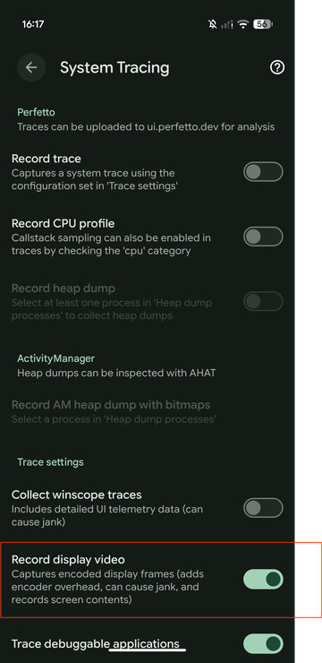
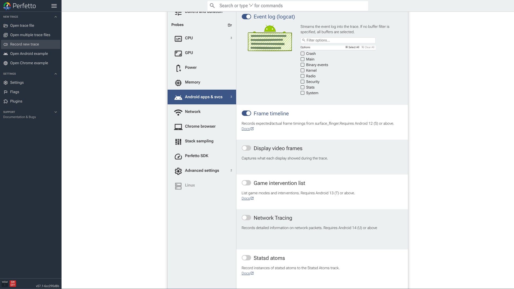
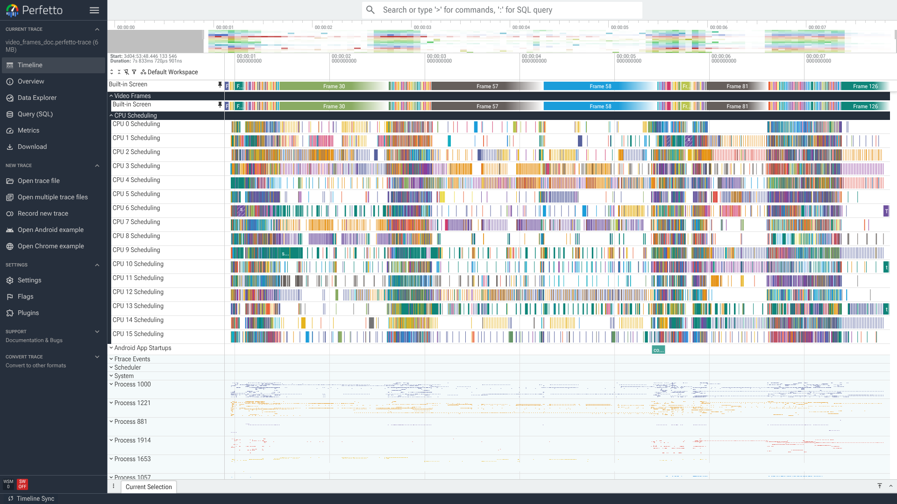
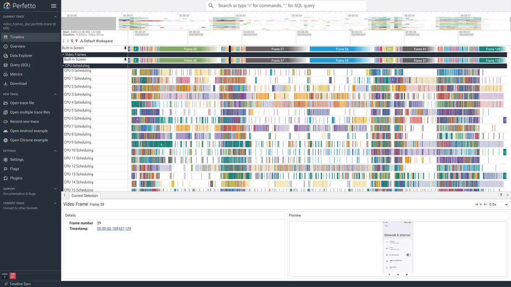

# Screen Recording

The **android.display.video** data source records what each physical
display showed while a trace was being captured. Perfetto stores the
frames as an encoded video stream inside the trace, and the UI adds a
per-display timeline track that decodes them in the browser. You can
hover the track to preview a frame, play the frames back like a video,
and click any frame to line it up with the tracks below it.

It records the actual contents of the screen, so any trace that contains
it is sensitive: it shows exactly what was on the display. On `userdebug`
(debuggable) devices it is available out of the box. On `user`
(production) builds it is gated behind a system property; the record page
sets it for you, and you only set it by hand for other capture paths — see
[Prerequisite on `user` builds](#prerequisite-on-user-builds).

This guide covers:

- [How it works, and what it costs](#how-it-works-and-what-it-costs) —
  how the frames get into the trace, and the overhead on the device.
- [Capturing display video](#capturing-display-video): the three ways to
  turn it on — the on-device toggle, the record page, and a raw config with
  full control over quality and size — plus the `user`-build property you set
  by hand only for the non-record-page paths.
- [Viewing display video](#viewing-display-video): the timeline track,
  hovering to preview a frame, and playing the capture back with the
  timeline kept in sync.

## How it works, and what it costs

While the data source is enabled, the device encodes what each display
shows into a video stream stored in the trace — one frame each time the
screen changes — and the UI decodes it back in the browser. This has two
costs:

- **Encoder and CPU overhead.** Encoding frames uses the device's video
  encoder while the trace runs. On a busy display this adds load and can
  perturb the timing you are measuring.
- **Trace size.** The stream grows with resolution and with how much the
  screen changes; the `scale` and `max_stream_size_bytes` options below
  keep it bounded.

When the data source is off, it costs nothing.

## Capturing display video

There are three ways to turn on display-video capture, from the simplest
to the most control. On `user` builds there is also a one-time-per-boot
property to set first — see the prerequisite below.

### Prerequisite on `user` builds

On `userdebug` (debuggable) devices, display-video capture works out of the
box. On `user` (production) builds it is gated behind the
`debug.tracing_video_allowed` system property.

**If you record from the Perfetto UI record page over ADB, skip this** — the
record page sets the property for you before starting a trace that includes
display video. You only set it by hand for the other capture paths (the
on-device System Tracing toggle, or a raw config you push another way):

```
adb shell setprop debug.tracing_video_allowed true
```

The property is **not persistent** — it is cleared on the next reboot, so it
must be set again after a restart. The record page does this each time; a
manual setter has to redo it.

### On the device, with System Tracing

The System Tracing app has a **Record display video** toggle under
**Trace settings**. Enable it, then record a trace as usual — the capture
is included automatically. This is the quickest route on a device you are
holding — no config to write.



### From the record page

Open the Perfetto UI record page, find **Display video frames** under the
Android probes, and enable it. This adds the `android.display.video` data
source to the generated config with the producer's default settings. On
`user` builds, when recording over ADB, the record page sets
`debug.tracing_video_allowed` for you first — no manual step needed.



### From a raw trace config

For full control, write the config yourself. Enable
`android.display.video`, and add a `display_video_config` to set quality
and size. With no options, each display uses the device's default
settings:

```
data_sources {
  config {
    name: "android.display.video"
  }
}
```

Add a `display_video_config` to tune the capture. Every field is
optional; an unset or zero field uses the producer default.

```
data_sources {
  config {
    name: "android.display.video"
    display_video_config {
      scale: 0.5
      format: FORMAT_H264
      key_frame_interval_secs: 2
      max_stream_size_bytes: 67108864  # 64 MiB per display
    }
  }
}
```

| Option | Description |
| --- | --- |
| `scale` | Factor applied to each display's resolution before capture, e.g. `0.5` for half size or `0.25` for quarter. Lower scale means less encoder load and a smaller trace, at the cost of detail. |
| `format` | `FORMAT_H264` (the default) or `FORMAT_HEVC`. HEVC produces a smaller stream at the same quality, but the device must support HEVC encoding to capture it and the browser must support HEVC decoding to preview it. |
| `key_frame_interval_secs` | How often a keyframe is emitted. Smaller values make seeking snappier but grow the trace; larger values are more compact but slower to scrub. |
| `max_stream_size_bytes` | A per-display cap on emitted bytes. When a display hits it, its stream is torn down (a size-cap error) rather than growing without bound. Left unset, the device applies a default cap of 256 MiB per display. |

## Size limits

Display video is limited to 256 MiB per display, enforced in two separate
places:

- On the device, `max_stream_size_bytes` caps how much each stream emits
  (256 MiB by default; a size-cap error is recorded when it is hit).
- Independently, trace_processor drops any frames beyond 256 MiB per
  stream when it loads the trace, so raising the on-device cap alone will
  not get you more frames in the UI.

On a long session or at a high resolution, the video can therefore stop
before the end of the trace. Both limits exist because of the memory cost
of holding the stream, not a fundamental constraint. If they get in your
way, comment on and upvote the tracking issue so it can be prioritised:
[perfetto#6609](https://github.com/google/perfetto/issues/6609).

## Viewing display video

### The timeline track

A trace that contains display video shows a **Video Frames** group with
one track per display (for a phone, typically a single **Built-in
Screen**). Each slice on the track is one captured frame, labelled with a
frame number. That number is just a sequential counter of captured frames
— it has nothing to do with the vsync ids in the frame timeline.



### Hovering to preview a frame

Move the pointer along the track to preview frames. The frame under the
cursor is decoded and shown as a thumbnail above the row, so you can scrub
to find the frame you want.


### Playing back

Click a frame to open its details. The panel shows the frame number and
timestamp on the left and a decoded **Preview** on the right, with
playback controls in the header: previous frame, play/pause, next frame,
and a playback-speed selector. Press play and the capture runs as a
video: the preview advances through the frames and the timeline selection
moves with it, so the rest of the UI stays lined up with what is on
screen. Step one frame at a time with the previous/next buttons, or change
the speed selector to play back slower (down to 0.1×) or faster (up to
2×).


