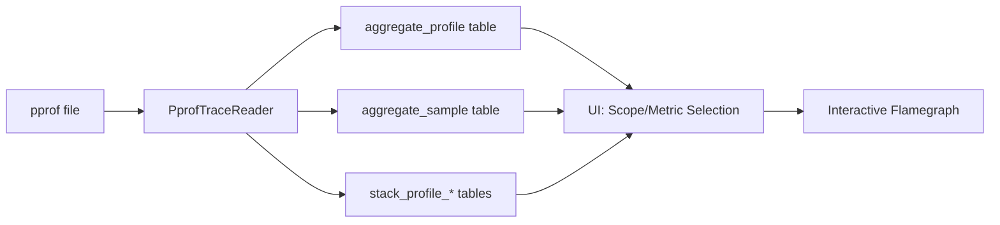

# pprof Support in Perfetto

_**Status:** COMPLETED **·** lalitm **·** 2025-09-30_

## Objective

Add support for importing pprof files into Perfetto Trace Processor and visualizing them with flame graphs in the Perfetto UI. This enables analysis of CPU/heap profiles from Go, C++, and other tools that generate pprof format within the Perfetto ecosystem.

## Overview

This feature extends Perfetto's trace analysis capabilities to include non-time-based aggregate profiling data. Unlike existing profiling support which is integrated with timeline-based traces, pprof data represents standalone aggregate samples that are independent of time.



The implementation builds upon existing Perfetto infrastructure:
- **Database layer**: Extends existing `stack_profile_*` tables with new aggregate tables
- **Import pipeline**: Follows the established `TraceType` + `TraceReader` pattern
- **UI layer**: Leverages existing flame graph visualization components

### Requirements

**Zero-setup analysis:** A pprof file can be analyzed with a single command or drag-and-drop.

**Full format support:** Support gzipped and uncompressed pprof protobuf files from any pprof-compatible tool.

**Multiple metrics per file:** Handle pprof files containing multiple value types (e.g., CPU samples + allocation counts) in a single visualization.

**Interactive flame graphs:** Provide full interactivity including zoom, search, and source location attribution where available.

**No timeline confusion:** Keep pprof data completely separate from time-based trace analysis to avoid user confusion.

## Detailed Design

### File Format Support

The implementation supports the standard pprof format as defined by [Google's pprof tool](https://github.com/google/pprof/blob/main/proto/profile.proto):

**Gzipped format:** Files compressed with gzip, as typically generated by most profiling tools.

**Raw protobuf:** Uncompressed protobuf files for development and testing.

**Profile structure:** Full support for the Profile protobuf message including:
- String table for deduplicated strings
- Sample data with location hierarchies
- Function and mapping metadata
- Multiple value types (CPU samples, allocations, etc.)

### Import Architecture

#### File Detection

The import pipeline automatically detects pprof files through a two-stage process:

1. **Gzip detection:** Recognize gzipped files by magic bytes (`1f 8b`)
2. **Protobuf validation:** After decompression, validate pprof structure by checking for Profile message with `sample_type` field

#### PprofTraceReader

```cpp
class PprofTraceReader : public ChunkedTraceReader {
 public:
  explicit PprofTraceReader(TraceProcessorContext* context);

  base::Status Parse(TraceBlobView blob) override;
  base::Status NotifyEndOfFile() override;

 private:
  base::Status ParseProfile();

  TraceProcessorContext* context_;
  std::vector<uint8_t> buffer_;
};
```

The reader accumulates pprof data into an internal buffer and parses the complete protobuf message upon EOF notification.

### Database Schema

#### New Tables

The implementation introduces two new tables that integrate with existing stack profiling infrastructure:

```sql
-- Metadata for each profiling metric from pprof files
CREATE TABLE aggregate_profile (
  id INTEGER PRIMARY KEY,
  scope TEXT,              -- file identifier (e.g., "cpu.pprof")
  name TEXT,               -- display name (e.g., "pprof cpu")
  sample_type_type TEXT,   -- pprof ValueType.type (e.g., "cpu")
  sample_type_unit TEXT    -- pprof ValueType.unit (e.g., "nanoseconds")
);

-- Sample values aggregated by callsite
CREATE TABLE aggregate_sample (
  id INTEGER PRIMARY KEY,
  aggregate_profile_id INTEGER,  -- FK to aggregate_profile
  callsite_id INTEGER,           -- FK to stack_profile_callsite
  value REAL                     -- sample count/value
);
```

#### Integration with Existing Infrastructure

- **stack_profile_frame:** Stores function name and source file information
- **stack_profile_callsite:** Maintains call stack hierarchy from root to leaf
- **stack_profile_mapping:** Contains binary/library mapping information

Each pprof location becomes a frame, callsites represent the full call chain from root to leaf, and samples aggregate values at each callsite.

### Data Processing Pipeline

#### Step 1: String Table Parsing

All pprof files use a string table for deduplication. The importer builds a vector of strings from the protobuf `string_table` field.

#### Step 2: Mapping and Function Creation

For each pprof `Mapping` and `Function`:
- Extract binary name, build ID, and memory ranges
- Create entries in `stack_profile_mapping` and populate frame metadata
- Build lookup tables for location resolution

#### Step 3: Location Processing

Each pprof `Location` represents a program counter with optional debug information:
- Map addresses to existing or dummy memory mappings
- Extract function names from associated line information
- Create `stack_profile_frame` entries with relative PCs

#### Step 4: Sample Processing

For each pprof `Sample`:
- Build complete callsite hierarchy from location chain (reversing pprof leaf-first order)
- Create aggregate entries for each value type in the sample
- Link samples to callsites through `aggregate_sample` table

```
Pprof Sample → Location IDs [3,2,1] (leaf first)
             ↓
Perfetto Callsite hierarchy: 1 → 2 → 3 (root to leaf)
                            ↓
Multiple aggregate_sample entries (one per value type)
```

### UI Implementation

#### PprofPage Component

The UI provides a dedicated page for pprof analysis accessible from the main navigation. The page automatically discovers available data and provides interactive controls.

#### Dynamic Data Discovery

Upon loading, the UI queries the database to discover:

1. **Available scopes** (typically one per imported pprof file)
2. **Available metrics** within each scope (CPU, allocations, etc.)
3. **Sample data** for the selected scope/metric combination

```typescript
// Discover available pprof data
const scopesResult = await trace.engine.query(`
  SELECT DISTINCT scope FROM __intrinsic_aggregate_profile ORDER BY scope
`);

// Load metrics for selected scope
const metricsResult = await trace.engine.query(`
  SELECT sample_type_type, sample_type_unit
  FROM __intrinsic_aggregate_profile
  WHERE scope = '${selectedScope}'
`);
```

#### Flamegraph Integration

The implementation reuses Perfetto's existing `QueryFlamegraph` component with dynamically generated metrics:

```typescript
const flamegraphMetrics = metricsFromTableOrSubquery(
  `
    WITH metrics AS MATERIALIZED (
      SELECT
        callsite_id,
        sum(sample.value) AS self_value
      FROM __intrinsic_aggregate_sample sample
      JOIN __intrinsic_aggregate_profile profile
        ON sample.aggregate_profile_id = profile.id
      WHERE profile.scope = '${scope}'
        AND profile.sample_type_type = '${metric}'
      GROUP BY callsite_id
    )
    SELECT
      c.id,
      c.parent_id as parentId,
      c.name,
      c.mapping_name,
      coalesce(m.self_value, 0) AS self_value
    FROM _callstacks_for_stack_profile_samples!(metrics) AS c
    LEFT JOIN metrics AS m USING (callsite_id)
  `,
  [{ name: 'Pprof Samples', unit: unit, columnName: 'self_value' }],
  'include perfetto module callstacks.stack_profile'
);
```

This query leverages the existing `_callstacks_for_stack_profile_samples!` table function to build the complete flamegraph hierarchy while aggregating pprof sample values.

### Usage

#### Command Line Analysis

```bash
# Analyze a pprof file directly
$ trace_processor_shell profile.pprof

# Query available metrics
> SELECT scope, sample_type_type, sample_type_unit
  FROM __intrinsic_aggregate_profile;

# Examine sample data
> SELECT COUNT(*) FROM __intrinsic_aggregate_sample
  WHERE aggregate_profile_id = 1;
```

#### Web UI Analysis

1. **File loading**: Drag and drop pprof file into Perfetto UI or use file picker
2. **Automatic detection**: Perfetto recognizes pprof format and imports data
3. **Navigation**: Go to "Pprof" page from main navigation
4. **Interactive analysis**: Select scope/metric and explore flame graph

#### Multi-metric Files

For pprof files containing multiple value types (e.g., CPU samples + heap allocations):

1. **Single import**: All metrics from one file imported together under same scope
2. **Metric switching**: UI dropdown allows switching between metrics instantly
3. **Independent analysis**: Each metric displays as separate flame graph

## Design Principles

### Integration over Replacement

Rather than building a standalone pprof viewer, this feature integrates pprof analysis into Perfetto's existing infrastructure. This provides:

**Unified tooling:** Users can analyze pprof data alongside other trace formats using the same UI and SQL interface.

**Leveraged infrastructure:** Reuses existing flame graph rendering, call stack handling, and database optimization.

**Consistent UX:** Familiar Perfetto interface for users already using the platform.

### Separation of Concerns

**Timeline independence:** pprof data represents aggregate samples without time dimension, kept completely separate from timeline-based trace analysis.

**Static import model:** pprof files are imported once and stored in read-only tables, avoiding complex re-aggregation logic.

**Format-specific handling:** Dedicated importer handles pprof-specific concepts while mapping to Perfetto's general profiling abstractions.

### Minimal Overhead

**Zero cost when unused:** No impact on existing Perfetto functionality when pprof features are not used.

**Efficient storage:** Sample values stored in aggregated form, avoiding redundant per-sample overhead.

**Query optimization:** Leverages existing database indices and table functions for optimal performance.