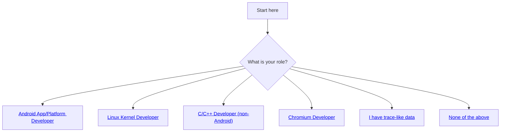
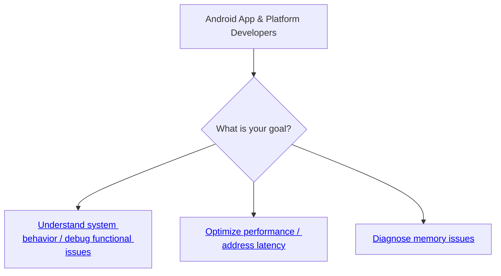

# How do I start using Perfetto?

TIP: If you are unfamiliar with the word "tracing" or in general, are new to the
world of performance, we suggest reading the
[What is Tracing?](/docs/tracing-101.md) page first. If you are not quite sure
what Perfetto is and why it's useful, check out the
[Perfetto homepage](/docs/README.md) first.

Perfetto is a large project and it can be daunting for someone new to understand
what parts of the documentation are relevant to them. By focusing on what
technology you are using and what you are trying to accomplish, this page will
guide you through our documentation and help you solve problems with Perfetto as
quickly as possible.

Our docs make use of the terms "Tutorials", "Cookbooks" and "Case Studies":

- **Tutorials** are guides which explain how to get started using Perfetto
  tools. They are focused on teaching you the tools themselves and _not_ so much
  on how the tools can be used to solve real world problems.
- **Cookbooks** are pages containing small, bite-sized guides (recipes) which
  give you a quick idea on how to solve a concrete problem with Perfetto. They
  will have snippets of code you can copy-paste or a sequence of instructions
  you can follow.
- **Case Studies** are detailed, opinionated guides which take you step-by-step
  how you can debug and root-cause a "vertical" problem using Perfetto. They
  focus more on helping you solve the problem and less on teaching you Perfetto
  tools. They may also make signifcant use of non-Perfetto based tools
  or commands where appropriate.

Based on what technology you are interested in, please choose one of the
following sections to go to next:

## {#android-developers} Android App & Platform Developers

Perfetto is the **default tracing system** on Android. It provides a powerful
way to understand the intricate workings of the Android OS and applications,
enabling developers to diagnose not only performance bottlenecks but also
complex functional issues and unexpected behaviors. By capturing a detailed,
chronological record of system and application activity, Perfetto helps you see
how different components interact over time.

If you are a developer working on an Android app or on Android platform code
(i.e. the Android OS itself), Perfetto can help you answer a wide array of
questions:

1.  Why is a specific operation taking longer than expected?
2.  What sequence of events led to this bug?
3.  How do different processes and system services interact during a particular
    use case?
4.  Is my component behaving correctly under specific system conditions?
5.  Why is my app - or the whole system - using so much memory?
6.  How can I optimize my component's CPU or resource usage?
7.  What is the state of various system components at a critical point in time?

<?tabs>

TAB: App Developers

As an Android App Developer, you might already be using Perfetto via one of
the app-focused tools which use Perfetto under the hood. Examples include:

- [Android Studio Profiler](https://developer.android.com/studio/profile)
- [Android GPU Inspector](https://gpuinspector.dev/)
- [AndroidX Macrobenchmark Library](https://developer.android.com/topic/performance/benchmarking/macrobenchmark-overview)
- [ProfilingManager API in Android SDK](https://developer.android.com/reference/android/os/ProfilingManager)

These projects use Perfetto trace tooling under the hoods to expose a more
polished and curated experience to app developers. On the other hand, they tend
to expose a reduced set of features to favour ease of use and reduce cognitive
overwhelming.

If you are just getting started with app tracing you should likely look first
into the aforementioned tools, as they offer a smoother learning curve.
If, on the other hand, you want to use the full set of features, and accept the
cost of dealing with a larger complexity and expertise demand, you can use
Perfetto directly and take advantage of its bleeding edge features.

This guide, and the rest of these docs, can help you start using Perfetto to
gain deeper insights into your app's behavior and its interaction with the
Android system.

TAB: Google Platform Developers

As a Google Platform Developer, Perfetto is deeply integrated
throughout the whole development process for Android platform changes. Platform
developers can (links are for Googlers only):

- Collect Perfetto traces locally while developing features or fixing bugs
- Collect, analyse and visualize Perfetto traces in Android
  [lab tests](http://go/crystalball)
- Collect, analyse and visualize Perfetto traces from Android
  [field telemetry](http://go/perfetto-project) systems

The below guidance can help you understand the range of low-level tooling
Perfetto makes available for comprehensive system analysis and debugging.

TAB: AOSP/OEM/Partner Platform Developers

Many OEMs and partners also have equivalent to the above local/lab/field systems
inside their own companies: please consult your internal company documentation
for details on this.

The below guidance can help you understand the range of low-level tooling
Perfetto makes available for comprehensive system analysis and debugging.

</tabs?>

### {#android-understanding-system-behavior} Understanding System Behavior & Debugging Functional Issues

When you need to understand how different parts of the system interact, debug a
complex functional bug, or see the sequence of events leading to an unexpected
state, Perfetto provides powerful insights.

- **How do different components interact? What is the sequence of events leading
  to an issue?** System traces provide a detailed, time-correlated view of
  activity across the kernel, system services, and applications. This is
  invaluable for understanding complex interactions and debugging issues that
  span multiple components. The Perfetto UI is the primary tool for visualizing
  these traces.

  - **Tutorial**:
    [Recording and Analyzing System Traces](/docs/getting-started/system-tracing.md)
  - **Reference**:
    [CPU Scheduling Data Source](/docs/data-sources/cpu-scheduling.md) (Often
    key for understanding interactions and component state)

- **How can I see the detailed flow of execution and state within my own code?**
  To understand the timing and sequence of specific operations within your
  codebase (app or platform service), add custom trace points via
  instrumentation (`android.os.Trace` or ATrace NDK). These appear as distinct
  slices in the trace, helping you debug logic flows and measure internal
  durations.

  - **Tutorial**:
    [Instrumenting Android code with atrace](/docs/getting-started/atrace.md)
  - **Reference**: [ATrace Data Source](/docs/data-sources/atrace.md)

- **How can I use existing diagnostic files like bugreports or logcat with
  Perfetto?** Perfetto tools can often work with common Android diagnostic
  outputs, allowing you to leverage its visualization and analysis capabilities.
  - Android `bugreport.zip` files often contain Perfetto traces. The Perfetto UI
    can open these directly, automatically extracting and loading the traces.
    - **Tutorial**:
      [Visualizing Android bugreports](/docs/getting-started/other-formats.md#bugreport-format)
  - You can visualize `adb logcat` output alongside trace data. Perfetto can
    also be configured to include logcat directly into new traces.
    - **Tutorial**:
      [Visualizing adb logcat](/docs/getting-started/other-formats.md#logcat-format)

### {#android-optimizing-performance} Optimizing Performance & Addressing Latency

When a component is slow, exhibits jank, or critical operations take too long,
Perfetto provides the tools to investigate. This can involve direct CPU/GPU
work, but often on Android, latency stems from inter-process communication (IPC)
like Binder, lock contention, I/O waits, or inefficient scheduling. For issues
primarily related to memory consumption, see the "Diagnosing Memory Issues"
section below.

- **What is causing delays or jank in my component or user interaction?** System
  traces are essential for understanding many types of latency. By visualizing
  thread states (Running, Runnable, Sleeping, Blocked on I/O or locks),
  scheduling decisions, and the timing of userspace events (like ATrace markers
  or custom SDK events), you can pinpoint where time is being spent. This is key
  for identifying:

  - **Binder/IPC latency**: See how long your component waits for responses from
    other processes.
  - **Lock contention**: Identify threads blocked waiting for mutexes.
  - **Scheduling delays**: Determine if your thread isn't getting scheduled
    promptly when it becomes runnable.
  - **I/O waits**: See if operations are blocked on disk or network I/O.
  - **UI Jank**: Correlate system activity with frame production and
    presentation, often in conjunction with FrameTimeline data.

  Starting points includes:

  - **Tutorial**:
    [Recording and Analyzing System Traces](/docs/getting-started/system-tracing.md)
  - **Reference**:
    [CPU Scheduling Data Source](/docs/data-sources/cpu-scheduling.md)

- **Why is the UI specifically janky or dropping frames?** For detailed analysis
  of UI rendering pipelines, Android's FrameTimeline data source is invaluable.
  It tracks frames from app rendering through composition to display,
  pinpointing which stage missed its deadline.

  - **Tutorial**:
    [Recording and Analyzing System Traces](/docs/getting-started/system-tracing.md)
  - **Reference**:
    [FrameTimeline Data Source](/docs/data-sources/frametimeline.md)

- **Which parts of my code are consuming the most CPU time (if CPU is indeed a
  bottleneck)?** If system traces indicate your component _is_ spending
  significant time on-CPU, then CPU profiling helps identify the specific
  functions responsible. Perfetto can capture these profiles or visualize
  profiles collected from `simpleperf`.
  - **Tutorial**:
    [Recording performance counters and CPU profiling with Perfetto](/docs/getting-started/cpu-profiling.md)
  - **Tutorial**:
    [Visualizing simpleperf files](/docs/getting-started/other-formats.md#firefox-json-format)

### {#android-diagnosing-memory-issues} Diagnosing Memory Issues

High memory usage can lead to poor performance, increased garbage collection
pauses (for Java/Kotlin), and even apps or services being killed by the Low
Memory Killer (LMK). For a comprehensive approach to these problems, start with
our detailed case study:

- **Case Study**:
  [Debugging memory usage on Android](/docs/case-studies/memory.md)

Perfetto also provides specific tools to investigate and attribute memory usage:

- **How do I find out which Java/Kotlin objects are using the most memory or
  identify potential leaks?** Java/Kotlin heap dumps provide a snapshot of all
  objects on the managed heap at a point in time. You can analyze this to see
  object counts, sizes, and retention paths (what's keeping an object alive),
  helping you find memory leaks or unexpectedly large objects.

  - **Tutorial**:
    [Recording Memory Profiles (Java/JVM Heap Dumps)](/docs/getting-started/memory-profiling.md)
  - **Reference**:
    [Java Heap Dumps Data Source](/docs/data-sources/java-heap-profiler.md)

- **Where is native (C/C++) memory being allocated in my code?** For native
  code, heap profiling tracks `malloc` and `free` calls (or `new`/`delete` in
  C++), attributing allocations to specific function callstacks. This helps
  identify areas of high native memory usage or churn (frequent allocations and
  deallocations).

  - **Tutorial**:
    [Recording Memory Profiles (Native Heap Profiling)](/docs/getting-started/memory-profiling.md)
  - **Reference**:
    [Native Heap Profiler Data Source](/docs/data-sources/native-heap-profiler.md)

- **How does my component's overall memory footprint (RSS, PSS) change over
  time, and what are system-wide memory events?** System traces can include
  memory counters (like Resident Set Size, Proportional Set Size) for your
  component and others, polled periodically. They can also capture critical
  kernel memory events, providing context on overall system memory pressure.
  - **Tutorial**:
    [Recording and Analyzing System Traces](/docs/getting-started/system-tracing.md)
  - **Reference**:
    [Memory Counters and Events Data Source](/docs/data-sources/memory-counters.md)

## {#linux-kernel-developers} Linux Kernel Developer

Perfetto offers deep integration with the Linux kernel, providing powerful tools
for kernel developers to understand system behavior, debug issues, and optimize
performance. It interfaces with:

- **ftrace**: For capturing detailed, high-frequency kernel events like
  scheduling changes, syscalls, interrupts, and custom tracepoints. Perfetto
  acts as an efficient userspace daemon for ftrace. Perfetto supports also
  recording and visualizing whole funcgraph traces via ftrace, to track each
  kernel function entry/exit on the timeline.
- **/proc and /sys interfaces**: For polling lower-frequency kernel statistics,
  process information (like command lines and parent/child relationships), and
  system-wide counters (e.g., memory usage, CPU frequency).
- **perf events**: For CPU profiling by sampling kernel and userspace callstacks
  based on hardware or software counters.

Here's how Perfetto can assist Linux kernel development and debugging:

- **How can I understand kernel-level activity, such as scheduling, syscalls, or
  specific driver behavior?** System traces captured by Perfetto provide a
  detailed timeline of kernel operations. You can configure Perfetto to record a
  wide array of ftrace events, giving you insights into kernel subsystems like
  the scheduler, interrupt handlers, and system calls. This is invaluable for
  debugging kernel bugs, understanding driver interactions, or analyzing system
  responsiveness. The Perfetto UI is the primary tool for visualizing and
  initially analyzing these traces.

  - **Tutorial**:
    [Recording System Traces on Linux](/docs/getting-started/system-tracing.md)
    (Focus on Linux-specific ftrace configuration)
  - **Reference**:
    [CPU Scheduling Data Source](/docs/data-sources/cpu-scheduling.md)
  - **Reference**: [System Calls Data Source](/docs/data-sources/syscalls.md)
  - **Reference**:
    [Memory Counters and Events (from /proc, /sys, and kmem ftrace)](/docs/data-sources/memory-counters.md)

- **How do I add custom instrumentation to my kernel code and see it in a
  trace?** When developing new kernel features or debugging specific modules,
  you can define new ftrace tracepoints in your kernel code. Perfetto can then
  be configured to collect these custom events, allowing you to visualize your
  instrumentation alongside standard kernel events for targeted debugging.

  - **Tutorial**:
    [Instrumenting the Linux kernel with ftrace](/docs/getting-started/ftrace.md)
  - **Reference**:
    [Kernel Tracepoint Documentation](https://www.kernel.org/doc/Documentation/trace/tracepoints.txt)
    (External link to kernel.org)

- **Which parts of the kernel (or userspace) are consuming the most CPU time?**
  If you suspect a CPU performance bottleneck in the kernel or a userspace
  process interacting heavily with the kernel, Perfetto can capture CPU profiles
  using `perf` events. This helps identify functions or kernel paths that are
  consuming excessive CPU cycles. Perfetto can also visualize profiles captured
  with the standalone `perf` tool.
  - **Tutorial**:
    [Recording performance counters and CPU profiling with Perfetto](/docs/getting-started/cpu-profiling.md)
  - **Guide**:
    [Visualizing perf files](/docs/getting-started/other-formats.md#firefox-json-format)

## {#c-cpp-developers} C/C++ Developer (non-Android)

If you're developing C/C++ applications on Linux, macOS, or Windows, Perfetto's
[Tracing SDK](/docs/instrumentation/tracing-sdk.md) allows you to instrument
your code to understand its behavior and identify performance characteristics.
On Linux, Perfetto also offers dedicated heap and CPU profiling tools for deeper
investigation into resource usage.

Here’s how Perfetto can help:

- **How can I understand my application's execution flow, debug behavior, or
  find performance bottlenecks?** By integrating the Perfetto Tracing SDK, you
  can add custom trace points (slices for timing, counters for values, flow
  events for causality) to your application. This allows you to visualize its
  internal operations on a timeline, measure the duration of functions or tasks,
  identify slow sections, and debug complex interactions within your code. These
  traces can be collected and viewed with the Perfetto UI.

  - **Tutorial**:
    [Recording In-App Traces with Perfetto](/docs/getting-started/in-app-tracing.md)
  - **Reference**:
    [Perfetto Tracing SDK Details](/docs/instrumentation/tracing-sdk.md)

- **(Linux-specific) How do I reduce my application's CPU usage?** If your
  application is CPU-bound or you want to optimize its CPU consumption on Linux,
  Perfetto can capture CPU profiles. This helps pinpoint the exact functions
  consuming the most CPU cycles, guiding your optimization efforts.

  - **Tutorial**:
    [Recording performance counters and CPU profiling with Perfetto](/docs/getting-started/cpu-profiling.md)

- **(Linux-specific) How can I investigate native memory usage in my C/C++
  application?** On Linux, Perfetto's native heap profiler can track
  `malloc`/`free` (or C++ `new`/`delete`) calls, attributing allocations to
  specific function callstacks. This is crucial for identifying memory leaks,
  understanding memory churn, or finding opportunities to reduce your
  application's memory footprint.
  - **Tutorial**:
    [Recording Memory Profiles (Native Heap Profiling)](/docs/getting-started/memory-profiling.md)
  - **Reference**:
    [Native Heap Profiler Data Source](/docs/data-sources/native-heap-profiler.md)

## {#chromium-developers} Chromium Developers

Perfetto underpins the chrome://tracing system for the Chromium browser and its
related projects (Angle, Skia, V8). While the Chromium project has its own
extensive internal documentation and best practices for recording and analyzing
traces, Perfetto provides the foundational tools for this.

If you're looking to capture traces from Chrome, our tutorial provides a
straightforward way to get started using the Perfetto UI:

- **Tutorial**:
  [Recording traces on Chrome](/docs/getting-started/chrome-tracing.md)

For a general introduction to practical trace analysis in Chrome,
[this Perf-Planet blog post](https://calendar.perfplanet.com/2023/digging-chrome-traces-introduction-example/)
is also a helpful resource.

## {#trace-like-data} Anyone with "trace-like" data to analyse/visualize

Perfetto's powerful UI and Trace Processor are not limited to traces recorded by
Perfetto itself. If you have existing traces from other systems or custom
timestamped data, you can often leverage Perfetto for visualization and
analysis.

- **Can I open traces from other tools (e.g., Chrome JSON, Android Systrace,
  Linux perf, Fuchsia, Firefox Profiler) in Perfetto?** Yes, the Perfetto UI and
  Trace Processor support a variety of common trace formats out of the box. This
  allows you to use Perfetto's advanced visualization and SQL-based analysis
  capabilities on data you may already have.

  - **Guide**:
    [Visualizing external trace formats with Perfetto](/docs/getting-started/other-formats.md)
    (Lists supported formats and how to open them)

- **I have my own custom logging or timestamped data. How can I view it in
  Perfetto?** If your data isn't in a directly supported format, you can convert
  it into Perfetto's native protobuf-based format. This allows you to represent
  virtually any kind of timestamped activity on a timeline and create complex
  links between them. Once converted, you can use the full power of the Perfetto
  UI and Trace Processor.
  - **Guide**:
    [Converting arbitrary timestamped data to Perfetto](/docs/getting-started/converting.md)
  - **Reference**:
    [TrackEvent protobuf definition for synthetic traces](/docs/reference/synthetic-track-event.md)

## {#not-listed} Anyone not listed above

If your specific role or use case wasn't directly covered by the categories
above, don't worry! Perfetto is a versatile suite of tools, and its core
capabilities might still be highly relevant to your needs. At its heart,
Perfetto excels in several key areas:

1.  **Recording Rich Timeline Data:** Perfetto provides a reasonably
    high-performance [Tracing SDK](/docs/instrumentation/tracing-sdk.md) and
    integrates deeply with system-level data sources (like ftrace on
    Linux/Android). This allows you to capture detailed, time-correlated events
    from your application and/or the system it runs on.

    - **Think creatively:** Could your problem be understood by instrumenting
      your C/C++ code to log events on a timeline? Our
      [Recording In-App Traces with Perfetto Tutorial](/docs/getting-started/in-app-tracing.md)
      shows how.
    - Are you working with an existing system that produces timestamped data? It
      might be convertible to a format Perfetto understands. See our
      [guide on converting custom data](/docs/getting-started/converting.md).

2.  **Powerful Timeline Visualization (No Code Required):** The
    [Perfetto UI](/docs/visualization/perfetto-ui.md) is designed to intuitively
    explore large, complex traces. You can navigate timelines, zoom into
    nanosecond-level details, inspect event properties, and correlate activity
    across different processes and hardware components, all through a graphical
    interface without writing any code. Features like track filtering,
    expanding/collapsing process threads, and visualizing event flows help you
    understand what your system is doing.

    - **Explore diverse data:** Perfetto can open various
      [external trace formats](/docs/getting-started/other-formats.md) directly
      in the UI.
    - **Discover UI features:** The Perfetto UI also has features like
      [Debug Tracks](/docs/analysis/debug-tracks.md) that allow for
      sophisticated data aggregation and custom visualizations driven by simple
      UI configurations.

3.  **In-depth Programmatic Trace Analysis:** For going beyond visual
    inspection, automating analysis, or extracting custom metrics, Perfetto's
    [Trace Processor](/docs/analysis/getting-started.md) engine allows you to
    query traces using SQL. This powerful backend can be accessed
    programmatically.
    - **Automate your insights:** If you have recurring analysis tasks or want
      to extract specific metrics from any trace (Perfetto-native or converted),
      the [Trace Processor](/docs/analysis/getting-started.md) is invaluable.

For further inspiration on how Perfetto's flexible architecture has been adapted
for a wide range of complex diagnostic scenarios, see:

- Snap's presentation on
  [Client Tracing at Scale](https://www.droidcon.com/2022/06/28/client-tracing-at-scale/).
- How Collabora used Perfetto for
  [profiling virtualized GPU acceleration](https://www.collabora.com/news-and-blog/blog/2021/04/22/profiling-virtualized-gpu-acceleration-with-perfetto/).

If you're unsure where to start or how Perfetto might apply to your unique
situation:

- **Browse our documentation:** Use the navigation sidebar to explore different
  sections like "Concepts," "Data Sources," or "Diving Deep."
- **Engage with the community:** Ask questions on
  [Discord](https://discord.gg/35ShE3A) or our
  [public mailing list](https://groups.google.com/forum/#!forum/perfetto-dev).
