# Heap Dump Explorer — Diff feature

End-to-end screenshots of every diff view in the Heap Dump Explorer.

## Two diff modes

The Heap Dump Explorer supports two diff workflows:

1. **Same-trace diff** — two heap dumps in one trace. Activates the
   *flamegraph diff* path with palette-modulated colouring (the
   flamegraph is rendered with the standard per-name palette hues, but
   each node is darkened / saturated for *grew*, lightened / desaturated
   for *shrank*, kept neutral for *unchanged*, and pop-saturated for
   *new*).

2. **Cross-trace diff** — two separate traces (or hprofs) loaded as
   primary + baseline. The Overview, Classes, Objects, Dominators,
   Bitmaps, Strings and Arrays tabs show diff columns; the flamegraph
   stays in single-engine mode because each trace has its own SQLite
   engine.

Status of each row is colour-coded: <span style="color:#c62828">**GREW
/ NEW**</span> (red), <span style="color:#1565c0">**SHRANK / GONE**</span>
(blue), gray for unchanged.

## Same-trace fixture (synthetic, two snapshots in one pftrace)

Built by `tools/heap_dump_diff_test_app/build_rich_fixture.py` →
`test/data/heap_diff_multi.pftrace`. ~1400 objects across two
Android-app-shaped snapshots: dump 1 has a busy UI (4 activities × 3
fragments × …); dump 2 has a quieter UI but heavier background services
and network connections. Some classes appear (`NewlyAddedClass`),
disappear (`RemovedClass`), grow, shrink or stay flat.

### Overview tab

Reachable instances and bytes-retained-by-heap with Δ columns.

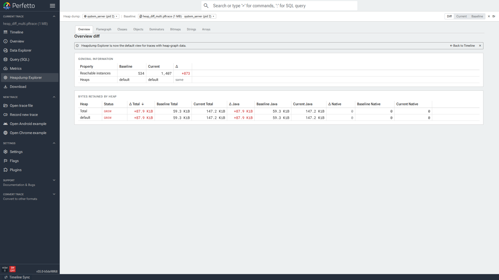

### Flamegraph tab

Same-trace flamegraph diff, palette colours preserved per class,
saturation / lightness modulated by Δ direction. UI sub-tree (left:
Application → Activity → Fragment → ViewHolder → TextView / ImageView →
String / Bitmap) reads as vivid (grew). Service sub-tree (right:
ServiceManager → BackgroundService → Worker → Task) reads as faded
(shrank).

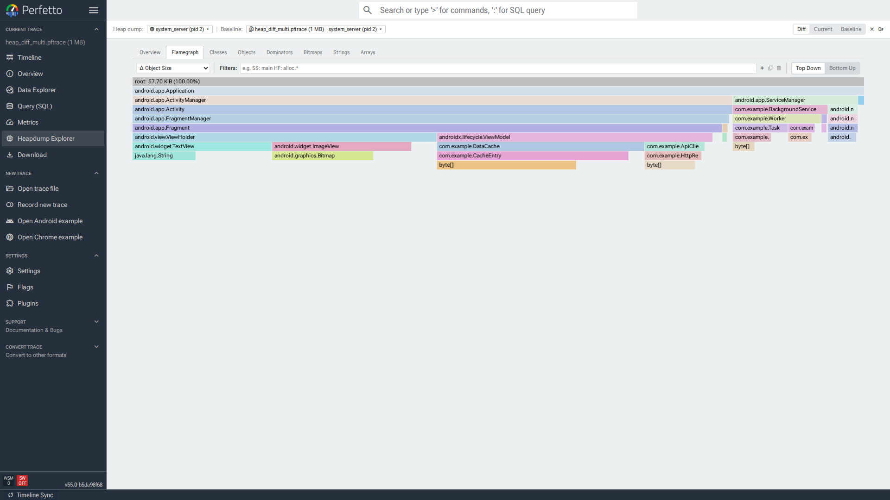

### Classes tab

Per-class diff breakdown. Status pills (GREW / SHRANK / NEW / GONE) and
signed deltas next to baseline / current values.

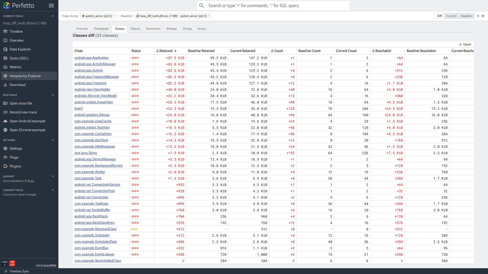

### Objects tab

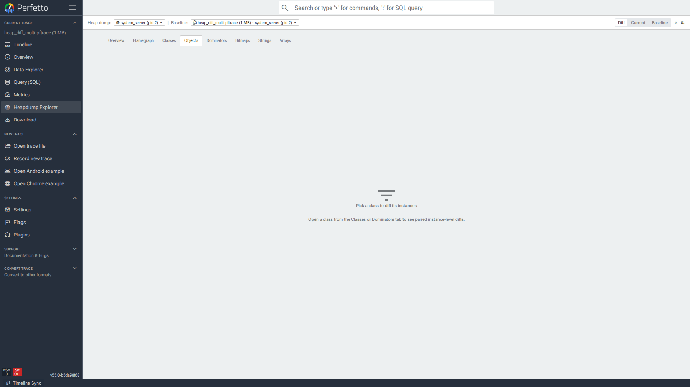

### Dominators tab

Dominator-tree retained-size diff per root class (size, count, native
size, retained obj count — all four columns are diffable).

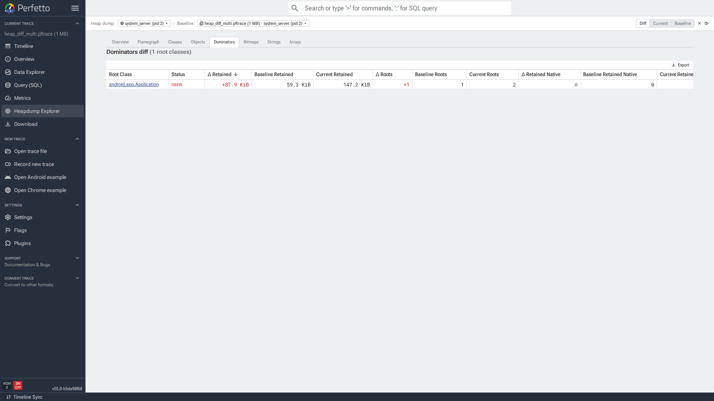

### Bitmaps tab

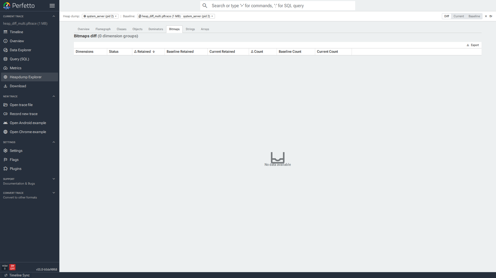

### Strings tab


### Arrays tab

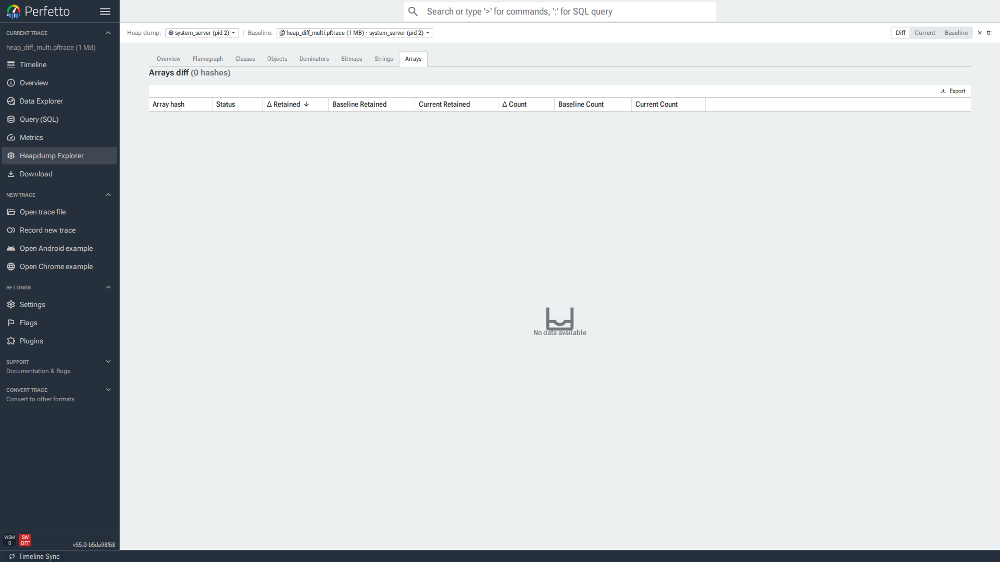

### Primary-dump popup

The primary-dump selector showing the "Diff against this dump" section.
Selecting another dump from the same trace activates the same-trace
flamegraph diff.

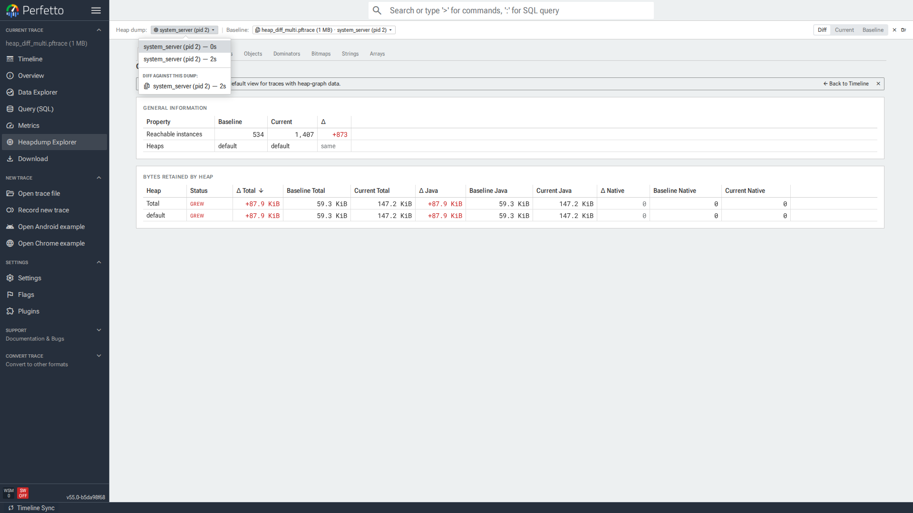

## Cross-trace fixture (real JVM hprofs)

Built by running the Java app at
`tools/heap_dump_diff_test_app/HeapDumpDiffTest.java` against a 1-GB
JVM. The app constructs an object graph with deep reference chains
(Application → ActivityManager → … → byte[]), then calls
`HotSpotDiagnosticMXBean.dumpHeap` twice with different scales between
the two dumps. The resulting `current.hprof` (smaller, services-heavy)
is opened as the primary trace and `baseline.hprof` (larger, UI-heavy)
is loaded as the cross-trace baseline.

### Overview (cross-trace)

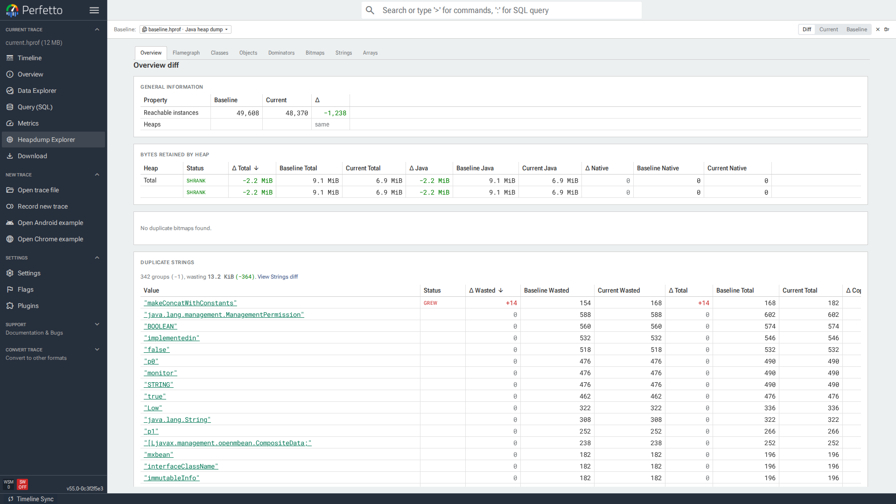

### Classes (cross-trace)

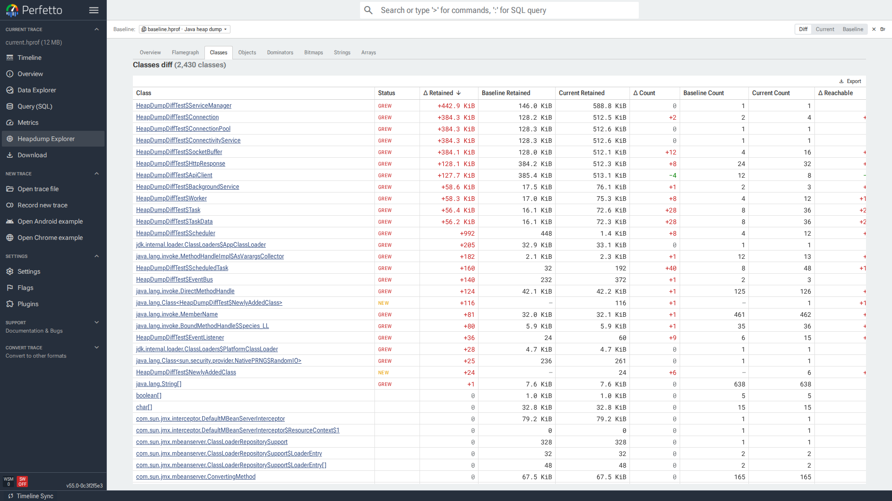

### Dominators (cross-trace)

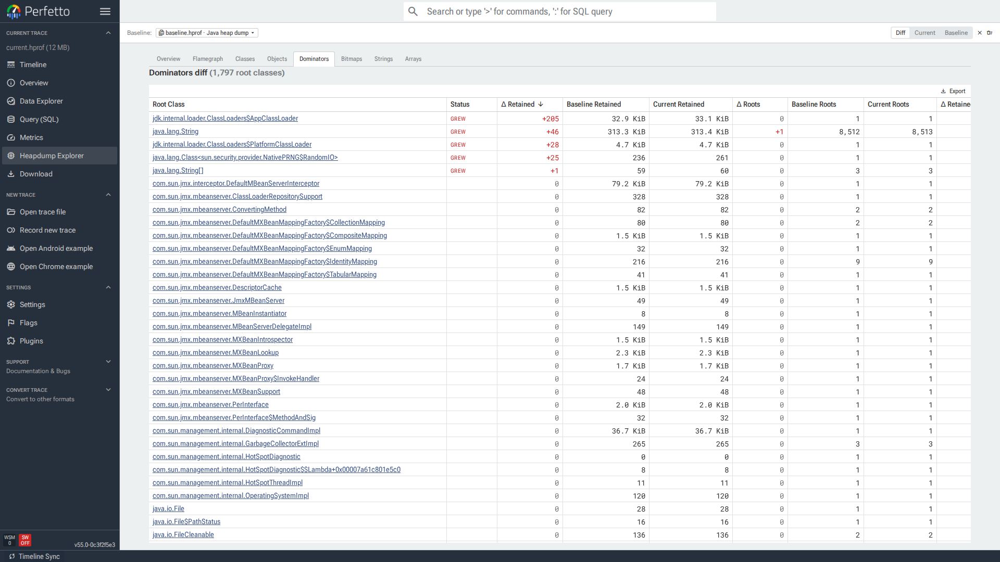

### Strings (cross-trace)

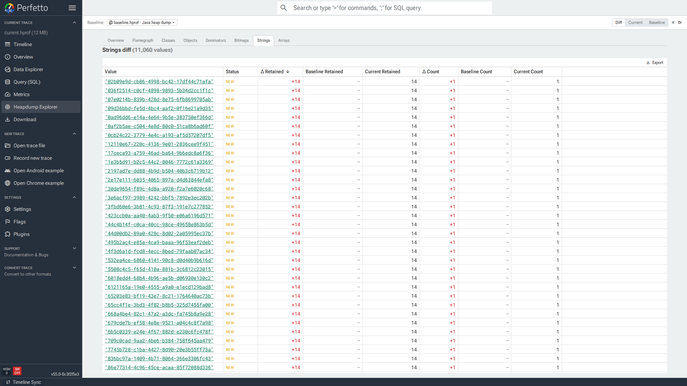

### Arrays (cross-trace)

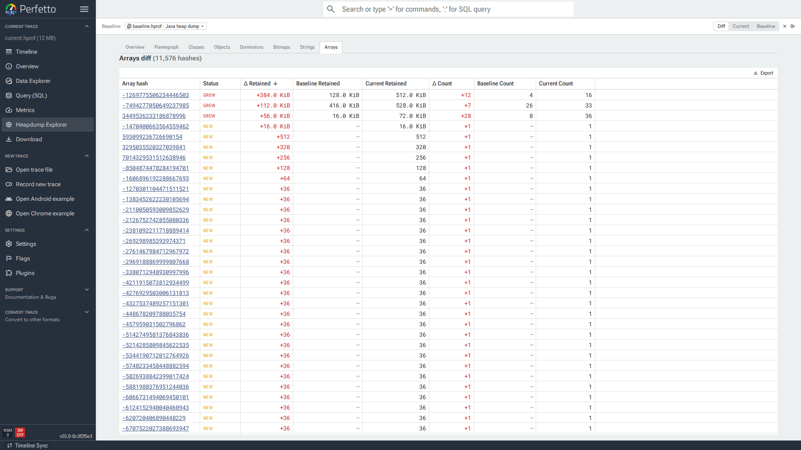

## Reproducing locally

```sh
# Capture two real hprofs.
cd tools/heap_dump_diff_test_app
javac HeapDumpDiffTest.java
java -Xmx1g HeapDumpDiffTest baseline.hprof current.hprof

# Build the same-trace synthetic fixture.
python3 build_rich_fixture.py
out/ui/protoc --encode=perfetto.protos.Trace -I . protos/perfetto/trace/trace.proto \
    < /tmp/hprof_test/multi_dump_rich.textproto \
    > test/data/heap_diff_multi.pftrace

# Serve the UI.
cd ui && pnpm install && node build.js --serve --watch

# In another shell, run the playwright e2e suites.
cd ui && pnpm exec playwright test src/test/heap_dump_flamegraph_diff.test.ts
cd ui && pnpm exec playwright test src/test/heap_dump_diff.test.ts
cd ui && pnpm exec playwright test src/test/heap_dump_diff_hprof_primary.test.ts
```
