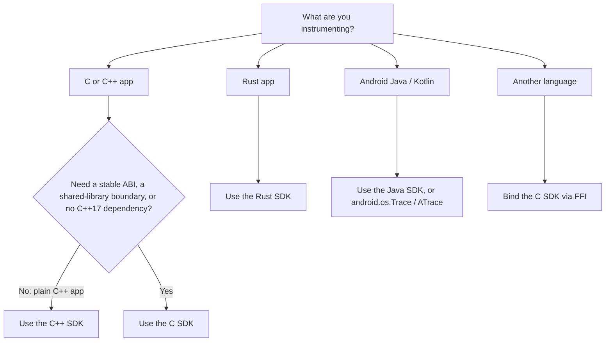

# Choosing a Perfetto SDK

Perfetto lets you add trace points to your own application so your events show up
on the same timeline as system events (CPU scheduling, syscalls, memory, and
more). You can do this from several languages. This page helps you pick the right
SDK and explains how they fit together.

The one-line summary:

> **Instrument once against a stable-by-design C ABI, and reach Perfetto from C,
> C++, Rust, Java, or any language you can FFI.**

## How the SDKs fit together

There is really one SDK — a C ABI — with language bindings on top of it.

At the bottom is the **C ABI**, shipped as the `libperfetto_c` shared library
(`include/perfetto/public/abi/*`, implemented in `src/shared_lib/`). It is a
plain-C boundary of opaque pointers and `extern "C"` functions, designed to be
stable across compilers and language boundaries.

On top of that sits a **header-only C convenience layer**
(`include/perfetto/public/*.h`) of inline functions and macros — this is what you
write when you use the C SDK directly.

Every other SDK is a binding over that same ABI:

- The **C++ SDK** is the native, most ergonomic binding for C++ apps.
- The **Rust SDK** wraps the ABI with `bindgen` and adds safe, idiomatic Rust.
- The **Java / Android SDK** wraps the ABI over JNI.
- **Your own language** can bind it too — Rust and Java are the precedent.

Because they all funnel into the same core, **they all emit the identical
protobuf trace format**. Events from any of them interoperate on one timeline in
the [Perfetto UI](https://ui.perfetto.dev), and combine with system tracing.

## Which one should I use?

### Decision matrix

| If you… | Use | Why |
| --- | --- | --- |
| Write a pure C++ app and want maximum ergonomics **and** stability today | [C++ SDK](/docs/instrumentation/tracing-sdk.md) | `TRACE_EVENT` one-liners, typed protos, and it is stable now |
| Ship a shared library or plugin, or otherwise need a stable-by-design ABI | **[C SDK](/docs/getting-started/c-sdk.md)** | Opaque-pointer ABI in `libperfetto_c` survives compiler/version boundaries |
| Cannot take a C++17 runtime dependency, or want minimal binary size | **[C SDK](/docs/getting-started/c-sdk.md)** | Header-only wrappers + a High-Level ABI tuned for small call sites |
| Want to bind a new language (Go, Swift, …) | **[C SDK](/docs/getting-started/c-sdk.md)** | It is the FFI target; Rust and Java are worked precedents |
| Write Rust | [Rust SDK](/docs/getting-started/rust-sdk.md) | A safe wrapper over the C SDK |
| Instrument Android Java/Kotlin | [Java SDK](/docs/instrumentation/java-sdk.md), or [ATrace](/docs/data-sources/atrace.md) | JNI over the C SDK; ATrace is simpler for common cases |

## The C SDK is the flagship — with an honest caveat

The C SDK is Perfetto's strategic direction for instrumentation: it is the
foundation every other binding is built on, and the place new capabilities land
first. That is why this documentation leads with it.

WARNING: **The C SDK is not yet stable.** Its API and ABI are subject to change,
there is no timeline (realistically at least a year out, as a lower bound), and
stabilization is gated on ongoing work to make the entire Android OS build on it.
Choose it today when you specifically need what only it provides. See
[ABI stability](/docs/reference/c-sdk-api.md#stability) for the full picture.

If you are writing a plain C++ application and none of the C-SDK-specific reasons
above apply to you, the **C++ SDK is the pragmatic choice today**: it is equally
capable for app instrumentation, more ergonomic, and already stable. It is not
deprecated and remains fully supported.

## What about Android-only instrumentation?

If you only need Android userspace instrumentation and the existing
[`android.os.Trace`](https://developer.android.com/reference/android/os/Trace)
(SDK) / [`ATrace_*`](https://developer.android.com/ndk/reference/group/tracing)
(NDK) APIs are sufficient, keep using them — they are fully supported in Perfetto
(see [ATrace instrumentation](/docs/data-sources/atrace.md)). Reach for a Perfetto
SDK when you need richer events (typed args, counters, flows, custom data
sources) or the same instrumentation across platforms.

## Next steps

- **[C SDK: Getting Started](/docs/getting-started/c-sdk.md)** — record your first
  trace in C.
- **[C++ SDK](/docs/instrumentation/tracing-sdk.md)** — the C++ binding.
- **[Rust SDK](/docs/getting-started/rust-sdk.md)** — the Rust binding.
- **[Java / Android SDK](/docs/instrumentation/java-sdk.md)** — the Android binding.
- **[C SDK Reference](/docs/reference/c-sdk-api.md)** — headers, functions, and the
  stability contract.
