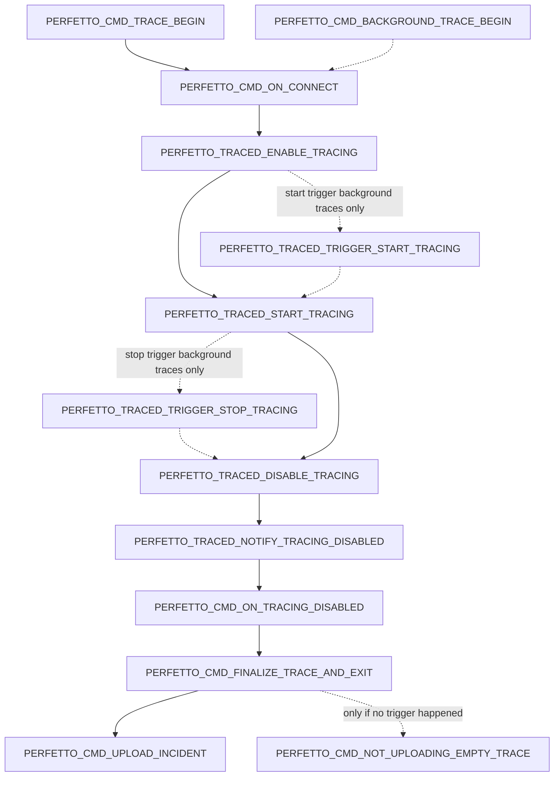

# Statsd Checkpoint Atoms
## Tracing

This diagram gives the atoms and the state transitions between when tracing/
All atoms above log the UUID of the trace;
`PERFETTO_TRACED_TRIGGER_STOP_TRACING` is special as it *also* logs the trigger
name which caused trace finalization.

NOTE: dotted lines indicate these transitions only happen in background
configs; transitions with solid lines happen in both background and
non-background cases.

NOTE: for background traces, *either* start triggers or stop triggers are
supported; both cannot happen for the same trace.

## Triggers

This diagram gives the atoms which can trigger finalization of a trace. 
These atoms will not be reported individually but instead aggregated by trigger name
and reported as a count.

