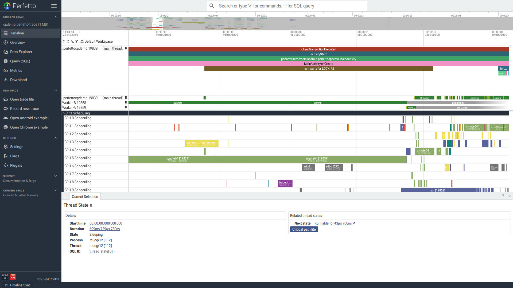

# Critical Path

When a thread is `Sleeping`, the lock or syscall it's blocked on
rarely tells you why wall-clock time is being spent. The holder of
that resource is itself often off-CPU, blocked further down a chain
of waits. The Critical Path follows the kernel scheduler's wakeup
graph backwards from the sleeping thread and, at every instant in
the wait window, names the thread that is actually on-CPU on its
behalf.

This guide covers:

- [Capturing](#capture-the-data) the ftrace events the analysis
  needs.
- [Opening](#open-the-critical-path-in-the-ui) the critical path in
  the UI and [reading the result](#read-the-result) on a worked
  monitor-contention example.
- [Querying it with SQL](#querying-it-with-sql) for batch or
  programmatic analysis.
- A second [case study](#case-study-2-kernel-lock-contention-from-a-thread-storm)
  on kernel-lock contention from a thread storm, where the
  attribution is spread across many siblings rather than a single
  blocker.
- [Common pitfalls](#common-pitfalls).

The same machinery applies to binder calls, IO waits, and other
sleeps where the kernel records a waker.

## Case study 1: monitor contention

Consider an app where `MainActivity.onCreate` blocks for ~60 ms
inside `synchronized (LOCK_AB)`. The shape is three threads deep:

```
main thread     wants LOCK_AB ────────┐
                                      ↓
Worker-A        holds LOCK_AB,
                wants LOCK_BC ────────┐
                                      ↓
Worker-B        holds LOCK_BC,
                doing 120 ms of CPU work
```

The Java that produces it:

```java
// Worker-B
synchronized (LOCK_BC) { burnCpu(120); }

// Worker-A
synchronized (LOCK_AB) {
    synchronized (LOCK_BC) { /* blocks for 120 ms */ }
}

// main
synchronized (LOCK_AB) { /* blocks behind Worker-A */ }
```

With ART's `dalvik` atrace category enabled, two slices appear on
main during the wait:

```
Lock contention on a monitor lock (owner tid: <Worker-A tid>)
monitor contention with owner Worker-A
  at MainActivity.lambda$startContenders$0(MainActivity.java:84)
  blocking from MainActivity.onCreate(MainActivity.java:60)
```

The owner is Worker-A, which suggests fixing Worker-A. Two things
make that wrong:

1. **The owner field is captured when contention starts.** ART
   writes the contention slice once, at the moment the waiter
   blocks. If the lock is released and re-acquired by a different
   thread during the wait, the displayed owner is stale.
2. **Even when the owner is stable, it may not be the thread
   consuming the wait time.** Worker-A holds `LOCK_AB` the whole
   time, but is itself in `S` state, blocked on `LOCK_BC`. The
   wall-clock cost of main's wait belongs to whichever thread is
   on-CPU on Worker-A's behalf — Worker-B.

The Critical Path resolves this by walking the wakeup graph and
attributing each instant of the wait to whichever thread is
actually running.

## Capture the data

```protobuf
buffers: { size_kb: 65536 }
duration_ms: 8000

data_sources: {
  config {
    name: "linux.ftrace"
    ftrace_config {
      ftrace_events: "sched/sched_switch"
      ftrace_events: "sched/sched_waking"
      ftrace_events: "sched/sched_wakeup_new"
      ftrace_events: "sched/sched_process_exit"
      ftrace_events: "task/task_newtask"
      atrace_categories: "dalvik"
      atrace_categories: "am"
      atrace_categories: "wm"
      atrace_categories: "view"
      atrace_categories: "gfx"
      atrace_apps: "<your.package>"
    }
  }
}
data_sources: { config { name: "linux.process_stats" } }
```

`sched_switch` and `sched_waking` are required to populate the
wakeup graph the analysis walks. `dalvik` is what gives you ART's
`Lock contention on a monitor lock` slices — without it you see
the wait but not the contention shape that names a nominal owner.
The remaining categories make the surrounding slice context
readable.

See [recording system traces](../getting-started/system-tracing.md)
for capture mechanics. Open the resulting `.perfetto-trace` at
[ui.perfetto.dev](https://ui.perfetto.dev).

## Open the critical path in the UI

The **Critical path lite** action, rooted at a `Sleeping` segment
of any thread-state track, adds one row below that thread
segmented by which thread was on-CPU on the blocked thread's
behalf at each instant.

Click the `Sleeping` segment, then use the _"Critical Path Lite"_
button on the Thread State details panel that appears at the
bottom of the UI:



## Read the result

Pin the three threads and their thread-state tracks, run
`Critical path lite` on main's long Sleeping segment, then zoom in
on the wait:

![Main thread's slice track at top: clientTransactionExecuted, activityStart, performCreate, MainActivity.onCreate, then the long olive "main waits for LOCK_AB" slice, with two ART contention slices stacked beneath it: "monitor contention with owner Worker-A (...) at MainActivity.lambda$startContenders$0 ... blocking from MainActivity.onCreate" and "Lock contention on a monitor lock (owner tid: <Worker-A>)". Below: thread-state rows for main (mostly Sleeping during the wait), Worker-B (solidly Running through the bulk of the wait), Worker-A (mostly S, briefly Running near the end). The Critical Path Lite track at the bottom is dominated by the long pink Worker-B segment, with brief prefixes/suffixes attributed to main itself and a short Worker-A bridge near the end.](../images/critical-path/01-overview.png)

The Lite chain attributes each instant of main's 60 ms wait to
the thread that was on-CPU on its behalf:

| relative ms | duration | on-CPU on main's behalf |
|---|---|---|
| 0.00 – 0.21 ms   |  0.21 ms |  main self-run, finishing its quantum |
| 0.21 – 51.44 ms  | **51.23 ms** | **Worker-B** (the CPU burn under `LOCK_BC`) |
| 51.46 – 53.77 ms |  2.31 ms | Worker-A (re-acquiring `LOCK_BC` and `LOCK_AB`) |
| 53.78 – 60.03 ms |  6.25 ms | main self-run, after monitor release |

Worker-B accounts for 85% of the 60 ms wait. Worker-A — the thread
the ART contention slice names as the owner — is on the chain for
~2 ms total, the time it takes to release the monitors. The fix is
on Worker-B:

```java
// Before
synchronized (LOCK_BC) {
    burnCpu(120);          // CPU work inside the lock
}

// After
synchronized (LOCK_BC) {
    // only the lock-protected mutation
}
burnCpu(120);              // CPU work outside the lock
```

After this change Worker-B releases `LOCK_BC` immediately,
Worker-A's critical section completes in microseconds, and
`onCreate` exits in a few ms.

The general pattern: when an ART contention slice names an owner
that doesn't account for your wait, follow the critical path
backwards until the chain reaches a thread in `Running` — that's
the one to fix.

## Querying it with SQL

The same data is available through the `sched.thread_executing_span`
stdlib module — useful for batch and programmatic analysis. Root the
query at the waiter and bound it to the wait slice itself so that
root-thread self-time outside the wait doesn't dominate the result:

```sql
INCLUDE PERFETTO MODULE sched.thread_executing_span;

SELECT
  thread.name AS blocker_thread,
  process.name AS blocker_process,
  sum(cp.dur) / 1e6 AS total_ms,
  count(*) AS segments
FROM _thread_executing_span_critical_path(
       (SELECT thread_track.utid FROM slice
        JOIN thread_track ON slice.track_id = thread_track.id
        WHERE slice.name = 'main waits for LOCK_AB'),
       (SELECT ts FROM slice WHERE name = 'main waits for LOCK_AB'),
       (SELECT dur FROM slice WHERE name = 'main waits for LOCK_AB')) AS cp
JOIN thread ON cp.utid = thread.utid
LEFT JOIN process USING (upid)
GROUP BY thread.name, process.name
ORDER BY total_ms DESC;
```

```
"blocker_thread", "blocker_process", "total_ms", "segments"
"Worker-B",        <app process>,     51.25,      1
<app main thread>, <app process>,      6.47,      2
"Worker-A",        <app process>,      2.31,      1
```

Numbers sum to the wait dur (60.03 ms).

NOTE: Looking up the wait by slice name (here `main waits for
LOCK_AB`, an app-emitted atrace slice wrapping the contended
`synchronized` block) is more robust than by process name. On cold
launch `process.name` may still report the zygote name because
`linux.process_stats` raced ahead of `setprocname`; the slice
carries the right `utid` regardless.

## Case study 2: kernel-lock contention from a thread storm

Monitor contention puts a single thread on the chain. Kernel-lock
contention from a thread storm looks different: a process that
creates many threads at once contends with itself on the per-process
`mmap_lock`, and the chain attribution is spread across every
concurrent sibling. Same machinery, different shape.

Consider an app whose initialiser spawns 200 threads in a tight
loop:

```java
Thread[] children = new Thread[200];
for (int i = 0; i < 200; i++) children[i] = new Thread(work, "Storm-" + i);
for (Thread t : children) t.start();   // <-- the storm
for (Thread t : children) t.join();
```

200 `Thread.start()` calls take ~140 ms — averaging ~700 µs per
spawn. Without contention `pthread_create` is ~5 µs, so most of
this is wait time inside the kernel.

### Capture additions for kernel locks

`thread_state.blocked_function` (the kernel symbol the thread is
blocked in) needs three things on top of the monitor-case config:

```protobuf
ftrace_events: "sched/sched_blocked_reason"   # the event itself
symbolize_ksyms: true                         # resolve symbols
ksyms_mem_policy: KSYMS_RETAIN                # keep them at runtime
```

`sched_blocked_reason` records a kernel address; perfetto
resolves it against `/proc/kallsyms` if `symbolize_ksyms` is on.
`/proc/kallsyms` itself only exposes real addresses when
`/proc/sys/kernel/kptr_restrict` is `0` — on most Android builds
it defaults to `2` (zeroed), so on `userdebug`:

```bash
adb root
adb shell 'echo 0 > /proc/sys/kernel/kptr_restrict'
```

If you skip these, `thread_state.blocked_function` stays NULL and
you can see the wait but not which kernel lock it's on.

### Read the result

The `mm`-lock contention shows up directly on the spawn-loop
thread's thread-state track: short, frequent `D` segments
labelled with kernel functions (`prctl_set_vma`, `__vm_munmap`,
`vm_mmap_pgoff`, `mmap_read_lock_killable`, `do_mprotect_pkey`,
`do_exit`). Aggregating across the storm window:

```sql
SELECT thread_state.blocked_function, count(*) AS cnt,
       sum(thread_state.dur)/1e6 AS total_ms
FROM thread_state JOIN thread USING(utid) JOIN process USING(upid)
WHERE process.pid = <app_pid>
  AND thread_state.blocked_function IS NOT NULL
  AND thread_state.ts BETWEEN <storm_start_ts> AND <storm_end_ts>
GROUP BY blocked_function ORDER BY total_ms DESC;
```

```
"blocked_function",          "cnt", "total_ms"
"__vm_munmap",                76,    62.03
"prctl_set_vma",              76,    52.51
"do_mprotect_pkey",           62,    41.55
"vm_mmap_pgoff",              85,    38.82
"mmap_read_lock_killable",    31,    18.10
"do_exit",                    32,    17.34
"mmap_read_lock",             16,     4.53
```

Every entry is a path that takes the per-process `mmap_lock`
(write side for `mmap`/`munmap`/`mprotect`/`prctl_set_vma`, read
side for the `_killable` variant during signal-aware waits).
`pthread_create` mmap's a new thread stack, the exit path
munmap's it, and the process is contending on its own
`mm_struct` from many CPUs at once.

Running `Critical path lite` on the spawn-loop thread over the
storm window:


A 10% slice of the storm, where individual chain hops are
visible:


The blocker ranking confirms the contention is intra-process: every
blocker is in the same process as the spawn-loop thread.

```sql
INCLUDE PERFETTO MODULE sched.thread_executing_span;

SELECT
  CASE WHEN cp.utid = (SELECT utid FROM thread WHERE tid = <main_tid>)
       THEN 'self (main, on-CPU)' ELSE 'other thread in same process' END
       AS attribution,
  count(distinct cp.utid) AS distinct_threads,
  sum(cp.dur) / 1e6 AS total_ms
FROM _thread_executing_span_critical_path(
       <main_utid>, <storm_start_ts>, <storm_dur>) cp
GROUP BY attribution
ORDER BY total_ms DESC;
```

```
"attribution",                   "distinct_threads", "total_ms"
"self (main, on-CPU)",            1,                  81.79
"other thread in same process",   147,                77.99
```

Half the wait is main running on-CPU; the other half is fragmented
across **147 distinct sibling threads**, with no single thread
dominant. Many distinct blockers in the same process is the
signature of intra-process kernel-lock contention. The same query
against a victim blocked on something external — for example a
binder call to a slow service — would show a different process in
the attribution and a much lower `distinct_threads` count.

### Mitigation

This is a parallelism problem, not a correctness one. Three
mitigations apply:

- **Bound the executor.** Replace
  `Executors.newCachedThreadPool()` (or a hand-rolled spawn loop)
  with `newFixedThreadPool(n)` sized to the cores you actually
  have. Reuse threads rather than paying mmap+munmap per task.
- **Stagger startup.** If the storm is during cold launch, spread
  the thread creation across the first few frames instead of
  doing it synchronously in `onCreate`.
- **Reduce stack size.** Android's default thread stack is 1 MB,
  which `pthread_create` mmap's per spawn. A smaller stack
  proportionally reduces the mmap work done under `mmap_lock`.

The general pattern: when `blocked_function` on a victim names a
kernel symbol and the critical-path attribution stays inside the
same process, the cause is intra-process kernel-lock self-contention.
The fix is reducing parallelism or per-operation work, not chasing
an offending peer.

## Other uses

Beyond the two case studies, the same machinery applies to any
sleep where the kernel records a waker:

- **Cross-process binder calls** — a foreground thread issues a
  binder transaction and blocks; the chain follows the binder
  thread on the server process into the slow path on that side.
  Useful for ANR or startup investigations where the server-side
  cause isn't obvious from the client trace alone.
- **App-startup waits and ANR roots** — `Looper.poll` or a
  framework call is the visible symptom; the cause is often a
  thread not implicated by the symptom itself. The
  [scheduling-blockages](../case-studies/scheduling-blockages.md)
  case study has more.

## Common pitfalls

**The button doesn't produce any output.** The trace is missing
`sched_switch` and/or `sched_waking`. Re-record with the config
above. On Android the device must allow ftrace capture
(`userdebug` build, or appropriate permissions).

**The Critical Path Lite track has gaps.** Two reasons:

1. **The wakeup graph dead-ends.** Some chain hop has no waker
   recorded — typically because the trace started in the middle
   of a long wait, or because the chain reaches a kernel thread
   woken purely by a hardware interrupt with no userspace
   provenance. The analysis is conservative and won't invent
   attribution.
2. **The trace covers less than the wait.** If the wait extends
   before `trace_start()` only the time inside the trace window
   can be attributed.

**Rooting at a non-main thread.** The action works on any
thread-state segment; the SQL function takes an arbitrary `utid`.
Useful for tracing why a binder thread on a service process was
slow to reply, or why a kworker stalled.

## See also

- [`sched.thread_executing_span`](/docs/analysis/stdlib-docs.autogen#package-sched) —
  stdlib module reference for the SQL surface used above.
- [Scheduling blockages case study](/docs/case-studies/scheduling-blockages.md) —
  end-to-end walkthrough of using critical-path analysis on real
  startup and ANR investigations.
- [Recording system traces](/docs/getting-started/system-tracing.md) —
  capture mechanics and config reference.
