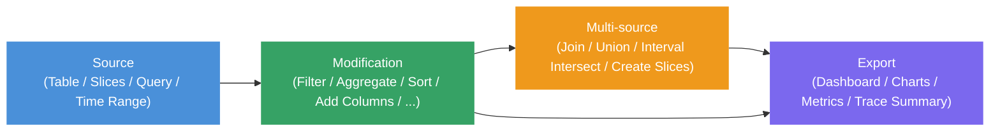

# Data Explorer

The Data Explorer is a tool for interactively exploring trace data without
writing SQL. The core idea is to think of your analysis as a **pipeline**:
you start from a data source (a table or custom SQL), then chain operations
on top of it - filters, aggregations, joins, and more - by connecting nodes
on a visual canvas or interacting directly with the data in a table. Results
are shown live as you build.

It is most useful when you are:

- **Investigating unfamiliar data** - browsing what columns and values a
  table contains before committing to a query
- **Debugging performance issues** - quickly slicing, filtering, and
  aggregating events to narrow down where time is being spent
- **Iterating on an analysis** - building up a query step by step and
  inspecting intermediate results at each stage
- **Visualizing results** - charting query output as graphs and dashboards
  using the Charts node, or exporting back to the trace as a
  [debug track](/docs/analysis/debug-tracks.md)

The key features are:

- **No SQL required** - nodes abstract away SQL concepts entirely; for
  example, adding a column doesn't require knowing about JOINs, and
  conditional expressions are built through a form rather than written as
  SQL
- **Specialized for Perfetto** - first-class support for trace-specific
  operations: intersecting time intervals, filtering events to a time range
  selected on the timeline, generating time ranges, and pairing start/end
  events into slices
- **Stdlib-aware** - integrates with the
  [PerfettoSQL standard library](/docs/analysis/perfetto-sql-getting-started.md);
  when picking a table source, the Data Explorer knows which tables exist
  and which ones actually contain data for the currently loaded trace
- **Visual graph** - compose queries by connecting nodes on a canvas; the
  graph structure maps directly to the query structure
- **Interactive data grid** - results update live as you build; you can
  also create new nodes directly from the grid without going back to the
  canvas - click a column value to add a filter, or enrich results by
  adding columns from a related table based on a foreign key
- **Charts and dashboards** - attach a Charts node to any query to
  produce charts; multiple visualizations can be combined into a dashboard
- **Full SQL power when needed** - the builder generates real SQL; you can
  inspect the generated query at any point and drop into a Query node
  when the built-in nodes aren't enough
- **Persistent state** - the graph is saved in the permalink and cached in
  the browser, so no work is lost between sessions and the same graph is
  available for any trace you open
- **Import / export** - save and share query graphs as JSON files

## Concepts

### Projects

Work in the Data Explorer is organized into **projects**. Each project
contains one query graph and any number of dashboards. You can maintain
multiple projects to keep separate analyses distinct, or do them all on in one project - the choice is yours.

### Nodes

The core concept in the Data Explorer is a **node**. Nodes fall into
three categories:



- **Source nodes** - provide the initial data. Examples: a SQL table,
  a slice query, or a custom SQL expression.
- **Modification nodes** - take a single input and transform it.
  Examples: filter, aggregate, sort, add columns. Every row comes in
  from one upstream node and comes out modified or filtered.
- **Multi-source nodes** - combine data from two or more inputs, with
  no single primary source. Examples: join, union, interval intersect,
  create slices.
- **Export nodes** - sit at the end of a pipeline and produce output
  outside the query graph: a dashboard view, a chart, a metric spec,
  or a trace summary for cross-trace analysis.

### The Graph

Nodes are arranged on a canvas. Connect two nodes by dragging from one
node's output port to another node's input port. Most nodes have a
single **primary input** (vertical flow); some accept **secondary
inputs** (side ports) for join-style operations. Data flows from left
to right (or top to bottom): each node receives the output of the
node(s) upstream of it and passes its own output downstream.

To insert a node into an existing pipeline, click the **+** button on
the node you want to insert after — the new node is automatically wired
between that node and its downstream connections. You can also insert
nodes directly from the data grid without going back to the canvas: for
example, clicking a cell value adds a Filter node on that value inline.

To delete a node, select it and press `Delete` (or use the right-click
menu). If the deleted node is in the middle of a pipeline, its primary
parent is automatically reconnected to its primary children so the rest
of the graph stays intact.

Use buttons to undo and redo changes.

### Column Types

Every column has a PerfettoSQL type. Types affect how values are
displayed in the data grid, what operations are available on a column,
and what the data grid can do when you interact with it.

| Type | Description |
|------|-------------|
| `int` | Integer value |
| `double` | Floating-point value |
| `string` | Text |
| `boolean` | True / false |
| `timestamp` | Absolute timestamp in nanoseconds; displayed as a human-readable time in the data grid |
| `duration` | Duration in nanoseconds; displayed in readable units (ms, us, etc.) in the data grid |
| `arg_set_id` | Reference to a set of trace arguments; enables the **From args** feature in Add Columns |
| `id` | Integer ID referencing a specific row in a known table; displayed as a link to the timeline in the data grid, and enables foreign-key column enrichment |
| `joinid` | Like `id`, but specifically used as a join key |
| `bytes` | Raw byte sequence; rarely encountered in practice |

Types are inferred automatically from the standard library schema. For
columns produced by a Query node or computed expressions, the type may
need to be set manually via Modify Columns or the column type picker in
Add Columns.

### Results

Select any node in the graph to see its results in the data grid below the
canvas. The grid supports column sorting, filtering, and adding new columns,
and handles large result sets via pagination through the query engine. Column types are
used for special cell formatting - durations are shown in readable units,
and IDs link directly to the timeline.

## Building a Query

### Smart Graph

The quickest way to get started is **Smart Graph**, available from the
navigation panel. It inspects the currently loaded trace and automatically
generates a graph populated with all the Core and Very Common tables that
have data - giving you an overview of what is available in the trace
without any manual setup.

When exploring, focus on the **Very Common** tables first - these are the
ones we recommend as good starting points for your use case. Core tables
are an unfiltered, unopinionated set gathered directly from the Trace
Processor and are included for completeness, not as a recommended starting
point. See the Table section in Node Reference below for the full
explanation of importance levels.

### Adding a source node

Click the blue **+** button in the top-left corner of the canvas to open
the node menu. Under **Sources**, pick the starting point for your data:

| Node | Description | Hotkey |
|------|-------------|--------|
| [**Table**](#table) | Use any standard library table | `T` |
| [**Slices**](#slices) | Pre-configured query over trace thread slices | `L` |
| [**Query**](#query) | Custom SQL query; column types may need to be set manually | `Q` |
| [**Time Range**](#time-range) | A time interval, entered manually or synced from the timeline selection | — |

### Adding nodes

With a node selected, open the node menu and pick an operation. The new
node is automatically wired to the selected node. Operations come in two
kinds:

**Modification nodes** transform a single input:

| Node | Description |
|------|-------------|
| [**Filter**](#filter) | Filter rows by value, condition, set membership, or time interval. |
| [**Aggregation**](#aggregation) | Group rows and add aggregated columns. |
| [**Sort**](#sort) | Order rows by one or more columns, ascending or descending. |
| [**Modify Columns**](#modify-columns) | Rename, remove, or change the types of columns. |
| [**Add Columns**](#add-columns) | Add columns from a secondary source or computed expressions. |
| [**Limit / Offset**](#limit-offset) | Restrict the number of rows returned. |
| [**Filter During**](#filter) | Keep rows that fall within intervals from a secondary source. |
| [**Counter to Intervals**](#counter-to-intervals) | Convert counter data (timestamps, no duration) into intervals with `ts` and `dur`. |
| [**Charts**](#charts) | Visualize data as bar charts or histograms; clicking a bar adds a filter. |

**Multi-source nodes** combine data from multiple sources, with no single
primary input:

| Node | Description |
|------|-------------|
| [**Join**](#join) | Combine columns from two sources on a shared key. |
| [**Union**](#union) | Stack rows from multiple sources into a single result. |
| [**Interval Intersect**](#interval-intersect) | Return only the overlapping portions of two sets of time intervals. |
| [**Create Slices**](#create-slices) | Pair start/end events from two sources into slices. |

**Export nodes** produce output outside the query pipeline:

| Node | Description |
|------|-------------|
| [**Dashboard**](#dashboard) | Export the data source to a dashboard. |
| [**Metrics**](#metrics) | Define a trace metric with a value column and dimensions. |
| [**Trace Summary**](#trace-summary) | Bundle multiple metrics into a single trace summary specification. |

## Running Queries

Most nodes execute automatically as you build the graph. Nodes that
require you to write SQL or finish configuring inputs before they can
run — such as the Query node — show a **Run Query** button instead.
Click it once the node is ready.

## Viewing Results

Click any node to select it. Its results appear in the data grid at the
bottom of the Data Explorer. The grid supports:

- **Column sorting** - click a column header to sort
- **Column filtering** - filter values inline within the grid
- **Export to timeline** - send results back to the main timeline as a
  [debug track](/docs/analysis/debug-tracks.md) using the **Export to
  timeline** button in the data grid toolbar

To see the generated SQL for a selected node, click the **SQL** tab in
the node sidebar. The **Proto** tab shows the node's internal query
representation as a structured proto — useful for debugging or for
sharing query graphs programmatically.

## Import / Export

Use the **Export** button to save the current graph as a JSON file. Use
**Import** to reload a previously saved graph. This is useful for sharing
query pipelines with teammates or saving work across sessions.

## Examples

Click **Examples** in the Data Explorer toolbar to load a curated set of
pre-built query graphs. These cover common analysis patterns — finding
long slices, aggregating CPU time by process, filtering events to a time
window, joining thread metadata, and building dashboards — and are a good
starting point for building your own queries.

## Node Reference

### Sources {#sources}

#### Table {#table}

Loads any table from the
[PerfettoSQL standard library](/docs/analysis/perfetto-sql-getting-started.md).
When picking a table, the Data Explorer shows which tables exist and
highlights those that contain data for the currently loaded trace.

Tables are tagged with an importance level that indicates how broadly
useful they are:

| Level | Label | Meaning |
|-------|-------|---------|
| `core` | Core | Unfiltered, unopinionated set of tables gathered directly from the Trace Processor - present for completeness, not recommended as a starting point |
| `high` | Very common | Tables recommended as good starting points for analysis |
| `mid` | *(no badge)* | Common tables, shown without a label |
| `low` | Deprecated | Tables that are deprecated and may be removed |

Smart Graph automatically adds all Core and Very Common tables that have
data for the loaded trace. Start your exploration with the Very Common
ones.

NOTE: The "has data" indicator is best-effort. Not all tables marked as
having data will necessarily contain rows - treat it as a hint rather than
a guarantee.

#### Slices {#slices}

A pre-configured source over all thread slices in the trace, with thread
and process metadata already joined in — exposing columns like `ts`,
`dur`, `name`, `tid`, `pid`, `thread_name`, and `process_name` without
any manual joining. Equivalent to querying the `slice` table with thread
and process context. A good starting point for exploring what events are
present without needing to know which tables to join.

#### Query {#query}

A freeform SQL editor. Use this when the built-in source nodes aren't
sufficient.

A Query node accepts exactly one `SELECT` statement. You may also
include `INCLUDE PERFETTO MODULE` statements before it to pull in
standard library modules. No other statements are allowed - no
`CREATE`, no `INSERT`, no multiple `SELECT`s.

If you connect other nodes to this node's input ports, you can
reference them in your query as `$input_0`, `$input_1`, etc. - for
example `FROM $input_0` in your `SELECT`. This lets you compose
freeform SQL on top of the output of any upstream node.

Column types are never inferred from arbitrary SQL - if you want
columns to have the correct types (for link rendering, duration
formatting, foreign-key enrichment, etc.), you must set them manually
using a [Modify Columns](#modify-columns) node downstream.

#### Time Range {#time-range}

A time interval used as a data source. The interval can be entered
manually or synced from the current timeline selection - in the latter
case it updates dynamically as the selection changes. Useful as input to
[Filter During](#filter-during) or [Interval Intersect](#interval-intersect).

---

### Modification Nodes {#modification-nodes}

#### Filter {#filter}

There are three filter-family nodes, each covering a different kind of
filtering. All three reduce the number of rows in your result without
changing the columns.

<?tabs>

TAB: Normal

Filters rows based on conditions. In most cases you won't need to
create a Filter node manually - it's much faster to add filters
directly from the results of the node you want to filter:

- **Click a cell value** - adds an equals or not-equals filter on
  that value.
- **Click a column header** - opens a picker to select which values
  to filter on.

When you do need to create a Filter node manually, it supports two
modes:

- **Structured** - pick a column, an operator, and a value using the
  UI. Available operators: `=`, `!=`, `<`, `>`, `<=`, `>=`, `glob`,
  `is null`, `is not null`.
- **Freeform** - write a raw SQL `WHERE` expression for cases the
  structured mode can't express, such as multi-column conditions or
  subexpressions that don't fit the picker.

Multiple conditions can be combined with either `AND` (all must be
satisfied) or `OR` (any must be satisfied) - switchable at the node
level. Since the AND/OR mode applies to the whole node, complex
expressions like `(X OR Y) AND Z` are achieved by chaining two Filter
nodes: one with OR for the `X OR Y` part, and one with AND for the
`Z` part.

TAB: Filter In

Keeps only rows where a column's value appears in the output of a
secondary node. Equivalent to a SQL `WHERE col IN (SELECT ...)`.

Pick a base column from the primary input and a match column from the
secondary input - rows are kept when the base column value is found in
the match column. If there is only one common column between the two
inputs, it is auto-suggested.

Useful for filtering slices to only those belonging to a specific set
of threads, or filtering counters by a set of track IDs.

TAB: Filter During

Keeps only rows whose time intervals overlap with intervals from a
secondary source. Designed for trace-specific temporal filtering - for
example, keeping only events that occurred during a specific task,
frame, or phase of a trace.

Key options:

- **Clip to intervals** (default on) - the output `ts` and `dur` are
  clipped to the intersection with the filter interval. Turn this off
  to keep the original `ts` and `dur` of the primary row.
- **Partition by** - group the overlap calculation by one or more
  columns (e.g. by thread or process), so that filter intervals are
  only matched against primary rows in the same group.

Overlapping filter intervals are automatically merged. If a primary
row spans multiple non-overlapping filter intervals, it is duplicated
once per interval.

</tabs?>

#### Aggregation {#aggregation}

Groups rows by one or more columns and computes aggregate values.
Equivalent to a SQL `GROUP BY`. If no group-by columns are selected, the
entire result is aggregated into a single row.

Available aggregate functions:

| Function | Description |
|----------|-------------|
| `COUNT` | Count of non-null values in a column |
| `COUNT(*)` | Count of all rows |
| `COUNT_DISTINCT` | Count of unique non-null values |
| `SUM` | Sum of values |
| `MIN` | Minimum value |
| `MAX` | Maximum value |
| `MEAN` | Arithmetic mean |
| `MEDIAN` | Median value |
| `DURATION_WEIGHTED_MEAN` | Mean weighted by the `dur` column |
| `PERCENTILE` | Percentile value; requires specifying a percentile (0-100) |

Multiple aggregations can be added in a single node, each producing a
named output column.

#### Sort {#sort}

Orders rows by one or more columns, each independently ascending or
descending. Columns can be reordered by dragging to control priority.
Equivalent to a SQL `ORDER BY`.

#### Modify Columns {#modify-columns}

Controls which columns are passed downstream and how they appear:

- **Show / hide** - uncheck columns to remove them from the output
- **Rename** - give any column an alias
- **Change type** - override the inferred column type
- **Reorder** - drag columns into a different order

Useful for cleaning up intermediate results before further processing or
visualization.

#### Add Columns {#add-columns}

The mental model for this node is simple: take everything from the
upstream node, and add one or more new columns to it. Every row passes
through unchanged - the node only widens the result. Reach for it
whenever you look at a result and think "I wish this also had a column
for X."

Because "X" can mean many different things - a value from another
table, a computed expression, a label derived from a raw ID, a trace
argument - the node supports six different ways to produce a new
column:

<?tabs>

TAB: Join from another source

Use this when the column you want lives in a different table. Pick a
secondary node, choose which of its columns to bring in, and specify
the join keys. The join is performed automatically without writing SQL.

There are two ways the join key gets resolved:

- If the upstream data already contains a `joinid` column typed to a
  known table (for example `thread_id` typed to `thread`), the Data
  Explorer auto-suggests that table and pre-fills both sides of the
  join key - you just confirm and pick which columns to bring in. This
  is the common case and usually takes just a couple of clicks.
- If there is no typed suggestion, you manually pick a column from the
  primary input and a matching column from the secondary input to join
  on.

The join is a **left join**: every row from the upstream node is kept,
even if no matching row is found in the secondary source. For rows
with no match, the new columns will be `NULL`. This means adding
columns never silently drops rows from your result - you always see
the full upstream data, with missing values where the join found
nothing.

Each incoming column can be renamed and have its type overridden
inline.

TAB: Expression

Use this when the column you want can be computed from columns already
in the result. Write any valid PerfettoSQL expression and it is
evaluated per row. Anything you can write in a SQL `SELECT` clause
works here.

Examples:

- `dur / 1e6` - convert nanoseconds to milliseconds
- `name || ' (' || tid || ')'` - build a display label
- `ts + dur` - compute an end timestamp

TAB: Switch

Use this when you want to map specific values of an existing column to
a new output value - for example, turning a numeric state code into a
human-readable label, or translating an internal enum into something
meaningful.

Pick the column to switch on, then list cases: when the column equals
this value, produce that output. Equivalent to SQL
`CASE col WHEN v1 THEN r1 WHEN v2 THEN r2 END`, but expressed through
a form with no SQL knowledge needed.

On string columns, the match can use **glob patterns** instead of
exact equality - so you can map `com.google.*` to `'Google app'` and
`com.android.*` to `'Android app'` without listing every package name.
This is one of the reasons column types matter: the Data Explorer uses
the type to decide whether to offer glob matching as an option.

TAB: If

Use this when the column you want depends on a condition rather than
an exact value match. Write a condition, a value to produce when it is
true, optional `elif` branches for additional cases, and a fallback
`else` value.

Useful for bucketing rows - for example, producing `'long'` when
`dur > 1e9` and `'short'` otherwise, or tagging rows by threshold
ranges. Equivalent to SQL
`CASE WHEN cond THEN val ... ELSE fallback END`, but expressed through
a structured form.

TAB: From args

Use this when the column you want is stored as a trace argument on an
`arg_set_id` column, which is a very common pattern in Perfetto
traces.

Instead of manually writing the args join, the Data Explorer inspects
the current result set, discovers which arg keys are actually present
in the data, and presents them as a searchable list. Pick a key and a
new column appears, populated via `extract_arg(arg_set_id_col, key)`,
with the column name derived from the key automatically.

This makes surfacing arbitrary per-event metadata - render intents,
scheduling parameters, app-specific annotations - a matter of a few
clicks, with no knowledge of the args table schema required.

TAB: Apply function

Use this when the column you want is the return value of a PerfettoSQL
standard library function applied to the current rows.

A two-step flow: first search and select a function from the stdlib;
then configure argument bindings, mapping each function parameter to a
source column or a custom expression. Useful for calling helper macros
or any stdlib function over your data without dropping into a Query
node.

</tabs?>

Multiple columns of any mix of types can be added in a single node,
each configured independently. Each column's type can be overridden
inline if the automatic inference is incorrect.

#### Limit / Offset {#limit-offset}

Restricts how many rows are returned and optionally skips a leading
number of rows. Equivalent to SQL `LIMIT` / `OFFSET`. Default is
limit=10, offset=0. Useful for sampling large results or paginating
through data.

#### Counter to Intervals {#counter-to-intervals}

Converts counter data - which has timestamps but no duration - into
intervals by pairing each sample with the next, producing `ts`, `dur`,
`next_value`, and `delta_value` columns. The input must have `id`,
`ts`, `track_id`, and `value` columns, and must not already have a
`dur` column.

This is a necessary prerequisite for using counter data with
interval-based nodes like [Interval Intersect](#interval-intersect) or
[Filter During](#filter-during).

#### Charts {#charts}

Attaches one or more visualizations to the upstream data. Supported
chart types: bar, histogram, line, scatter, pie, treemap, boxplot,
heatmap, CDF, scorecard.

Each chart is configured independently with its own column, aggregation,
and display options. Filters can be applied per chart or shared across
all charts in the node. Clicking a bar or data point in the chart feeds
a filter back into the pipeline automatically.

---

### Multi-Source Nodes {#multi-source-nodes}

#### Join {#join}

Combines columns from two sources by matching rows on a shared key.
The left input provides the base rows; the right input provides the
columns to bring in.

Two join types are available:

- **Inner join** (default) - only rows that match on both sides are
  kept. Rows from the left input with no match in the right input are
  dropped.
- **Left join** - all rows from the left input are kept. For rows
  with no match on the right, the right-side columns are `NULL`.

The join condition can be configured in two modes:

- **Equality** - pick a column from the left input and a column from
  the right input; rows are matched when those columns are equal.
  This covers the common case.
- **Freeform** - write a custom SQL expression for cases the equality
  mode can't express, such as range conditions or multi-column keys.

You can select which columns from each side appear in the output, and
rename them with aliases.

NOTE: For simply enriching a result with columns from a related table,
[Add Columns](#add-columns) with "Join from another source" is usually
more convenient - it handles key suggestions automatically and is a
left join by default. Use this Join node when you need an inner join
or a freeform condition.

#### Union {#union}

Stacks rows from two or more sources into a single result. Accepts
any number of inputs (no upper limit).

You select which columns appear in the output. You can include columns
that are not present in every source - any column missing from one or
more sources is silently excluded from the output rather than causing
an error. Use [Modify Columns](#modify-columns) upstream to rename
columns if the names don't align across sources.

NOTE: This is more permissive than SQL `UNION` / `UNION ALL`, which
requires all inputs to have identical columns. Here, you can freely
add sources with different schemas - columns that don't appear in all
of them simply won't be in the result.

#### Interval Intersect {#interval-intersect}

Takes between two and six sources of time intervals and returns only
the portions where all of them overlap simultaneously. Each input must
have `id`, `ts`, and `dur` columns. Use
[Counter to Intervals](#counter-to-intervals) upstream if your data
has timestamps but no duration.

Key options:

- **Partition by** - restrict the intersection to rows that share the
  same value in one or more columns. For example, partitioning by
  `utid` means intervals are only intersected against other intervals
  on the same thread - a CPU-running interval on thread A will not
  intersect a frame interval on thread B.
- **ts/dur source** - controls where the `id`, `ts`, and `dur` in the
  output come from. Set to "intersection" to use the clipped interval
  bounds with no `id`; set to a specific input to carry through that
  input's original `id`, `ts`, and `dur` alongside the clipped bounds.

#### Create Slices {#create-slices}

Takes two sources of events - one for start events and one for end
events - and pairs them up into slices with a `ts` and `dur`. Useful
for constructing synthetic slices from raw begin/end log lines or
counter transitions where start and end are recorded separately.

Each input can be configured in one of two modes:

- **ts** - the input provides a single timestamp column marking the
  start (or end) of each event.
- **ts + dur** - the input provides a timestamp and a duration; the
  end of the interval is computed as `ts + dur`. Useful when one side
  already has duration information.

Timestamp columns must have type `timestamp` and duration columns must
have type `duration` - if a source has only one column of the required
type, it is selected automatically. The output contains exactly two
columns: `ts` and `dur`.

---

### Export Nodes {#export-nodes}

#### Dashboard {#dashboard}

Makes the upstream query result available as a named data source in the
dashboard view. The Dashboard node itself is a pass-through - it does
not transform data, it just registers the result under a name so it can
be displayed alongside other sources.

Multiple Dashboard nodes from different pipelines can be active at
once, and all of them are displayed side by side in the dashboard view.
This lets you compose a multi-panel overview - for example, a table of
top CPU consumers next to a breakdown by process - each panel backed by
its own independent query pipeline. The data stays live: as you modify
the upstream graph, the dashboard updates automatically.

You can give each Dashboard node an export name to control how it
appears in the dashboard. If no name is set, the title of the upstream
node is used.

#### Metrics {#metrics}

Turns the upstream query result into a structured trace metric for
export and cross-trace analysis. The node doesn't change what data is
in the result - it annotates it with the schema that the
[trace summary](/docs/analysis/trace-summary.md) infrastructure needs
to understand it.

Configuration:

- **Metric ID prefix** - a short identifier for this metric family
  (e.g. `memory_per_process`). Used as the base name in the exported
  spec and must be unique across all Metrics nodes in the same Trace
  Summary.
- **Dimensions** - columns that identify what a row describes: the
  categorical axes of the metric (e.g. `process_name`, `thread_name`).
  Any non-numeric column can be used as a dimension.
- **Value columns** - the numeric columns that are the actual
  measurements. Each value column is configured with:
  - **Unit** - the unit of the measurement (e.g. bytes, milliseconds,
    percentage), chosen from a standard list or entered as a custom
    string.
  - **Polarity** - whether higher or lower values are better, or
    whether it is not applicable. Used by analysis tooling to flag
    regressions.
  - **Display name / help text** - optional labels for human-readable
    output.
- **Dimension uniqueness** - whether each combination of dimension
  values appears exactly once (`UNIQUE`) or may appear multiple times
  (`NOT_UNIQUE`). Setting this correctly enables more precise
  aggregation in downstream tooling.

The node shows a live preview of the computed metric data. You can also
export the metric spec directly as a `.pbtxt` textproto file from the
node, without needing a Trace Summary node, if you only have a single
metric.

Connect this node to a [Trace Summary](#trace-summary) node to bundle
it with other metrics for a combined export.

#### Trace Summary {#trace-summary}

Bundles one or more [Metrics](#metrics) nodes into a single
[trace summary](/docs/analysis/trace-summary.md) specification. This
is the final step for producing a reusable, portable metric spec that
can be run against any trace outside the UI.

Connect any number of Metrics nodes to the Trace Summary node's input
ports - one port per metric. Metric ID prefixes must be unique across
all connected nodes. Results are shown in the node's panel, with one
tab per metric.

Clicking **Export** downloads a `trace_summary_spec.pbtxt` file. This
file can then be run on any trace using the Trace Processor CLI or
Python API:

<?tabs>

TAB: Command-line

```sh
trace_processor_shell summarize --metrics-v2 IDS \
  trace.pftrace spec.pbtxt
```

TAB: Python API

```python
tp.trace_summary(specs, metric_ids, metadata_query_id)
```

</tabs?>

See [Trace Summarization](/docs/analysis/trace-summary.md) for the
full documentation on how to use the exported spec downstream.
