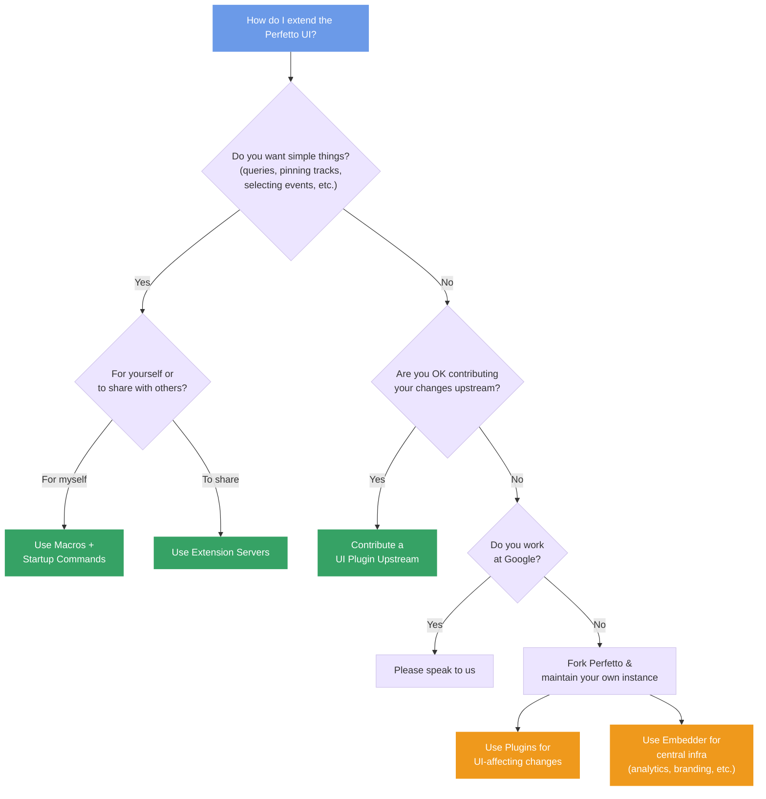

# Extending the Perfetto UI

Perfetto offers several ways to extend and customize the UI. The right choice
depends on what you want to do and who you want to share it with.

## Which approach should I use?

## Commands, startup commands, and macros

**Commands** are individual UI actions (pin a track, run a query, create a debug
track). **Startup commands** run automatically every time you open a trace.
**Macros** are named sequences of commands you trigger manually from the command
palette.

These are configured locally in Settings and are the simplest way to customize
your own workflow. No server or sharing infrastructure needed.

See [Commands and Macros](/docs/visualization/ui-automation.md) for how to set
these up, and the
[Commands Automation Reference](/docs/visualization/commands-automation-reference.md)
for the full list of available commands.

## Extension servers

**Extension servers** are HTTP(S) endpoints that distribute macros, SQL modules,
and proto descriptors to the Perfetto UI. They are the recommended way for teams
to share reusable trace analysis workflows — instead of everyone copy-pasting
JSON, you host extensions on a server and anyone with access can load them.

The easiest way to get started is to fork a GitHub template repository and push
your extensions there. The Perfetto UI can load directly from GitHub repos.

See [Extension Servers](/docs/visualization/extension-servers.md) for how they
work and how to set one up.

## Plugins

**Plugins** are TypeScript modules that run inside the Perfetto UI and can add
new tracks, tabs, commands, and visualizations. Unlike macros and extension
servers (which are declarative), plugins can execute code and deeply integrate
with the UI.

If you want to contribute a plugin upstream, see
[UI Plugins](/docs/contributing/ui-plugins.md).

## Forking Perfetto

If you need changes that go beyond what plugins, macros, and extension servers
offer — such as custom branding, analytics integration, or deep infrastructure
changes — you can fork Perfetto and maintain your own instance. Within a fork,
you can use the **embedder API** for central infrastructure concerns (analytics,
branding) and **plugins** for UI-affecting changes.
