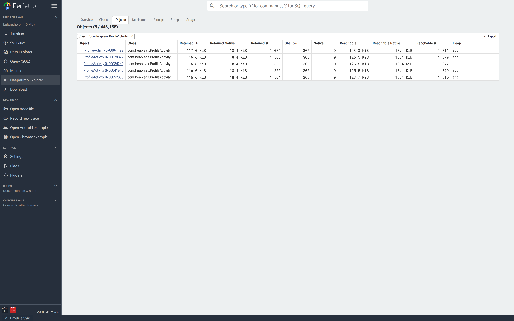
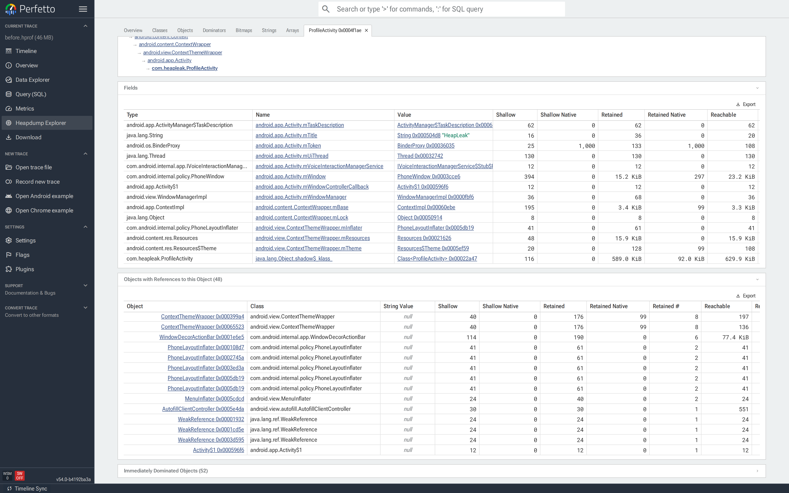
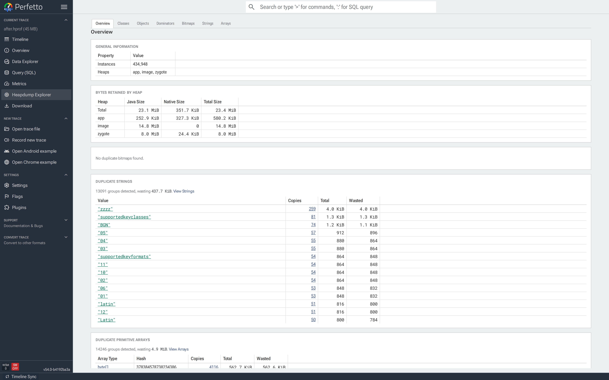

# Heap Dump Explorer

The Heap Dump Explorer is a page in the Perfetto UI for analyzing Android
ART heap dumps. For every reachable object it shows the class, the
shallow and retained sizes, and the reference path from a GC root — so
you can answer what is in the heap, what is keeping each object alive,
and how much memory each one retains.

This guide covers:

- [Heap dumps vs. heap profiles](#heap-dumps-vs-heap-profiles) and when
  to use which.
- [Capturing a heap dump](#capturing-a-heap-dump), both the lightweight
  Perfetto heap graph and the fuller ART HPROF formats.
- How to use each tab of the explorer, starting with
  [inspecting a single object](#inspecting-a-single-object) — the view
  most investigations end up at.
- A full reference for the [flamegraph](#flamegraph): what each node
  and number means (cumulative, self, self count), the four metrics,
  top-down vs. bottom-up, zooming, filters and pivoting.
- Worked [case studies](#case-studies): a leaked `Activity` and
  duplicate bitmaps.

## Heap dumps vs. heap profiles

<!-- TODO(zezeozue): Move this explanation into the memory guide
     (docs/case-studies/memory.md or docs/getting-started/memory-profiling.md)
     and cross-link from here instead of duplicating. -->

- An **ART allocation profile** samples _allocations over time_ as a
  flamegraph of call stacks. It answers which code paths are
  allocating memory while the trace is recorded. See the
  [ART allocation sampler](/docs/data-sources/native-heap-profiler.md#art-allocation-profiling).

- An **ART heap dump** is a _snapshot of the heap at one point in time_.
  It captures every reachable object, the references between them, GC
  roots and — depending on the format — field values, strings,
  primitive array bytes and bitmap pixel buffers.

The Heap Dump Explorer is for dumps. Use an ART allocation profile
instead for allocation call-path analysis.

### What heap dumps are good for

- **Memory leaks.** An object is reachable that shouldn't be. The
  reference path from a GC root points at the holder — typically a
  static field, a cached listener, or a `Handler` posting to a
  destroyed context.
- **Retention surprises.** An object is small itself but retains many
  megabytes through its references. The dominator tree and the
  _Immediately dominated objects_ section show exactly what it is
  holding on to.
- **Duplicate content.** Multiple copies of the same bitmap, string or
  primitive array. The Overview groups them by content hash and shows
  the wasted bytes.
- **Bitmap accounting.** Which bitmaps are alive, how large they are
  and what is holding them.
- **Class breakdowns.** Which classes own the largest share of
  retained memory.

### What heap dumps are not good for

- **Allocation call paths.** A heap dump is a snapshot, not a
  recording — it doesn't tell you _which code_ allocated an object.
  Use an [ART allocation profile](/docs/data-sources/native-heap-profiler.md#art-allocation-profiling)
  for that.
- **Native-only memory.** The dump covers the Java heap. For native
  allocations use the
  [native heap profiler](/docs/data-sources/native-heap-profiler.md).
- **Timing and performance.** Heap dumps say nothing about when
  objects were created or how long operations took.

## Capturing a heap dump

Two formats are supported.

### Perfetto heap graph (lightweight)

Captures the object graph — classes, references, sizes, GC roots — but
not field values, strings, primitive array bytes or bitmap pixels.
Enough for retention, dominator and class-breakdown analysis.

**Pros:**

- Privacy-safe — no string values, pixel buffers or field contents
  leave the device, so it can be captured from real users in the field
  without leaking sensitive data.
- Does not require a `debuggable` process.
- Integrates with the rest of the Perfetto tooling: you can capture a
  heap graph alongside heap profiles, memory counters and other data
  sources in a single trace.

**Cons:**

- No content-based analysis — the Strings, Arrays and Bitmaps tabs and
  the duplicate-content detection on the Overview are unavailable.

Choose this format for leak investigations, dominator analysis and
class breakdowns, especially when capturing from non-debuggable
production builds.

```bash
$ tools/java_heap_dump -n com.example.app -o heap.pftrace

Dumping Java Heap.
Wrote profile to heap.pftrace
```

Use `--wait-for-oom` to trigger on `OutOfMemoryError`, or
`-c <interval_ms>` for continuous dumps. See
[ART heap dumps](/docs/data-sources/java-heap-profiler.md) for the
full config and
[OutOfMemoryError heap dumps](/docs/getting-started/local-android-trace-recording.md#oom-heap-dump)
for the OOM-triggered variant.

### ART HPROF (full detail)

Everything the heap graph has, plus field values, primitive array
contents, string values and bitmap pixel buffers. Required for the
Strings, Arrays and Bitmaps tabs and for the duplicate-content
detection on the Overview tab.

**Pros:**

- Full visibility — field values, string contents, bitmap pixels and
  primitive array bytes are all available.
- Enables duplicate-content detection and the Bitmaps gallery.
- The HPROF format is also understood by other tools such as Android
  Studio.

**Cons:**

- Much slower to capture and freezes the target process for several
  seconds (Perfetto works on a forked copy so the main process is
  unaffected).
- Produces larger files.
- Contains the full contents of the heap, so it is not suitable for
  capturing from real users — it will contain any sensitive data in
  memory.
- Requires a `debuggable` process.

Choose this format when you need content-level detail: hunting
duplicate bitmaps, inspecting string values, or exporting to other
tools.

```bash
$ adb shell am dumpheap -g -b png com.example.app /data/local/tmp/heap.hprof
$ adb pull /data/local/tmp/heap.hprof

File: /data/local/tmp/heap.hprof
```

`-b` encodes bitmap pixel buffers as the given format (`png`, `jpg`,
or `webp`) and is required for the Bitmaps gallery to render pixels.
`-g` forces a GC before the dump, so unreachable instances don't
appear in the result — use it when hunting a suspected leak. The
target process must be `debuggable` (a `userdebug`/`eng` build, or an
APK with `android:debuggable="true"`).

NOTE: Sections marked _requires HPROF_ below are hidden on traces
captured with the heap graph format.

Open the resulting trace by dragging it onto
[ui.perfetto.dev](https://ui.perfetto.dev) or clicking
_"Open trace file"_ in the sidebar.

## Opening the explorer

There are two entry points:

1. **Sidebar.** Click _"Heapdump Explorer"_ under the current trace.
   The entry only appears when the trace contains a heap dump.

   

2. **From a heap graph flamegraph.** Click a diamond in a
   _"Heap Profile"_ track to open the heap graph flamegraph, click a
   node to select it, then click the menu icon in the node's details
   popup and pick _"Open in Heapdump Explorer"_. This is covered in
   detail under [Jumping from a flamegraph](#jumping-from-a-flamegraph).

   

The explorer is organized as tabs across the top. _Overview_,
_Flamegraph_, _Classes_, _Objects_, _Dominators_, _Bitmaps_, _Strings_,
_Arrays_ and _Callstack_ are fixed (_Callstack_ shows the allocation
stack that triggered the dump, and only has data for dumps captured on
`OutOfMemoryError` on recent Android versions). Tabs you open by
drilling into a specific object or flamegraph selection are appended on
the right and can be closed.


All tabs share the underlying `heap_graph_*` tables. Blue links — a
class name, an object id, a _Copies_ count — navigate to the
corresponding tab pre-filtered.

## Overview

NOTE: The duplicate sections _require HPROF_.

The Overview is the default landing page and summarizes the dump:

- **General information.** Reachable instance count and the list of
  heaps in the dump (typically `app`, `zygote`, `image`).
- **Bytes retained by heap.** Java, native and total sizes per heap,
  with a total row at the top. Use this to see whether the problem
  is on the Java heap, in native memory, or both.
- **Duplicate bitmaps / strings / primitive arrays.** Duplicated
  content grouped by content hash. Each row shows the copy count
  and the wasted bytes; clicking _Copies_ opens the relevant tab
  filtered to that group.


## Flamegraph

The Flamegraph tab shows the whole heap at once, aggregated by class.
Where Classes and Objects answer "how much memory does class X own",
the flamegraph also shows _where in the reference graph_ that memory
sits: which chains of references, starting at the GC roots, lead to
it. It is usually the fastest way to spot that one subtree of the
heap is disproportionately large.

The same flamegraph appears in the timeline when you click a heap
dump diamond in a _"Heap Profile"_ track — every feature below works
identically there. A few extras that only exist in the timeline
variant are covered at the end under
[the timeline flamegraph](#the-timeline-flamegraph).


### How to read it

A heap is a _graph_ — objects reference each other freely — but a
flamegraph draws a _tree_, so the graph is first converted:

- Starting from the GC roots, every reachable object is placed at its
  **shortest reference path** from a root (a breadth-first search;
  ties are broken deterministically). Each object appears in the tree
  exactly once.
- Objects at the same path are then **merged by class**: one node per
  class per path. A node labelled `ArrayList` sitting under
  `Class<ProfileActivity>` means "all `ArrayList` instances whose
  shortest path from a root goes through a `ProfileActivity` class
  object".

Reading top-down: the synthetic `root` row at the top spans the whole
dump; each row below it is one more reference hop away from the GC
roots. The width of a node is proportional to the selected metric
(bytes or object count) in that node's entire subtree. Objects with
no known class name show as `[Unknown]`.

One caveat that trips people up: in this shortest-path tree, a node's
subtree is **not** the same as its retained size. An object referenced
from two places is drawn only under its shortest path, but it would
survive the other reference being dropped. When you need "what would
actually be freed", switch to the
[dominator metrics](#choosing-a-metric) below.

Nodes too narrow to draw (less than ~3 pixels) are collapsed into a
grey `(merged)` node. They are still counted in every total; zoom in
or add a filter to see them individually.

### Choosing a metric

The dropdown at the top-left switches what the flamegraph measures:

| Metric | Tree | Node width is |
|--------|------|---------------|
| **Object Size** | Shortest-path | Shallow bytes of all objects in the subtree |
| **Object Count** | Shortest-path | Number of objects in the subtree |
| **Dominated Object Size** | Dominator | Bytes freed if the subtree's top object died |
| **Dominated Object Count** | Dominator | Objects freed if the subtree's top object died |

The two **Dominated** metrics build the tree from the
[dominator tree](#dominators) instead of shortest paths: each object
hangs under the object that _exclusively_ retains it. A node's
cumulative value is therefore its true retained size — exactly what
the garbage collector would reclaim if those objects became
unreachable. Use _Object Size_ to follow the actual reference
structure of the heap, and _Dominated Object Size_ to attribute
memory to the objects responsible for keeping it alive.

Sizes count the Java shallow size of each object. Native memory
registered against a Java object (for example bitmap pixel buffers on
modern Android) is shown as a separate child node labelled
`[native] <ClassName>` and is counted in all cumulative totals.
Native memory that is not registered this way does not appear in the
dump at all; use the
[native heap profiler](/docs/data-sources/native-heap-profiler.md)
for that.

### Cumulative, Self and Self Count

Hover or click a node to see its numbers:


- **Cumulative** — the metric summed over this node _and everything
  below it_. This matches the node's width. Two percentages are
  shown: `all` (share of the entire unfiltered dump) and `parent`
  (share of the parent node's cumulative value).
- **Self** — the metric for the objects merged into _this node only_,
  excluding descendants. For _Object Size_ that is the summed shallow
  size of this node's own instances. A node with a large self value
  is itself heavy; a node with small self but large cumulative is a
  cheap container holding an expensive subtree.
- **Self Count** — the number of object instances merged into this
  node. In the screenshot above, the `java.lang.String` node
  represents 53,546 individual strings that all share the same
  reference path. (Shown with the size metrics; with the count
  metrics the main value already is the count.)
- **Root Type** — only on nodes that are themselves GC roots: how the
  runtime is pinning them, e.g. `ROOT_STATIC` (static fields),
  `ROOT_JNI_GLOBAL` (JNI global references), `ROOT_JAVA_FRAME` (a
  live thread's stack), `ROOT_INTERNED_STRING`.
- **Heap Type** — which ART heap the objects live in: `app` (your
  process's own allocations), `zygote` (inherited from the zygote at
  fork) or `image` (the preloaded boot image). Leaks are almost
  always on the `app` heap.

Because nodes are only merged when Root Type and Heap Type match, the
same class can legitimately appear as several sibling nodes — e.g.
one `java.lang.String` node per heap.

### Top Down and Bottom Up

The radio buttons at the top-right flip the direction of aggregation:

- **Top Down** (default) — as described above: roots at the top,
  each row one reference hop further from a root.
- **Bottom Up** — every occurrence of a class, wherever it sits in
  the tree, is merged into a single row at the bottom; the referrer
  chains that lead to it are stacked _above_, widest referrer first.
  Use this to answer "how much do all `X` hold in total, regardless
  of path?" and "who are the biggest referrers of `X`?" — the
  flamegraph equivalent of a reverse-reference query across the whole
  heap.

### Zooming

Double-click a node (or use _Zoom in_ from its popup) to stretch it
to the full width. Nothing is filtered out — ancestors stay visible,
greyed, and totals don't change. Double-click the `root` row to zoom
back out. Zooming is purely visual; to actually cut the data down,
use filters.

### Filters

The filter bar reshapes the tree. Type into it directly, or press the
`+` button for a guided form. Active filters show as chips;
double-click a chip to edit it, click its `x` to remove it, or use
the bin button to clear everything.

Patterns are regular expressions matched case-sensitively against
the class name; bare text is a substring match (`String` matches
`java.lang.String`), and `^`/`$` anchor it exactly. Patterns also
match against a node's Root Type and Heap Type values, so
`SS: ROOT_JNI_GLOBAL` or `SS: zygote` work too.

There are four filter types plus [Pivot](#pivot). In the filter bar,
prefix the pattern with the short or full name; with no prefix the
text becomes a _Show Stack_ filter. Multiple filters can be typed in
one go, separated by spaces: `SS: main HF: alloc.*`.

- **Show Stack** (`SS:`) — keep only paths that contain a matching
  node; everything else is removed. The `root` row shows how much of
  the dump survived, e.g. `root: 1.2 MiB (4.92%)`. Multiple Show
  Stack filters AND together: a path must match all of them.
- **Hide Stack** (`HS:`) — the inverse: remove every path that
  contains a matching node. Called "Drop function" in some other
  profilers.
- **Show From Frame** (`SFF:`) — keep only matching nodes and their
  subtrees, dropping the ancestors above them. Useful to study one
  class's subtree in isolation without re-rooting the whole graph.
  Called "Focus on subtree" elsewhere.
- **Hide Frame** (`HF:`) — delete matching nodes themselves and
  splice their children onto their parent. This is the tool for
  collapsing noise rows: `HF: java.lang.Object\[\]` merges array
  containers away so container contents attach directly to whatever
  owns the container. Called "Merge function" elsewhere.

Filters persist when you switch metrics or between Top Down and
Bottom Up, and the copy button next to the bar copies the active
filter set as text so it can be shared or pasted back.

### Pivot

Pivoting (`P:` in the filter bar, or _Pivot on matching frames_ from
a node's popup) re-roots the flamegraph at every node matching the
pattern:

- The matched class becomes the central row.
- Everything it references grows **downwards**, as usual.
- Everything that references it grows **upwards**, inverted.

This is the "show me everything about this class in one picture"
view: its total footprint, what it is made of, and who is holding it,
without walking objects one at a time. A pivot shows as a
`Pivot: ...` chip; only one can be active at a time (setting a new
one replaces it), the Top Down / Bottom Up switch is disabled while
pivoted, and removing the chip returns to Top Down.

The object tab integrates with pivot directly: the
_Shortest Path from GC Root_ and _Dominator Tree Path_ sections each
have a _View in Flamegraph_ button that opens this tab pivoted on
that specific instance's path (the chip reads
`ClassName (this instance)`), using the _Object Size_ or
_Dominated Object Size_ metric respectively.

### Node actions

Clicking a node opens its details popup with four menus, grouping
everything you can do from a node:

- **Focus** — reframe without removing data: _Zoom in_, _Focus on
  matching subtrees_ (Show From Frame) and _Pivot on matching
  frames_.
- **Filter** — reshape the tree: _Keep stacks matching name_ (Show
  Stack), _Hide stacks matching name_ (Hide Stack) and _Merge
  matching frames into caller_ (Hide Frame).
- **Drill down** — _Show objects from this class_ opens a closable
  [Flamegraph objects](#jumping-from-a-flamegraph) tab listing the
  individual instances behind the node, from which any object's
  [object tab](#inspecting-a-single-object) is one click away. (In
  the timeline flamegraph this action is called _Open in Heapdump
  Explorer_.)
- **Copy** — _Copy stack_ copies the chain of class names from the
  root to this node as plain text; _Copy stack with details_ copies
  it as a markdown table with Root Type, Heap Type, Cumulative, Self
  and Self Count per row — handy for bug reports and code review
  comments.

Actions launched from a node match that node exactly (the pattern is
anchored as `^name$`), so filtering on `java.lang.String` will not
accidentally match `java.lang.StringBuilder`.

### The timeline flamegraph

The flamegraph in the timeline's _"Heap Profile"_ details panel has
three extras:

- Each node's _Drill down_ menu has _Open in Heapdump Explorer_,
  which jumps into the explorer with a _Flamegraph objects_ tab open
  for that node — see
  [Jumping from a flamegraph](#jumping-from-a-flamegraph).
- The `root` node's menu has _Reference paths by class_, which opens
  a table aggregating every distinct reference path: one row per
  class and path with the number of paths, object count, total size
  and total native size. It is the tabular twin of the flamegraph —
  the same data, but sortable and exportable.
- If the heap graph in the trace is incomplete (the dump was cut
  short), a warning modal offers to show the import errors; the
  flamegraph still renders with whatever data arrived.

## Classes

The Classes tab lists every class in the dump, sorted by _Retained_
descending:

- **Count** — reachable instances.
- **Shallow / Shallow Native** — combined self-size of all instances.
- **Retained / Retained Native** — bytes freed if every instance
  became unreachable.
- **Retained #** — the number of objects that would go with them.

![Classes tab sorted by Retained; `byte[]` and `java.lang.String` at the top, `com.heapleak.ProfileActivity` further down with Count 1.](../images/heap_docs/05-classes.png)

Use this tab when you have a suspect class, or want a top-down view
of which classes own the most memory. Clicking a class name opens
Objects filtered to that class.

## Objects

The Objects tab lists reachable instances. Opening it from Classes or
from a duplicate group applies the filter automatically; opening it
directly shows every object.

Each row has the object identifier (short class name + hex id), its
class, shallow and retained size, and its heap. `java.lang.String`
rows carry a badge with a preview of the value, so strings can be
scanned at a glance.


Clicking an object opens its [object tab](#inspecting-a-single-object).
Typical uses: identifying a stale `Activity` after a leak, or the
instance of a data class holding the largest subgraph.

## Inspecting a single object

**The _Shortest Path from GC Root_, _Dominator Tree Path_ and _Objects
with References to this Object_ are the key sections for most
investigations.** The shortest path shows the fewest reference hops
keeping the object alive; the dominator tree path shows the chain of
objects that exclusively retain it; the reverse references list every
object holding a field pointer to it.

Clicking any object in any tab opens a closable tab for that instance.
Multiple object tabs can be open at once.

The object tab contains everything known about the instance:

- **Header** with the object id, plus an _Open in Classes_ shortcut
  when the object is itself a `Class`.
- **Bitmap preview** for bitmap instances, with a download button.
- **Shortest Path from GC Root** — the shortest chain of references
  from a GC root to this object.
- **Dominator Tree Path** — the chain of dominators keeping this
  object alive, one step per row with the holder and the field name.
- **Object info** — class, heap, root type.
- **Object size** — shallow, retained and reachable sizes split by
  Java / native / count.
- **Class hierarchy** — the full inheritance chain up to
  `java.lang.Object`, plus the instance size for class objects.
  Clicking any class opens **Classes** filtered to that class and its
  subclasses.
- **Static fields** (for class objects), **instance fields** (for
  ordinary objects) or **array elements** (for arrays). Reference
  values are clickable and jump to the referenced object. For byte
  arrays, _Download bytes_ exports the raw data.
- **Objects with references to this object** — the reverse references.
  Every instance that has a field pointing at this one.
- **Immediately dominated objects** — what would be freed if this
  instance became unreachable.

![Object tab (top) for `ProfileActivity 0x0004f1ae`: Sample Path from GC Root goes `Class<ProfileActivity> → com.heapleak.ProfileActivity.history → ArrayList → Object[0] → ProfileActivity`; retained 117.6 KiB across 1,604 objects.](../images/heap_docs/12-object-tab-top.png)


Both sections auto-collapse on large objects — click the header to
expand.

## Dominators

The Dominators tab shows the
[dominator tree](https://en.wikipedia.org/wiki/Dominator_(graph_theory))
of the heap. In a directed graph, node `a` _dominates_ node `b` when
every path from a root to `b` must pass through `a`. Applied to a heap:
if you free `a`, everything it dominates — every object reachable
_only_ through `a` — is also freed. The dominator tree groups the heap
into these "freed-together" subtrees, making it easy to see which
single objects gate the largest chunks of retained memory.


_Root Type_ (e.g. `THREAD`, `STATIC`, `JNI_GLOBAL`) identifies how each
dominator is itself kept alive. Click a row to open its object tab and
walk the reference path.

Use this tab when there is no specific suspect and the question is
simply where the memory has gone.

## Bitmaps

NOTE: Pixel previews and duplicate detection _require HPROF_.

The Bitmaps tab is a gallery of every `android.graphics.Bitmap` in the
dump. With an HPROF, each bitmap's pixels are rendered inline.


Each card shows the rendered pixels, dimensions (px and dp), DPI,
retained memory and a _Details_ button that opens the object tab.
Pixel buffers may be RGBA, PNG, JPEG or WebP depending on how they
were stored.

The path dropdown above the gallery picks which reference path to
overlay on each card: _Shortest path_ (fewest edges from a GC root),
_Dominator path_ (the chain of dominators), or _No path_. Showing a
path is the fastest way to spot an `Activity`, `Fragment` or
`Handler` holding leaked bitmaps.


Two tables at the bottom list bitmaps with and without pixel data,
with filter, sort and export controls. Arriving via _Copies_ on
Overview pre-filters the tab by buffer content hash, leaving only the
visually identical bitmaps in that group.

## Strings

NOTE: The Strings tab _requires HPROF_.

The Strings tab lists every `java.lang.String` with its value. The
summary card reports the total number of strings, the number of
distinct values and the total retained memory. The gap between total
and distinct is memory spent on duplicates.


Filter by value to find data that was expected to be unique: a user
id, a serialized config payload, an error message repeated thousands
of times. Clicking a row opens its object tab, where the
reverse-references section lists every object holding that string.

## Arrays

NOTE: The Arrays tab _requires HPROF_.

The Arrays tab lists primitive arrays (`byte[]`, `int[]`, `long[]`,
...) together with a stable content hash. Filtering by _Content Hash_
returns every array with the same bytes; this is how the Overview
detects duplicate arrays.


Two common uses: finding a large duplicated `byte[]` that backs an
image or serialized buffer, and jumping from a container object to
the primitive array holding its data.

## Jumping from a flamegraph

The timeline heap graph flamegraph (a full feature reference is in
the [Flamegraph](#flamegraph) section above) has an _Open in Heapdump
Explorer_ action that opens the explorer on the list of objects
matching a selected reference path. Use it to inspect a flamegraph
node object-by-object:

1. Click a diamond in a _"Heap Profile"_ track to open the flamegraph.

   

2. Click a node to select it, then click the menu icon in the node's
   details popup. Pick _"Open in Heapdump Explorer"_.

   

   This opens a new closable _Flamegraph Objects_ tab listing every
   object allocated along the selected path. Dominator flamegraph
   nodes produce a dominator-based selection; regular nodes produce
   a path-based selection.

   

3. From there, click any object to open its
   [object tab](#inspecting-a-single-object), or use _Back to Timeline_
   to return to the flamegraph view.

Multiple flamegraph selections can be open at once, each as its own
tab — useful for comparing two call stacks side by side.

## Case studies

<!-- TODO(zezeozue): Break these case studies out and integrate them into
     the existing memory guides (docs/case-studies/memory.md). Rationalize
     the material so it isn't duplicated across docs. -->

### Finding a leaked Activity

A developer on a Kotlin app reports that rotating their profile
screen a few times drives the Java heap upward and never comes back
down. The screen is unremarkable — an `Activity`, a view hierarchy,
one avatar — and rotating _should_ destroy the old instance. It
doesn't.

A quick grep turns up a "breadcrumb" list the team added a while
ago for crash reporting. It stores every `ProfileActivity` instance
created, and is never cleared:

```kotlin
class ProfileActivity : Activity() {
    companion object {
        val history = mutableListOf<ProfileActivity>()   // never cleared
    }

    override fun onCreate(state: Bundle?) {
        super.onCreate(state)
        setContentView(R.layout.profile)
        history += this                                   // <-- the bug
    }
}
```

The intent was to keep a lightweight trail of recent screens for
crash reports. What it actually does is pin every `ProfileActivity`
ever created: `onDestroy` runs on the old one, but the class's
static `history` list keeps a strong reference — along with the old
Activity's entire view hierarchy.

**Capturing.** The heap graph format is enough to chase an Activity
leak; it carries the full object graph and GC roots:

```bash
$ tools/java_heap_dump -n com.example.app -o /tmp/profile.pftrace

Dumping Java Heap.
Wrote profile to /tmp/profile.pftrace
```

Rotate the device a handful of times first so multiple instances
accumulate. Drag the file onto
[ui.perfetto.dev](https://ui.perfetto.dev) and click _Heapdump
Explorer_ in the sidebar.

**Confirming the leak.** Open **Classes** and find
`com.heapleak.ProfileActivity`. `Count` should be 0 after the user
has navigated away; here it's 5, one per rotation:


Clicking the class name opens **Objects** filtered to
`ProfileActivity`. Every row is one live instance:



**Reading the reference path.** Click the top row to open its object
tab. The _Sample Path from GC Root_ is the chain of field references
keeping this instance alive:

![Object tab for a leaked ProfileActivity. Sample Path from GC Root: Class<ProfileActivity> → com.heapleak.ProfileActivity.history → ArrayList.elementData → Object[0] → ProfileActivity. Retained 117.6 KiB, ~1,600 reachable objects.](../images/heap_docs/12-object-tab-top.png)

Read bottom-up: the runtime keeps the `java.lang.Class<ProfileActivity>`
alive (as it does for every loaded class); that class has a
companion-object field `history`; that field points at an `ArrayList`
whose element 0 is this `ProfileActivity`. The hop from the class
object to `history` names the bug — a static list of Activities.

The _Object Size_ block quantifies the cost: one leaked Activity is
pinning 117.6&nbsp;KiB and ~1,600 reachable objects. Multiply by
five (the `Count`) and the leak is already ~600&nbsp;KiB of Activity
graphs sitting in the heap. Further down the same tab are the
_Objects with References to this Object_ and _Immediately Dominated
Objects_ sections:



Expanding _Immediately Dominated Objects_ shows everything going
down with the leak — the `Activity`'s view hierarchy and the rest
of the state it transitively retains. None of it is supposed to
outlive the Activity; all of it does, because one companion-object
list is holding the root.

**Fix.** Never store an `Activity` in a `static` or companion-object
container. If you want a breadcrumb trail for crash reports, store
strings with a bounded capacity instead:

```kotlin
object Breadcrumbs {
    private const val CAPACITY = 16
    private val trail = ArrayDeque<String>(CAPACITY)

    @Synchronized
    fun record(event: String) {
        while (trail.size >= CAPACITY) trail.removeFirst()
        trail.addLast("${System.currentTimeMillis()} $event")
    }
}

class ProfileActivity : Activity() {
    override fun onCreate(state: Bundle?) {
        super.onCreate(state)
        setContentView(R.layout.profile)
        Breadcrumbs.record("ProfileActivity.onCreate")
    }
}
```

Re-run the same repro and re-dump. The Classes tab now shows
exactly one `ProfileActivity` — the currently visible screen —
instead of one per rotation.

This tiny demo saves ~1.5&nbsp;MiB of app heap; a real screen with a
live view hierarchy sees the difference in tens of megabytes. Any
`Activity` subclass showing `Count > 0` in a dump captured after
the user navigated away is a leak.

The same recipe finds the other common shapes of Activity leak —
delayed-message `Handler`s, unregistered listeners, coroutines that
outlived their scope. The last hop before the Activity in the
reference path always names the holder; the fix is to clear that
field at the right lifecycle callback.

### Tracking down duplicate bitmaps

A Kotlin feed app is running out of memory on long scrolls. `dumpsys
meminfo com.example.feed` reports a `Graphics:` line several times
bigger than the pixels actually on screen, and the in-app image
cache looks small. Something else is holding pixels.

The suspect turns out to be a `RecyclerView` adapter that decodes
each row's thumbnail from resources on every bind, and appends the
result to a companion-object list:

```kotlin
class FeedAdapter(private val res: Resources) : RecyclerView.Adapter<VH>() {
    companion object {
        val cache = mutableListOf<Bitmap>()     // grows without bound
    }

    override fun onBindViewHolder(holder: VH, position: Int) {
        val bmp = BitmapFactory.decodeResource(res, R.drawable.thumb)
        cache += bmp                            // "cache" — actually just accumulates
        holder.image.setImageBitmap(bmp)
    }
    // ...
}
```

Every bind decodes a fresh copy of the same PNG. Every copy is then
held forever by `cache`. The pixels all hash to the same value, but
they're different `Bitmap` instances with different backing
`byte[]`s.

**Capturing.** Duplicate detection needs the hash of each bitmap's
pixel buffer, which only the HPROF format carries. `-b png` encodes
the pixels so the Bitmaps gallery can render previews:

```bash
$ adb shell am dumpheap -g -b png com.example.feed /data/local/tmp/feed.hprof
$ adb pull /data/local/tmp/feed.hprof
```

Scroll the feed long enough to reproduce the bloat before dumping —
the adapter's `cache` only grows on bind.

**Triage on the Overview.** The Overview groups bitmaps by
pixel-buffer hash. Each row shows copy count, total bytes across
all copies, and wasted bytes — what deduplicating to a single copy
would save:


The row shows what was accumulated: twelve copies of one 128×128
asset, all with the same content hash. The _Duplicate Strings_ and
_Duplicate Primitive Arrays_ cards below work the same way — same
grouping, same sizing — and are useful when the wasted memory is in
text (e.g. a config payload duplicated thousands of times) or
primitive buffers. All three duplicate detectors require HPROF
because they hash the actual content, which the heap graph format
doesn't carry.

**Drill into the copies.** Click _Copies_ on that row. **Bitmaps**
opens pre-filtered to that content-hash group, so only those copies
render as cards:


**Find the holder.** Set the path dropdown to _Shortest path_. The
reference chain below each card is the fields keeping that bitmap
alive:


Every chain in the gallery is identical: `Class<FeedAdapter>.cache →
ArrayList → Bitmap`. All twelve copies share one holder — a
cache-layer bug, one field to fix.

The shape of the chains is the diagnostic. Two other patterns to
recognize on future investigations:

- _Each copy has a different chain_ → call-site bug. There's no
  cache, or callers are bypassing it.
- _The chain passes through an `Activity`_ → fix the Activity leak
  first ([previous case study](#finding-a-leaked-activity)); the
  bitmaps will follow.

**Fix.** There's no real reason to keep a side list of `Bitmap`s at
all — Android already has a `LruCache<K, Bitmap>`, scoped to the
application, with eviction you control:

```kotlin
class FeedAdapter(private val res: Resources) : RecyclerView.Adapter<VH>() {
    companion object {
        private val cache = object : LruCache<Int, Bitmap>(4) {
            override fun sizeOf(key: Int, value: Bitmap) = 1
        }
    }

    override fun onBindViewHolder(holder: VH, position: Int) {
        val key = R.drawable.thumb
        val bmp = cache[key] ?: BitmapFactory.decodeResource(res, key).also { cache.put(key, it) }
        holder.image.setImageBitmap(bmp)
    }
    // ...
}
```

**Verify.** Scroll the feed the same distance, re-dump, re-open.
The Overview should declare `No duplicate bitmaps found`, and the
app-heap retained bytes should drop accordingly:



The _wasted bytes_ total across all groups on the Overview is the
cleanest single-number scorecard — watching it drop from dump to
dump is how you confirm each fix and catch regressions.

## See also

- [ART heap dumps](/docs/data-sources/java-heap-profiler.md) —
  recording config, troubleshooting and SQL schema reference.
- [Memory case study](/docs/case-studies/memory.md) — end-to-end guide
  to investigating Android memory issues, covering `dumpsys meminfo`,
  native heap profiles and ART heap dumps together.
- [OutOfMemoryError heap dumps](/docs/getting-started/local-android-trace-recording.md#oom-heap-dump)
  — capturing a heap dump automatically on OOM.
- [Native heap profiler](/docs/data-sources/native-heap-profiler.md) —
  for allocation call-path analysis rather than heap contents.
