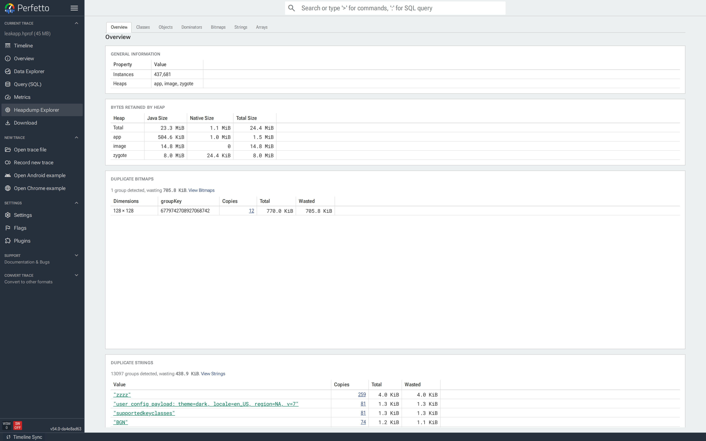
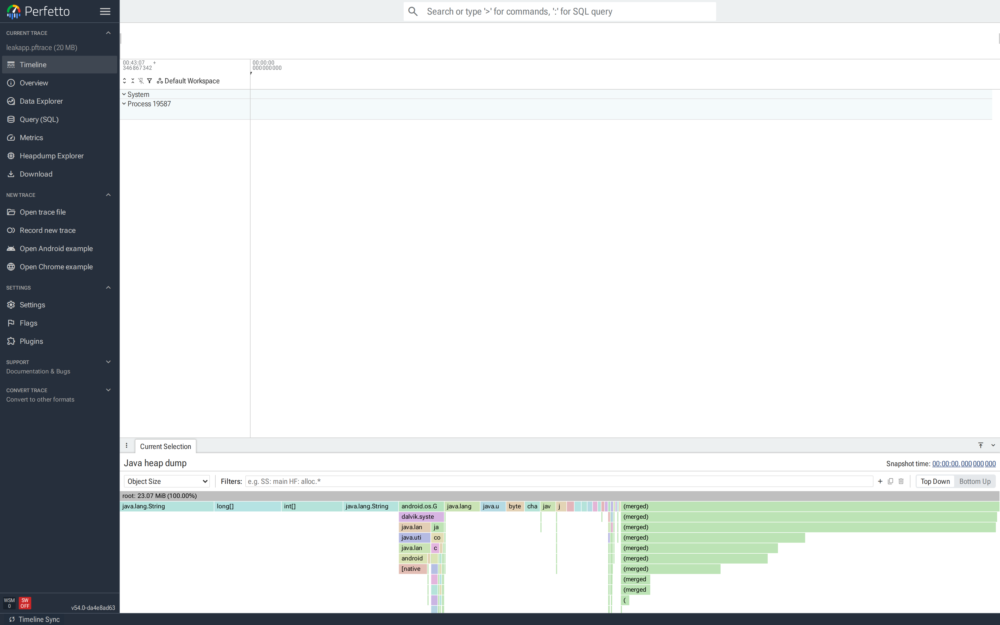
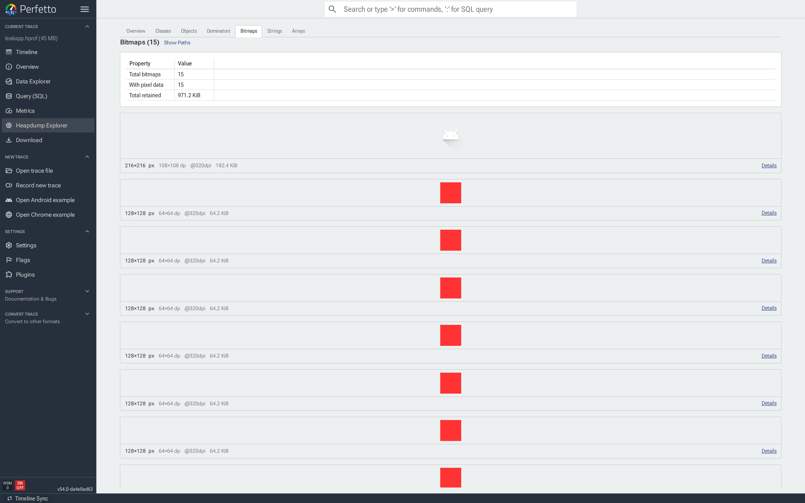
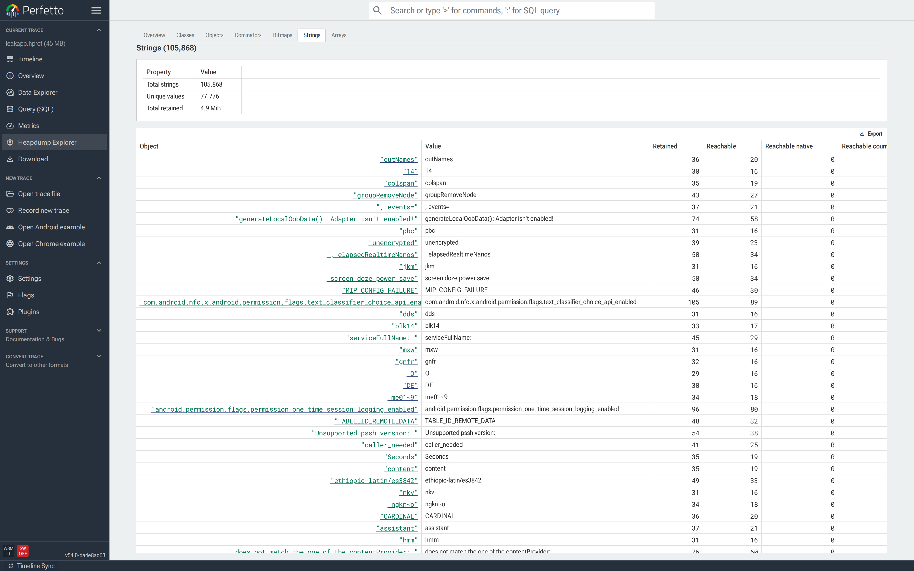
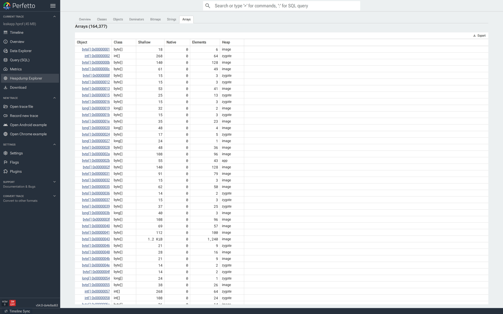

# Heap Dump Explorer

The Heap Dump Explorer is a page in the Perfetto UI for analyzing Android
Java heap dumps. For every reachable object it shows the class, the
shallow and retained sizes, and the reference path from a GC root — so
you can answer what is in the heap, what is keeping each object alive,
and how much memory each one retains.

This guide covers:

- [Heap dumps vs. heap profiles](#heap-dumps-vs-heap-profiles) and when
  to use which.
- [Capturing a heap dump](#capturing-a-heap-dump), both the lightweight
  Perfetto heap graph and the fuller ART HPROF formats.
- How to use each tab of the explorer.
- Worked [case studies](#case-studies): a leaked `Activity` and
  duplicate bitmaps.

## Heap dumps vs. heap profiles

- A **Java heap profile** samples _allocations over time_ as a
  flamegraph of call stacks. It answers which code paths are
  allocating memory while the trace is recorded. See the
  [Java heap sampler](/docs/data-sources/native-heap-profiler.md#java-heap-sampling).

- A **Java heap dump** is a _snapshot of the heap at one point in time_.
  It captures every reachable object, the references between them, GC
  roots and — depending on the format — field values, strings,
  primitive array bytes and bitmap pixel buffers.

The Heap Dump Explorer is for dumps. Use a heap profile instead for
allocation call-path analysis.

### What heap dumps are good for

- **Memory leaks.** An object is reachable that shouldn't be. The
  reference path from a GC root points at the holder — typically a
  static field, a cached listener, or a `Handler` posting to a
  destroyed context.
- **Retention surprises.** An object is small itself but retains many
  megabytes through its references. The dominator tree and the
  _Immediately dominated objects_ section show exactly what it is
  holding on to.
- **Duplicate content.** Multiple copies of the same bitmap, string or
  primitive array. The Overview groups them by content hash and shows
  the wasted bytes.
- **Bitmap accounting.** Which bitmaps are alive, how large they are
  and what is holding them.
- **Class breakdowns.** Which classes own the largest share of
  retained memory.

## Capturing a heap dump

Two formats are supported.

### Perfetto heap graph (lightweight)

Captures the object graph — classes, references, sizes, GC roots — but
not field values, strings, primitive array bytes or bitmap pixels.
Enough for retention, dominator and class-breakdown analysis.

```bash
$ tools/java_heap_dump -n com.example.app -o heap.pftrace

Dumping Java Heap.
Wrote profile to heap.pftrace
```

Use `--wait-for-oom` to trigger on `OutOfMemoryError`, or
`-c <interval_ms>` for continuous dumps. See
[Java heap dumps](/docs/data-sources/java-heap-profiler.md) for the
full config and
[OutOfMemoryError heap dumps](/docs/case-studies/android-outofmemoryerror.md)
for the OOM-triggered variant.

### ART HPROF (full detail)

Everything the heap graph has, plus field values, primitive array
contents, string values and bitmap pixel buffers. Required for the
Strings, Arrays and Bitmaps tabs and for the duplicate-content
detection on the Overview tab.

```bash
$ adb shell am dumpheap -g -b png com.example.app /data/local/tmp/heap.hprof
$ adb pull /data/local/tmp/heap.hprof

File: /data/local/tmp/heap.hprof
```

`-b` encodes bitmap pixel buffers as the given format (`png`, `jpg`,
or `webp`) and is required for the Bitmaps gallery to render pixels.
`-g` forces a GC before the dump, so unreachable instances don't
appear in the result — use it when hunting a suspected leak. The
target process must be `debuggable` (a `userdebug`/`eng` build, or an
APK with `android:debuggable="true"`).

NOTE: Sections marked _requires HPROF_ below are hidden on traces
captured with the heap graph format.

Open the resulting trace by dragging it onto
[ui.perfetto.dev](https://ui.perfetto.dev) or clicking
_"Open trace file"_ in the sidebar.

## Opening the explorer

There are two entry points:

1. **Sidebar.** Click _"Heapdump Explorer"_ under the current trace.
   The entry only appears when the trace contains a heap dump.

   

2. **From a heap graph flamegraph.** Click a diamond in a
   _"Heap Profile"_ track to open the heap graph flamegraph,
   right-click a node and pick _"Open in Heapdump Explorer"_. This is
   covered in detail under [Jumping from a flamegraph](#jumping-from-a-flamegraph).

   

The explorer is organized as tabs across the top. _Overview_,
_Classes_, _Objects_, _Dominators_, _Bitmaps_, _Strings_ and _Arrays_
are fixed. Tabs you open by drilling into a specific object or
flamegraph selection are appended on the right and can be closed.


All tabs share the underlying `heap_graph_*` tables. Blue links — a
class name, an object id, a _Copies_ count — navigate to the
corresponding tab pre-filtered. Every navigation updates
`window.location.hash`, so the browser back button works and any view
is bookmarkable (see [Deep linking](#deep-linking)).

## Overview

The Overview is the default landing page and summarizes the dump:

- **General information.** Reachable instance count and the list of
  heaps in the dump (typically `app`, `zygote`, `image`).
- **Bytes retained by heap.** Java, native and total sizes per heap,
  with a total row at the top. Use this to see whether the problem
  is on the Java heap, in native memory, or both.
- **Duplicate bitmaps / strings / primitive arrays.** Duplicated
  content grouped by content hash. Each row shows the copy count
  and the wasted bytes; clicking _Copies_ opens the relevant tab
  filtered to that group.


NOTE: The duplicate sections _require HPROF_.

## Classes

The Classes tab lists every class in the dump, sorted by _Retained_
descending:

- **Count** — reachable instances.
- **Shallow / Shallow Native** — combined self-size of all instances.
- **Retained / Retained Native** — bytes freed if every instance
  became unreachable.
- **Retained #** — the number of objects that would go with them.

![Classes tab sorted by Retained; `byte[]` at 131,573 retained instances followed by `java.lang.String`, `int[]`, and application classes further down.](../images/heap_docs/05-classes.png)

Use this tab when you have a suspect class, or want a top-down view
of which classes own the most memory. Clicking a class name opens
Objects filtered to that class.

## Objects

The Objects tab lists reachable instances. Opening it from Classes or
from a duplicate group applies the filter automatically; opening it
directly shows every object.

Each row has the object identifier (short class name + hex id), its
class, shallow and retained size, and its heap. `java.lang.String`
rows carry a badge with a preview of the value, so strings can be
scanned at a glance.


Clicking an object opens its [object tab](#inspecting-a-single-object).
Typical uses: identifying a stale `Activity` after a leak, or the
instance of a data class holding the largest subgraph.

## Dominators

The Dominators tab shows the roots of the dominator tree: objects that
exclusively retain the largest subgraphs of the heap. An object `a`
dominates `b` if every path from a GC root to `b` passes through `a`,
so freeing `a` also frees `b`.


_Root Type_ (e.g. `THREAD`, `STATIC`, `JNI_GLOBAL`) identifies how each
dominator is itself kept alive. Click a row to open its object tab and
walk the reference path.

Use this tab when there is no specific suspect and the question is
simply where the memory has gone.

## Bitmaps

The Bitmaps tab is a gallery of every `android.graphics.Bitmap` in the
dump. With an HPROF, each bitmap's pixels are rendered inline.



Each card shows the rendered pixels, dimensions (px and dp), DPI,
retained memory and a _Details_ button that opens the object tab.
Pixel buffers may be RGBA, PNG, JPEG or WebP depending on how they
were stored.

The _Show Paths_ toggle adds the reference path from the GC root to
each card — the fastest way to spot an `Activity`, `Fragment` or
`Handler` holding leaked bitmaps.


Two tables at the bottom list bitmaps with and without pixel data,
with filter, sort and export controls. Arriving via _Copies_ on
Overview pre-filters the tab by buffer content hash, leaving only the
visually identical bitmaps in that group.

NOTE: Pixel previews and duplicate detection _require HPROF_.

## Strings

The Strings tab lists every `java.lang.String` with its value. The
summary card reports the total number of strings, the number of
distinct values and the total retained memory. The gap between total
and distinct is memory spent on duplicates.



Filter by value to find data that was expected to be unique: a user
id, a serialized config payload, an error message repeated thousands
of times. Clicking a row opens its object tab, where the
reverse-references section lists every object holding that string.

NOTE: The Strings tab _requires HPROF_.

## Arrays

The Arrays tab lists primitive arrays (`byte[]`, `int[]`, `long[]`,
...) together with a stable content hash. Filtering by _Content Hash_
returns every array with the same bytes; this is how the Overview
detects duplicate arrays.



Two common uses: finding a large duplicated `byte[]` that backs an
image or serialized buffer, and jumping from a container object to
the primitive array holding its data.

NOTE: The Arrays tab _requires HPROF_.

## Inspecting a single object

Clicking any object opens a closable tab for that instance. Multiple
object tabs can be open at once. The URL hash is
`#!/heapdump/object_0x<hex>`, so objects are shareable.

The object tab contains everything known about the instance:

- **Header** with the object id, plus an _Open in Classes_ shortcut
  when the object is itself a `Class`.
- **Bitmap preview** for bitmap instances, with a download button.
- **Reference path from GC root** — the chain of references keeping
  this object alive, one step per row with the holder and the field
  name. Dominator hops along the path are bold. If the object is
  unreachable, a sample path is shown instead.
- **Object info** — class, heap, root type.
- **Object size** — shallow, retained and reachable sizes split by
  Java / native / count.
- **Class hierarchy** — the full inheritance chain up to
  `java.lang.Object`, plus the instance size for class objects.
  Clicking any class opens **Classes** filtered to that class and its
  subclasses.
- **Static fields** (for class objects), **instance fields** (for
  ordinary objects) or **array elements** (for arrays). Reference
  values are clickable and jump to the referenced object. For byte
  arrays, _Download bytes_ exports the raw data.
- **Objects with references to this object** — the reverse references.
  Every instance that has a field pointing at this one.
- **Immediately dominated objects** — what would be freed if this
  instance became unreachable.


The reference path and the reverse references are the two sections
that resolve most investigations: the reference path shows who is
keeping the object alive; the reverse references list every object
holding a field pointer to it. Both auto-collapse on large objects —
click the header to expand.

## Jumping from a flamegraph

The heap graph flamegraph has an _Open in Heapdump Explorer_ action
that opens the explorer on the list of objects matching a selected
allocation path. Use it to inspect a flamegraph node object-by-object:

1. Click a diamond in a _"Heap Profile"_ track to open the flamegraph.

   

2. Right-click a node and pick _"Open in Heapdump Explorer"_. This
   opens a new closable tab in the explorer listing every object
   allocated along that path. Dominator flamegraph nodes produce a
   dominator-based selection; regular nodes produce a path-based
   selection.

   <!-- Screenshot pending: "Open in Heapdump Explorer" produces a
        dynamic tab showing every object on the selected allocation
        path. Capture from a trace with a large heap dump flamegraph
        whose node labels read clearly at 1080p. -->


3. From there, click any object to open its
   [object tab](#inspecting-a-single-object), or use _Back to Timeline_
   to return to the flamegraph view.

Multiple flamegraph selections can be open at once, each as its own
tab — useful for comparing two call stacks side by side.

## Deep linking

Every navigation updates `window.location.hash`, so any selection is
bookmarkable. Common patterns:

| URL hash                                    | View                             |
| ------------------------------------------- | -------------------------------- |
| `#!/heapdump`                               | Overview                         |
| `#!/heapdump/classes`                       | Classes                          |
| `#!/heapdump/classes?root=<class>`          | Classes rooted at a class and its subclasses |
| `#!/heapdump/objects`                       | All objects                      |
| `#!/heapdump/objects?cls=<class>`           | Objects filtered to a class      |
| `#!/heapdump/dominators`                    | Dominators                       |
| `#!/heapdump/bitmaps`                       | Bitmaps gallery                  |
| `#!/heapdump/bitmaps?fk=<hash>`             | Bitmaps filtered by content hash |
| `#!/heapdump/strings?q=<value>`             | Strings filtered to exact value  |
| `#!/heapdump/arrays?ah=<hash>`              | Arrays filtered to a content hash|
| `#!/heapdump/object_0x<hex>`                | A specific object tab            |
| `#!/heapdump/flamegraph_objects_<name>`     | A flamegraph selection tab       |

See [Deep linking](/docs/visualization/deep-linking-to-perfetto-ui.md)
for how to open the Perfetto UI at a specific URL from an external
dashboard.

## Case studies

### Finding a leaked Activity

**Symptom:** after navigating away from `MyActivity` and forcing a GC,
`dumpsys meminfo` still shows the old instance alive.

1. Capture a heap dump: `tools/java_heap_dump -n com.example.app`. Open
   the trace and click _Heapdump Explorer_ in the sidebar.
2. In **Classes**, filter to `MyActivity`. _Count_ should be ≥&nbsp;1
   if the leak is real.
3. Click the class name to open **Objects** filtered to `MyActivity`.
   The stale instance is usually the one with the highest _Retained_.
4. Open its **object tab** and read the _Reference path from GC root_.
   The last hop before `MyActivity` identifies the holder: a static
   field, a `Handler`, a listener list, an anonymous inner class
   capturing `this`.
5. Check _Immediately dominated objects_ to see what is being held
   alongside the Activity — typically a view hierarchy, a bitmap
   cache, or a cursor.

The fix is typically to clear the offending reference in the
appropriate lifecycle callback, or switch to a weak reference.

### Tracking down duplicate bitmaps

**Symptom:** bitmap memory is unexpectedly high. In-app caches look
small, but the graphics heap in `dumpsys meminfo` is large.

1. Capture an **HPROF** so bitmap pixel buffers are included. Open the
   trace and click _Heapdump Explorer_ in the sidebar.
2. On the **Overview**, look at _Duplicate bitmaps_. Each row groups
   visually identical bitmaps by content hash and shows the wasted
   bytes.
3. Click _Copies_ on the most expensive row. **Bitmaps** opens
   pre-filtered to that group — every card is a copy of the same
   image.
4. Toggle _Show Paths_. If every copy shares a holder near the GC
   root (e.g. one image-loading library instance), the duplication
   is in the caching layer. If each copy has a different holder
   (different `Fragment`s or `ViewModel`s), the duplication is at
   the call site.
5. Click _Details_ on a representative copy to open the **object
   tab** and inspect the full reference chain.

The fix depends on where the duplication originates: centralize
loading behind one cache, key the cache correctly, or drop references
in `onDestroy`.

## See also

- [Java heap dumps](/docs/data-sources/java-heap-profiler.md) —
  recording config, troubleshooting and SQL schema reference.
- [Memory case study](/docs/case-studies/memory.md) — end-to-end guide
  to investigating Android memory issues, covering `dumpsys meminfo`,
  native heap profiles and Java heap dumps together.
- [OutOfMemoryError heap dumps](/docs/case-studies/android-outofmemoryerror.md)
  — capturing a heap dump automatically on OOM.
- [Native heap profiler](/docs/data-sources/native-heap-profiler.md) —
  for allocation call-path analysis rather than heap contents.
