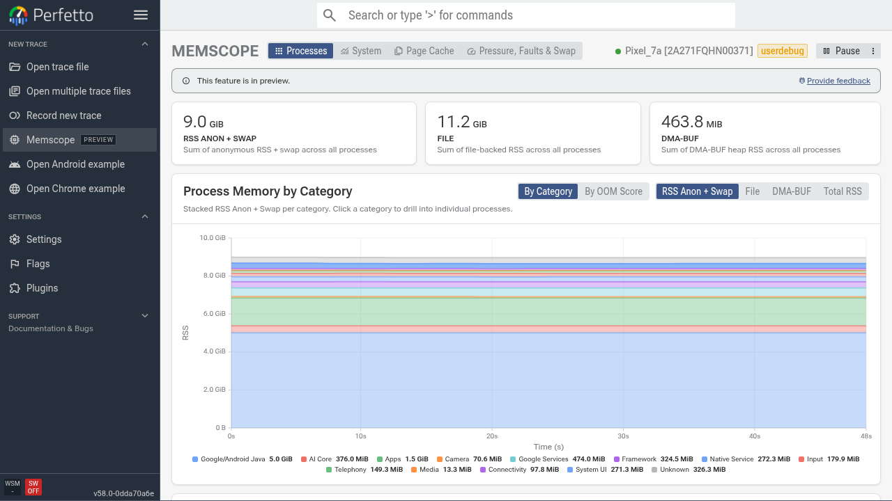
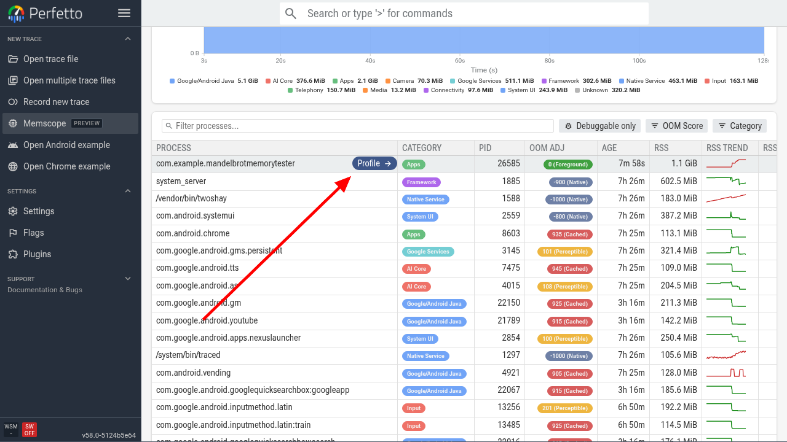
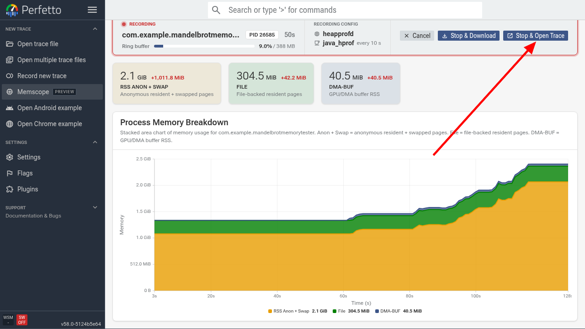

# Memscope and Memory Overview

NOTE: Memscope and Memory Overview are currently available on the Autopush and
Canary channels. Switch channels using the
[release channel flag](https://ui.perfetto.dev/#!/flags/releaseChannel).

Perfetto provides two complementary features for memory analysis:

- **Memscope** - A live memory monitor showing system-level and per-process
  stats from a running device. Provides shortcuts to start tracing a specific
  process.
- **Memory Overview** - Appears after recording a trace, providing a high-level
  overview of the memory information, blending smaps snapshots, ART heap dumps
  and native profiling, with links to drill down further using
  [Heap Dump Explorer](/docs/visualization/heap-dump-explorer.md) and the
  existing memory tracks on the timeline.

This guide walks through recording a trace with Memscope and analyzing it in the
Memory Overview page.

NOTE: Recording smaps snapshots requires Android build `ZP1A.260626.001` or
newer.

## Memscope: Live Memory Profiling

Memscope lets you connect to an Android device or Linux host and watch system
and per-process memory metrics update in real time. It is useful for:

- Checking the overall health of the system (memory pressure / thrashing /
  LMKs).
- Finding which processes are growing over time.
- Spot-checking memory usage before and after a specific action.
- Starting a trace for a specific process.

### Starting a live Memscope session

1. Open https://ui.perfetto.dev and click **Memscope** in the sidebar.

   

2. Connect to your device or host using one of the available transports. The
   recording options are identical to those on the record page. If you are
   unsure which to pick, WebUSB is the easiest option for Android devices
   connected via USB.

3. Once connected, Memscope displays a dashboard of system stats and a
   task-manager-style list of running processes and their memory stats. The
   dashboard updates every few seconds.

   

   

   You can click through the tabs at the top of the page to see various
   system-level memory stats such as page cache usage and memory pressure.

### Process monitoring

Use the process table to:

- **Sort by memory usage** - by default the process list is sorted by descending
  RSS Anon + Swap usage.
- **Watch trends** - the sparkline next to each process shows recent RSS
  direction - processes with consistently upward trends are good candidates for
  deeper investigation.
- **Search for a process** - use the filter box to search for a specific process
  or package by name.
- **Profile a process** - hover over a process row to reveal the **Profile**
  button - click it to start a heap profile for that process.

  

  In this example, we are going to test a dummy app that intentionally leaks
  native memory.

### Recording and opening a trace

After clicking **Profile**, Memscope starts recording the selected process using
a pre-configured memory trace configuration.

This pre-configured trace config includes:

- Periodic [Java (ART) heap dumps](/docs/data-sources/java-heap-profiler.md)
  (every 10s).
- Periodic smaps dumps (every 10s).
- [Native heap profiling](/docs/data-sources/native-heap-profiler.md) (dumped
  every 5s).

Exercise the app or otherwise reproduce the behavior you want to investigate,
then click **Stop & Open Trace**. You can monitor the high-level memory usage
using the stacked area graph on this page.

## Memory Overview: Post-Hoc Memory Triage

The Memory Overview page opens by default for any trace that contains smaps
snapshots, but you can also find it in the sidebar under **Memory Overview**. It
provides a comprehensive view of memory usage for a given process over the
duration of the trace.

NOTE: For Googlers, you can find good examples of traces with smaps dumps via
the
[process_smaps dashboard](https://apconsole.corp.google.com/dashboards/process_smaps).
However, these usually contain only a single dump, so the timeline view on this
page will be hidden.

### Process selector and headline stats

At the top of the page, the process selector lets you pick which process to
inspect. By default, the process with the highest number of memory-relevant
stats is selected. If you have recorded a trace via Memscope, this process will
be selected automatically, as it only records a single process.

### Composition chart

The composition-over-time chart shows how memory is broken down by category
(anon, file, shmem, etc.) based on the information in the smaps snapshots. This
is used for top-level temporal navigation for the rest of the page. You can:

- **Select single snapshots** - click points on the chart to inspect specific
  snapshots. The following sections show a breakdown of this snapshot only.
- **Drag across a range** - click and drag across multiple snapshots to compare
  snapshots and see how memory use has changed over time.

In this example, we can see that native memory started increasing rapidly
towards the end of the trace (after we started interacting with the app).

#### Where the growth went

This bar shows a breakdown of how the memory growth within the selected region
is split into the various high-level categories. If a single snapshot is
selected, it shows the delta from the start of the trace.

### Memory breakdown sections

Below the chart, Memory Overview provides several sections for drilling into
memory usage.

#### Where did all the memory go?

This section provides a breakdown of resident memory based on smaps data for the
selected snapshot (absolute, not delta). Use it to determine which sections
below are consuming the most memory.

In this example, we can see that native memory is using a large proportion.

#### Java heap

For ART processes, the Java section explains heap usage and lists the heaviest
retained objects by various metrics, grouped by class name. Clicking any of the
class names reveals the contributing objects in Heap Dump Explorer.

#### Bitmaps

The bitmap section summarizes the largest and most frequent bitmaps grouped by
dimension.

#### Native allocations

The native allocation section shows the top unreleased memory allocation call
sites (allocations for which we haven't seen a subsequent free). Note that it
cannot account for all native memory usage - only for allocations made since we
started recording the trace. In our example it covers 87%, so we can get a good
idea of where the memory is going.

We can see that a native function in the mandelbrot engine has allocated 182 MB
without freeing it. This function originates from a native tile rendering
library in the dummy app used to generate the mandelbrot bitmaps and send them
back to the Java runtime for composition. It should not retain much, if any,
memory. The intentional leak was, in fact, caused by skipping the call to free
the image buffer for rendered tiles, so every call into the native code would
leak one 512x512px buffer, which has added up steadily over time.

Click on the 'Show in timeline' button to drill down into the native allocation
flamegraph in more detail.

#### Smaps Detail

Scrolling back up to the top of the page, click the **Smaps Detail** tab at the
top of Memory Overview to inspect the raw `/proc/<pid>/smaps` data. The table
groups mappings using the same categories as the composition chart.

## Putting it together: A workflow

In summary, a typical memory investigation workflow looks like this:

1. **Find the process** - use Memscope to monitor memory live and identify which
   process is growing or find the process you're looking to monitor.
2. **Start tracing the process** - click to start profiling the offending
   process, then open the trace in the UI.
3. **Triage in Memory Overview** - open the trace and use the composition chart
   and breakdown sections to understand where the memory went.
4. **Go deeper** - if needed, start a native heap profile from Memscope or
   record a new trace with heap profiling enabled to get allocation call stacks.

## See also

- [Memory Profiling guide](/docs/getting-started/memory-profiling.md) - overview
  of native heap profiling, ART heap dumps, and allocation profiling.
- [Memory counters](/docs/data-sources/memory-counters.md) - per-process memory
  counters and events from the kernel.
- [Native heap profiler](/docs/data-sources/native-heap-profiler.md) - deep dive
  into heapprofd allocation profiling.
- [Heap Dump Explorer](/docs/visualization/heap-dump-explorer.md) - analyzing
  ART heap dumps object by object.
- [Memory usage case study](/docs/case-studies/memory.md) - end-to-end guide to
  debugging memory issues on Android.
