# Firehose workbook: every experiment we ran

This is the lab notebook behind [the RFC](../../0038-firehose-debundling-smb-compression.md). The RFC is the narrative; this is
the backing. It covers the three threads of the de-bundle to SMB to recompress study:

1. **Ftrace de-bundling** (does it blow up the size?)
2. **SMB pressure** (how many concurrent traces can one buffer feed?)
3. **Compression** (can *traced* recompress it back to today's size, and what does it cost?)

Every entry follows the same shape: **Ran** (what we did), **Data** (the chart or
table it produced), **Conclusion** (what it told us). Numbers are measured on a
**Pixel Fold (Tensor G2)** unless noted; all tools and raw data are under each task
folder.

## Quick index

- [How we ran everything (tests, commands, scripts)](#how-we-ran-everything-tests-commands-scripts)

**Part 1: ftrace de-bundling (size)**
- [1.1 De-bundling growth across 12 real traces](#11-de-bundling-growth-across-12-real-traces)
- [1.2 Per-event-class amplification](#12-per-event-class-amplification)
- [1.3 Growth tracks scheduler share](#13-growth-tracks-scheduler-share)
- [1.4 Byte composition by trace type](#14-byte-composition-by-trace-type)
- [1.5 Not counting atrace events](#15-not-counting-atrace-events)
- [1.6 The pure-scheduler ceiling](#16-the-pure-scheduler-ceiling)
- [1.7 Is the rebuilt sched_switch faithful?](#17-is-the-rebuilt-sched_switch-faithful)
- [1.8 Field-level byte breakdown](#18-field-level-byte-breakdown)
- [1.9 Absolute size, not just ratios](#19-absolute-size-not-just-ratios)

**Part 2: SMB pressure (bandwidth)**
- [2.1 Host bench: a fast reader's ceiling](#21-host-bench-a-fast-readers-ceiling)
- [2.2 Loss vs load, per scenario (interim model)](#22-loss-vs-load-per-scenario-interim-model)
- [2.3 Breakpoint by condition](#23-breakpoint-by-condition)
- [2.4 Starvation is the cause, not the buffer](#24-starvation-is-the-cause-not-the-buffer)
- [2.5 The drain-ceiling rule](#25-the-drain-ceiling-rule)
- [2.6 Buffer size: healthy vs starved reader](#26-buffer-size-healthy-vs-starved-reader)
- [2.7 Controlled cold-start multiplier](#27-controlled-cold-start-multiplier)
- [2.8 Cold-start buffer sweep](#28-cold-start-buffer-sweep)
- [2.9 Two ways to mean "N×": time-warp vs duplication](#29-two-ways-to-mean-n-time-warp-vs-duplication)
- [2.10 The nice fix (interim model)](#210-the-nice-fix-interim-model)
- [2.11 Faithful: sessions before loss, by condition](#211-faithful-sessions-before-loss-by-condition)
- [2.12 Faithful: buffer size by condition](#212-faithful-buffer-size-by-condition)
- [2.13 Faithful: idle ceiling grid](#213-faithful-idle-ceiling-grid)
- [2.14 Faithful: the nice fix under heavy load](#214-faithful-the-nice-fix-under-heavy-load)
- [2.15 Reassembly correctness stress test](#215-reassembly-correctness-stress-test)
- [2.16 Reading it as sessions, and why routing helps](#216-reading-it-as-sessions-and-why-routing-helps)
- [2.17 Audit + re-verify: is the boot/first-unlock reader faithful to traced?](#217-audit--re-verify-is-the-bootfirst-unlock-reader-faithful-to-traced)

**Part 3: compression**
- [3.1 Codec bake-off on the little core](#31-codec-bake-off-on-the-little-core)
- [3.2 Stored size vs today, all 12 traces](#32-stored-size-vs-today-all-12-traces)
- [3.3 Ratio vs level, dense vs sparse](#33-ratio-vs-level-dense-vs-sparse)
- [3.4 On-device cost across cores](#34-on-device-cost-across-cores)
- [3.5 Is it a fair fight? window clamp](#35-is-it-a-fair-fight-window-clamp)
- [3.6 Block size](#36-block-size)
- [3.7 The --long window](#37-the---long-window)
- [3.8 Memory and decompression (read side)](#38-memory-and-decompression-read-side-per-core)
- [3.9 Why some traces are cheap (the 3 levers)](#39-why-some-traces-are-cheap-the-3-levers)

---

# How we ran everything (tests, commands, scripts)

Every number traces back to one of three test rigs. All scripts are committed under
[`media/0038/scripts/`](scripts) (one subdir per part); the device runs are on a **Pixel
Fold (Tensor G2)**. The shared workhorse is **`ftrace_expand.py`**: an offline
de-bundler that reads a real bundled trace and re-emits it as the v2 firehose (one
*FtraceEvent* per packet, *CompactSched* expanded), reporting sizes and a field-level
byte breakdown. It is the heart of Parts 1 and 3, so a copy sits in each part's script
dir. The corpus is the **12 real captures** (6 scenarios × 2) named in the RFC glossary,
stored as `<cat>/t{1,2}.pftrace` on the *tracing_v2* branch.

### Part 1: size (de-bundling) · [`scripts/size/`](scripts/size)

*What it answers:* how many more bytes the de-bundled stream is than today, per trace and
per event class, with nothing compressed yet (the raw on-the-wire / SMB cost), and the
pure-scheduler worst case.

- **`ftrace_expand.py`: the de-bundler** (the core tool, shared with Part 3):
  - Reads a *decompressed* trace and parses the proto by hand (small varint/length helpers,
    no generated code).
  - Walks each *TracePacket* into the *FtraceEventBundle*, pulling out its one *cpu*, its
    *repeated event* list (the full events: print, binder, irq, …), and its *compact_sched*
    blob, then rebuilds it all in the v2 firehose shape.
  - Tallies bytes two ways per event: **payload only** (event bytes) and **file level**
    (event + its own new *TracePacket* header). Those are the RFC Part-1 "data ×" / "+pkt ×"
    columns.
  - *Individual events:* already standalone, just re-wrapped + a per-event *cpu*. ~1.07×.
  - *CompactSched:* rebuilt into full *FtraceEvent*s (delta timestamp summed to absolute,
    *comm* un-interned, `prev_*` rebuilt from a per-CPU chain). ~3.5–4.7×. This is where the
    size goes.
  - Splits totals by class, giving the per-class amplification and the **scheduler
    byte-share** the growth tracks. Output: one JSON per trace.
- **`task1_size.sh`: the orchestrator.** Runs the de-bundler over a directory of traces;
  decompresses each first (*gunzip* / `traceconv decompress_packets`); **cross-checks** the
  result against *trace_processor*'s `select count(*) from ftrace_event` so the hand parser
  is provably complete; concatenates all JSON into `ALL_JSON.txt`.
- **Pure-scheduler ceiling.** `sched_load.py` drives the max context-switch rate (process
  pairs pinned to the same CPU ping-ponging a byte through a pipe, forcing a wakeup + switch
  per round); `capture_pure_sched.sh` records a sched-only trace under it = the ~5× worst
  case. `capture_ftrace.sh` is a milder sched-heavy local capture.
- **`plot_size.py`: charts.** Reads the JSON (+ `compress_sweep.json` for stored size) and
  renders the Part 1 figures plus `size_onwire.png` / `size_stored.png`.
  `ftrace_expand_selftest.py` unit-checks the parser.

**Worked example: one bundle in, three packets out.** Take a single CPU-3 bundle that holds
one atrace *print* plus two *sched_switch* (the sched packed columnar). Values shown as
text-proto:

```proto
# BEFORE (today): one TracePacket, one bundle, many events
TracePacket {
  ftrace_events: FtraceEventBundle {          # field 1
    cpu: 3                                     #   one cpu for the whole batch
    event: FtraceEvent {                       #   a full, standalone event (atrace)
      timestamp: 1000000                       #     absolute
      pid: 1843
      print { buf: "B|1843|onDraw" }
    }
    compact_sched {                            #   the two sched_switch, columnar:
      intern_table:          ["", "surfaceflinger", "kworker/3:1"]   # comm strings, interned once
      switch_timestamp:      [120, 90]         #   DELTAs (packed varints), not absolute
      switch_next_pid:       [1, 305]
      switch_next_comm_index:[2, 1]            #   indices INTO intern_table
      switch_prev_state:     [1, 0]
    }
  }
}
```

```proto
# AFTER (v2 de-bundled): one TracePacket per event, cpu moved onto each event
# 1) the print: copied verbatim, just gains its own packet + cpu      (~1.07x)
TracePacket { ftrace_event: FtraceEvent {
  timestamp: 1000000
  pid: 1843
  cpu: 3                                       # field 6, NEW (was per-bundle)
  print { buf: "B|1843|onDraw" }
} }

# 2) sched_switch row 0: rebuilt into a FULL event                    (~4x)
TracePacket { ftrace_event: FtraceEvent {
  timestamp: 1000120                           # delta summed back to ABSOLUTE (1000000 + 120)
  cpu: 3
  sched_switch {
    prev_comm: "surfaceflinger"  prev_pid: 305 # rebuilt from the per-CPU chain (who ran last)
    prev_state: 1
    next_comm: "kworker/3:1"     next_pid: 1   # intern_table[2], written out IN FULL
    next_prio: 120
  }
} }

# 3) sched_switch row 1: same expansion
TracePacket { ftrace_event: FtraceEvent {
  timestamp: 1000210                           # 1000120 + 90
  cpu: 3
  sched_switch {
    prev_comm: "kworker/3:1"     prev_pid: 1   # = row 0's "next" (the chain)
    next_comm: "surfaceflinger"  next_pid: 305 # intern_table[1]
  }
} }
```

So the *print* is essentially unchanged (it just costs one extra *cpu* field and its own
packet header), while each *sched_switch* balloons: a ~1-byte delta becomes a full absolute
*timestamp*, the interned index becomes the full *comm* string, and the `prev_*` block is
reconstructed from the previous switch on that CPU. That asymmetry, cheap individual events
vs expensive sched, is the whole story of Part 1.

```sh
# (copy task1_size.sh + ftrace_expand.py into perfetto/tools/ first)
tools/task1_size.sh <traces-dir> <outdir>          # decompress + de-bundle + count-check
python3 scripts/size/plot_size.py <outdir> <compress_sweep.json> media/0038
```

### Part 2: SMB bandwidth · [`scripts/smb/`](scripts/smb) + [`scripts/rerun/`](scripts/rerun)

*What it answers:* how much write-rate the 512 KB shared-memory buffer (SMB) absorbs
before it drops events, per device condition; whether the cause is raw throughput or the
consumer being starved of CPU; and that a negative *nice* fixes the boot case.

This is the rig everything in Part 2 rests on, so here it is in full. The flow:

```text
  build_replay.py  ─►  aot_boot_t1.smbr      per-CPU (gap, size) streams from a real boot
                            │
                            ▼   harness loads it; rate set by --dup-mult N (or --multiplier N)
     one WriterThread per source CPU
        each loop: sleep(gap / mult)  ->  write `size` bytes   (first 4 bytes = seq#)
                            │  BeginWrite / CommitWrite
                            ▼
     v2 SharedRingBuffer        the real prototype; size = --smb-kb (default 512 KB)
                            │  ReadOneChunk / completed_messages
                            ▼
     ONE reader thread  ( = traced )      DrainLoop(): drain everything available,
        pinned to traced's                then sleep until --wake-ms timer fires
        cpuset + cgroup + nice            OR buffer crosses --fill-pct, then repeat
                            │
                            ▼
     loss = per-writer sequence gaps   (next != last+1  ->  lost += seq - last - 1)
     + reader run-vs-runnable-wait (the starvation signal)   ->  stderr line + --csv row
```

- **What we're modeling.** In the real stack the kernel produces ftrace events per CPU, the
  producer copies them into one shared-memory ring buffer, and a *single* consumer
  (*traced*) drains it. If events arrive faster than they drain, the buffer fills and the
  producer drops events. The whole question is that race, fill rate vs drain rate, run
  against the real buffer code.
- **The replay file (`build_replay.py` → `*.smbr`).** Replays a *real*, zero-loss boot
  capture, not a synthetic flat stream:
  - walks every de-bundled ftrace event, records `(cpu, timestamp, exact wire size)`, and
    groups them per CPU into `(gap-since-previous, size)` streams.
  - sizes are the exact de-bundled *FtraceEvent* bytes (CompactSched unpacked, *cpu* added)
    from the same *ftrace_expand* as Part 1, so the bytes pushed match real v2.
- **The writers (one per CPU).** One writer thread per source CPU, mirroring per-CPU ftrace.
  Each: wait the recorded gap (÷ rate multiplier), then write *size* bytes into the real v2
  *SharedRingBuffer* via its genuine *BeginWrite*/*CommitWrite*. Real timing/bursts/sizes,
  not a flat rate. First 4 bytes of each message = a per-writer sequence number.
- **The reader (the one consumer = *traced*).** The *single* thread that drains the SMB
  (one, like the real system). It runs `DrainLoop()`: pull everything available, then sleep
  until a flush timer (`--wake-ms`, default 1 ms) *or* a fill threshold (`--fill-pct`,
  default 50%), then drain again. That "drain all, then wait" rhythm is how *traced*
  batches; it is deliberately not a busy spin.
- **Why it can starve.** Before draining, the reader thread joins the *same* scheduling
  context as the live *traced*: cpuset, cpu cgroup, and *nice* (`--reader-cpus`,
  `--reader-cgroup`, `--reader-nice`; match verified in 2.17). So under load it gets
  descheduled exactly as *traced* would, which is how boot starvation is reproduced, not
  assumed.
- **How loss is counted (exact, not sampled).** Each writer numbers its messages; the
  reader compares each to the last seq from that writer, and a jump (next != last + 1) means
  the producer couldn't commit because the buffer was full, i.e. dropped. Summing gaps =
  exact loss (`lost += seq - last - 1`). Every Part 2 "loss %" is this over events sent.
- **The two ways to say "N×".** `--multiplier N` (time-warp) shrinks the gaps to hit N× the
  rate but distorts bursts and overstates loss (interim). `--dup-mult N` (duplication) emits
  N copies of each event at its real instant, so a burst of B becomes N×B over the same
  window = N concurrent traces at honest timing: the **faithful** model the RFC uses. Each
  copy keeps its own seq, so loss accounting is unchanged. (2.9 compares them.)
- **Output + build.** One stderr line + a CSV row (`--csv`): sent, received, lost, loss %,
  input MB/s, peak occupancy %, and the reader's run vs runnable-wait (*reader_wait_pct* =
  the starvation signal). `--smb-kb` sets buffer size (default 512). Built through the
  ringbuf prototype worktree by `build_harness.sh` (`--arm64`), since it `#include`s the
  real v2 *SharedRingBuffer*.
- **The device sweeps that drive it.** `rerun/run_nonreboot.sh` (idle / cold_start /
  dex2oat) and `rerun/run_boot.sh` (real_boot + first_unlock, co-captured per reboot), with
  `rerun/run_all.sh` driving both; `rerun/aggregate.py` → `rfc_sessions.csv`;
  `rerun/plots.py` → `sessions_under_load.png` / `buffer_vs_condition.png` /
  `nice_fix_faithful.png`. `smb/_devstate.sh` is the thermal cooldown (screen off, ≤37 °C
  skin) between reboots; `rerun/reassembly_stress.cc` is the separate 6-config correctness
  test. The earlier time-warp sweeps (`smb/sweep_device.sh`, `smb/run_sweep_v2.sh`, …) were
  superseded by the `rerun/` runners.

```sh
scripts/smb/build_harness.sh --arm64                       # build the harness (real SMB)
python3 scripts/smb/build_replay.py aot_boot_t1.dec --out aot_boot_t1   # -> aot_boot_t1.smbr
nohup scripts/rerun/run_all.sh > /tmp/rfc_all.out 2>&1 &   # sweep, then aggregate.py + plots.py
```

**The load and triggers we drove (show our work).** Each condition is a real device action
over *adb*, not a synthetic stand-in:

- **Heavy compile (*dex2oat*)** = a whole-device compile-all, looped, the harshest steady
  CPU load short of a boot:
  ```sh
  adb shell "nohup sh -c 'while true; do cmd package compile -m speed -a -f; done' &"
  # stop: kill the loop + any orphaned dex2oat it spawned
  adb shell 'for p in $(pgrep -f "package compile") $(pgrep dex2oat); do kill -9 $p; done'
  ```
- **First unlock** = wake, dismiss the keyguard, cold-launch an app, then run the harness
  through the spike:
  ```sh
  adb shell 'input keyevent KEYCODE_WAKEUP; wm dismiss-keyguard'
  adb shell 'am start -W com.google.android.apps.maps'
  ```
- **Thermal gate before every loaded run** = cool with the screen off until VIRTUAL-SKIN
  is ≤ 37 °C, safely under this Pixel's 39 °C throttle point, so every run starts from a
  comparable temperature:
  ```sh
  adb shell 'input keyevent 223'                       # 223 = SLEEP (screen off cools faster)
  adb shell 'dumpsys thermalservice' | grep -A1 'Current temperatures from HAL'
  ```
  Real output on the Pixel Fold (the throttle thresholds confirm why 37 is the target):
  ```text
  Current temperatures from HAL:
      Temperature{mValue=30.65, mType=3, mName=VIRTUAL-SKIN, mStatus=0}
  TemperatureThreshold{... mName=VIRTUAL-SKIN, mHotThrottlingThresholds=[NaN, 39.0, 43.0, ...]}
  ```
  `smb/_devstate.sh` parses *mValue*, waits until it is ≤ 37 °C (or a soft timeout), then
  proceeds. (Idle and cold_start need no extra load; cold_start reuses the same
  `am start` at a fixed offset.)

### Part 3: compression · [`scripts/compress/`](scripts/compress)

*What it answers:* which codec and level recompress the bigger de-bundled stream back to
≤ today, and what that costs on the cores *traced* runs on. Two independent dimensions:
**ratio** (size) is the same on any machine, so measured once on the host across all 12
traces; **cost** (CPU/memory) depends on the silicon, so measured on the real Pixel. The
flow:

```text
  trace.pftrace (field, DEFLATE)
       │ debundle_corpus.py  (ftrace_expand)
       ├─►  *.today.pftrace    bundled + CompactSched   ( = ships today )
       └─►  *.v2.pftrace       de-bundled firehose
                │
    ┌───────────┴──────────────────────────────────┐
    ▼ RATIO (host, once, all 12)                    ▼ COST (Pixel, per core cluster)
  compress_sweep.py                               run_device.py ─► cost_bench.py
    gzip/lz4/zstd × level                           zstd/lz4 -b<level>  (in-proc loop,
    zstd block sizes (csize_blocked)                  round-trip self-verified)
    zstd --long ; baseline = gzip-6 on .today       little / mid / big
    ─► compress_sweep.json (vs_today/config)        ─► cost_device.json, decomp_device.json
                │                                            │
                ▼                                            ▼
       5_vs_today.png, 4_block_size.png            2_speed_cores.png, 6_decomp_speed.png
```

- **`debundle_corpus.py`: the two streams to compare.** Per trace, writes both forms with
  the same *ftrace_expand* from Part 1: `*.today.pftrace` (bundled + CompactSched = ships
  today) and `*.v2.pftrace` (de-bundled firehose). Field traces decompressed first.
  Everything downstream compresses these two, so "today vs v2" is always like-for-like.
- **`compress_sweep.py`: ratio sweep (host),** sizes only:
  - *codec × level:* gzip (1/6/9), lz4 (1/3/6/9/12), zstd (1..19) on the whole v2 stream.
  - *zstd block size:* `csize_blocked()` compresses independent 512K / 1M / 2M / 4M / whole
    chunks and sums them, exactly what *traced* does per flush. (the *4_block_size* data.)
  - *zstd `--long`:* the big-window variant, ratio side only.
  - *baseline:* gzip-6 on the **bundled** stream = today's actual artifact.
  - each entry's *vs_today* = `stored(v2 + codec) / today(gzip on bundled)`, so `<1` =
    smaller than today. Output `compress_sweep.json` feeds `5_vs_today.png`,
    `4_block_size.png` and the size table.
- **`cost_bench.py`: cost (host or device).** Prices a fixed shortlist for CPU/memory by
  driving *zstd*/*lz4*'s built-in **`-b` benchmark mode** (an in-process loop that
  compresses+decompresses, self-verifies the round-trip, and prints
  `<in> -> <out>, <C> MB/s, <D> MB/s`); `cost_bench.py` runs it and parses those (+ peak
  RSS). Same binary on x86 and arm64, so `--target adb` runs it on the phone. gzip has no
  `-b`, so it's the host-only anchor.
- **`run_device.py`: on-device driver.** Pushes arm64 *zstd*/*lz4* + a trace subset to the
  Pixel and runs `cost_bench.py` per core cluster (little / mid / big) → `cost_device.json`
  / `decomp_device.json`, the per-core MB/s behind `2_speed_cores.png` and
  `6_decomp_speed.png`.
- **Charts:** `plot_charts.py` (`5_vs_today.png`, `2_speed_cores.png`, `4_block_size.png`,
  …) and `plot_decomp.py` (`6_decomp_speed.png`).

```sh
# 1) make both streams for every trace  (-> <out>/<cat>_<tN>.{today,v2}.pftrace)
python3 scripts/compress/debundle_corpus.py tracing_v2/traces <out> tools/traceconv

# 2) RATIO sweep on the host (all 12 traces, architecture-independent)
python3 scripts/compress/compress_sweep.py <out> compress_sweep.json --jobs 8

# 3) COST on the Pixel: push arm64 zstd/lz4, bench per core cluster
python3 scripts/compress/run_device.py <out>/first_unlock_t1.v2.pftrace \
    --bin-dir ~/arm64bin --secs 3 --out cost_device.json

# what cost_bench actually drives on the device (one codec, the built-in -b loop):
adb shell '/data/local/tmp/tv2/zstd -b6 -e6 -i3 first_unlock_t1.v2.pftrace'
```

Example `-b` line it parses (level#file : in -> out (ratio), compress MB/s, decompress MB/s):

```text
 6#first_unlock_t1.v2 : 118931031 -> 24139051 (4.93), 14.0 MB/s, 239.6 MB/s
```

`cost_bench.py` pulls the two MB/s and the in/out sizes from that line; on the little core
that is the zstd-6 row behind `2_speed_cores.png` (14 MB/s compress) and `6_decomp_speed.png`
(240 MB/s decompress).

# Part 1: ftrace de-bundling (size)

The firehose emits one full *FtraceEvent* per *TracePacket* instead of packing many
into a bundle and columnar-packing sched with *CompactSched*. These experiments
measure how much bigger that makes the on-the-wire stream, *before* compression.
Tool: `scripts/size/ftrace_expand.py` (pure wire-format Python).

## 1.1 De-bundling growth across 12 real traces

**Ran.** De-bundled 12 real, data-loss-free Android traces (6 capture types × 2),
reporting the size multiplier two ways: event bytes only, and including the per-event
*TracePacket* header.

**Data.**

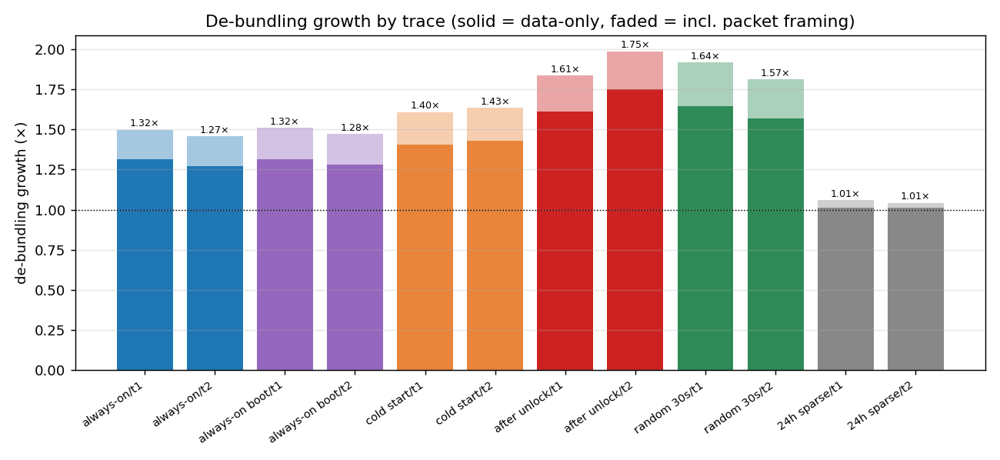

| trace type | events | today MB | de-bundled MB | data × | +pkt × |
|---|--:|--:|--:|--:|--:|
| general load (aot) | 1.45 M | 45.8 | 60.3 | 1.32 | 1.50 |
| startup load (aot_boot) | 1.56 M | 45.7 | 60.1 | 1.32 | 1.51 |
| cold start | 1.64 M | 46.0 | 65.8 | 1.43 | 1.64 |
| post-unlock | 2.55 M | 61.6 | 107.9 | 1.75 | 1.99 |
| random sampling | 1.50 M | 36.2 | 59.6 | 1.64 | 1.92 |
| sparse 24 h (battery_long) | 0.12 M | 15.8 | 16.0 | 1.01 | 1.06 |

**Conclusion.** **All-ftrace de-bundling is ~1.3–1.7× (mean 1.46) on load traces, and
free (~1.0×) on a sparse 24 h trace.** Nowhere near the feared 5×.

## 1.2 Per-event-class amplification

**Ran.** Split the growth by event class to find *what* gets bigger: atrace *print*,
binder/irq, vs scheduler events.

**Data.**

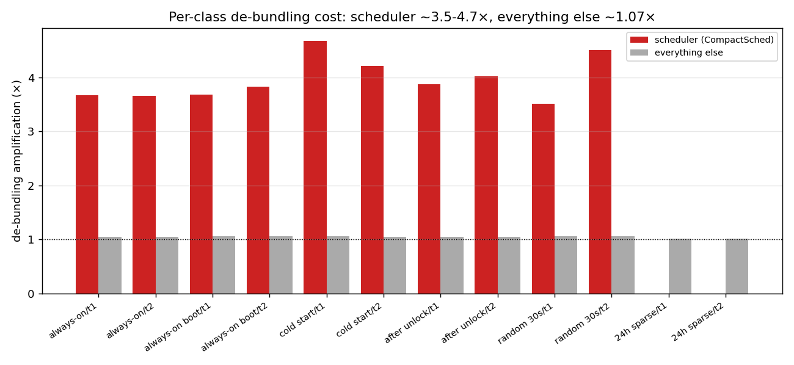

| event class | × bigger (data) | why |
|---|--:|---|
| atrace *print*, binder, irq | ~1.07× | already standalone; only re-wrapped |
| scheduler (*sched_switch*/*waking*) | 3.5–4.7× | *CompactSched* undone: full ts, un-interned comm, rebuilt `prev_*` |

**Conclusion.** **Only scheduler events are expensive to un-bundle.** Everything else
is already one-event-per-message today and is essentially free to re-wrap.

## 1.3 Growth tracks scheduler share

**Ran.** Plotted each trace's overall growth against its scheduler byte-share, to test
whether the per-class rule (1.2) fully explains the per-trace variation (1.1).

**Data.**

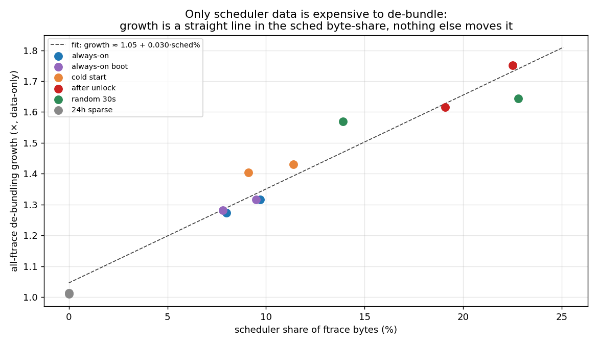

**Conclusion.** **A straight line: growth ≈ 1.04 + 0.029 × sched%.** Nothing but
scheduler share moves the multiplier, so growth is a pure byte-weighted blend of the
two per-class costs.

## 1.4 Byte composition by trace type

**Ran.** Broke each trace into its byte mix (print / sched / other) to explain why the
scheduler share, and therefore the growth, differs by capture config.

**Data.**

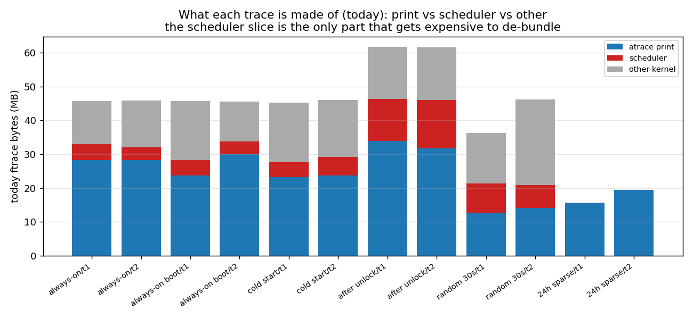

**Conclusion.** **The capture config sets the mix.** Print-heavy load configs sit at
~1.3×; lean configs with a bigger sched share (post-unlock ~22% sched) reach ~1.7%;
configs with no sched are free.

## 1.5 Not counting atrace events

**Ran.** Subtracted userspace atrace *print* (which need not be captured in ftrace at
all) and re-measured the remaining stream, per trace.

**Data.**

| | data × | +pkt × |
|---|--:|--:|
| all ftrace today | 1.3–1.7× (mean 1.46) | 1.5–2.0× (mean 1.67) |
| **not counting atrace events** | **~1.9× (up to 2.5×)** | **~2.2× (up to 2.9×)** |

**Conclusion.** **The v2 number is ~1.9–2.5×.** With atrace not counted, what remains
leans scheduler, so the multiplier climbs, but is still far under the pure-scheduler ceiling.

## 1.6 The pure-scheduler ceiling

**Ran.** Built the most hostile possible input, a synthetic trace of nothing but
scheduler events (27.3 M, no atrace), to bound the absolute worst case.

**Data.**

| pure scheduler (~100% sched) | today | de-bundled | × |
|---|--:|--:|--:|
| all ftrace (synthetic, 27.3 M ev) | 222.6 MB | 1098 MB / 1255 MB | **4.94× / 5.64×** |
| **on a real Pixel** (sched-only, 454 K ev) | 3.96 MB | 19.7 MB / 22.3 MB | **4.98× / 5.64×** |

**Conclusion.** **The "5×" is real and reachable with a pure-scheduler config** (sched
events only, no atrace), an allowed config, just not what typical field traces enable. We
confirmed it on a **real Pixel** (sched-only ftrace under *sched_load*, 100% sched):
**4.98× / 5.64×**, matching the host reference, so 5× is the ceiling a config *can* hit,
on real silicon, not a host artifact. Field traces carry atrace and mixed events, so they
land far lower (~1.5×).

## 1.7 Is the rebuilt sched_switch faithful?

**Ran.** The firehose re-materializes every field *CompactSched* drops
(`prev_*`/`next_*`, full timestamp, *comm*). Compared the reconstruction
field-for-field against a real capture taken with *compact_sched* **disabled**.

**Data.** Reconstructed *sched_switch* carries exactly the kernel's full-event field
set (no *common_flags*, no *common_preempt_count*), plus the relocated *cpu*. Event
counts match *trace_processor* to within 0.001% on most traces.

**Conclusion.** **The de-bundled sched event is byte-faithful to the kernel's own
full form.** The size numbers are measuring a correct transform, not a lossy one.

## 1.8 Field-level byte breakdown

**Ran.** Profiled each trace's field-level byte breakdown today vs de-bundled
(`trace_processor_shell --analyze-trace-proto-content`) as an independent cross-check
of the mechanism.

**Data.**

| byte bucket | today | de-bundled | change |
|---|--:|--:|---|
| atrace *print* strings | 9.4–25.6 MB | identical | untouched |
| *compact_sched* | 3.9–15.2 MB | 0 (gone) | re-expanded → |
| sched as full messages | n/a | 10.3–42.4 MB | full fields + comm strings |
| per-event timestamp | small | +2–8 MB | full ts per event |
| per-event cpu | 0.1–0.6 MB | 1.7–2.7 MB | moved onto the event |

**Conclusion.** **The entire cost is un-interned sched comm strings and full
timestamps**, exactly what *CompactSched* packs. The print bytes are byte-identical on
both sides.

## 1.9 Absolute size, not just ratios

**Ran.** Converted the per-trace size data + the compression sweep into absolute MB:
on-the-wire (uncompressed) today-vs-de-bundled, and stored (compressed) today-gzip vs
v2-zstd-6.

**Data.**

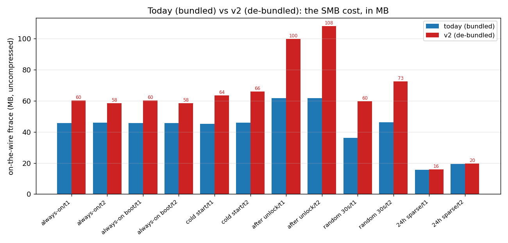
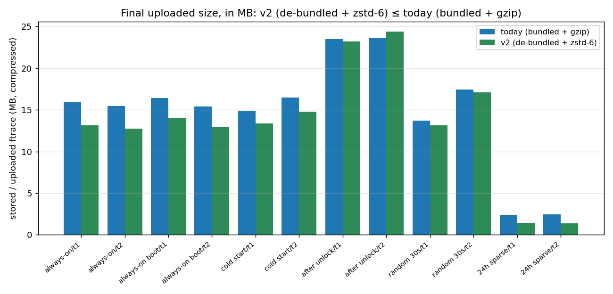

**Conclusion.** **The cost and the recompression win are real in MB, not just ratios.**
A boot trace's ftrace grows ~46 MB → ~60 MB on the wire (the raw SMB cost), the heaviest
~62 MB → ~100 MB; but what you upload lands at/below today after zstd (after-unlock
**23.5 → 23.2 MB**, 24 h sparse **~2.4 → ~1.4 MB**).

---

# Part 2: SMB pressure (bandwidth)

De-bundling makes ftrace ~1.5–2.5× bigger (Part 1): the real de-bundled *aot_boot*
stream peaks at **~13 MB/s**. These experiments ask **how many MB/s the SMB can absorb
before it drops**. Rig: replay each CPU's exact event stream through the real v2
*shared_ring_buffer*, reader pinned to traced's cpuset 0–5, loss measured exactly
(numbered events). The charts' x-axis is **MB/s**.

**A second reading for routing.** We dial the rate up by duplicating each event at its
real instant (bigger bursts = what de-bundling does). Because each extra un-deduped
trace re-emits the same events, **N×13 MB/s also reads as N concurrent traces**, the
framing used in [2.16](#216-reading-it-as-sessions-and-why-routing-helps) to reason
about routing.

The first block (2.1–2.10) used an interim **time-warp** model (play the recording
faster). We later found that overstates loss at high load and switched to the faithful
**duplication** model (2.11–2.14). Both are kept here; the faithful numbers are the
ones the RFC cites.

## 2.1 Host bench: a fast reader's ceiling

**Ran.** Before touching a phone, ran the buffer on a Linux x86 box with synthetic
writers and the batched reader (wake-when-full / timer → drain → sleep), swept from
the real rate up past breaking.

**Data.** Loss stays 0 until ~500 MB/s (≈30–40× the real ftrace rate). A bigger buffer
barely helps at a sustained near-ceiling rate; 1 vs 128 writers is about the same; the
wake interval barely matters (the buffer self-regulates by also waking at half-full).

**Conclusion.** **With a free fast core the buffer holds to ~500 MB/s.** Everyone
expects Linux to hold; the interesting case is the phone, where the reader does *not*
get a free fast core. Recorded for provenance, not used as a headline.

## 2.2 Loss vs load, per scenario (interim model)

**Ran.** On the phone, swept write rate (time-warp) under four conditions: idle,
synthetic load, and during a real boot and first-unlock.

**Data.**

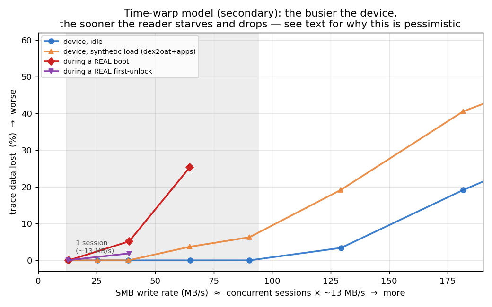

**Conclusion.** **Every phone curve breaks far sooner than the host, and the more
realistic the scenario the sooner it breaks** (a real boot is steepest). The phone, not
the host, is the constraint.

## 2.3 Breakpoint by condition

**Ran.** Extracted the write rate at which each condition first crosses 1% loss.

**Data.**

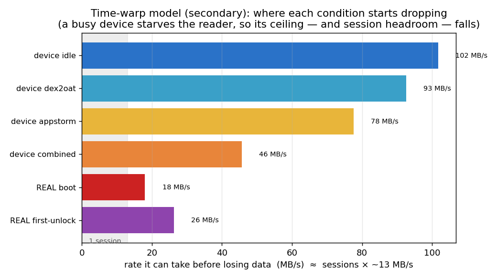

**Conclusion.** **Headroom shrinks with realism.** A real boot's breakpoint sits only
just above the steady ftrace rate, so the everyday cushion at boot is thin.

## 2.4 Starvation is the cause, not the buffer

**Ran.** Held the data rate fixed at 5× and changed only how busy the phone is, while
recording how long the reader sat waiting for a CPU.

**Data.**

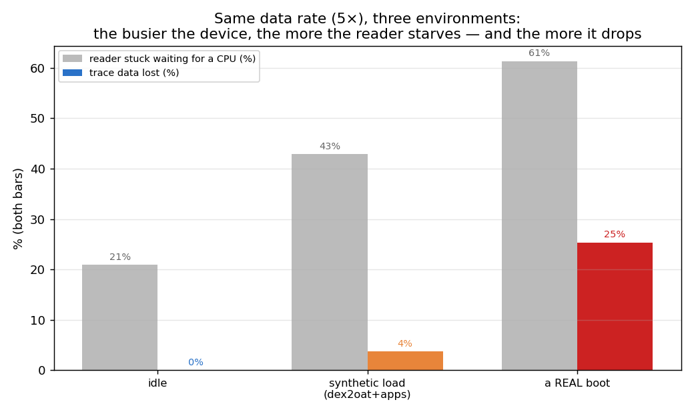

| environment | reader waiting for CPU | loss |
|---|--:|--:|
| idle | 21% | ~0 |
| synthetic load | 43% | a few % |
| real boot | 61% | ~25% |

**Conclusion.** **Loss tracks reader starvation, not the buffer.** Same rate, same
buffer; the only thing that changed is how often the reader lost the CPU.

**Seen in a real boot trace.** The starvation isn't only a harness artifact: the live
*traced* shows it in the field boot capture (`aot_boot/t1`, opened in the Perfetto UI).
Selecting a busy window of the boot storm and aggregating *traced*'s thread states:

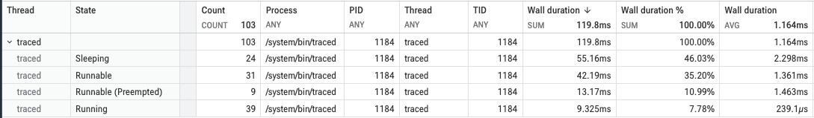

*traced* is **Running only 7.78%** of the window and **Runnable / Runnable(Preempted) 46%**
(Sleeping is the rest, i.e. blocked, not wanting the CPU). So of the time it actually
wanted a CPU, it was **denied one ~86%** (55.4 ms waiting vs 9.3 ms running) over this
hotspot; over the whole ~5.1 s storm the figure is ~77%, matching the ~76% reader-wait the
harness measured. The Running slices land only on **cpus 0–5** (the little/mid cores the
audit confirmed *traced* is pinned to), which during boot are exactly the contended ones.
Query in `scripts/` notes; this is a real device, not the replay.

## 2.5 The drain-ceiling rule

**Ran.** Held the buffer fixed (512 KB) and swept the write rate at three reader-health
levels (healthy / mildly squeezed / starved, set by reader nice), to find exactly where
loss begins.

**Data.**

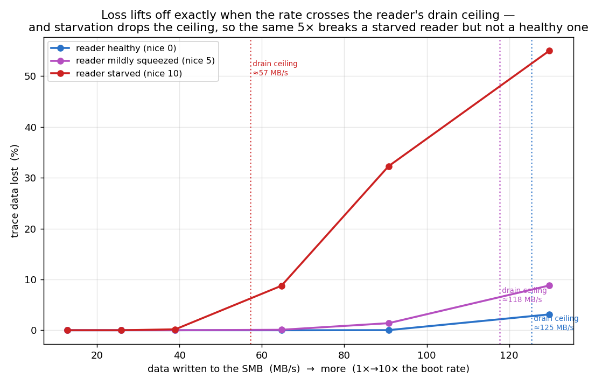

| reader state | drain ceiling | 5× | 10× |
|---|--:|--:|--:|
| healthy | 125 MB/s | 0 | 3.1% |
| mildly squeezed | 118 | 0.1% | 8.8% |
| starved | 57 | 8.8% | 55% |

**Conclusion.** **One rule governs everything: you lose data only when the write rate
crosses the reader's drain ceiling.** Starvation lowers the ceiling; the buffer only
smooths bursts.

## 2.6 Buffer size: healthy vs starved reader

**Ran.** Swept SMB size (256 KB → 4 MB) twice: with the reader healthy, and with it
deliberately starved.

**Data.**

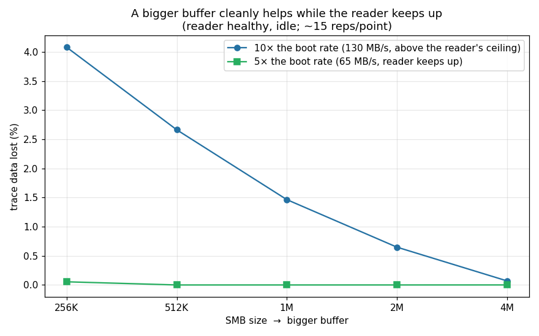
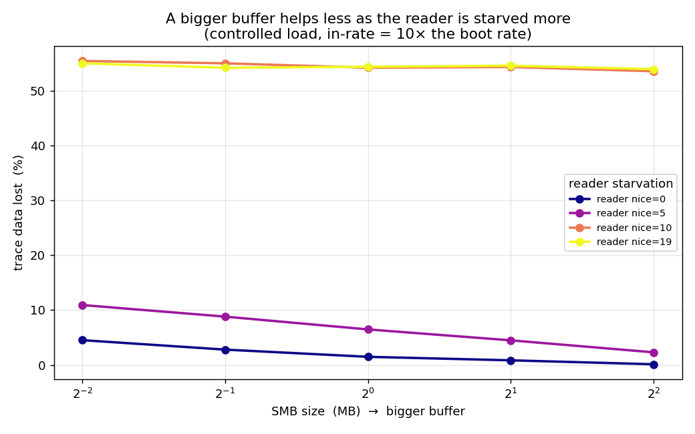

**Conclusion.** **A bigger buffer is a burst knob, not a starvation cure.** When the
reader keeps up it cleanly absorbs bursts; once the reader is starved (drain < arrival)
every size loses the same.

## 2.7 Controlled cold-start multiplier

**Ran.** Boot is uncontrollable, so we made a repeatable real event: force-stop an app,
start the harness, fire `am start` at a fixed offset, sweep the multiplier.

**Data.**

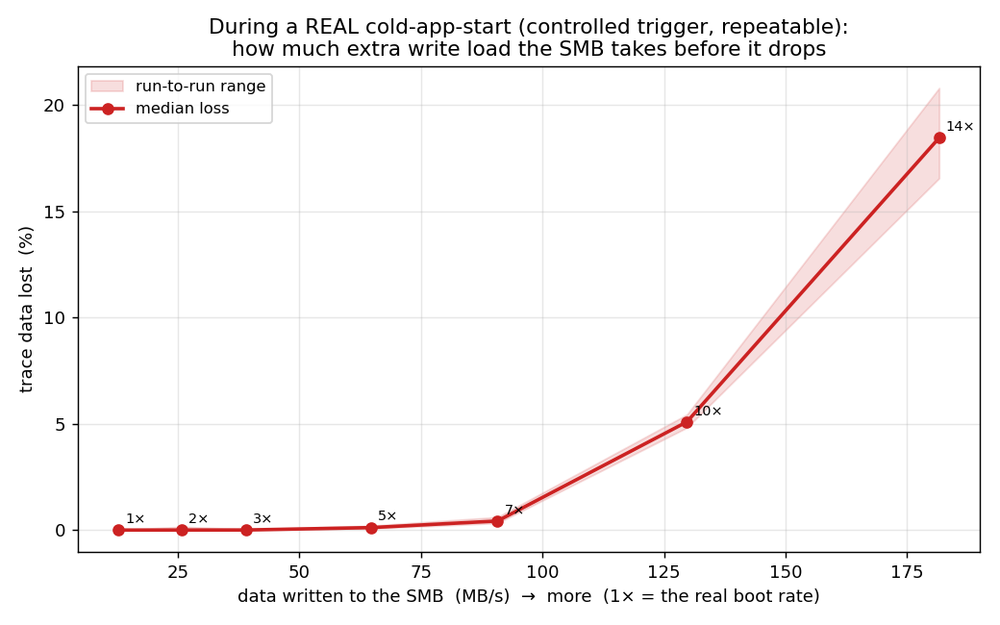

| load | 1× | 5× | 7× | 10× | 14× |
|---|--:|--:|--:|--:|--:|
| loss | 0% | 0.12% | 0.43% | 5.1% | 18% |

**Conclusion.** **A normal cold app start stays loss-free up to ~5× the real rate**, and
first drops data (~0.12%) at 5×; loss climbs steeply past that. So the everyday cold start
has real margin before the SMB drops anything, but the margin is finite, not unlimited.

## 2.8 Cold-start buffer sweep

**Ran.** Swept SMB size at a fixed 5× during the same repeatable cold start.

**Data.**

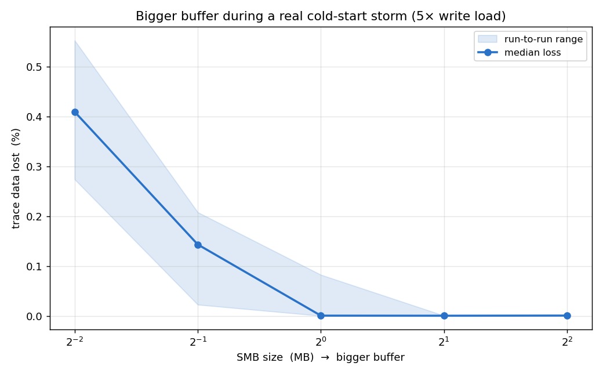

| SMB | 256 KB | 512 KB | 1 MB | 2 MB |
|---|--:|--:|--:|--:|
| loss | 0.41% | 0.14% | 0% | 0% |

**Conclusion.** **1 MB and up cleanly absorbs the residual** at the edge, confirming
2.6 on a real event: size mops up the last bit of burst, it does not rescue a starved
reader.

## 2.9 Two ways to mean "N×": time-warp vs duplication

**Ran.** Compared the two replay models at idle: **time-warp** (play faster, shrink the
gaps) vs **duplication** (N copies of each event at its real instant, gaps preserved).
Duplication is the faithful model of N concurrent traces.

**Data.**

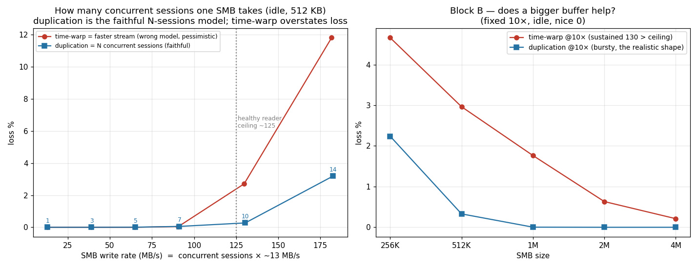

| N | time-warp loss | duplication loss |
|---|--:|--:|
| 5 | 0.0003% | 0.007% |
| 10 | 2.7% | 0.27% |
| 14 | 11.8% | 3.2% |

**Conclusion.** **Time-warp overstates loss at high N**, because shrinking the gaps
manufactures a sustained over-ceiling rate that real concurrent traces never produce.
**Duplication is the faithful model**, and it is gentler; we switched to it for the
headline numbers.

## 2.10 The nice fix (interim model)

*The nice fix is consolidated in [2.14](#214-faithful-the-nice-fix-under-heavy-load);
this is just the interim note.* We first tested it in the time-warp model under combined
load: a strong negative nice closed the loss (5×: **7.3% → 0.05%**) by cutting the
reader's runqueue-wait from **53% → 13%**. That runqueue-wait drop is the
model-independent reason the fix works; 2.14 has the faithful numbers.

## 2.11 Faithful: MB/s the SMB absorbs, by condition

**Ran.** The real answer. Duplication model, 512 KB SMB, swept the write rate ~13–182
MB/s across five conditions (idle, cold start, heavy compile, first-unlock, real boot).
565 runs, 0 skipped.

**Data.**

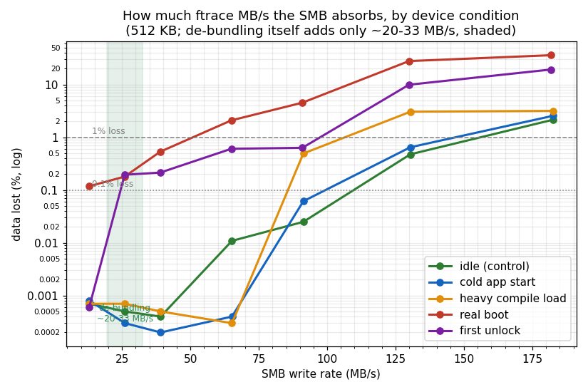

| condition | absorbs @ <0.1% | absorbs @ <1% |
|---|--:|--:|
| idle | ~98 MB/s | ~143 MB/s |
| cold app start | ~91 MB/s | ~143 MB/s |
| heavy compile | ~70 MB/s | ~99 MB/s |
| first-unlock | ~20 MB/s | ~91 MB/s |
| **real boot** | **≤13 MB/s** | **~47 MB/s** |

Full sweep, loss % at each write rate (MB/s). *Loss % = the share of ftrace events the
producer dropped because the SMB was full when it went to write, counted exactly from the
per-event sequence numbers in the replay (a missing number is a real drop). So 0.12% means
~1 event in 800 never reached the reader, and never made it into the trace; 0% means none
were dropped.*

| rate | idle | cold | heavy compile | unlock | boot |
|---|--:|--:|--:|--:|--:|
| 13 | 0.001 | 0.001 | 0.001 | 0.001 | 0.118 |
| 26 | 0.001 | 0.000 | 0.001 | 0.195 | 0.180 |
| 39 | 0.000 | 0.000 | 0.001 | 0.215 | 0.534 |
| 65 | 0.011 | 0.000 | 0.000 | 0.607 | 2.097 |
| 91 | 0.025 | 0.061 | 0.493 | 0.633 | 4.542 |
| 130 | 0.477 | 0.649 | 3.061 | 9.940 | 27.9 |
| 182 | 2.156 | 2.560 | 3.177 | 19.3 | 36.1 |

*Each cell is the median of 3 repetitions (sweep 1a). Values below ~0.01% are at the
measurement noise floor (a few stray events out of millions per run); treat them as zero
and do not read a trend into them (e.g. idle at 13 vs 39 MB/s differ only by rounding
noise, not because a higher rate dropped fewer events).*

**Conclusion.** **When the reader keeps up, one 512 KB SMB carries ~90–145 MB/s with no
loss.** A real boot is the exception: whole-system contention starves the reader and the
buffer already drops data at the real ~13 MB/s rate (~0.12%). Any loss is bad, so the fact
to carry forward is that boot already loses today and de-bundling (~13 → ~20–33 MB/s)
pushes that to ~0.1–0.5%. Boot needs the reader-starvation fix; the other conditions have
no loss at the real rate.

## 2.12 Faithful: buffer size by condition

**Ran.** Duplication model, swept SMB size at ~130 MB/s per condition.

**Data.**

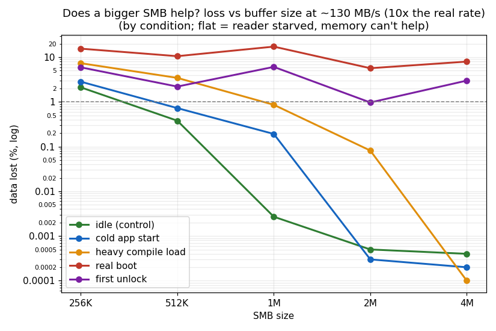

| loss @ ~130 MB/s | 256 KB | 512 KB | 1 MB | 4 MB |
|---|--:|--:|--:|--:|
| idle | 2.1% | 0.38% | 0.003% | 0% |
| heavy compile | 7.3% | 3.4% | 0.86% | 0% |
| real boot | 15.5% | 10.5% | 17.3% | 8.0% (flat/noisy) |

**Conclusion.** **Confirms the burst-vs-starvation split in the faithful model.** For
keep-up conditions 1–2 MB takes even ~130 MB/s to ~0; for a starved boot every size
loses about the same.

## 2.13 Faithful: idle ceiling grid

**Ran.** Duplication model, idle, swept reader nice 0/5/10 (positive nice as a clean
starvation proxy) across write rates, to confirm the drain-ceiling rule (2.5) faithfully.

**Data.**

| nice | 65 MB/s | 91 MB/s | 130 MB/s |
|---|--:|--:|--:|
| 0 | 0.002% | 0.026% | 0.319% |
| 5 | 0.038% | 0.408% | 1.073% |
| 10 (starved) | 0.432% | 2.063% | 8.188% |

**Conclusion.** **The drain-ceiling rule holds in the faithful model too**: starving
the reader (nice 10) lowers the ceiling, so loss begins at fewer MB/s.

## 2.14 Faithful: the nice fix under heavy load

**Ran.** Duplication model, the three heavy conditions, reader nice 0 vs −10 (Android
won't grant −20 to a service, so −10 is the realistic target).

**Data.**

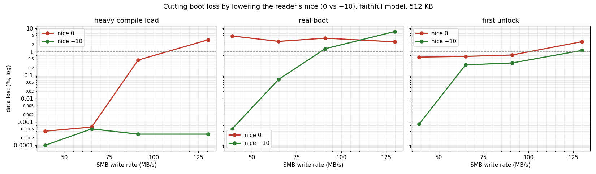

| condition | 39 MB/s | 65 MB/s | 91 MB/s | 130 MB/s |
|---|--:|--:|--:|--:|
| heavy compile (0→−10) | 0.00→0.00 | 0.00→0.00 | 0.44→0.00 | 3.21→0.00 |
| real boot (0→−10) | 4.70→0.001 | 2.78→0.07 | 3.80→1.34 | 2.65→7.31\* |
| first-unlock (0→−10) | 0.59→0.001 | 0.63→0.28 | 0.73→0.33 | 2.69→1.14 |

**Conclusion.** **The boot caveat is closed in the faithful model.** Up to ~91 MB/s
nice −10 takes boot/unlock loss from a few percent to ~0 and wipes out the heavy-compile
loss. The model-independent reason (from the interim run, 2.10) is that a negative nice
cuts the reader's runqueue-wait from **~53% → ~13%**, lifting its under-load drain
ceiling back above the elevated rate. **Even nice −10** (the most Android grants a
service) gets essentially the whole win, and *traced* already holds *SYS_NICE*, so it is
a one-line fix. (`*` the real-boot 130 MB/s cell is boot noise: one-shot, 3 reps,
non-monotonic baseline; trust the shape.)

## 2.15 Reassembly correctness stress test

**Ran.** Loss is not corruption. Built a host stress test (*smb_reassembly_stress*)
with self-describing messages and verified every *delivered* message byte-for-byte
across six adversarial configs.

**Data.**

| config | hazard | writers | verdict |
|---|---|--:|---|
| single-chunk | baseline | 4 | PASS |
| fragmented | multi-chunk reassembly | 4 | PASS |
| fragmented/SPIN-lap | reader laps writer (*needs_rewrite*) | 8 | PASS |
| tiny-buf/wrap | constant wrap-around | 8 | PASS |
| 16w-contention | heavy CAS contention | 16 | PASS |
| big-msg/wrap | 8 KB messages (~32 chunks) | 6 | PASS |

**Conclusion.** **6/6 PASS, every delivered message byte-exact, zero corruption.**
Drops under these adversarial configs are expected and fine; the reassembly path holds
under the descheduled-writer race, fragmentation, wrap-around, and contention.

## 2.16 Reading it as sessions, and why routing helps

**The point.** The "× the real rate" axis has a second reading that matters for routing.
Today, **each extra trace that wants the same ftrace makes the writer emit the events
again**, so *N* concurrent traces cost ~*N*× the write rate, no dedup. So everything
above is equally a statement about concurrent traces: one 512 KB SMB carries ~7–11
un-deduped concurrent de-bundled traces when the reader keeps up, and de-bundling spends
~1.5–2.5× of that budget per trace.

**Why routing changes it.** The planned routing (RFC-0028) makes the writer emit each
event **once** and *traced* tee it to every interested trace. That converts the headroom
into **output**: one write feeds *X* traces, i.e. roughly **X traces' worth of delivered
content (≈ X × 13 MB/s) for a single emission**. So the SMB stops scaling with the number
of traces, and the bandwidth measured in this part is a *floor*: what one SMB sustains
*before* that win lands. This is the lens to carry into the routing design.

## 2.17 Audit + re-verify: is the boot/first-unlock reader faithful to traced?

**Ran.** The faithful boot and first-unlock numbers (2.11, 2.14) rest on a 3-rep sweep,
and the tolerated rates (boot ~47 MB/s, first-unlock ~91 MB/s) are high enough to double
check. Two worries: (1) is the harness reader actually in *traced*'s scheduling context,
or is it over-privileged, which would overstate how much the SMB tolerates; and (2) does
the result reproduce? So we audited the live *traced* on the device and re-ran boot +
first-unlock with the reader pinned explicitly to traced's context.

**Audit (data).** Live *traced* (pid 1152) vs the running reader thread, Pixel Fold:

| dimension | live *traced* | harness reader | match |
|---|---|---|---|
| cpuset | `/foreground` = cpus 0–5 | cpus 0–5 | yes |
| cpu affinity | `0x3f` (0–5) | `0x3f` | yes |
| cpu cgroup (v1) | root `cpu:/` (no extra weight) | root `cpu:/` | yes |
| nice | 0 (no self-renice despite *SYS_NICE*) | 0 | yes |
| sched policy | *SCHED_OTHER* / 0 | same | yes |

The reader was already faithful; the explicit pinning (`--reader-cpus 0-5
--reader-cgroup /dev/cpuctl/tasks --reader-nice 0`) just makes it verifiable rather than
inherited from the shell.

**Re-run (data).** Faithful duplication, 512 KB, 3 reps/rate, cooldown to 37 C between
reboots, rates 1×/3×/5× (13/39/65 MB/s). Median loss %, against the earlier sweep (2.11):

| rate | boot (2.11) | boot (re-run) | first-unlock (2.11) | first-unlock (re-run) |
|---|--:|--:|--:|--:|
| 13 MB/s | 0.118 | 0.0003 | 0.001 | 0.0007 |
| 39 MB/s | 0.534 | 0.162 | 0.215 | 0.297 |
| 65 MB/s | 2.097 | 0.798 | 0.607 | 0.377 |

(boot re-run at 65 MB/s spread: min 0.35 / max 1.68 / p90 1.51, still noisy.)

**Conclusion.** The reader context is faithful to *traced* (not over-privileged), so the
tolerated-rate claims are not an artifact of a too-fast reader. The re-run reproduces and
slightly beats the earlier numbers: boot's median stays under 1% out to 65 MB/s (past the
~47 MB/s / 3.6× claim), and first-unlock is ≤0.38% through 65 MB/s. Two gaps remain:
first-unlock's 7× / ~91 MB/s point was not re-tested (the re-run capped at 5×), and at 3
reps the boot tail at 5× is still noisy. Raw data and the audit write-up live on the
*tracing_v2* branch (`task-2-smb-bandwidth/audit_findings.md`, `rfc_rerun/verify_raw.csv`,
`rfc_rerun/verify_summary.md`).

---

# Part 3: compression

The firehose stream is bigger raw (Part 1). *traced* compresses it in batches before
storing/uploading. These experiments answer: which codec, what does it cost on the
phone, and does it land ≤ today's size (today = bundled stream + gzip)? Cores that
matter: *traced* runs under *ProcessCapacityHigh* on the little+mid cores (cpus 0–5),
never big, so we judge cost on **little (floor)** and **mid (typical)**.

## 3.1 Codec bake-off on the little core

**Ran.** Compressed the de-bundled stream with gzip / lz4 / zstd at every useful level,
on the Pixel little core (the floor *traced* runs on), heaviest trace *first_unlock*.

**Data.**

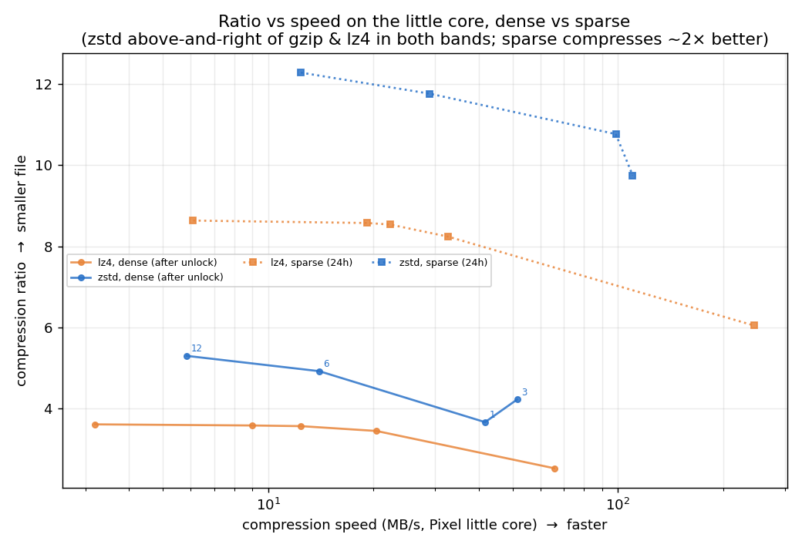

| codec/level | ratio | MB/s (little) | vs gzip-6 size | vs gzip-6 speed |
|---|--:|--:|--:|--:|
| gzip-6 (today) | 3.84 | 11.5 | baseline | baseline |
| lz4-1 | 2.54 | 65 | 51% bigger | 5.7× faster |
| zstd-3 | 4.23 | 50 | **9% smaller** | **4.3× faster** |
| zstd-6 | 4.93 | 14.4 | **22% smaller** | **1.25× faster** |
| zstd-19 | 5.95 | 0.4 | 36% smaller | 29× slower (don't) |

**Conclusion.** **Use zstd.** Every useful level sits above-and-right of gzip and lz4
(smaller *and* faster), even on the little core. lz4 has no good operating point.

## 3.2 Stored size vs today, all 12 traces

**Ran.** Compared the final stored size (de-bundling cost included) to today's whole
pipeline (bundled + gzip), across all 12 traces.

**Data.**

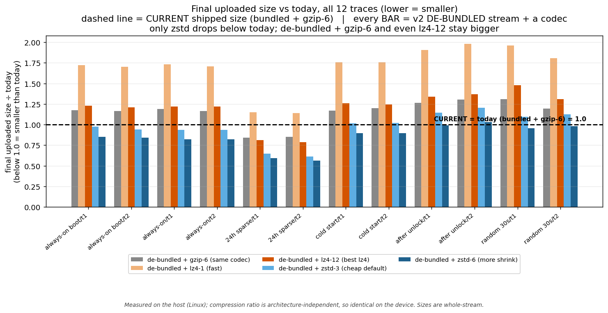

| stored size ÷ today | zstd-3 | zstd-6 | zstd-12 |
|---|--:|--:|--:|
| load traces | 1.04× | **0.91×** | 0.85× |
| battery_long (24 h sparse) | 0.63× | **0.58×** | 0.55× |

**Conclusion.** **De-bundled + zstd is ≤ today on all 12 traces.** zstd-3 ≈ break-even
at ~⅛ the CPU; zstd-6 ≈ 10% under today; sparse traces ≈ half.

## 3.3 Ratio vs level, dense vs sparse

**Ran.** Swept the full ratio-vs-level curve for all three codecs on a dense
(*first_unlock*) and a sparse (*battery_long*) trace.

**Data.**

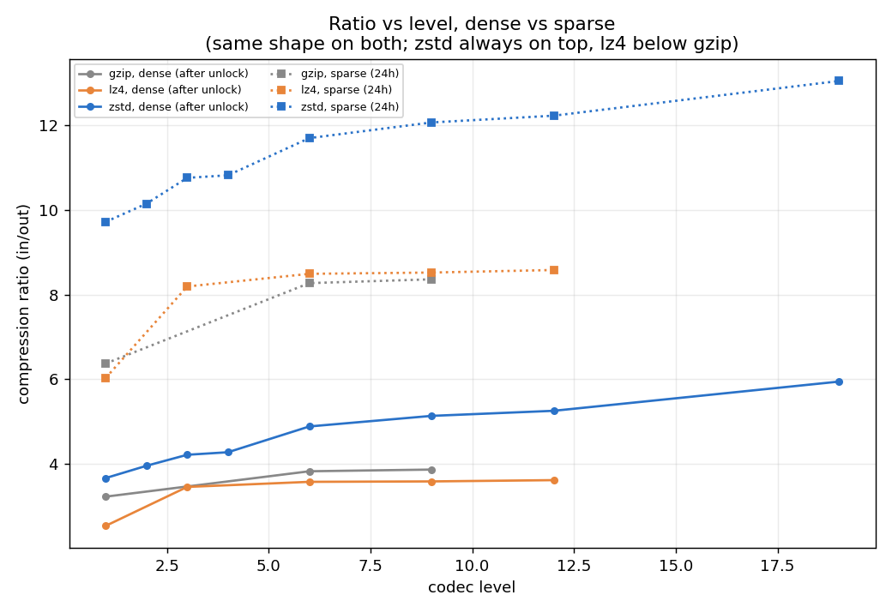

**Conclusion.** **zstd's whole curve is above gzip's and lz4's**; even zstd-2 beats
gzip-6 on ratio. The knee is at levels 3→6; past ~9 you pay a lot of CPU for little.
Sparse data just compresses ~2× better in the same shape.

## 3.4 On-device cost across cores

**Ran.** Timed compression of the 113 MB dense stream on little / mid / big cores
(*taskset*), using each tool's in-process benchmark mode.

**Data.** (re-measured on device; now includes zstd-12 and the on-device lz4 ladder)

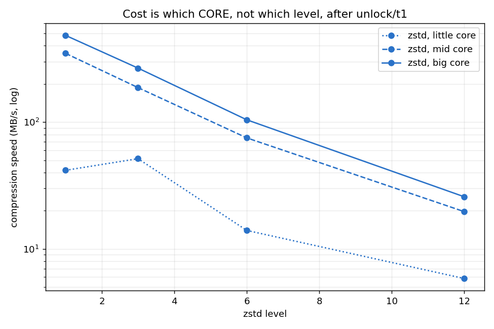

| codec/level | little | mid | big (ref) |
|---|--:|--:|--:|
| **zstd-3** | **51** | **187** | **266** |
| zstd-6 | 14 | 75 | 104 |
| zstd-12 | 5.9 | 20 | 26 |
| gzip-6 (today) | 12 | 27 | 34 |
| lz4-1 | 66 | 482 | 596 |
| lz4-9 | 9.0 | 33 | 47 |

**Conclusion.** **Cheap on the cores that matter, and zstd-3 is the cheap default.**
The stream is *produced* at ~2–4 MB/s; **zstd-3 chews it at ~51 MB/s on a little core**
(zstd-6 at 14), far above the production rate using a fraction of one slow core. The
on-device lz4 ladder (new this run) confirms the verdict: lz4-1 is fast but bigger than
today, lz4's HC levels are slower than zstd-3 at a worse ratio, so **zstd dominates on
both axes on-device.** Compression is not where traced's CPU goes.

## 3.5 Is it a fair fight? window clamp

**Ran.** lz4 is a 64 KB-window codec; zstd defaults to a few MB. To prove the win
isn't just the bigger window, clamped zstd to lz4's exact 64 KB window.

**Data.**

| config (whole-stream) | window | ratio |
|---|---|--:|
| lz4-9 / lz4-12 | 64 KB | 3.58 / 3.61 |
| zstd-6, clamped to 64 KB | 64 KB | 4.14 |
| zstd-6, default | few MB | 4.88 |

**Conclusion.** **Window-for-window, zstd-6 is ~15% smaller than lz4** (its entropy
coding beats lz4's raw LZ output); its larger default window adds ~18% more. "Use zstd"
is not a window artifact.

## 3.6 Block size

**Ran.** *traced* compresses one block per flush. Swept block size to see the ratio
gain from letting the compressor see more repetition.

**Data.**

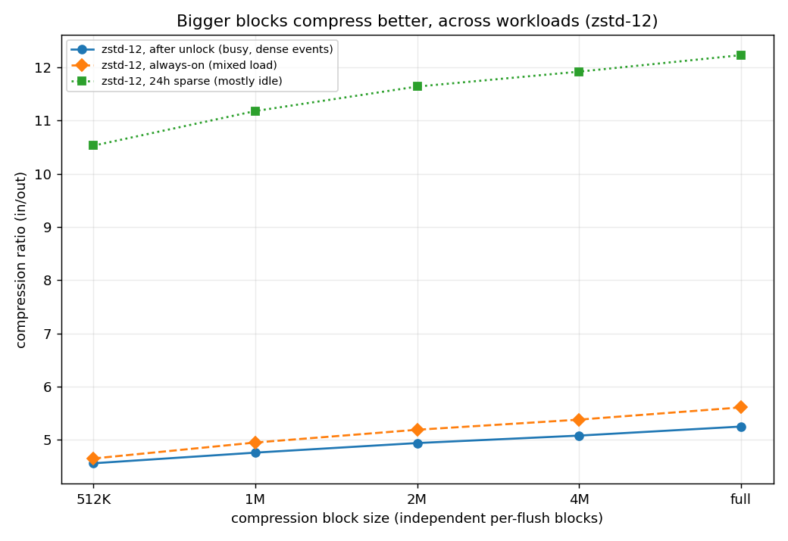

| | 512 KB | 1 MB | 2 MB | 4 MB | whole |
|---|--:|--:|--:|--:|--:|
| zstd-12 | 4.56 | 4.76 | 4.94 | 5.08 | 5.25 |

**Conclusion.** **1–4 MB is the sweet spot.** 512 KB → 4 MB is worth ~5–10%; past 4 MB
almost nothing, and you'd hold a bigger buffer for it.

## 3.7 The --long window

**Ran.** Tested zstd's big-window (`--long`, 128 MB) mode for any ratio gain on ftrace,
and measured its memory cost on device.

**Data.**

| | ratio | peak memory |
|---|--:|--:|
| zstd-6 (default window) | 4.93 | 40 MB |
| zstd-6 `--long` | 4.95 | 131 MB |

**Conclusion.** **Skip `--long`.** Zero ratio gain on ftrace (the repetition is already
in the default window), 3.2× the memory, and windows > 128 MB break decoder interop.

## 3.8 Memory and decompression (read side), per core

**Ran.** Measured peak RSS while compressing, and **decompression** speed per core on
the device (`zstd -b` / `lz4 -b`, same pass as compression; arm64 lz4 + zstd built with
the in-tree NDK), for zstd 1/3/6/12 and lz4 1/3/6/9/12.

**Data.** Peak RSS ~40 MB at zstd-6 default window (dense), ~13–15 MB sparse. Decompress
MB/s, after-unlock/t1:

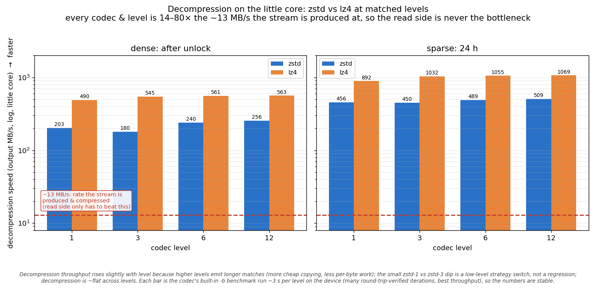

| codec | little | mid | big |
|---|--:|--:|--:|
| zstd-3 | 181 | 811 | 1088 |
| zstd-6 | 240 | 909 | 1235 |
| lz4-1 | 490 | 2503 | 3101 |
| lz4-12 | 563 | 2511 | 3153 |

**Conclusion.** **Memory is a non-issue at the recommended settings, and decompression
is cheap on every core.** zstd decompresses ~180 MB/s (little) to ~1.3 GB/s (big); lz4
~2–3× faster (~0.5–3.1 GB/s). Both decompress far faster than they compress, so the
read/upload side is never the bottleneck and doesn't sway the codec choice. The window
is the only real memory lever, and per 3.7 you don't want to grow it.

## 3.9 Why some traces are cheap (the 3 levers)

**Ran.** Pulled apart why the de-bundling cost and the final compressed size vary so
much across the corpus, by trace config.

**Data / conclusion.** Three config properties explain the whole spread:

- **Lever 1: scheduler byte-share = the de-bundling tax.** Only *CompactSched* is
  expensive to undo, so the SMB cost ≈ the sched share. No sched (24 h sparse) → free /
  shrinks; sched-heavy → toward the ~5× ceiling.
- **Lever 2: event density.** Sparse configs flush tiny bundles (~1.6 events/bundle),
  so much of their size is bundle framing that de-bundling removes, an extra discount.
- **Lever 3: atrace vocabulary = compressibility.** A few long recurring system markers
  compress ~2× better than a flood of short unique app markers, which is why 24 h sparse
  hits ~11× and a busy unlock only ~5×.

So 24 h sparse is the best case (free to de-bundle, ~0.59× today) and a sched-heavy load
trace is the hard case (~1.8× raw, still ≈ today once compressed). Predict a new config
from its **sched byte-share** (cost) and **print vocabulary** (compressibility).

---

## Summary

| thread | verdict |
|---|---|
| **de-bundling size** | ~1.5× today, ~1.9–2.5× once atrace leaves; only sched grows; 5× is the worst case, hit by a real pure-scheduler config |
| **SMB pressure** | one 512 KB SMB absorbs ~7–11× the real ftrace rate when the reader keeps up (de-bundling needs only ~1.5–2.5×); a real boot starves it to ~1–4×, closed by a negative *nice*; reassembly byte-exact. Read as traces: ~7–11 un-deduped concurrent traces, which routing collapses to one write |
| **compression** | zstd-6 (or zstd-3 for headroom), 1–4 MB blocks, no `--long`; ≤ today on all 12 traces and cheaper than gzip on the cores *traced* runs on |
