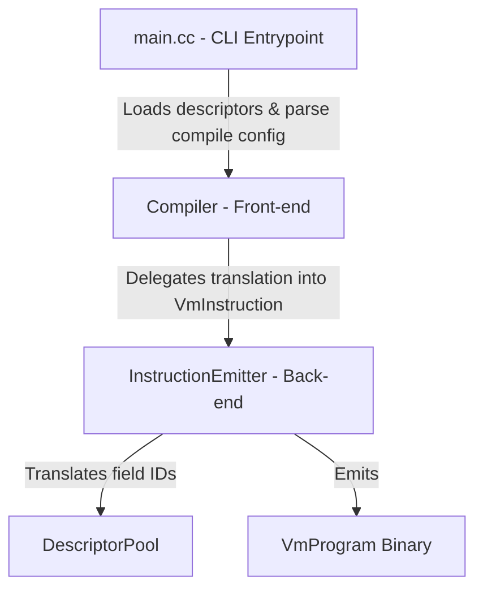

# ProtoVM Compiler

The ProtoVM Compiler is a CLI tool that compiles high-level transformation commands (`CompileConfig`) into low-level bytecode instructions (`VmProgram`) executable by the ProtoVM.

## Command-Line Interface

The compiler CLI (`protovm_compiler`) is the entry point for compilation.

### Usage

```sh
protovm_compiler [-I <proto_path>] <file1.proto> [<file2.proto> ...]
```

### Input
- **Command-line arguments**: A list of `.proto` files that contain the definitions of the source and destination messages.
- **`-I` / `--proto_path`**: Specifies directories in which to search for imports. Multiple `-I` flags can be provided.
- **`stdin`**: The compiler reads the `CompileConfig` textproto from standard input.

### Output
- **`stdout`**: The compiler outputs the compiled binary `VmProgram` to standard output.
- **`stderr`**: Any compilation or validation errors are printed to standard error.

### Example

```sh
protovm_compiler \
  -I external/perfetto \
  -I external/perfetto/buildtools/protobuf/src \
  protos/perfetto/trace/trace_packet.proto \
  protos/perfetto/trace/android/winscope_extensions_impl.proto \
  <compile_config.textproto
  >program.pb
```

## Architecture Overview

The compiler is structured into three main components:



### 1. `main.cc` (CLI Entrypoint)
- Parses command-line arguments.
- Loads and compiles the `.proto` files provided as arguments into a serialized file descriptor.
- Reads the `CompileConfig` textproto from standard input (`stdin`).
- Instantiates and invokes the `Compiler`

### 2. `Compiler` (Front-end)
- Parses the high-level `CompileConfig` textproto.
- Traverses the list of high-level commands (`set`, `del`, `merge`, `enter_scope`).
- Tracks the compilation "scope", which maintains the current instruction being populated and the src/dst cursor positions.
- Delegates translation of individual commands to the `InstructionEmitter`.

### 3. `InstructionEmitter` (Back-end)
- Translates human-redable field names to field IDs.
- Translates high-level commands (`SelectByKey`, `MergeByKey`, etc.) into the proper sequence of low-level `VmInstruction`s.
